# Quickstart: Create and run a chaos experiment by using Azure Chaos Studio
Get started with Azure Chaos Studio by using a virtual machine (VM) shutdown service-direct experiment to make your service more resilient to that failure in real-world scenarios.

## Prerequisites
- An Azure subscription. [!INCLUDE [quickstarts-free-trial-note](../../includes/quickstarts-free-trial-note.md)] 
- A Linux VM. If you don't have a VM, [follow these steps to create one](../virtual-machines/linux/quick-create-portal.md).

## Register the Chaos Studio resource provider
If it's your first time using Chaos Studio, you must first register the Chaos Studio resource provider before you onboard the resources and create an experiment. You must do these steps for each subscription where you use Chaos Studio:

1. Open the [Azure portal](https://portal.azure.com).
1. Search for **Subscriptions** and open the subscription management page.
1. Select the subscription where you want to use Chaos Studio.
1. In the pane on the left, select **Resource providers**.
1. In the list of resource providers that appears, search for **Microsoft.Chaos**.
1. Select the Microsoft.Chaos provider and select the **Register** button.

## Create an Azure resource supported by Chaos Studio

Create an Azure resource and ensure that it's one of the supported [fault providers](chaos-studio-fault-providers.md). Also validate if this resource is being created in the [region](https://azure.microsoft.com/global-infrastructure/services/?products=chaos-studio) where Chaos Studio is available. In this experiment, we choose an Azure VM, which is one of the supported fault providers for Chaos Studio.

## Enable Chaos Studio on the VM you created
1. Open the [Azure portal](https://portal.azure.com).
1. Search for **Chaos Studio** in the search bar.
1. Select **Targets** and go to the VM you created.

1. Select the checkbox next to your VM. Select **Enable targets** > **Enable service-direct targets** from the dropdown menu.

   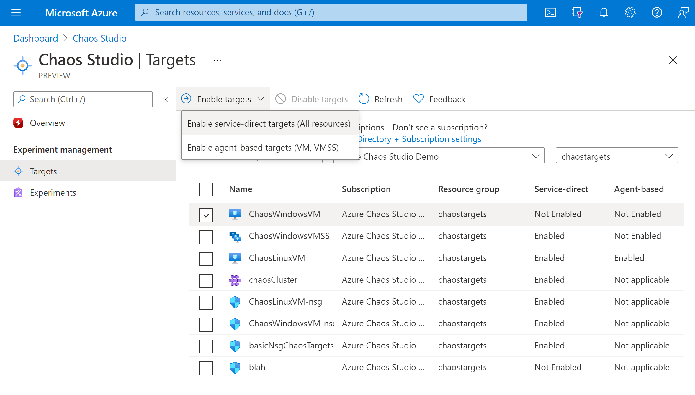

1. Confirm that the desired resource is listed. Select **Review + Enable**, then **Enable**. 

1. A notification appears and indicates that the resource selected was successfully enabled.
   
   

## Create an experiment

1. Select **Experiments**.

   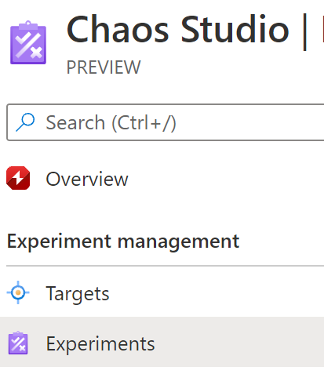

1. Select **Create** > **New experiment**.

1. Fill in the **Subscription**, **Resource Group**, and **Location** boxes where you want to deploy the chaos experiment. Give your experiment a name. Select **Next: Experiment designer**.

   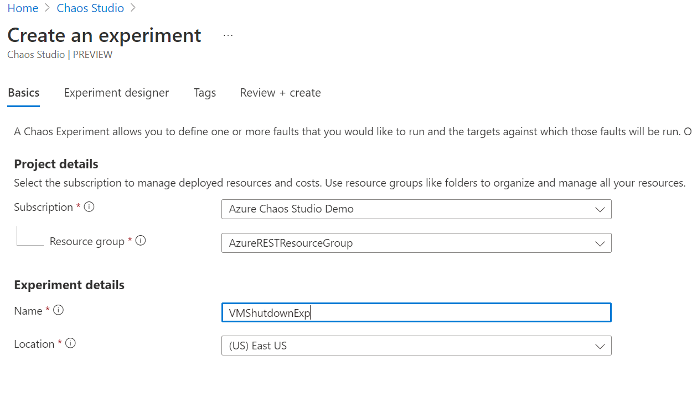

1. In the Chaos Studio experiment designer, give a friendly name to your **Step** and **Branch**. Select **Add action > Add fault**.

   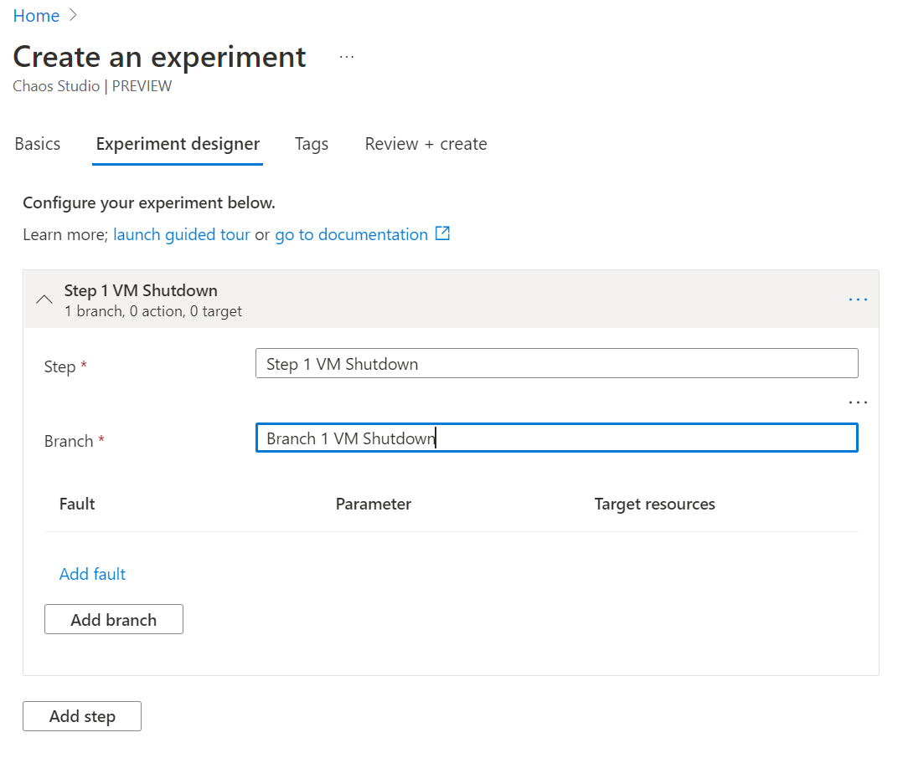

1. Select **VM Shutdown** from the dropdown list. Then fill in the **Duration** box with the number of minutes you want the failure to last.

   

1. Select **Next: Target resources**.

   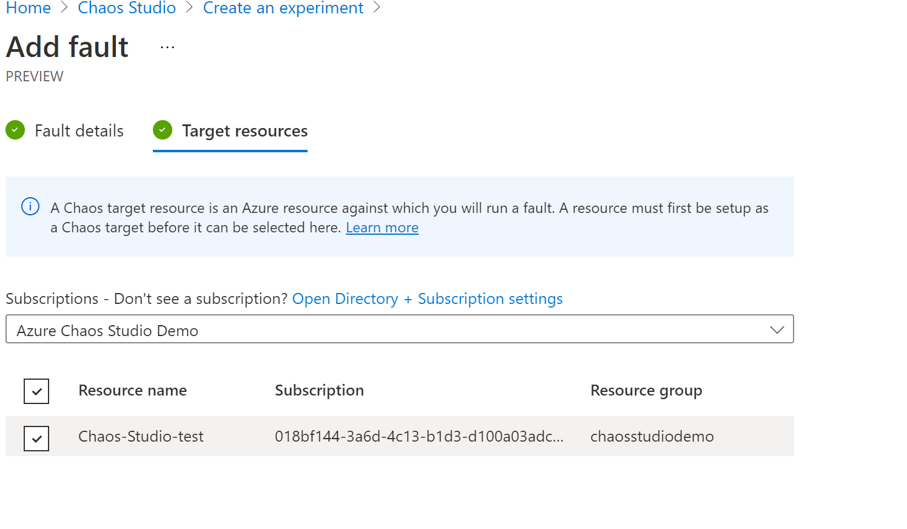

1. Select **Add**.

   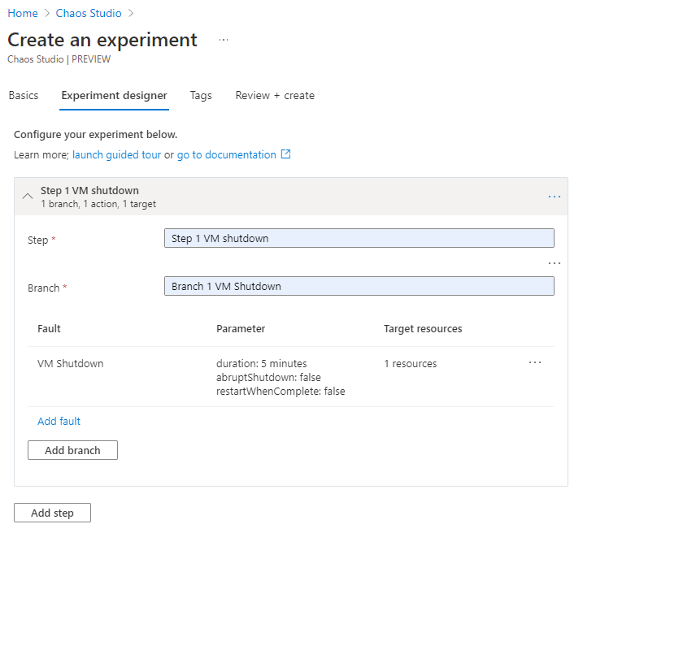

1. Verify that your experiment looks correct and then select **Review + create** > **Create**.

   

## Give experiment permission to your VM
1. Go to your VM and select **Access control (IAM)**.

   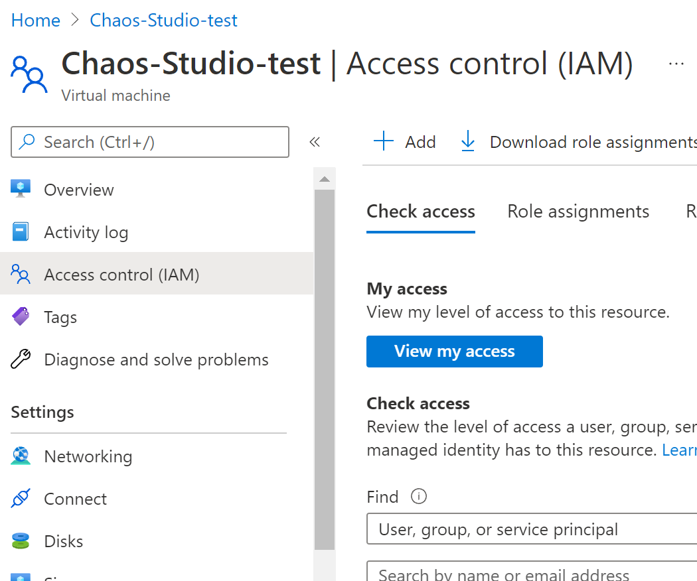
1. Select **Add**.

   

1. Select **Add role assignment**.

   

1. Search for **Virtual Machine Contributor** and select the role. Select **Next**.

   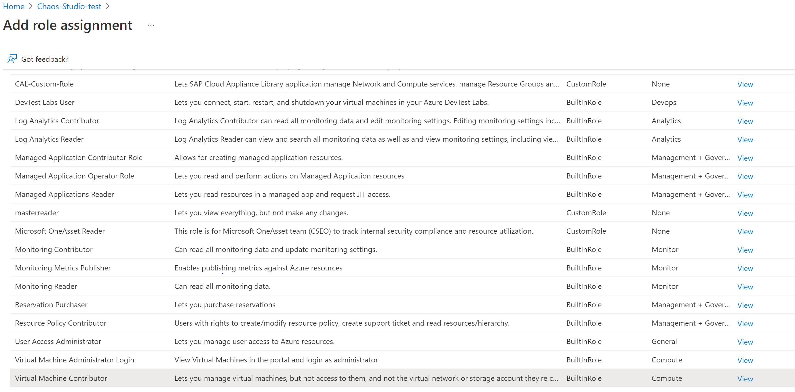
1. Choose **Select members** and search for your experiment name. Select your experiment and choose **Select**.

   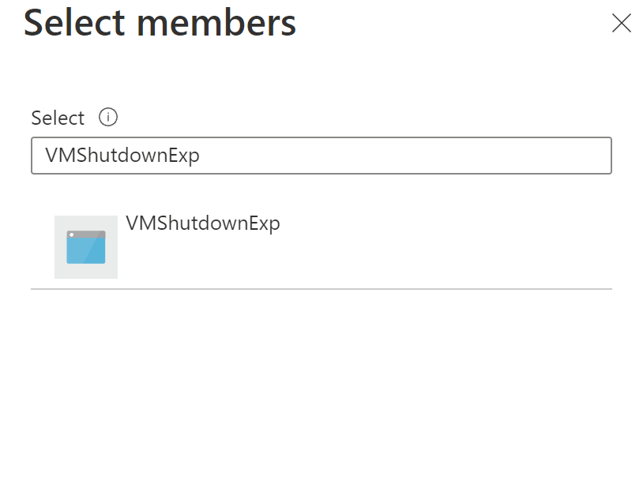

1. Select **Review + assign**.

## Run the chaos experiment

1. Open the Azure portal:
    * If you're using an @microsoft.com account, go to [this website](https://portal.azure.com/?microsoft_azure_chaos_assettypeoptions={%22chaosStudio%22:{%22options%22:%22%22},%22chaosExperiment%22:{%22options%22:%22%22}}&microsoft_azure_chaos=true).
    * If you're using an external account, go to [this website](https://portal.azure.com/?feature.customPortal=false&microsoft_azure_chaos_assettypeoptions={%22chaosStudio%22:{%22options%22:%22%22},%22chaosExperiment%22:{%22options%22:%22%22}}).
1. Select the checkbox next to the experiment name and select **Start Experiment**.

    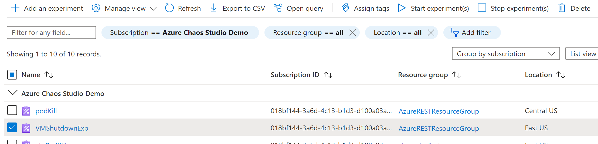

1. Select **Yes** to confirm you want to start the chaos experiment.

    
1. (Optional) Select the experiment name to see a detailed view of the execution status of the experiment.

## Clean up resources

1. Select the checkbox next to the experiment name and select **Delete**.

   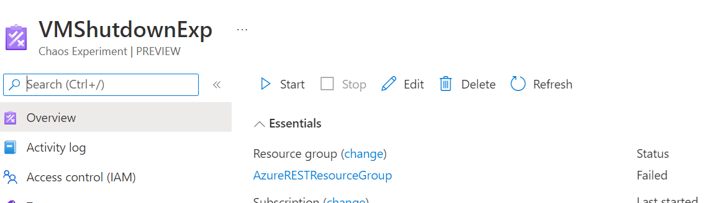

1. Select **Yes** to confirm that you want to delete the experiment.

1. Search the VM that you created on the Azure portal search bar.

   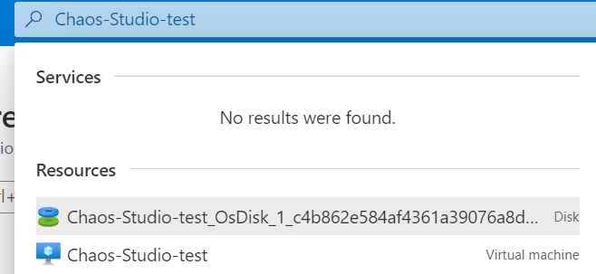

1. Select **Delete** to avoid being charged for the resource.

   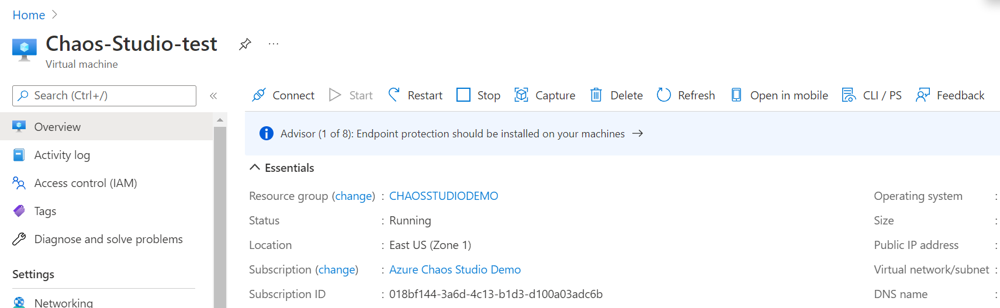

## Next steps

Now that you've run a VM shutdown service-direct experiment, you're ready to:

- [Create an experiment that uses agent-based faults](chaos-studio-tutorial-agent-based-portal.md)
