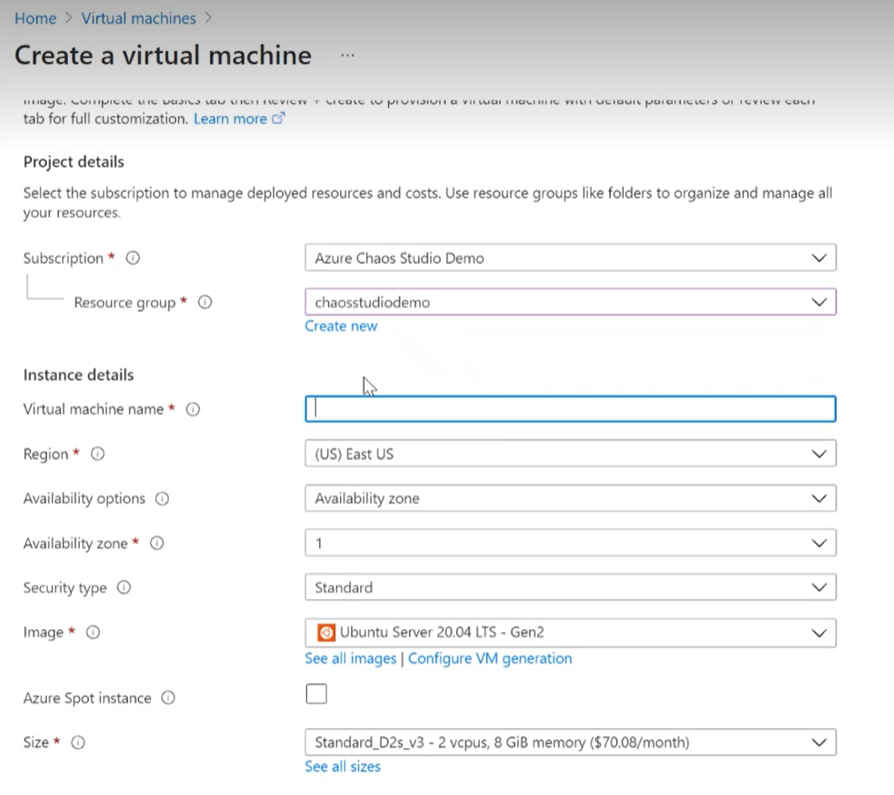
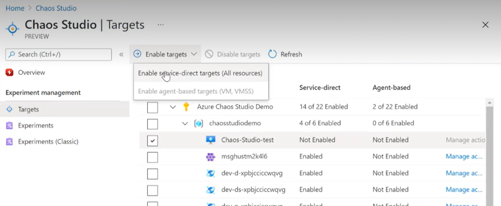

# Quickstart:Create and run a chaos experiment using the Azure portal
## Sign in to Azure portal 
Sign in to the Azure portal at https://portal.azure.com
## Create a VM resource
1. On the Azure portal menu or from the Home page, search for **Virtual machines** in the serach bar. 

    
    
3. Click on **Create**

    
    
4. In **Create a virtual machine** provide values for the **Reasource group**, and **Virtual machine name**.

5. Click **Review + create**, then create.

## Enable Chaos Studio on your VM created
1. Open the [Azure portal](https://portal.azure.com).
2. Search for **Chaos Studio (preview)** in the search bar.
3. Click on **Targets** and navigate to your VM created.

4. Check the box next to your Cosmos DB account and click **Enable targets** then **Enable service-direct targets** from the dropdown menu.

5. A notification will appear indicating that the resource(s) selected were successfully enabled.

You have now successfully onboarded your Cosmos DB account to Chaos Studio. In the **Targets** view you can also manage the capabilities enabled on this resource. Clicking the **Manage actions** link next to a resource will display the capabilities enabled for that resource.

7. Click **Add an experiment**.

    

## Create an experiment
Click Add an experiment, and then provide values for the Resource group, experiment Name, and Location. 
Click Next: Experiment designer > and add Fault VM Shutdown. 
Click Next: Target resources >
Click Review + Create 
Go to the experiment and click Start
## Clean up resources
## Next steps
In this quickstart, you created the VM targets, created and expriment using those targets. You can now use all the data 
