# Quickstart: Replicate a DNS outage by using the NSG fault

The network security group (NSG) fault enables you to modify your existing NSG rules as part of a chaos experiment in Azure Chaos Studio. By using this fault, you can block network traffic to your Azure resources and simulate a loss of connectivity or outages of dependent resources.

In this quickstart, you create a chaos experiment that blocks all traffic to external (internet) DNS servers for 15 minutes. With this experiment, you can validate that resources connected to the Azure virtual network associated with the target NSG don't have a dependency on external DNS servers. In this way, you can validate one of the risk-threat model requirements.

## Prerequisites

- An NSG that's associated with the Azure resource you want to target in your experiment.
- Use the Bash environment in [Azure Cloud Shell](../cloud-shell/quickstart.md).

## Create the NSG fault provider

First, you register a fault provider on the subscription where your NSG is hosted for Chaos Studio to interact with it.

1. Create a file named *AzureNetworkSecurityGroupChaos.json* with the following contents and save it to your local machine:

      ```json
      { 
        "properties": {
          "enabled": true,
          "providerConfiguration": {
            "type": "AzureNetworkSecurityGroupChaos"
          }
        }
      }
      ```

1. Open an instance of [Cloud Shell](https://shell.azure.com/).
1. Replace `$SUBSCRIPTION_ID` with the Azure subscription ID that contains the NSG you want to use in your experiment. Run the following command to ensure that the provider is registered on the correct subscription:

    ```azurecli
    az account set --subscription $SUBSCRIPTION_ID
    ```

1. Drag and drop *AzureNetworkSecurityGroupChaos.json* into the Cloud Shell window to upload the file.
1. Replace `$SUBSCRIPTION_ID` used in the prior step and execute the following command to register the `AzureNetworkSecurityGroupChaos` fault provider:

    ```azurecli
    az rest --method put --url "https://management.azure.com/subscriptions/$SUBSCRIPTION_ID/providers/microsoft.chaos/chaosProviderConfigurations/AzureNetworkSecurityGroupChaos?api-version=2023-11-01" --body @AzureNetworkSecurityGroupChaos.json --resource "https://management.azure.com"
    ```

1. (Optional) Delete the *AzureNetworkSecurityGroupChaos.json* file you previously created because it's no longer required. Close Cloud Shell.

## Create a chaos experiment

After the NSG fault provider is created, you can start to create experiments in Chaos Studio.

1. Open the Azure portal with the Chaos Studio feature flag:
    * If you're using an @microsoft.com account, go to [this website](https://portal.azure.com/?microsoft_azure_chaos_assettypeoptions={%22chaosStudio%22:{%22options%22:%22%22},%22chaosExperiment%22:{%22options%22:%22%22}}&microsoft_azure_chaos=true).
    * If you're using an external account, go to [this website](https://portal.azure.com/?feature.customPortal=false&microsoft_azure_chaos_assettypeoptions={%22chaosStudio%22:{%22options%22:%22%22},%22chaosExperiment%22:{%22options%22:%22%22}}).
1. Select **Add an experiment**.

    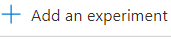

1. Enter the name you want to give the experiment and select the **Subscription**, **Resource group**, and **Location** (region) where you want to create the experiment.
1. Select **Next: Experiment designer**.

    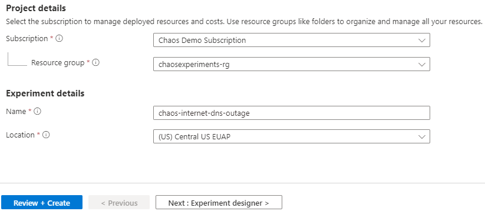

1. Select **Add fault**.
1. Select **Network Security Group Fault** from the **Faults** dropdown list.

    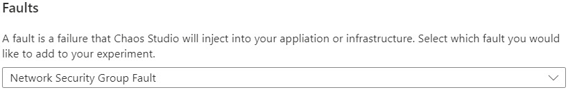

1. Populate the following parameters.

    | Parameter | Value |
    |--|--|
    | Duration | `15` |
    | Name | `block_internet_dns` |
    | Source Address Prefix | `*` |
    | Destination Address Prefix | `Internet` |
    | Access | `Deny` |
    | Source Port Range | `*` |
    | Destination Port Range | `53` |
    | Priority | `1001` |
    | Direction | `Outbound` |

    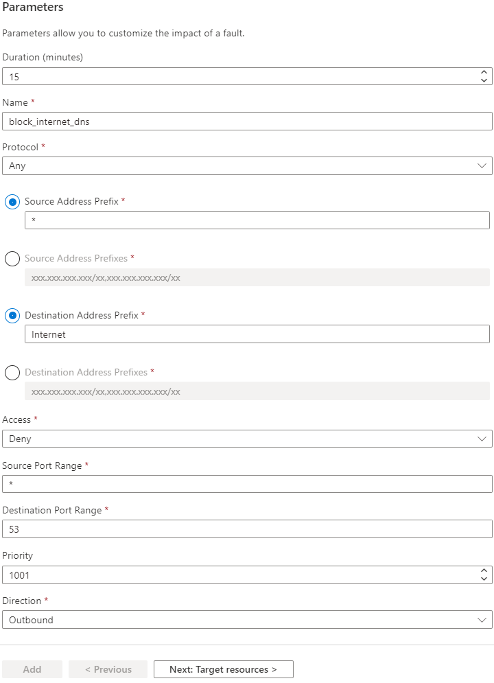

   The **Name** and **Priority** fields might need to be adjusted if either one already exists in a preexisting rule on the target NSG.

   > [!NOTE]
   > The priority might need to be lowered if there are any rules that explicitly allow port 53 traffic to the internet.

1. Select **Next: Target resources**.
1. Select the NSGs to be targeted by this experiment.
1. Select **Add**.

    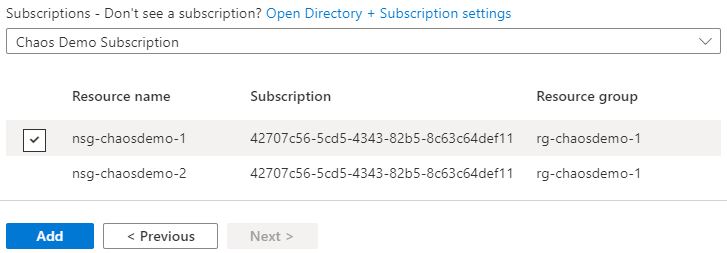

1. Select **Review + Create**.

    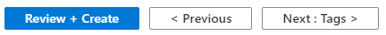

1. Select **Create**.

    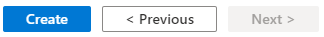

## Grant the chaos experiment access to the network security group

As a safety precaution, all chaos experiments must be granted access to the Azure resources targeted in the experiment.

1. Go to the resources targeted in the experiment.
1. Select **Access Control (IAM)**.

    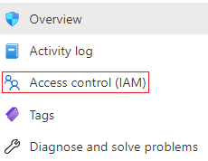

1. Select **Add**.

    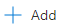

1. Select **Add role assignment**.

    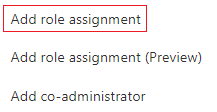

1. In **Role**, select `Network Contributor`.

    

1. In **Select**, enter the name of the chaos experiment and then select it.

    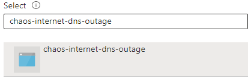

1. Select **Save**.

    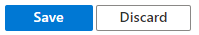

## Run the chaos experiment

1. Open the Azure portal with the Chaos Studio feature flag:
    * If you're using an @microsoft.com account, go to [this website](https://portal.azure.com/?microsoft_azure_chaos_assettypeoptions={%22chaosStudio%22:{%22options%22:%22%22},%22chaosExperiment%22:{%22options%22:%22%22}}&microsoft_azure_chaos=true).
    * If you're using an external account, go to [this website](https://portal.azure.com/?feature.customPortal=false&microsoft_azure_chaos_assettypeoptions={%22chaosStudio%22:{%22options%22:%22%22},%22chaosExperiment%22:{%22options%22:%22%22}}).
1. Select the checkbox next to the experiment name and select **Start Experiment**.

    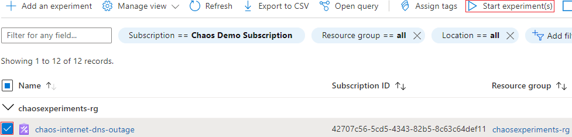

1. Select **Yes** to confirm you want to start the chaos experiment.

    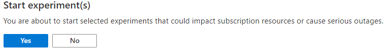
1. (Optional) Select the experiment name to see a detailed view of the execution status of the experiment.
1. After the experiment starts, you can use your existing monitoring, telemetry, or logging tools to confirm what effect the execution chaos experiment has had on your service.

## Clean up resources

If you're not going to continue to use this experiment and want to delete it:

1. Open the Azure portal with the Chaos Studio feature flag:

   * If you're using an @microsoft.com account, go to [this website](https://portal.azure.com/?microsoft_azure_chaos_assettypeoptions={%22chaosStudio%22:{%22options%22:%22%22},%22chaosExperiment%22:{%22options%22:%22%22}}&microsoft_azure_chaos=true).
   * If you're using an external account, go to [this website](https://portal.azure.com/?feature.customPortal=false&microsoft_azure_chaos_assettypeoptions={%22chaosStudio%22:{%22options%22:%22%22},%22chaosExperiment%22:{%22options%22:%22%22}}).
1. Select the checkbox next to the experiment name and select **Delete**.
1. Select **Yes** to confirm that you want to delete the experiment.

If you're not going to continue using any faults related to NSGs:

1. Open an instance of [Cloud Shell](https://shell.azure.com/).
1. Replace **$SUBSCRIPTION_ID** with the Azure subscription ID where the NSG fault provider was provisioned. Run the following command:

    ```azurecli
    az rest --method delete --url "https://management.azure.com/subscriptions/$SUBSCRIPTION_ID/providers/microsoft.chaos/chaosProviderConfigurations/AzureNetworkSecurityGroupChaos?api-version=2023-11-01" --resource "https://management.azure.com"
    ```
