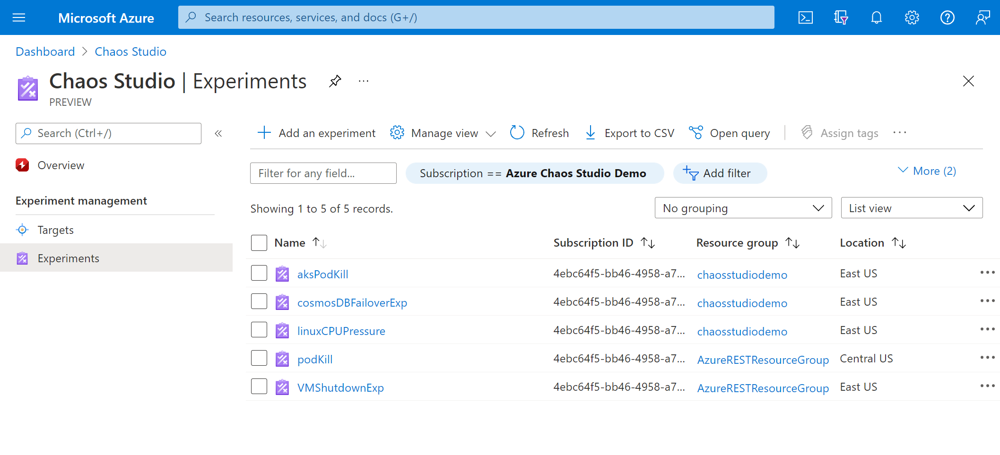
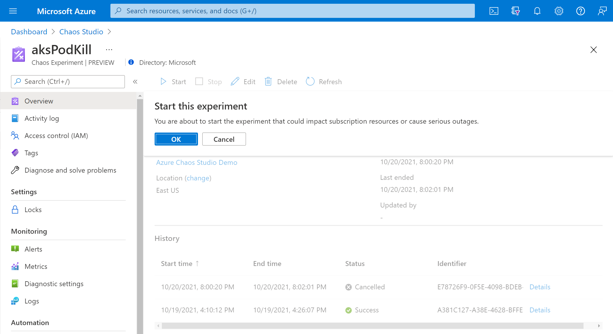
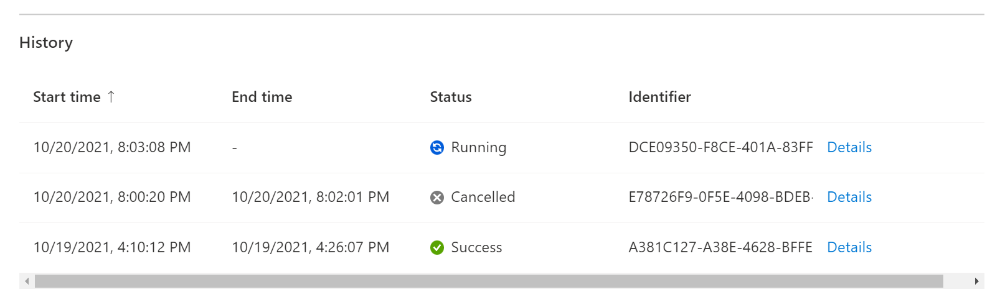
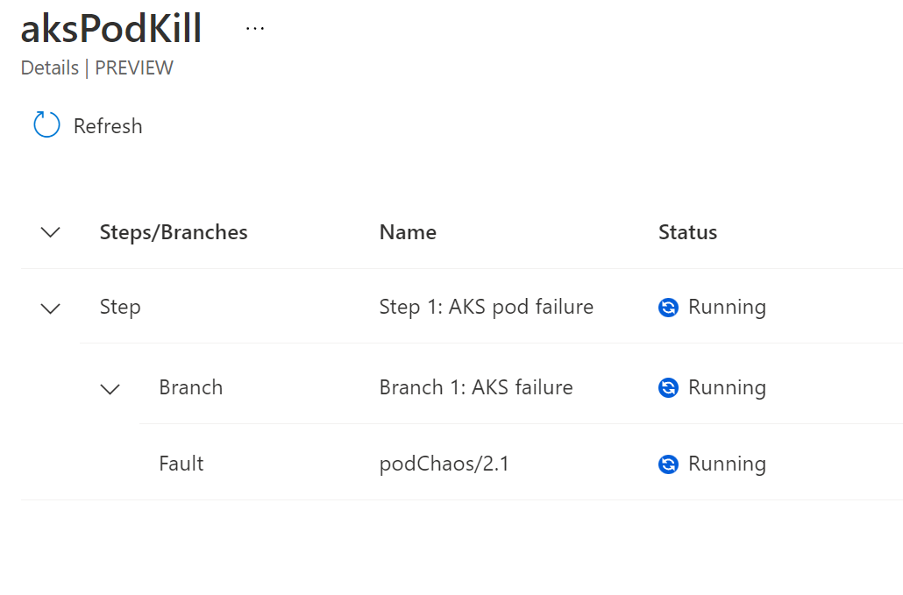
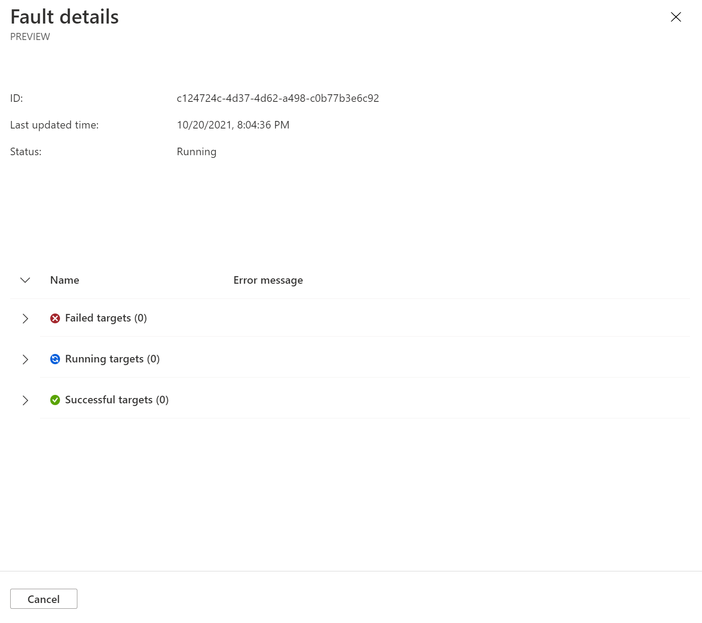
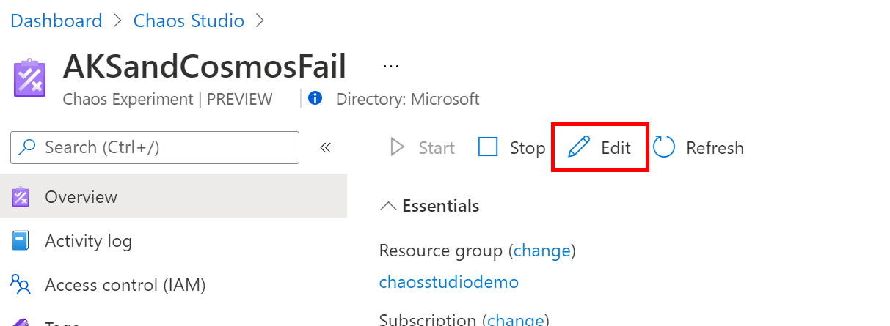
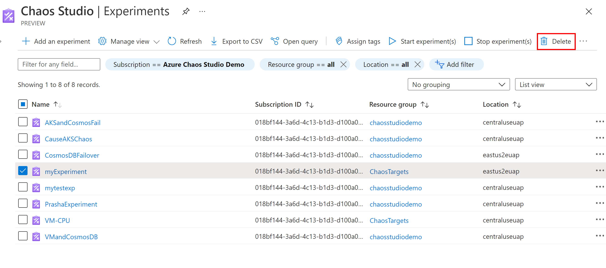

# Run and manage an experiment in Azure Chaos Studio Preview

You can use a chaos experiment to verify that your application is resilient to failures by causing those failures in a controlled environment. This article provides an overview of how to use Azure Chaos Studio Preview with a chaos experiment that you've previously created.

## Start an experiment

1. Open the [Azure portal](https://portal.azure.com).

1. Search for **Chaos Studio (preview)** in the search bar.

1. Select **Experiments**. This experiment list view is where you can start, stop, or delete experiments in bulk. You can also create a new experiment.

    

1. Select your experiment. On the experiment **Overview** page, you can start, stop, and edit your experiment. You can also view essential details about the resource and its history. Select **Start** and then select **OK** to start your experiment.

    

1. The experiment status shows as *PreProcessingQueued*, then *WaitingToStart*, and finally *Running*.

## View experiment history and details

1. After the experiment is running, under **History**, select **Details** on the current run to see status and errors.

    

1. The experiment **Details** view shows the execution status of each step, branch, and fault. Select a fault.

    

1. **Fault details** shows other information about the fault execution. It includes which targets have failed or succeeded and why. If there's an error running your experiment, debugging information appears here.

    

## Edit an experiment

1. Return to the experiment **Overview** page and select **Edit**.

    

1. This experiment designer is the same as the one you used to create the experiment. You can add or remove steps, branches, and faults. You can also edit fault parameters and targets. To edit a fault, select **...** next to the fault.

    

1. When you're finished editing, select **Save**. If you want to discard your changes without saving, select the **Close** button in the upper-right corner.
  

> [!WARNING]
> If you added targets to your experiment, remember to add a role assignment on the target resource for your experiment identity.

## Delete an experiment

1. Return to the **Experiments** list and select the checkbox next to the experiment you want to delete. Select **Delete**. You might need to select **...** to see the delete option depending on your screen resolution.

    

1. Select **Yes** to confirm that you want to delete the resource.

1. Alternatively, you can open an experiment and select **Delete**.
