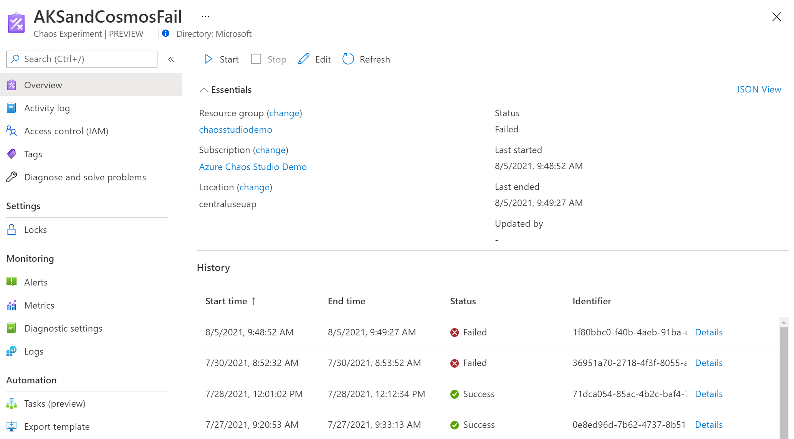
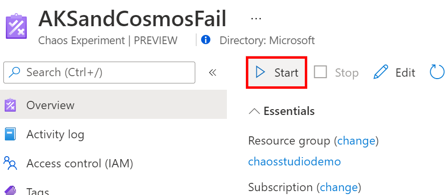
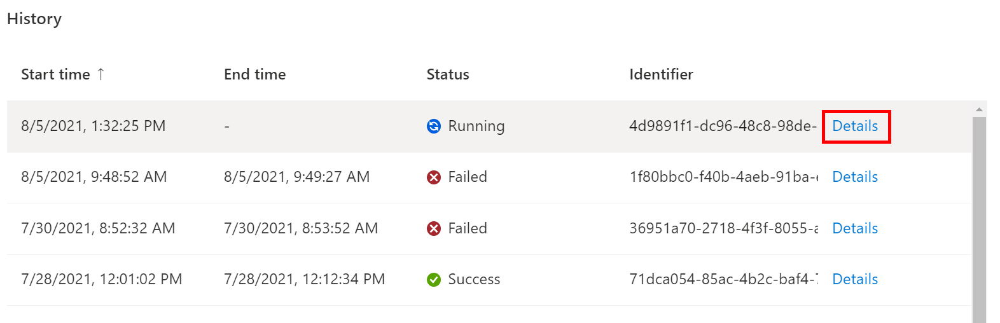
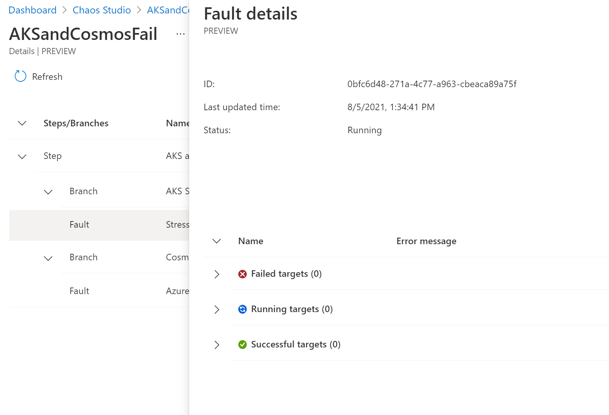

# Run and manage an experiment

Now that you have created your first experiment, you are ready to run your experiment and view details of the execution

## Start an experiment

1. Open the Azure portal with the Chaos Studio feature flag:
    * If using an @microsoft.com account, [click this link](https://ms.portal.azure.com/?microsoft_azure_chaos_assettypeoptions={%22chaosStudio%22:{%22options%22:%22%22},%22chaosExperiment%22:{%22options%22:%22%22}}&microsoft_azure_chaos=true).
    * If using an external account, [click this link](https://portal.azure.com/?feature.customPortal=false&microsoft_azure_chaos_assettypeoptions={%22chaosStudio%22:{%22options%22:%22%22},%22chaosExperiment%22:{%22options%22:%22%22}}).

2. In the Search bar at the top of the page, search for "Chaos Experiments" and select the service.

    

3. If needed, filter and sort the experiment list to see your experiment, then click on it to open the Experiment Overview page.

    

4. The Experiment Overview page allows you to start, stop, and edit your experiment, view essential details about the resource, and view history. Click the **Start** button then click **OK** to start your experiment.

    

5. The experiment status shows *PreProcessingQueued*, then *WaitingToStart*, and finally *Running*.

## View experiment history and details

1. Once the experiment is running, click **Details** on the current run under **History** to see detailed status and errors.

    

2. The Experiment Details view shows the execution status of each step, branch, and fault. Click on a fault.

    

3. Fault details shows additional information about the fault execution including which targets have failed or succeeded and why. If there is an error running your experiment, debugging information appears here.

    

## Edit experiment

> [!WARNING]
> The Experiment Designer may not have all faults available in the [Fault Library](chaos-studio-fault-library.md). If your experiment uses faults not available in Experiment Designer, use the [REST API](https://aka.ms/chaosrestapi) to edit it.

1. Return to the Experiment Overview and click the **Edit** button.

    

2. This is the same Experiment Designer as was used to create the experiment. You can add or remove steps, branches, and faults, and edit fault parameters and targets. To edit a fault, click on the **...** beside the fault.

    

3. When you are finished editing, click **Save**. If you want to discard your changes without saving, click the **Close (X)** button in the top right.
  

> [!NOTE]
> If you added targets to your experiment, remember to add a role assignment on the target resource for your experiment identity.

## Delete experiment
1. Return to the Experiment List and check the experiment(s) you want to delete. Click **Delete** in the toolbar above the experiment list. You may need to click the ellipsis (...) to see the delete option depending on screen resolution.

    

2. Click **Yes** to confirm you want to delete the resource.

## Use the Chaos Studio REST API

### Start experiment
To run your experiment, execute the following command, replacing `$EXPERIMENT_ID` with the resource ID of your experiment and `{apiVersion}` with the [latest API version documented here](https://aka.ms/chaosrestapi).

```bash
az rest --method post --url "https://management.azure.com/$EXPERIMENT_ID/start?api-version={apiVersion}" --resource "https://management.azure.com"
```

This returns a `statusUrl` which you can query to get the status of the experiment execution.

### Get experiment status and history
To list experiment runs and statuses, execute the following command, replacing `$EXPERIMENT_ID` with the resource ID of your experiment and `{apiVersion}` with the [latest API version documented here](https://aka.ms/chaosrestapi).

```bash
az rest --method get --url "https://management.azure.com/$EXPERIMENT_ID/statuses?api-version={apiVersion}" --resource "https://management.azure.com"
```

This returns an array of executions. Each execution has a `name` property that is the execution ID. To get the details of an execution, execute the following command, replacing `$EXECUTION_ID` with the execution ID, `$EXPERIMENT_ID` with the resource ID of your experiment and `{apiVersion}` with the [latest API version documented here](https://aka.ms/chaosrestapi).

```bash
az rest --method get --url "https://management.azure.com/$EXPERIMENT_ID/executiondetails/$EXECUTION_ID?api-version={apiVersion}" --resource "https://management.azure.com"
```
