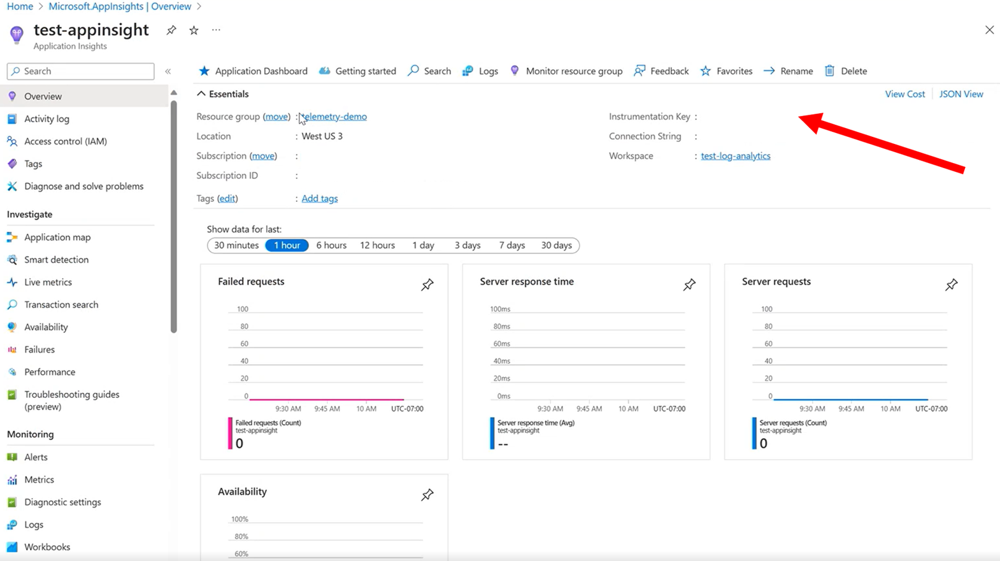
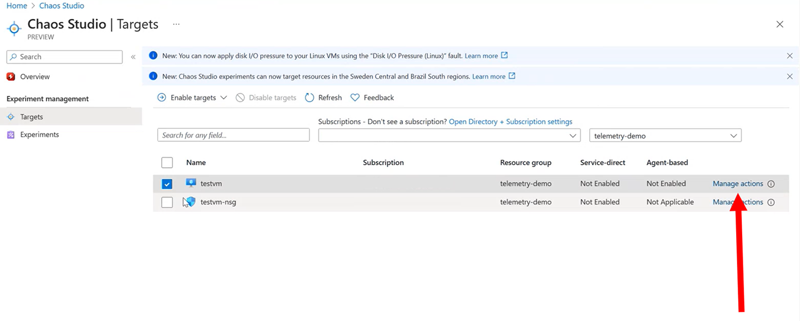

# How-to: Configure your experiment to emit Experiment Fault Events to App Insights
In this guide, we will show you the steps needed to configure a Chaos Studio **Agent-based** Experiment to emit telemetry to App Insights. These events will show the start and stop of each fault as well as the type of fault executed and the resource the fault was executed against. This is the primary recommended logging solution for **Agent-based** experiements in Chaos Studio.

## Prerequisites
- An Azure subscription
- An existing Chaos Studio **Agent-based** Experiment [chaos-studio-tutorial-agent-based-portal.md)
- An existing Log Analytics Workspace (required for Application Insights Resource as well) [How to Create a Log Analytics Workspace](../azure-monitor/logs/quick-create-workspace.md)
- An existing Application Insights Resource [How to Create an Application Insights Resource](../azure-monitor/app/create-workspace-resource.md)
- A User-Assigned Managed Identity (Required for Agent-based Chaos Experiments) [How to create a User-Assigned Managed Identity](../active-directory/managed-identities-azure-resources/how-manage-user-assigned-managed-identities.md)

## Step 1: Copy the Instrumentation Key from your Application Insights Resource
Once you have met all the pre-requisite steps, copy the **Instrumentation Key** found in the overview page of your Application Insights Resource (see red arrow in the screenshot below)

 

## Step 2: Enable the Target Platform for your Agent-Based Fault with Application Insights
Navigate to the Chaos Studio overview page and click on the **Targets** blade under the "Experiments Management" section. Find the target platform, ensure it is enabled for agent-based faults, and select "Manage Actions" in the right-most column. See screenshot below for an example:
 

 

## Step 3: Add your Application Insights account and Instrumentation key
Once you have clicked "Manage Actions" in Step 2, you will see the page in the below screenshot. After configuring your managed identity, make sure Application Insights is "Enabled" and then select your desired Application Insights Account and enter the Instrumentation Key you copied in Step 1. Once this is complete, you can click "Review+Create" to deploy your resource. 

 

## Step 4: Run the chaos experiment
Once you have completed Step 3, your Chaos Target is now configured to emit telemetry to the App Insights Resource you configured! If you navigate to your specific Application Insights Resource and open the "Logs" blade under the "Monitoring" section, you should see the Agent health status as well as any actions the Agent is taking on your Target Platform. You can now run your experiment and see logging in your Application Insights Resource. See screenshot below for example App Insights Resource running succesfully on an Agent-based Chaos Target platform. 

 

To query your logs, navigate to the "Logs" tab in the Application Insights Resource to get your desired logging information your desired format.

 

