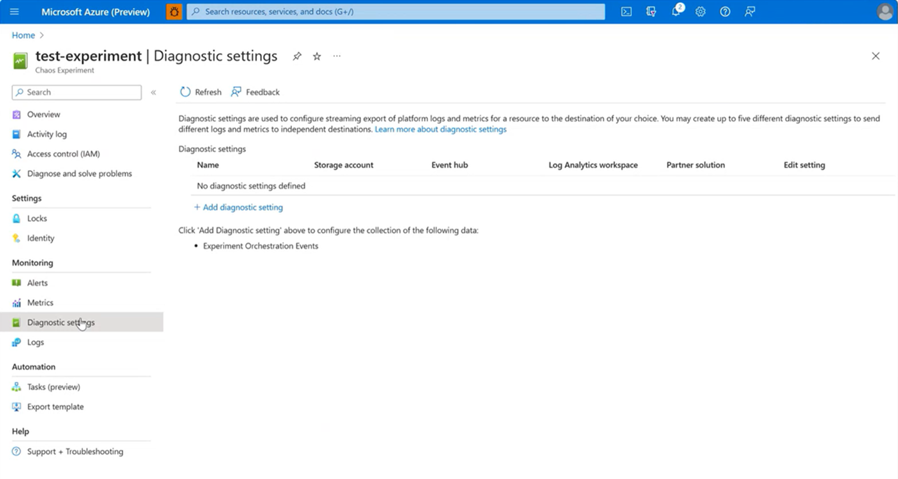
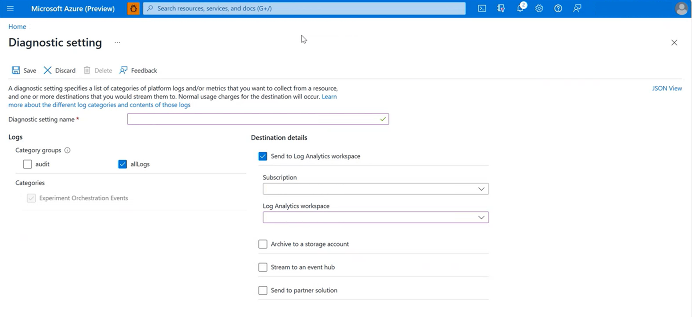
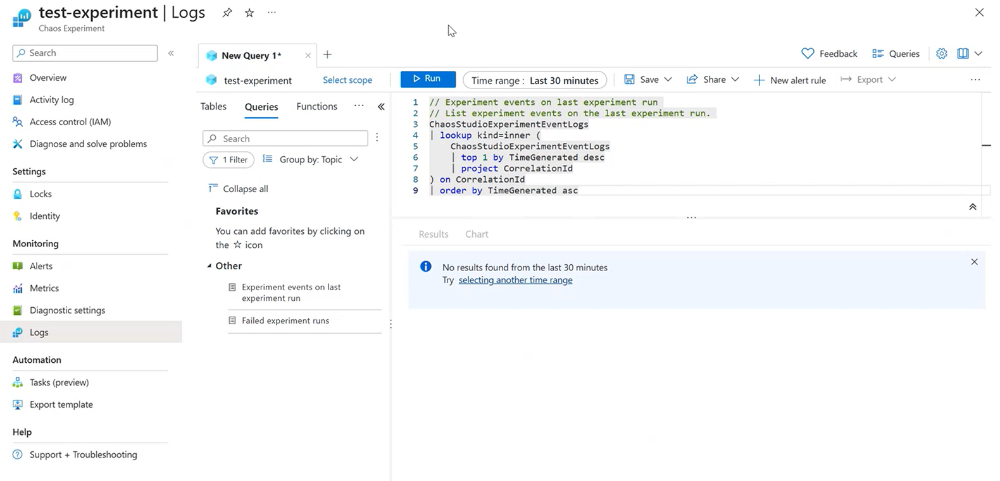

# How-to: Configure your experiment to emit Experiment Fault Events to Azure Monitor
In this guide, we'll show you the steps needed to integrate an Experiment to emit telemetry to Azure Monitor. These events show the start and stop of each fault as well as the type of fault executed and the resource the fault was executed against. You can overlay this data on top of your existing Azure Monitor or external monitoring dashboards.

## Prerequisites
- An Azure subscription
- An existing Chaos Studio Experiment [How to create your first Chaos Experiment](chaos-studio-quickstart-azure-portal.md)
- An existing Log Analytics Workspace [How to Create a Log Analytics Workspace](../azure-monitor/logs/quick-create-workspace.md)

## Step 1: Navigate to Diagnostic Settings tab in your Chaos Experiment
Navigate to the Chaos Experiment you want to emit telemetry to Azure Monitor and open it. Then navigate to the "Diagnostic settings" tab under the "Monitoring" section as shown in the below screenshot:

 

## Step 2: Connect your Chaos Experiment to your desired Log Analytics Workspace
Once you are in the "Diagnostic Settings" tab within your Chaos Experiment, select "Add Diagnostic Setting."
Enter the following details:
1. **Diagnostic Setting Name**: Any String you want, much like a Resource Group Name
2. **Category Groups**:Choose which category of logging you want to output to the Log Analytics workspace. 
3. **Subscription**: The subscription which includes the Log Analytics Workspace you would like to use
4. **Log Analytics Workspace**: Where you'll select your desired Log Analytics Workspace
 
All the other settings are optional
 

 

## Step 3: Run the chaos experiment
Once you have completed Step 2, your experiment is now configured to emit telemetry to Azure Monitor upon the next Chaos Experiment execution!  It typically takes time (20 minutes) for the logs to populate. Once populated you can view the log events from the logs tab. Events include experiment start, stop, and details about the faults executed. You can even turn the logs into chart visualizations or overlay your existing live site visualizations with chaos metadata.

 

To query your logs, navigate to the "Logs" tab in your Chaos Experiment Resource to get your desired logging information in your desired format.

 

