# Create a chaos experiment that uses an agent-based fault with the Azure portal

You can use a chaos experiment to verify that your application is resilient to failures by causing those failures in a controlled environment. In this article, you cause a high CPU event on a Linux virtual machine (VM) by using a chaos experiment and Azure Chaos Studio. Running this experiment can help you defend against an application from becoming resource starved.

You can use these same steps to set up and run an experiment for any agent-based fault. An *agent-based* fault requires setup and installation of the chaos agent. A service-direct fault runs directly against an Azure resource without any need for instrumentation.

## Prerequisites

- An Azure subscription. [!INCLUDE [quickstarts-free-trial-note](../../includes/quickstarts-free-trial-note.md)]
- A Linux VM. If you don't have a VM, you can [create one](../virtual-machines/linux/quick-create-portal.md).
- A network setup that permits you to [SSH into your VM](../virtual-machines/ssh-keys-portal.md).
- A user-assigned managed identity *that was assigned to the target VM or virtual machine scale set*. If you don't have a user-assigned managed identity, you can [create one](../active-directory/managed-identities-azure-resources/how-manage-user-assigned-managed-identities.md).

## Enable Chaos Studio on your virtual machine

Chaos Studio can't inject faults against a VM unless that VM was added to Chaos Studio first. To add a VM to Chaos Studio, create a [target and capabilities](chaos-studio-targets-capabilities.md) on the resource. Then you install the chaos agent.

Virtual machines have two target types. One target type enables service-direct faults (where no agent is required). Another target type enables agent-based faults (which requires the installation of an agent). The chaos agent is an application installed on your VM as a [VM extension](../virtual-machines/extensions/overview.md). You use it to inject faults in the guest operating system.

### Enable the chaos target, capabilities, and agent

> [!IMPORTANT]
> Prior to finishing the next steps, you must [create a user-assigned managed identity](../active-directory/managed-identities-azure-resources/how-manage-user-assigned-managed-identities.md). Then you assign it to the target VM or virtual machine scale set.

1. Open the [Azure portal](https://portal.azure.com).
1. Search for **Chaos Studio** in the search bar.
1. Select **Targets** and move to your VM.

   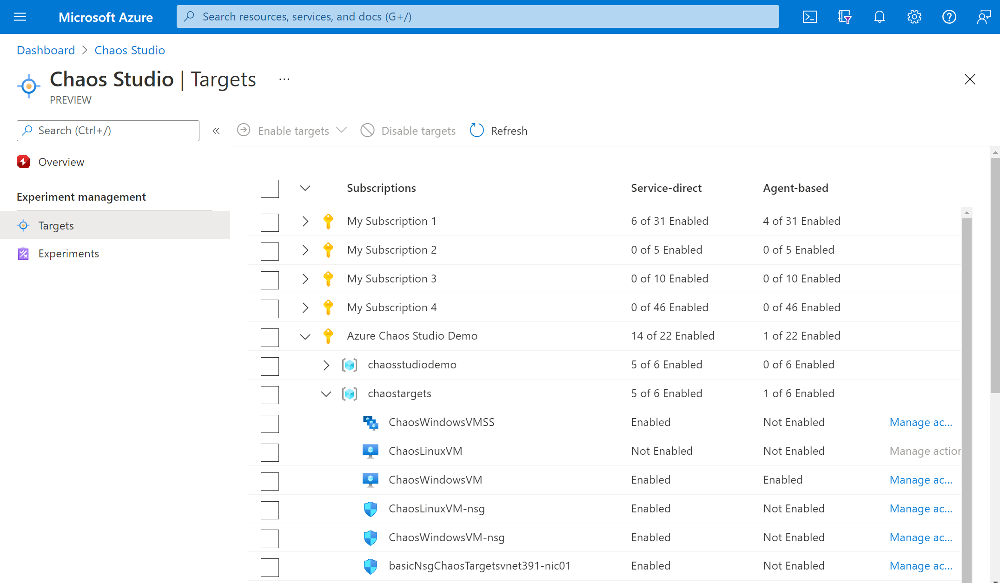
1. Select the checkbox next to your VM and select **Enable targets**. Then select **Enable agent-based targets** from the dropdown menu.

   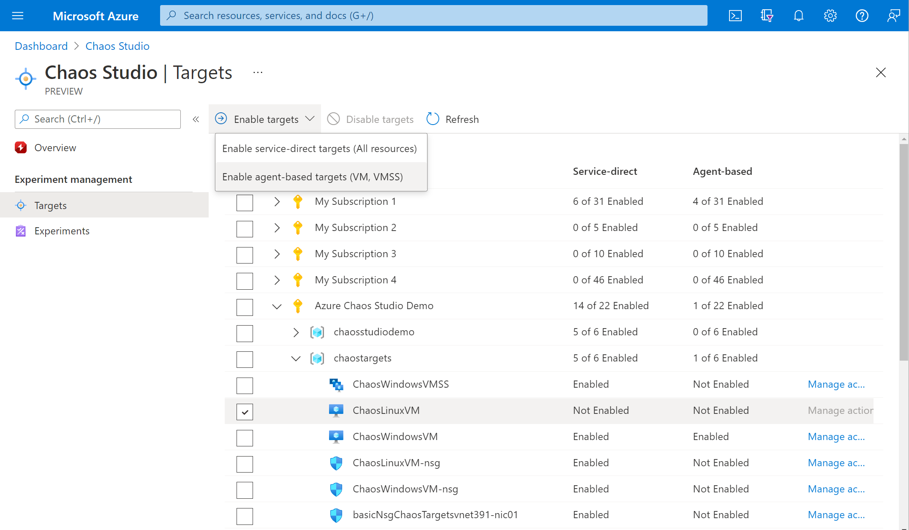
1. Select the **Managed Identity** to use to authenticate the chaos agent and optionally enable Application Insights to see experiment events and agent logs.

   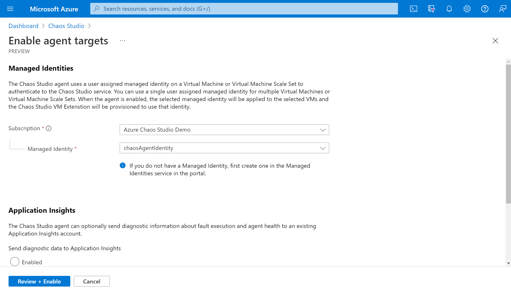
1. Select **Review + Enable** > **Enable**.

   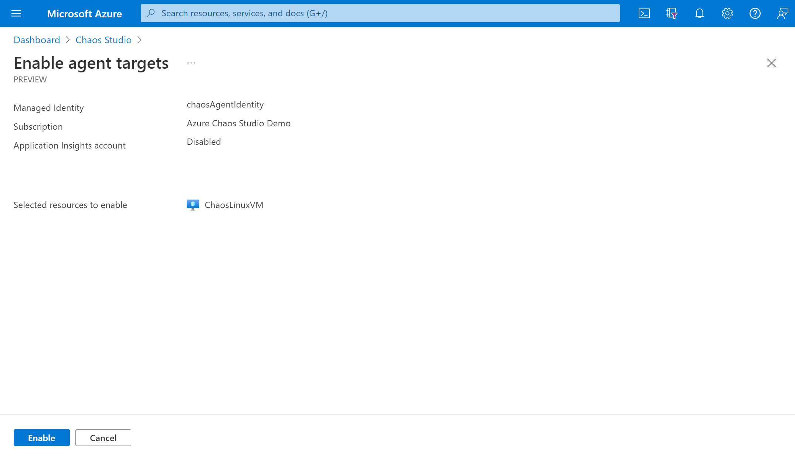
1. After a few minutes, a notification appears that indicates that the resources selected were successfully enabled. The Azure portal adds the user-assigned identity to the VM. The portal enables the agent target and capabilities and installs the chaos agent as a VM extension.

   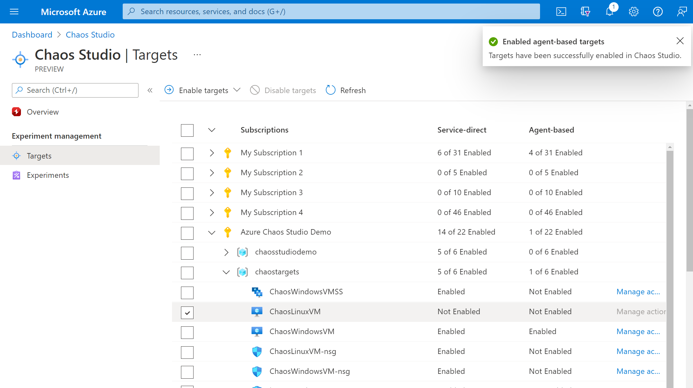
1. If you're enabling a virtual machine scale set, upgrade instances to the latest model by going to the virtual machine scale set resource pane. Select **Instances**, and then select all instances. Select **Upgrade** if you're not on the latest model.

You've now successfully added your Linux VM to Chaos Studio. In the **Targets** view, you can also manage the capabilities enabled on this resource. Select the **Manage actions** link next to a resource to display the capabilities enabled for that resource.

## Create an experiment
Now you can create your experiment. A chaos experiment defines the actions you want to take against target resources. The actions are organized and run in sequential steps. The chaos experiment also defines the actions you want to take against branches, which run in parallel.

1. Select the **Experiments** tab in Chaos Studio. In this view, you can see and manage all your chaos experiments. Select **Create** > **New experiment**.

   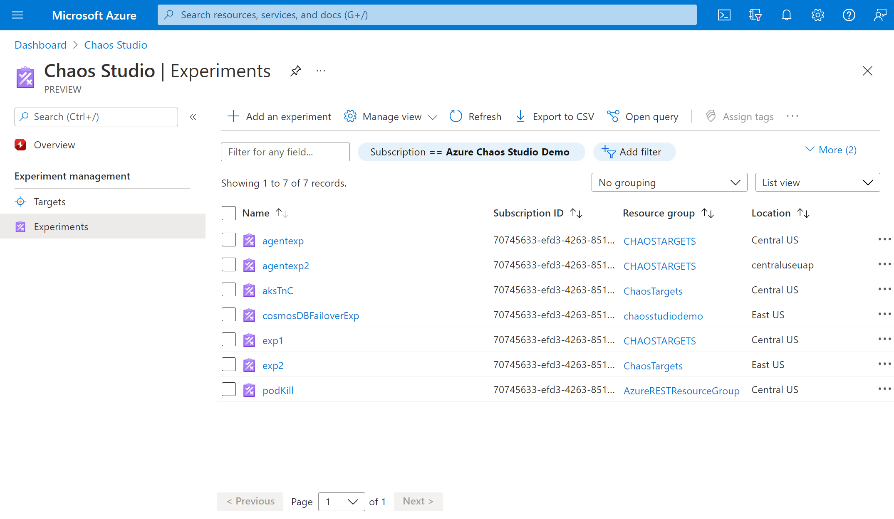
1. Fill in the **Subscription**, **Resource Group**, and **Location** where you want to deploy the chaos experiment. Give your experiment a name. Select **Next: Experiment designer**.

   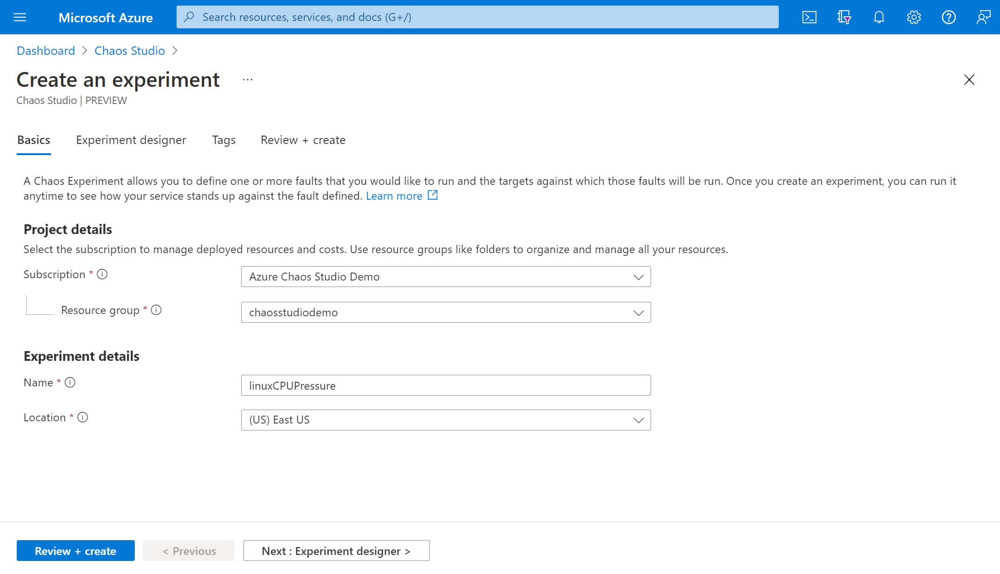
1. You're now in the Chaos Studio experiment designer. You can build your experiment by adding steps, branches, and faults. Give a friendly name to your **Step** and **Branch**. Then select **Add action > Add fault**.

   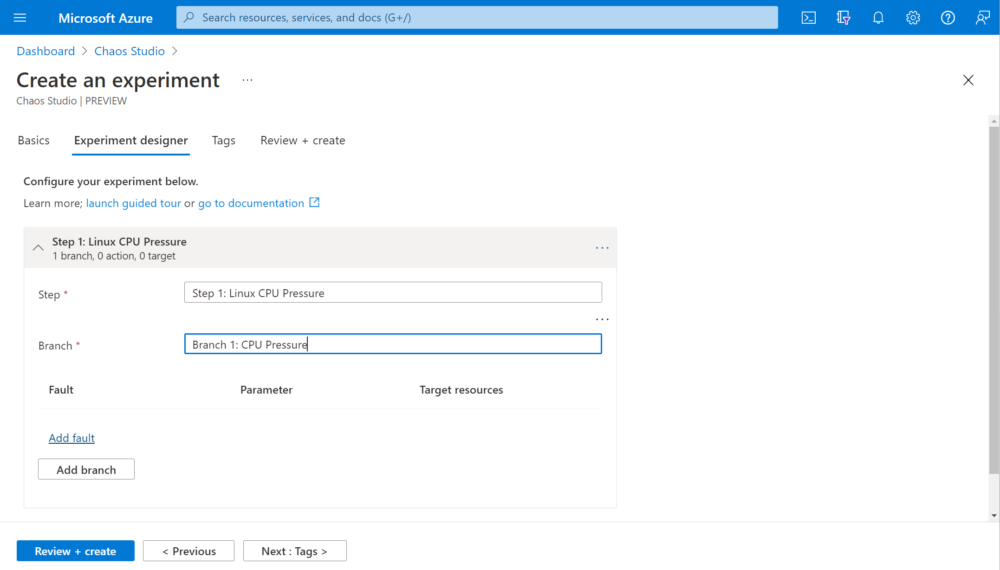
1. Select **CPU Pressure** from the dropdown list. Fill in **Duration** with the number of minutes to apply pressure. Fill in **pressureLevel** with the amount of CPU pressure to apply. Leave **virtualMachineScaleSetInstances** blank. Select **Next: Target resources**.

   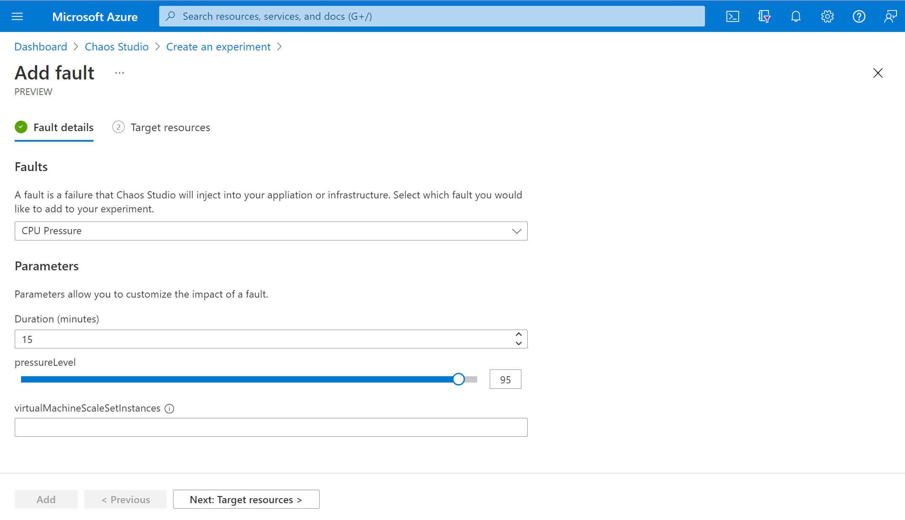
1. Select your VM and select **Next**.

   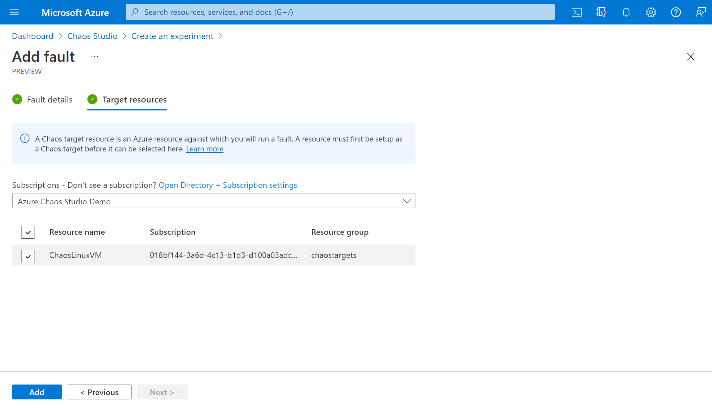
1. Verify that your experiment looks correct. Then select **Review + create** > **Create**.

   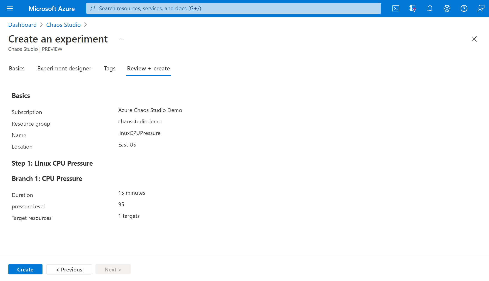

## Give the experiment permission to your virtual machine
When you create a chaos experiment, Chaos Studio creates a system-assigned managed identity that executes faults against your target resources. This identity must be given [appropriate permissions](chaos-studio-fault-providers.md) to the target resource for the experiment to run successfully.

1. Go to your VM and select **Access control (IAM)**.

   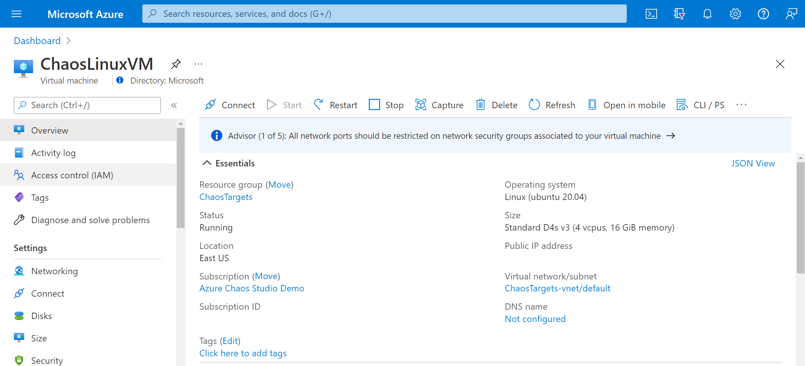
1. Select **Add** > **Add role assignment**.

   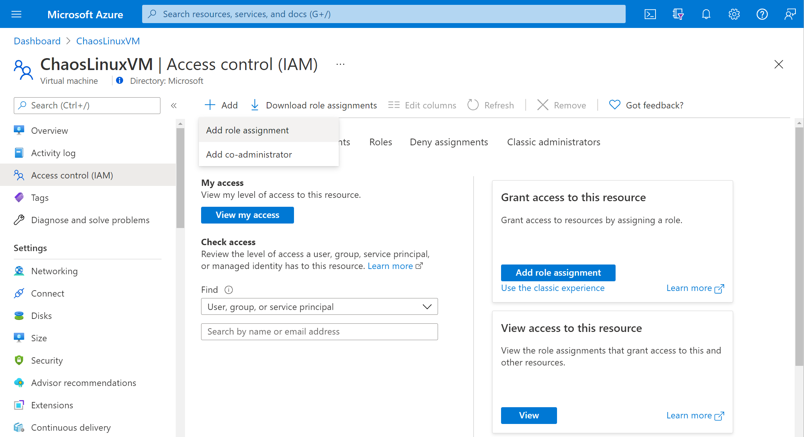
1. Search for **Reader** and select the role. Select **Next**.

   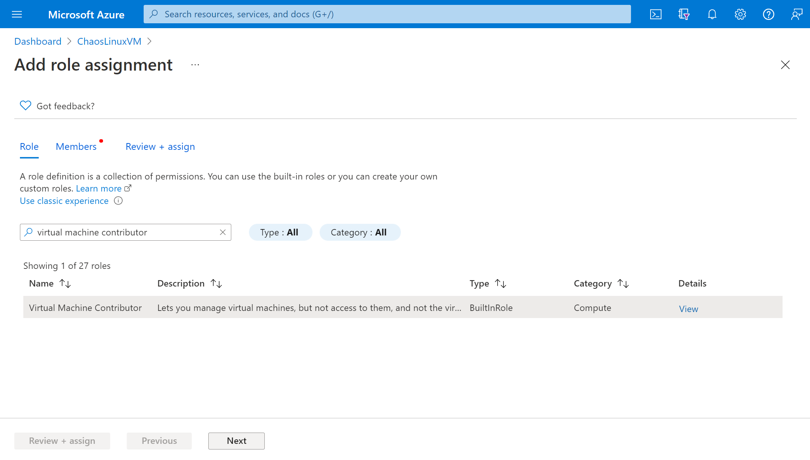
1. Choose **Select members** and search for your experiment name. Select your experiment and choose **Select**. If there are multiple experiments in the same tenant with the same name, your experiment name is truncated with random characters added.

   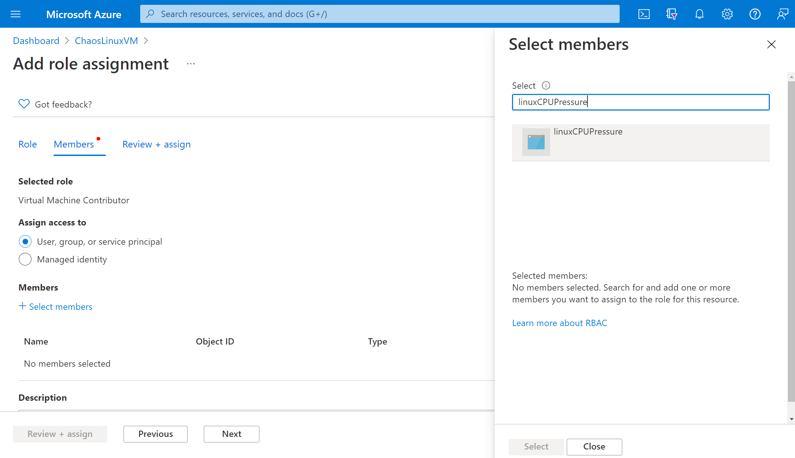
1. Select **Review + assign** > **Review + assign**.

## Run your experiment
You're now ready to run your experiment. To see the impact, we recommend that you open an [Azure Monitor metrics chart](../azure-monitor/essentials/tutorial-metrics.md) with your VM's CPU pressure in a separate browser tab.

1. In the **Experiments** view, select your experiment. Select **Start** > **OK**.

   
1. After the **Status** changes to *Running*, under **History**, select **Details** for the latest run to see details for the running experiment.

## Next steps
Now that you've run an agent-based experiment, you're ready to:
- [Create an experiment that uses service-direct faults](chaos-studio-tutorial-service-direct-portal.md)
- [Manage your experiment](chaos-studio-run-experiment.md)
