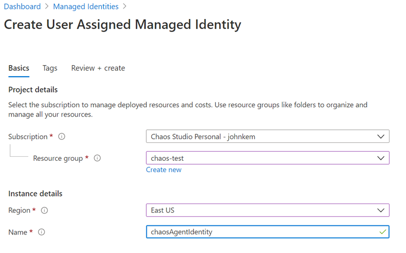
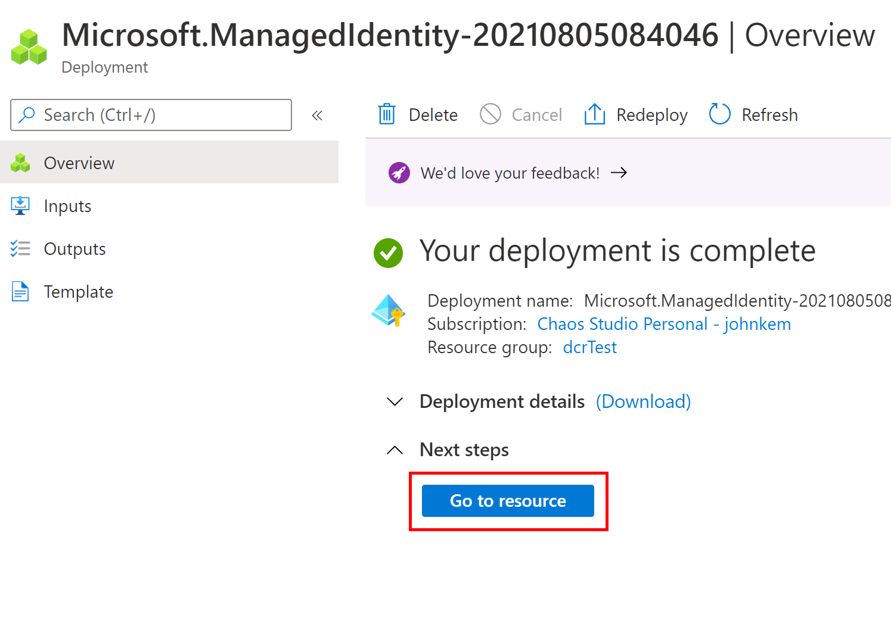
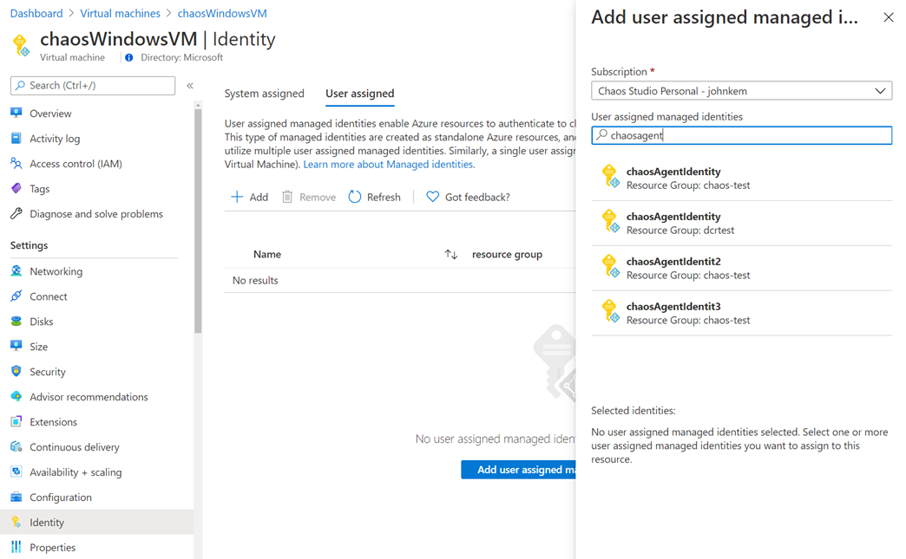
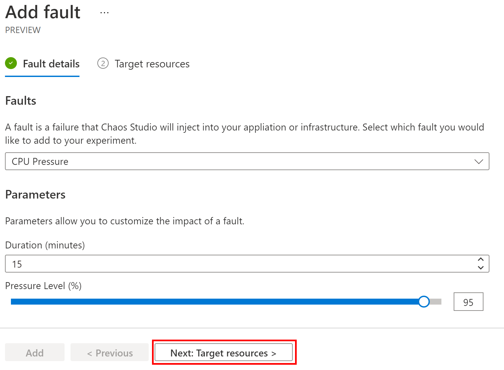
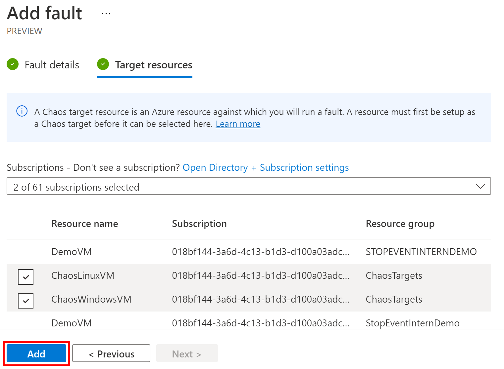
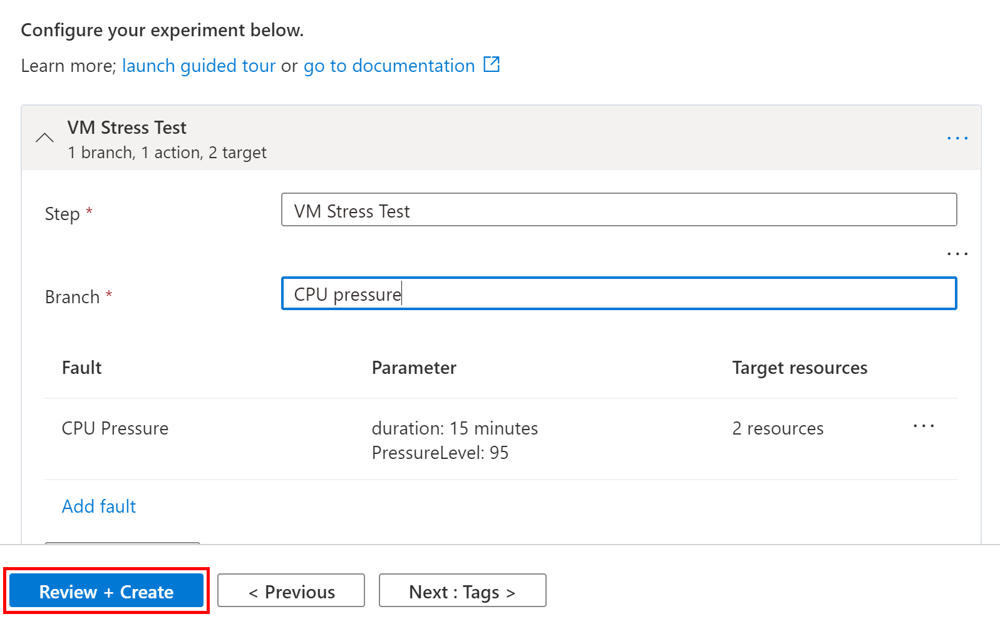
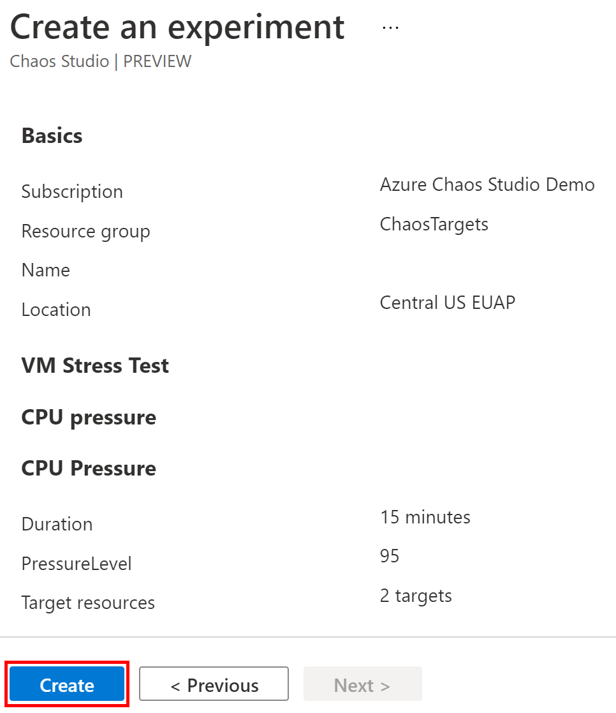
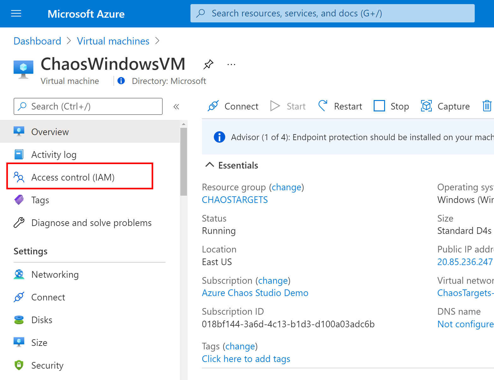
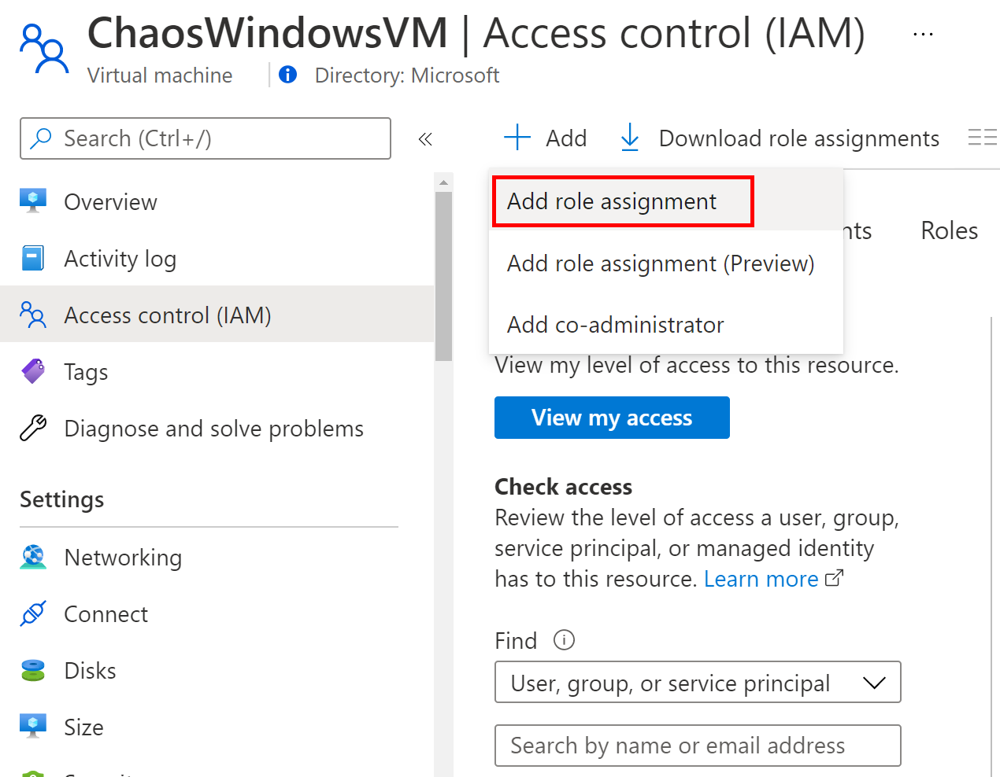
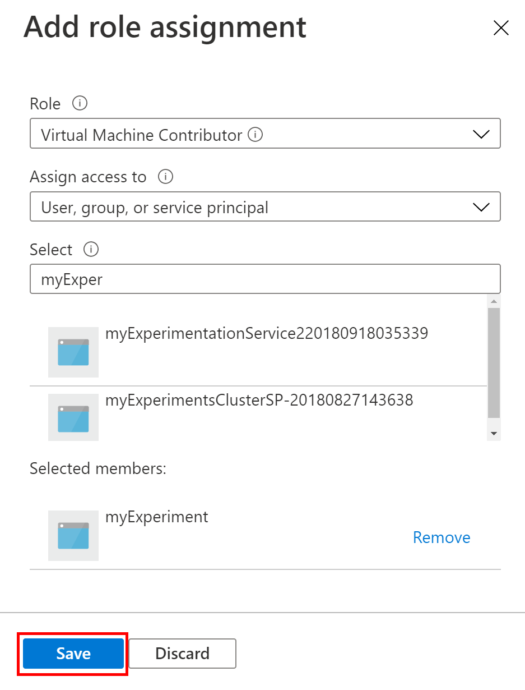

# Create an experiment that uses an agent-based fault

Chaos Studio supports two types of faults – service-direct faults, where the fault is injected service to service, and agent-based faults, where the fault is injected by an agent running in the guest operating system of a VM, virtual machine scale set, or other compute service. An agent-based fault uses the Chaos Studio agent. This requires a few additional setup steps. In this walkthrough, we create a single-step, single-branch, single-action experiment that causes high CPU using the chaos agent.

## Set up fault targets

Before running an agent-based fault you must first create the chaos agent provider configuration and install the agent on each target.

### Create a user-assigned managed identity and assign it to each VM or virtual machine scale set

The Chaos Agent uses a [user-assigned managed identity](../active-directory/managed-identities-azure-resources/overview.md) to authenticate to Chaos Studio. All agents installed on all VMs within a subscription can use the same user-assigned managed identity, which must be assigned to those VMs that you plan to target in an experiment. You can use either the Azure portal or the Azure CLI to create the identity and assign it to your VMs.

#### Use the Azure portal

1. First create a user-assigned managed identity. You can use one managed identity for all VMs/virtual machine scale sets that you plan to target. Go to the **Managed Identities** blade and click **Create**.

2. Fill in the **Subscription**, **Resource group**, **Region**, and **Name** fields. The identity can be in any resource group and region and have any name.

    

3. Click **Review + create** then click **Create**.

4. When the identity has been created click **Go to resource**.

    

5. Copy the **Client ID** of the identity and save it for a later step.

    

6. Navigate to the VM or virtual machine scale set you want to onboard and click **Identity** in the table of contents. Switch to the **User assigned** tab and press the **Add** button. Search for the identity you created in Step 1 and add it to the VM/virtual machine scale set.

    

#### Use the Azure CLI

1. Log in to the Azure CLI and set the active subscription if needed. Replace `My Subscription` with your subscription name.
    ```bash
    az login
    az account set --subscription "My Subscription"
    ```

2. First create a user-assigned managed identity by running the `az identity create` command. You can use one managed identity for all VMs/virtual machine scale sets that you plan to target. Replace `$SUBSCRIPTION_ID` and `$RESOURCE_GROUP` with the subscription ID and resource group where you want the identity to be created. The identity can be in any resource group and region and have any name; we recommend using the same resource group and region where the target VM is located.
    ```bash
    az identity create --subscription $SUBSCRIPTION_ID --resource-group $RESOURCE_GROUP --name chaosAgentIdentity
    ```

3. Copy the **id** (the resource ID of the managed identity), **clientId**, and **tenantId** properties and save them for a later step.

4. Assign the new managed identity to each VM and/or virtual machine scale sets where you plan to install the agent by using the `az vm identity assign` or `az vmss identity assign` command. Replace `$VM_RESOURCE_ID`/`$VMSS_RESOURCE_ID` with the resource ID of the Virtual Machine you are adding as a chaos target and `$MANAGED_IDENTITY_RESOURCE_ID` with the resource ID of the managed identity recorded in the previous step.

    **Virtual Machine**

    ```bash
    az vm identity assign --ids $VM_RESOURCE_ID --identities $MANAGED_IDENTITY_RESOURCE_ID
    ```

    **Virtual Machine Scale Set**

    ```bash
    az vmss identity assign --ids $VMSS_RESOURCE_ID --identities $MANAGED_IDENTITY_RESOURCE_ID
    ```

### Create the chaos agent provider configuration

Next set up a chaosAgent provider configuration that specifies the user-assigned managed identity that agents use to connect to Chaos Studio. You can only have one provider configuration per type (in this case, chaosAgent is the type). In this example, we use one managed identity for all VMs so we only add one identity to the provider configuration. Provider configurations cannot be updated - they can only be deleted and recreated - so we recommend sharing an identity among VMs to avoid having to recreate your chaosAgent provider configuration each time you want to onboard more VMs. A provider configuration must be created via REST API. In this example we use the `az rest` command to execute the REST API calls.

1. Modify the following JSON, replacing `$USER_IDENTITY_CLIENT_ID` with the clientID of your managed identity and `$USER_IDENTITY_TENANT_ID` with your Azure tenant ID (if not recorded in a previous step, you can find this in the Azure portal under **Azure Active Directory** under  **Tenant information**). Save the JSON as a file in the same location where you are running the Azure CLI (in Cloud Shell you can drag-and-drop the JSON file to upload it).

    ```json
    {
      "properties": {
        "enabled": true,
        "providerConfiguration": {
          "identities": [
            {
              "clientId": "$USER_IDENTITY_CLIENT_ID",
              "tenantId": "$USER_IDENTITY_TENANT_ID",
              "type": "UserAssignedMsiIdentity"
            }
          ],
          "type": "ChaosAgent"
        }
      }
    }
    ```

2. Create the provider configuration using the REST API. Replace `$SUBSCRIPTION_ID` with the subscription ID where your target VMs reside. Replace `providerConfig.json` with the name of the JSON file you created in the previous step.

    ```bash
    az rest --method put --uri https://management.azure.com/subscriptions/$SUBSCRIPTION_ID/providers/Microsoft.Chaos/chaosProviderConfigurations/ChaosAgent?api-version=2021-06-21-preview --body @providerConfig.json --query properties.providerConfiguration.agentProfileId -o tsv
    ```

3. The command returns a GUID for the **agentProfileId**. Copy this down for use in a later step.

### Install the Chaos Agent

The Chaos Agent is an application that runs in your VMs/virtual machine scale set instances to execute agent-based faults. During installation you configure the agent with the managed identity the agent should use, the profile ID of the chaosAgent provider configuration, and optionally an Application Insights instrumentation key that enables the agent to send diagnostic events to Application Insights.

1. Before beginning, make sure you have the following details:
    * **agentProfileId** - the property returned when creating the chaosAgent provider configuration. If you don't have this, you can run `az rest --method get --uri https://management.azure.com/subscriptions/$SUBSCRIPTION_ID/providers/Microsoft.Chaos/chaosProviderConfigurations/ChaosAgent?api-version=2021-06-21-preview` and copy the `profileId` property.
    * **ClientId** - the client ID of the user-assigned managed identity used in the chaosAgent provider configuration. If you don't have this, you can run `az rest --method get --uri https://management.azure.com/subscriptions/$SUBSCRIPTION_ID/providers/Microsoft.Chaos/chaosProviderConfigurations/ChaosAgent?api-version=2021-06-21-preview` and copy the `clientId` property
    * (optionally) **AppInsightsKey** - the instrumentation key for your Application Insights component. You can find this in the Application Insights blade in the Azure portal under **Essentials**.

2. Modify the following Windows or Linux JSON, replacing `$AGENT_PROFILE_ID` with the agentProfileId, `$USER_IDENTITY_CLIENT_ID` with the clientID of your managed identity, and `$APP_INSIGHTS_KEY` with your Application Insights instrumentation key. If you are not using Application Insights, remove that flag and variable. Save this file as `agentSettings.json` in the folder where you are running the Azure CLI.

    **Windows**

    ```json
    {
      "commandToExecute": "PowerShell.exe -ExecutionPolicy Unrestricted -File installer/azure-chaos-agent-installer.ps1 -TenantId \"CHAOSRPCANARY\" -ProfileId \"$AGENT_PROFILE_ID\" -IdentityType \"UserAssignedMsi\" -IdentitySubject \"$USER_IDENTITY_CLIENT_ID\" -AppInsightsKey \"$APP_INSIGHTS_KEY\" -CommunicationApiBaseUrl \"https://agentcommunicationservice-frontdoor-canary.trafficmanager.net\"",
      "fileUris": [
        "https://azurechaosagent.blob.core.windows.net/global/installer/azure-chaos-agent-installer.ps1"
      ]
    }
    ```

    **Linux**

    ```json
    {
      "commandToExecute": "bash azure-chaos-agent-installer.sh -t\"CHAOSRPCANARY\" -p \"$AGENT_PROFILE_ID\" -i \"UserAssignedMsi\" -c \"$USER_IDENTITY_CLIENT_ID\" -a \"$APP_INSIGHTS_KEY\" -e \"https://agentcommunicationservice-frontdoor-canary.trafficmanager.net\"",
      "fileUris": [
        "https://azurechaosagent.blob.core.windows.net/global/installer/azure-chaos-agent-installer.sh"
      ]
    }
    ```


3. Install the agent using the Custom Script extension and the settings JSON created above. Replace `$VM_RESOURCE_ID` with the resource ID of your VM or replace `$SUBSCRIPTION_ID`, `$RESOURCE_GROUP`, and `$VMSS_NAME` with those properties for your virtual machine scale set.

    #### Install the agent on a VM

    **Windows**

    ```bash
    az vm extension set --name CustomScriptExtension --publisher "Microsoft.Compute" --version 1.10 --settings agentSettings.json --ids $VM_RESOURCE_ID
    ```

    **Linux**

    ```bash
    az vm extension set --name CustomScript --publisher "Microsoft.Azure.Extensions" --version 2.1 --settings agentSettings.json --ids $VM_RESOURCE_ID
    ```

    #### Install the agent on a virtual machine scale set

    **Windows**

    ```bash
    az vmss extension set --name CustomScriptExtension --publisher "Microsoft.Compute" --version 1.10 --settings agentSettings.json --subscription $SUBSCRIPTION_ID --resource-group $RESOURCE_GROUP --vmss-name $VMSS_NAME
    ```

    **Linux**

    ```bash
    az vmss extension set --name CustomScript --publisher "Microsoft.Azure.Extensions" --version 2.1 --settings agentSettings.json --subscription $SUBSCRIPTION_ID --resource-group $RESOURCE_GROUP --vmss-name $VMSS_NAME
    ```

4. When complete, we recommend validating that the resources defined in your experiment were successfully onboarded. Run the following command, replacing `$SUBSCRIPTION_ID` with the subscription ID where you created the experiment. This returns a JSON object with an array of all onboarded targets and their status.

    ```bash
    az rest --method get --url "https://management.azure.com/subscriptions/$SUBSCRIPTION_ID/providers/Microsoft.Chaos/chaosTargets?api-version=2021-06-21-preview&chaosProviderType=chaosAgent"
    ```

You are now ready to create and run your first experiment.

## Create a chaos experiment

### Use the Azure portal
The Azure portal is the easiest way to create and manage experiments. Follow the instructions below to create an experiment using the portal.

1. Open the Azure portal with the Chaos Studio feature flag:
    * If using an @microsoft.com account, [click this link](https://ms.portal.azure.com/?microsoft_azure_chaos_assettypeoptions={%22chaosStudio%22:{%22options%22:%22%22},%22chaosExperiment%22:{%22options%22:%22%22}}&microsoft_azure_chaos=true).
    * If using an external account, [click this link](https://portal.azure.com/?feature.customPortal=false&microsoft_azure_chaos_assettypeoptions={%22chaosStudio%22:{%22options%22:%22%22},%22chaosExperiment%22:{%22options%22:%22%22}}).

2. In the Search bar at the top of the page, search for "Chaos Experiments" and select the service.

    

3. Click **Add an experiment**.

    

4. Fill in the subscription, resource group, and region where you want the experiment to be stored and give the experiment a name. Then click **Next : Experiment designer**.

    

5. You are now in the Experiment Designer. By default, you see one step with one branch and no actions. Steps execute sequentially, branches execute in parallel within a step, and actions execute sequentially within a branch. The next step only begins once all actions in all branches in the previous step complete and actions within a branch only starts once the previous action has completed. Optionally, give your step and branch friendly names, then click **Add fault** to add a fault to your first branch.

    

6. In the page that appears, select the **CPU Pressure** fault from the fault dropdown and fill in the **Duration** and **Pressure Level** properties as appropriate for your environment. Descriptions and parameters for each fault are available in the [Fault Library](chaos-studio-fault-library.md). Click **Next : Target resources**.

    

   > [!WARNING]
   > The Experiment Designer may not have all faults available in the [Fault Library](chaos-studio-fault-library.md). If your experiment uses faults not available in Experiment Designer, use the [REST API](https://aka.ms/chaosrestapi) to edit your experiment.

7. Pick the resources that the fault will target. Only resources that have been onboarded to Chaos Studio (those that have a provider configuration for their resource type and an agent installed) and only resource types for which the fault is applicable appear in the list. Select the VM(s) you would like to target and click **Add**.

    

8. Continue to add steps, branches, and faults. When done click **Review + Create**.

    

9. Verify that the details of your experiment are correct, then click **Create**

    

10. Before running your experiment you must grant the experiment permission to the target resource(s). Navigate to the resource(s) you are targeting for fault injection and click on **Access control (IAM)**.

    

11. Click **Add** and click **Add role assignment**.

    

12. Under **Role** select the [appropriate role for the resource type](chaos-studio-fault-providers.md) and under **Select** search for the name of your experiment. When you create an experiment Chaos Studio creates a system-assigned managed identity for the experiment with the same name. This identity is used to inject faults against your resources. If an identity already exists with the experiment name, Chaos Studio truncates the experiment name and adds random characters to it. Select the identity for your experiment and click **Save**. Repeat this process for any resources targeted by your experiment.

    

Congratulations! You've created your first chaos experiment and set up resources for fault injection!

Next, **[run your experiment](chaos-studio-run-experiment.md) >>**

### Use the Chaos Studio REST API
If you are using features that aren't available in the portal yet or if you prefer to use REST APIs, follow the instructions below to create an experiment that uses agent-based faults.

1. Formulate your experiment JSON starting with the JSON sample below. Modify the JSON to correspond to the experiment you want to run using the [Create Experiment API](https://aka.ms/chaosrestapi) and the [Fault Library](chaos-studio-fault-library.md)

    ```json
    {
      "location": "eastus2euap",
      "identity": {
        "type": "SystemAssigned"
      },
      "properties": {
        "steps": [
          {
            "name": "Step1",
            "branches": [
              {
                "name": "Branch1",
                "actions": [
                  {
                    "type": "continuous",
                    "name": "urn:provider:agent-v2:Microsoft.Azure.Chaos.Fault.CPUPressureAllProcessors",
                    "parameters": [
                      {
                        "key": "PressureLevel",
                        "value": "90"
                      }
                    ],
                    "duration": "PT5M",
                    "selectorid": "Selector1"
                  }
                ]
              }
            ]
          }
        ],
        "selectors": [
          {
            "id": "Selector1",
            "type": "List",
            "targets": [
              {
                "type": "ResourceId",
                "id": "/subscriptions/018bf144-3a6d-4c13-b1d3-d100a03adc6b/resourceGroups/chaosstudiodemo/providers/Microsoft.Compute/VirtualMachines/ChaosWindowsVM/Microsoft.Chaos/chaosAgents/chaosAgent"
              }
            ]
          }
        ]
      }
    }
    ```

    The resource ID used for agent-based faults is different than the resource ID used for service-direct faults. For agent-based faults, append `/Microsoft.Chaos/chaosAgents/chaosAgent` to the VM or virtual machine scale set instance resource ID:  
    `{vm-resource-id}/Microsoft.Chaos/chaosAgents/chaosAgent`

    `/subscriptions/{subscriptionId}/resourceGroups/{rg-name}/providers/Microsoft.Compute/virtualMachineScaleSets/{vmssName}/VirtualMachines/{vmInstanceId}/Microsoft.Chaos/chaosAgents/chaosAgent`

2. Create the experiment using the Azure CLI, replacing `$SUBSCRIPTION_ID`, `$RESOURCE_GROUP`, and `$EXPERIMENT_NAME` with the properties for your experiment. Make sure you have saved and uploaded your experiment JSON in Step 1, updating `experiment.json` with your JSON filename.

    ```bash
    az rest --method put --uri https://management.azure.com/subscriptions/$SUBSCRIPTION_ID/resourceGroups/$RESOURCE_GROUP/providers/Microsoft.Chaos/chaosExperiments/$EXPERIMENT_NAME?api-version=2021-06-21-preview --body @experiment.json
    ```

    Each experiment creates a corresponding system-assigned managed identity. Note of the `principalId` for this identity in the response for the next step.

3. Give the experiment access to your VM/virtual machine scale sets using the command below, replacing `$EXPERIMENT_PRINCIPAL_ID` with the principalId from the previous step and `$RESOURCE_ID` with the resource ID of the target VM/virtual machine scale sets (the actual resource ID, not the chaos agent resource ID used in the experiment definition). Run this command for each VM/virtual machine scale sets targeted in your experiment.

    ```bash
    az role assignment create --role "Virtual Machine Contributor" --assignee-principal-type "ServicePrincipal" --assignee-object-id $EXPERIMENT_PRINCIPAL_ID --scope $RESOURCE_ID 
    ```

Congratulations! You've created your first chaos experiment and set up resources for fault injection!

Next, **[run your experiment](chaos-studio-run-experiment.md) >>**
