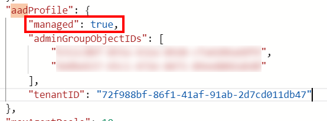
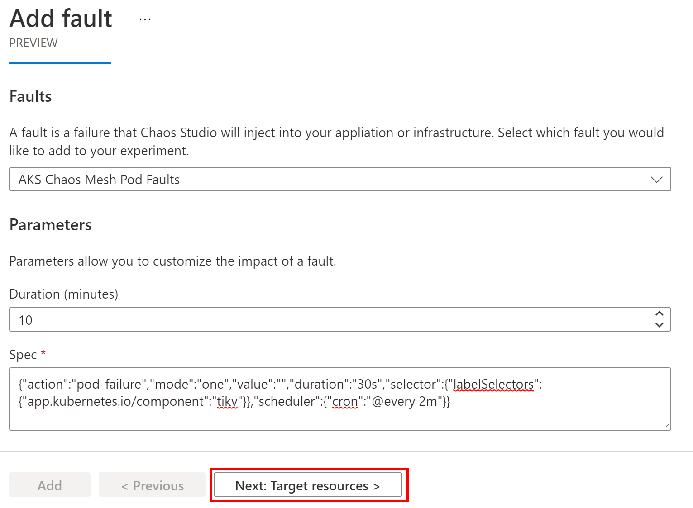
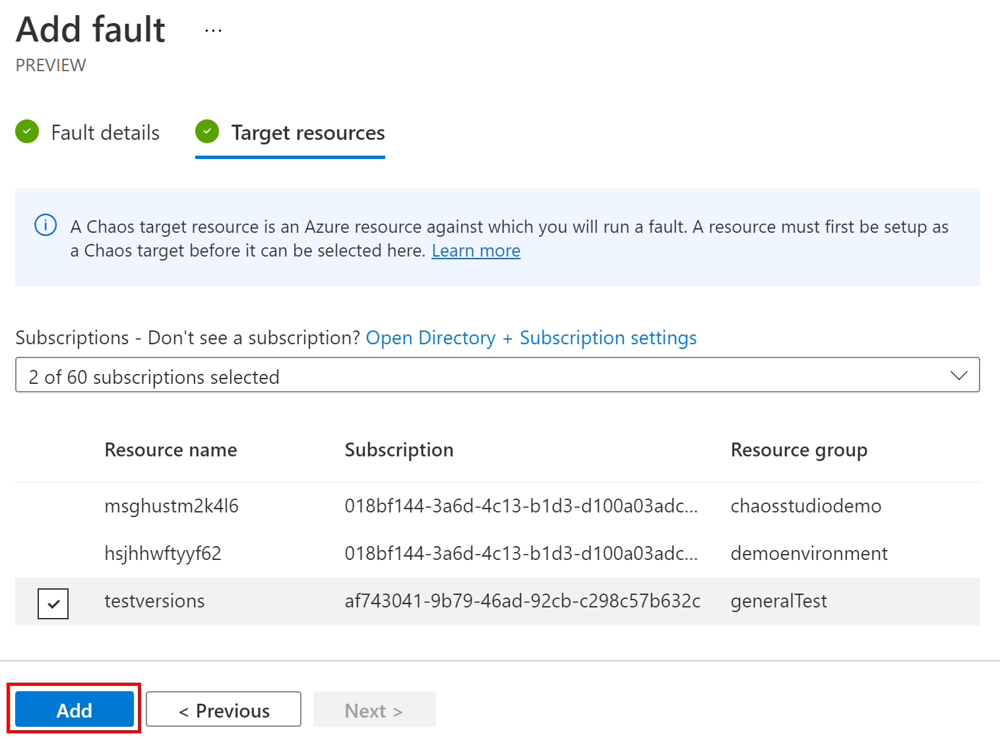
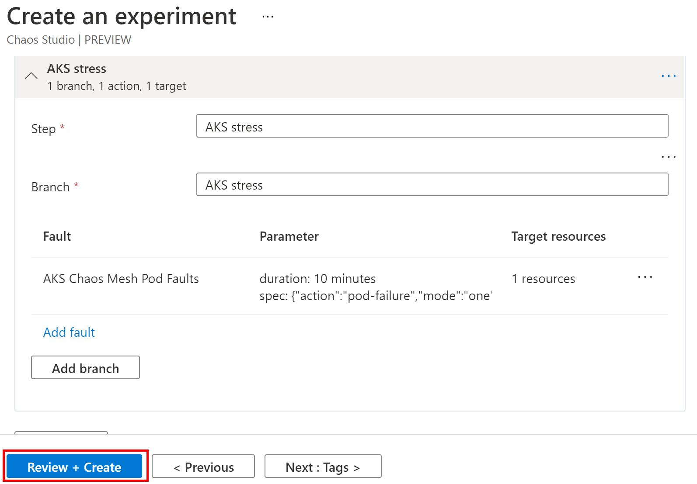
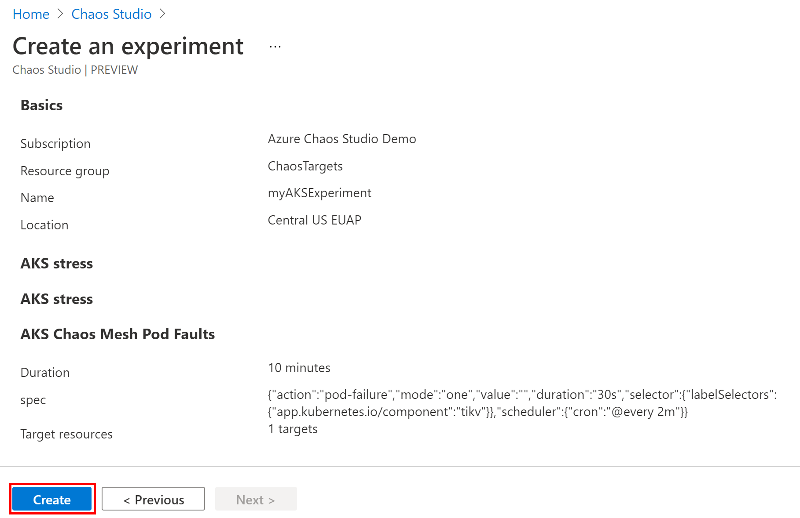
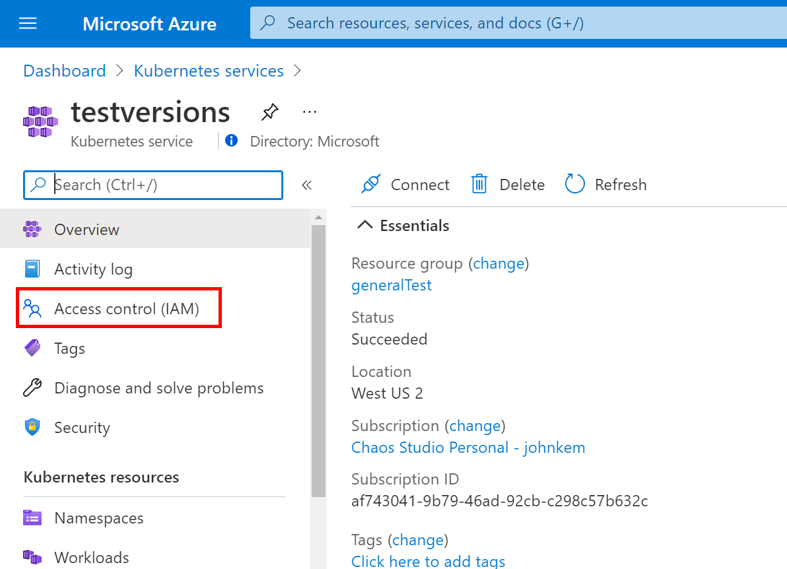
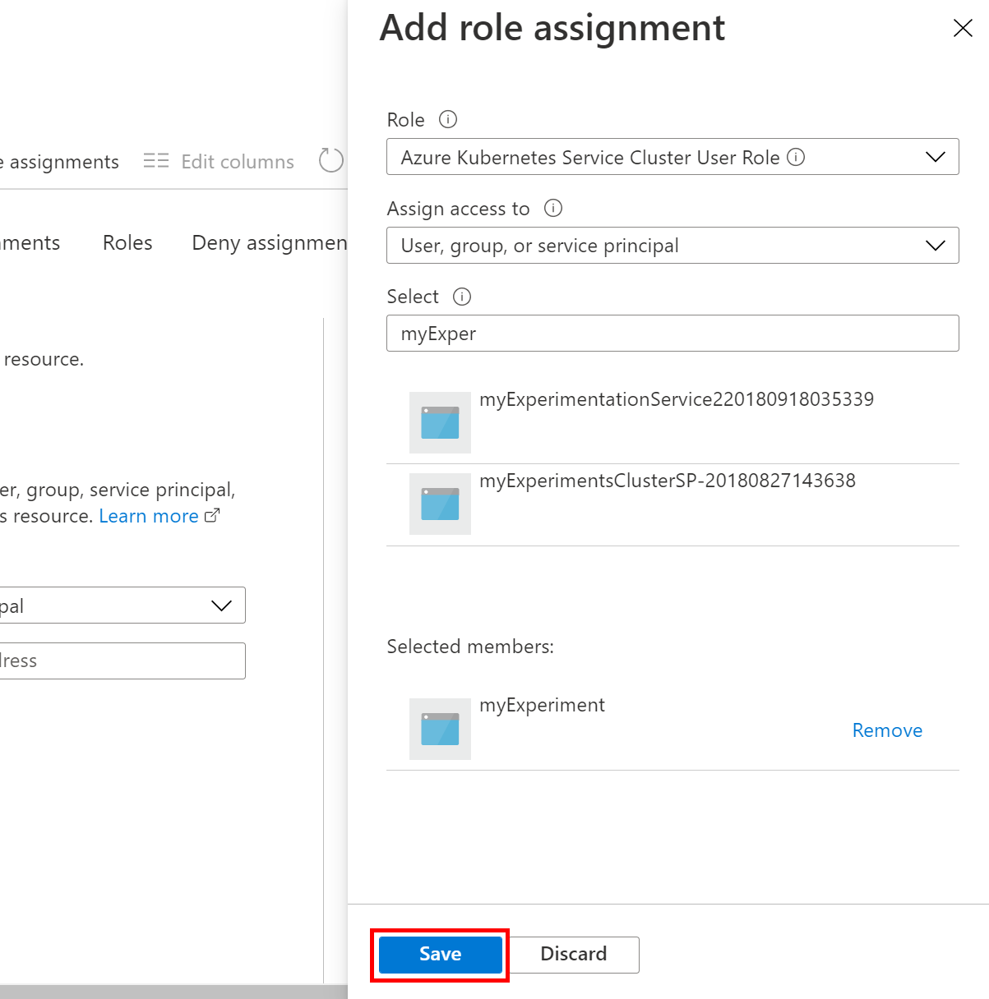

# Create an experiment that uses a service-direct fault on AKS

Azure Chaos Studio leverages [Chaos Mesh](https://chaos-mesh.org/), a free, open-source Chaos Engineering platform for Kubernetes to inject faults into an Azure Kubernetes Service cluster. Chaos Mesh faults are [service-direct](chaos-studio-tutorial-service-direct.md) faults that require Chaos Mesh to be installed on the AKS cluster.

## Limitations
* The AKS cluster must be running Chaos Mesh version **1.1.4 or older**. Newer Chaos Mesh versions are not yet supported.
* The AKS cluster you are performing fault injection against must have [AKS-managed Azure Active Directory](../aks/managed-aad.md) **disabled**. You can check if your cluster has AKS-managed AAD enabled by going to the Azure Portal blade for your cluster, clicking on "JSON View" in the top right corner, and searching the JSON for a `"aadProfile"` property.

  

  If the property is set to `true` you cannot execute chaos experiments against this cluster yet. There is no way to disable AKS-managed AAD.

## Install Chaos Mesh on your AKS cluster
Before you can run Chaos Mesh faults in Chaos Studio you need to install Chaos Mesh on your AKS cluster.

1. Run the following commands in an Azure Cloud Shell window where you have the active subscription set to be the subscription where your AKS cluster is deployed. Replace `$RESOURCE_GROUP` and `$CLUSTER_NAME` with the resource group and name of your cluster resource.

```bash
az aks get-credentials -g $RESOURCE_GROUP -n $CLUSTER_NAME
helm repo add chaos-mesh https://charts.chaos-mesh.org
helm repo update
curl -sSL https://mirrors.chaos-mesh.org/v1.1.4/crd.yaml | kubectl apply --validate=false -f -
kubectl create ns chaos-testing
helm install chaos-mesh chaos-mesh/chaos-mesh --namespace=chaos-testing --version v0.4.4 --set chaosDaemon.runtime=containerd --set chaosDaemon.socketPath=/run/containerd/containerd.sock
```

2. Verify that the Chaos Mesh pods are installed by running the following command:

```bash
kubectl get pods --namespace chaos-testing -l app.kubernetes.io/instance=chaos-mesh
```

You should see output similar to the following (a chaos-controller-manager and one or more chaos-daemons):

```bash
NAME                                        READY   STATUS    RESTARTS   AGE
chaos-controller-manager-6d6d95cd94-kl8gs   1/1     Running   0          3m40s
chaos-daemon-5shkv                          1/1     Running   0          3m40s
chaos-daemon-jpqhd                          1/1     Running   0          3m40s
chaos-daemon-n6mfq                          1/1     Running   0          3m40s
```

You can also [use the version 1.1.4 installation instructions on the Chaos Mesh website](https://chaos-mesh.org/docs/1.1.4/user_guides/installation/#install-by-helm).

## Setup fault targets

To setup an AKS Chaos Mesh fault you need to create a provider configuration for AKS clusters. You can only have one provider configuration per type (in this case, ChaosMeshAKSChaos is the type) and you only need one provider configuration for all clusters in the subscription. A provider configuration must be created via REST API. In this example we use the `az rest` command to execute the REST API calls.

1. Save the following JSON as a file in the same location where you are running the Azure CLI (in Cloud Shell, you can drag-and-drop the JSON file to upload it).

    ```json
    {
      "properties": {
        "enabled": true,
        "providerConfiguration": {
          "type": "ChaosMeshAKSChaos"
        }
      }
    }
    ```

2. Create the provider configuration using the REST API. Replace `$SUBSCRIPTION_ID` with the subscription ID of the subscription where your target resources are deployed. Replace `providerConfig.json` with the name of the JSON file you created in the previous step.

    ```bash
    az rest --method put --url "https://management.azure.com/subscriptions/$SUBSCRIPTION_ID/providers/Microsoft.Chaos/chaosProviderConfigurations/ChaosMeshAKSChaos?api-version=2021-06-21-preview" --body @providerConfig.json
    ```

3. When complete, we recommend validating that the clusters in your subscription were successfully onboarded. Run the following command, replacing `$SUBSCRIPTION_ID` with the subscription ID where you created the provider configuration. This returns a JSON object with an array of all onboarded clusters and their status.

    ```bash
    az rest --method get --url "https://management.azure.com/subscriptions/$SUBSCRIPTION_ID/providers/Microsoft.Chaos/chaosTargets?api-version=2021-06-21-preview&chaosProviderType=ChaosMeshAKSChaos"
    ```

You are now ready to perform Chaos Mesh faults on your AKS clusters.

## Create a chaos experiment

### Use the Azure portal
The Azure portal is the easiest way to create and manage experiments. Follow the instructions below to create an experiment using the portal.

1. Open the Azure portal with the Chaos Studio feature flag:
    * If using an @microsoft.com account, [click this link](https://ms.portal.azure.com/?microsoft_azure_chaos_assettypeoptions={%22chaosStudio%22:{%22options%22:%22%22},%22chaosExperiment%22:{%22options%22:%22%22}}&microsoft_azure_chaos=true).
    * If using an external account, [click this link](https://portal.azure.com/?feature.customPortal=false&microsoft_azure_chaos_assettypeoptions={%22chaosStudio%22:{%22options%22:%22%22},%22chaosExperiment%22:{%22options%22:%22%22}}).

2. In the Search bar at the top of the page, search for "Chaos Experiments" and select the service.

    

3. Click **Add an experiment**.

    

4. Fill in the subscription, resource group, and region where you want the experiment to be stored and give the experiment a name. Then click **Next : Experiment designer**.

    

5. You are now in the Experiment Designer. By default, you see one step with one branch and no actions. Steps execute sequentially, branches execute in parallel within a step, and actions execute sequentially within a branch. The next step only begins once all actions in all branches in the previous step complete and actions within a branch only starts once the previous action has completed. Optionally, give your step and branch friendly names, then click **Add fault** to add a fault to your first branch.

    

6. In the page that appears, select **AKS Chaos Mesh Pod Faults** fault from the fault dropdown and fill in the **Duration** and **Spec** properties. Descriptions and parameters for each fault are available in the [Fault Library](chaos-studio-fault-library.md). Click **Next : Target resources**.

    To formulate the **Spec** property:
    1. Visit the Chaos Mesh 1.1.4 documentation for a fault type, [e.g. the PodChaos type](https://chaos-mesh.org/docs/1.1.4/chaos_experiments/podchaos_experiment#pod-failure-configuration-file).
    2. Formulate the YAML configuration for that fault type using the Chaos Mesh documentation.

        ```yaml
        apiVersion: chaos-mesh.org/v1alpha1
        kind: PodChaos
        metadata:
          name: pod-failure-example
          namespace: chaos-testing
        spec:
          action: pod-failure
          mode: one
          value: ''
          duration: '30s'
          selector:
            labelSelectors:
              'app.kubernetes.io/component': 'tikv'
          scheduler:
            cron: '@every 2m'
        ```
    3. Remove any YAML outside of the `spec` (including the spec property name), and remove the indentation of the spec details.

        ```yaml
        action: pod-failure
        mode: one
        value: ''
        duration: '30s'
        selector:
          labelSelectors:
            'app.kubernetes.io/component': 'tikv'
        scheduler:
          cron: '@every 2m'
        ```
    4. Use a [YAML-to-JSON converter like this one](https://www.convertjson.com/yaml-to-json.htm) to convert the Chaos Mesh YAML to JSON and minify it.

        ```json
        {"action":"pod-failure","mode":"one","value":"","duration":"30s","selector":{"labelSelectors":{"app.kubernetes.io/component":"tikv"}},"scheduler":{"cron":"@every 2m"}}
        ```
    5. Paste the minified JSON into the **Spec** field in the portal.

    

7. Pick the resources that the fault will target. Only resources that have been onboarded to Chaos Studio (those that have a provider configuration for their resource type) and only resource types for which the fault is applicable appear in the list. Select the AKS cluster(s) you would like to target and click **Add**.

    

8. Continue to add steps, branches, and faults. When done click **Review + Create**.

    

9. Verify that the details of your experiment are correct, then click **Create**.

    

10. Before running your experiment you must grant the experiment permission to the target resource(s). Navigate to the AKS cluster(s) you are targeting for fault injection and click on **Access control (IAM)**.

    

11. Click **Add** and click **Add role assignment**.
    
    

12. Under **Role** select "Azure Kubernetes Service Cluster User Role" and under **Select** search for the name of your experiment. When you create an experiment Chaos Studio creates a system-assigned managed identity for the experiment with the same name. This identity is used to inject faults against your resources. If an identity already exists with the experiment name, Chaos Studio truncates the experiment name and adds random characters to it. Select the identity for your experiment and click **Save**. Repeat this process for any resources targeted by your experiment.

    

Congratulations! You've created your first chaos experiment and setup resources for fault injection!

Next, **[run your experiment](chaos-studio-run-experiment.md) >>**

### Use the Chaos Studio REST API
If you are using features that aren't available in the portal yet or if you prefer to use REST APIs, follow the instructions below to create an experiment that uses AKS Chaos Mesh faults.

1. Formulate your `spec` property. Visit the Chaos Mesh 1.1.4 documentation for a fault type, [e.g. the PodChaos type](https://chaos-mesh.org/docs/1.1.4/chaos_experiments/podchaos_experiment#pod-failure-configuration-file).
2. Formulate the YAML configuration for that fault type using the Chaos Mesh documentation.

    ```yaml
    apiVersion: chaos-mesh.org/v1alpha1
    kind: PodChaos
    metadata:
      name: pod-failure-example
      namespace: chaos-testing
    spec:
      action: pod-failure
      mode: one
      value: ''
      duration: '30s'
      selector:
        labelSelectors:
          'app.kubernetes.io/component': 'tikv'
      scheduler:
        cron: '@every 2m'
    ```
3. Remove any YAML outside of the `spec` (including the spec property name), and remove the indentation of the spec details.

    ```yaml
    action: pod-failure
    mode: one
    value: ''
    duration: '30s'
    selector:
      labelSelectors:
        'app.kubernetes.io/component': 'tikv'
    scheduler:
      cron: '@every 2m'
    ```
4. Use a [YAML-to-JSON converter like this one](https://www.convertjson.com/yaml-to-json.htm) to convert the Chaos Mesh YAML to JSON and minify it.

    ```json
    {"action":"pod-failure","mode":"one","value":"","duration":"30s","selector":{"labelSelectors":{"app.kubernetes.io/component":"tikv"}},"scheduler":{"cron":"@every 2m"}}
    ```
5. Use a [JSON string escape tool like this one](https://www.freeformatter.com/json-escape.html) to escape the JSON spec
    
    ```json
    {\"action\":\"pod-failure\",\"mode\":\"one\",\"value\":\"\",\"duration\":\"30s\",\"selector\":{\"labelSelectors\":{\"app.kubernetes.io\/component\":\"tikv\"}},\"scheduler\":{\"cron\":\"@every 2m\"}}
    ```

6. Formulate your experiment JSON starting with the sample below, using the [Create Experiment API](https://aka.ms/chaosrestapi) and the [Fault Library](chaos-studio-fault-library.md) for property definitions. Replace the `name` property with the URN for the correct kind of Chaos Mesh fault and replacing the contents of the `parameters` array with a key/value pair for the Chaos Mesh spec as shown below:

    ```json
    {
      "location": "eastus2euap",
      "identity": {
        "type": "SystemAssigned"
      },
      "properties": {
        "steps": [
          {
            "name": "AKS pod kill",
            "branches": [
              {
                "name": "AKS pod kill",
                "actions": [
                  {
                    "type": "continuous",
                    "selectorId": "Selector1",
                    "duration": "PT10M",
                    "parameters": [
                      {
                          "key": "spec",
                          "value": "{\"action\":\"pod-failure\",\"mode\":\"one\",\"value\":\"\",\"duration\":\"30s\",\"selector\":{\"labelSelectors\":{\"app.kubernetes.io\/component\":\"tikv\"}},\"scheduler\":{\"cron\":\"@every 2m\"}}"
                      }
                    ],
                    "name": "urn:provider:Azure-kubernetesClusterChaosMesh:ChaosMesh.PodChaos"
                  }
                ]
              }
            ]
          }
        ],
        "selectors": [
          {
            "id": "Selector1",
            "type": "List",
            "targets": [
              {
                "type": "ResourceId",
                "id": "/subscriptions/018bf144-3a6d-4c13-b1d3-d100a03adc6b/resourceGroups/chaosstudiodemo/providers/Microsoft.ContainerService/managedClusters/myAKSCluster"
              }
            ]
          }
        ]
      }
    }
    ```

7. Create the experiment using the Azure CLI, replacing `$SUBSCRIPTION_ID`, `$RESOURCE_GROUP`, and `$EXPERIMENT_NAME` with the properties for your experiment. Make sure you have saved and uploaded your experiment JSON, updating `experiment.json` with your JSON filename.

    ```bash
    az rest --method put --url "https://management.azure.com/subscriptions/$SUBSCRIPTION_ID/resourceGroups/$RESOURCE_GROUP/providers/Microsoft.Chaos/chaosExperiments/$EXPERIMENT_NAME?api-version=2021-06-21-preview" --body @experiment.json
    ```

    Each experiment creates a corresponding system-assigned managed identity. Note of the `principalId` for this identity in the response for the next step.
 
3. Give the experiment access to your resource(s) using the command below, replacing `$EXPERIMENT_PRINCIPAL_ID` with the principalId from the previous step and `$RESOURCE_ID` with the resource ID of the target resource (in this case, the AKS cluster resource ID). Change the role to the appropriate [built-in role for that resource type](chaos-studio-fault-providers.md). Run this command for each resource targeted in your experiment. 

    ```bash
    az role assignment create --role "Azure Kubernetes Cluster User Role" --assignee-object-id $EXPERIMENT_PRINCIPAL_ID --scope $RESOURCE_ID
    ```

Congratulations! You've created your first chaos experiment and setup resources for fault injection!

Next, **[run your experiment](chaos-studio-run-experiment.md) >>**

## Troubleshoot issues running AKS faults

* I am getting an error *{insert error here}*
  * The Chaos Studio integration with Chaos Mesh only supports Chaos Mesh versions **1.1.4 or older**. Verify you are running a supported version of Chaos Mesh.
* When creating the provider configuration, I receive an error:
  ```bash
  Unsupported Media Type({
    "error": {
      "code": "UnsupportedMediaType",
      "message": "Unknown error encountered.",
      "target": null,
      "details": null,
      "additionalInfo": null
    }
  })
  ```

  * Verify that the name of your chaos provider configuration matches the one listed in the `--body` property and modify the filename if it doesn't match.
  * Check that there are no special characters or unexpected characters in the provider configuration file.
  * Try manually typing out the CLI command rather than copy-pasting from documentation.
