# Use a chaos experiment template to take down Virtual Machine Scale Set availability zones with autoscale disabled

You can use a chaos experiment to verify that your application is resilient to failures by causing those failures in a controlled environment. In this article, you take down an availability zone (with autoscale disabled) of a Virtual Machine Scale Sets instance using a pre-populated experiment template and Azure Chaos Studio.

## Prerequisites

- An Azure subscription. [!INCLUDE [quickstarts-free-trial-note](../../includes/quickstarts-free-trial-note.md)]
- A Virtual Machine Scale Sets instance.
- An Autoscale Settings instance.

## Enable Chaos Studio on your Virtual Machine Scale Sets and Autoscale Settings instances

Azure Chaos Studio can't inject faults against a resource until that resource is added to Chaos Studio. To add a resource to Chaos Studio, create a [target and capabilities](chaos-studio-targets-capabilities.md) on the resource. Virtual Machine Scale Sets has only one target type (`Microsoft-VirtualMachineScaleSet`) and one capability (`shutdown`). Autoscale Settings has only one target type (`Microsoft-AutoScaleSettings`) and one capability (`disableAutoscale`). Other resources might have up to two target types. One target type is for service-direct faults. Another target type is for agent-based faults. Other resources might have many other capabilities.

1. Open the [Azure portal](https://portal.azure.com).
1. Search for **Chaos Studio** in the search bar.
1. Select **Targets** and find your autoscale setting resource.
1. Select the autoscale setting resource and select **Enable targets** > **Enable service-direct targets**.

      [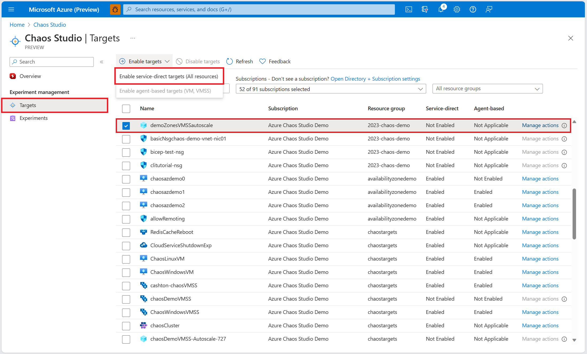 ](images/chaos-studio-tutorial-availability-zone-down-portal/target-enable-one.png#lightbox)
1. Select **Review + Enable** > **Enable**.
1. Find your virtual machine scale set resource.
1. Select the virtual machine scale set resource and select **Enable targets** > **Enable service-direct targets**.

      [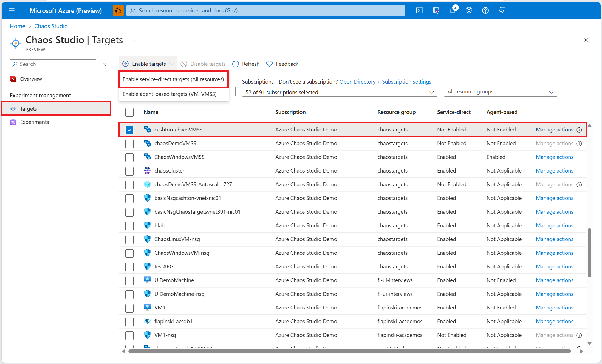 ](images/chaos-studio-tutorial-availability-zone-down-portal/target-enable-two.png#lightbox)
1. Select **Review + Enable** > **Enable**.

You've now successfully added your autoscale setting and virtual machine scale set to Chaos Studio.

## Create an experiment from a template

Now you can create your experiment from a pre-filled experiment template. A chaos experiment defines the actions you want to take against target resources. The actions are organized and run in sequential steps. The chaos experiment also defines the actions you want to take against branches, which run in parallel.

1. In Chaos Studio, go to **Experiments** > **Create** > **New from template**.

   [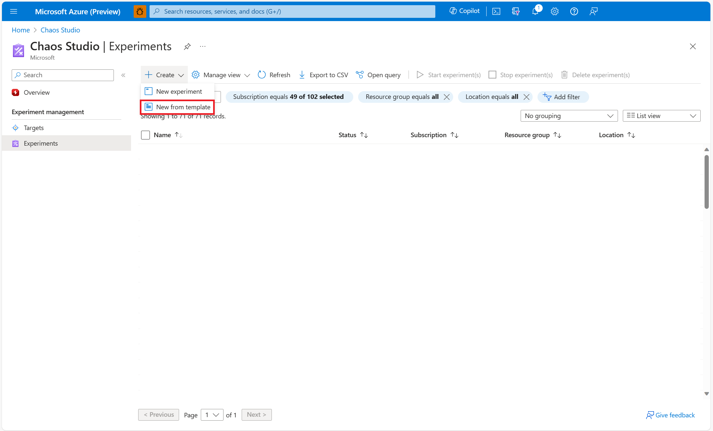](images/chaos-studio-tutorial-availability-zone-down-portal/create-from.png#lightbox)
1. Select **Availability Zone Down**.

   [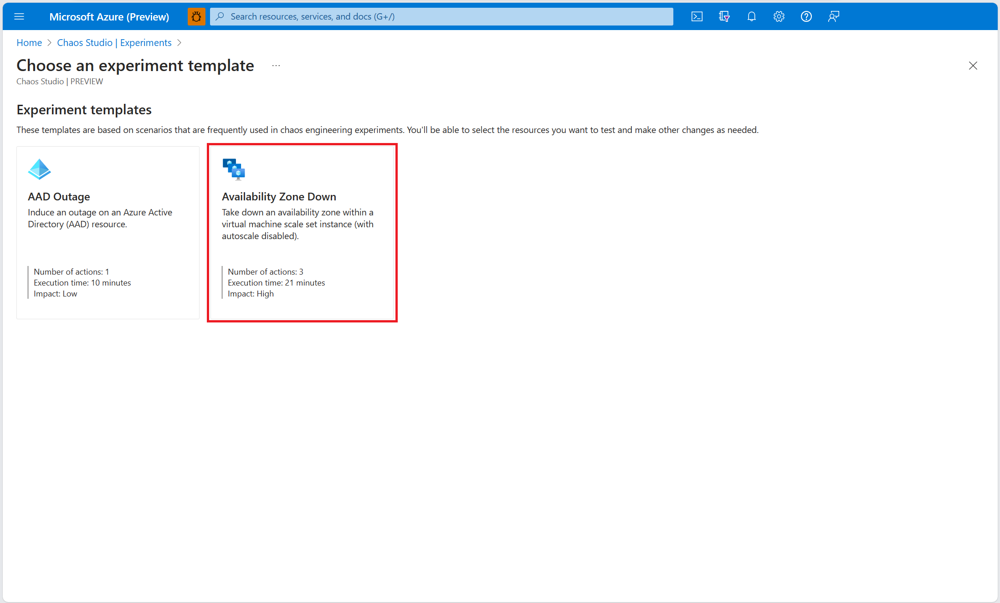](images/chaos-studio-tutorial-availability-zone-down-portal/template-selection.png#lightbox)
1. Add a name for your experiment that complies with resource naming guidelines. Select **Next: Permissions**.

   [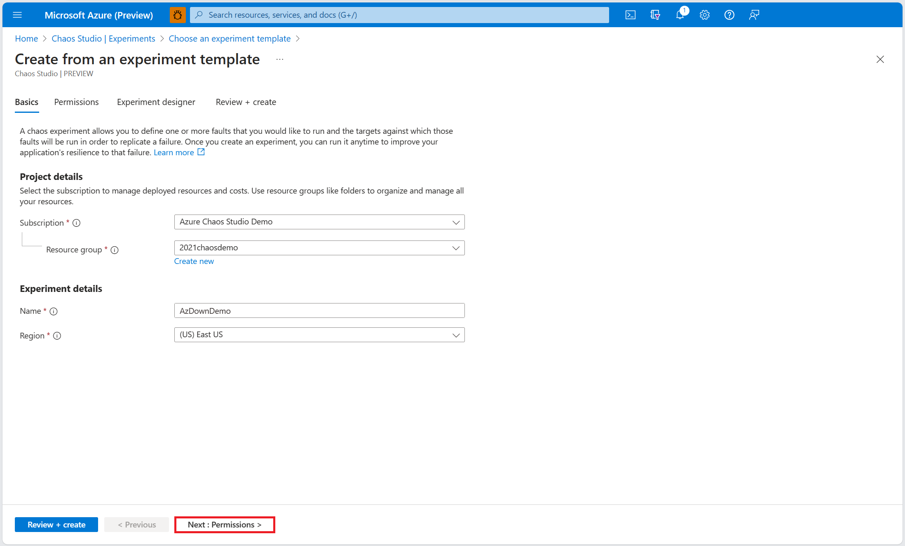](images/chaos-studio-tutorial-availability-zone-down-portal/basics.png#lightbox)
1. For your chaos experiment to run successfully, it must have [sufficient permissions on target resources](chaos-studio-permissions-security.md). Select a system-assigned managed identity or a user-assigned managed identity for your experiment. You can choose to enable custom role assignment if you would like Chaos Studio to add the necessary permissions to run (in the form of a custom role) to your experiment's identity. Select **Next: Experiment designer**.

   [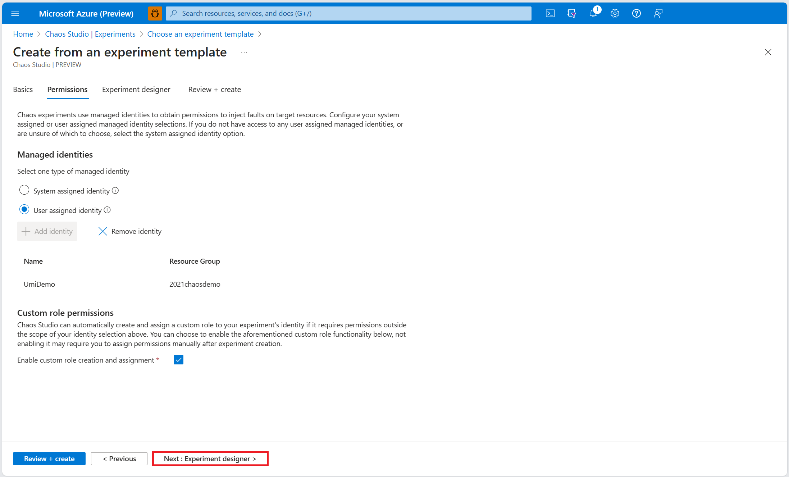](images/chaos-studio-tutorial-availability-zone-down-portal/permissions-page.png#lightbox)
1. Within the **Disable Autoscale** fault, select **Edit**.

   
1. Review fault parameters and select **Next: Target resources**.

   [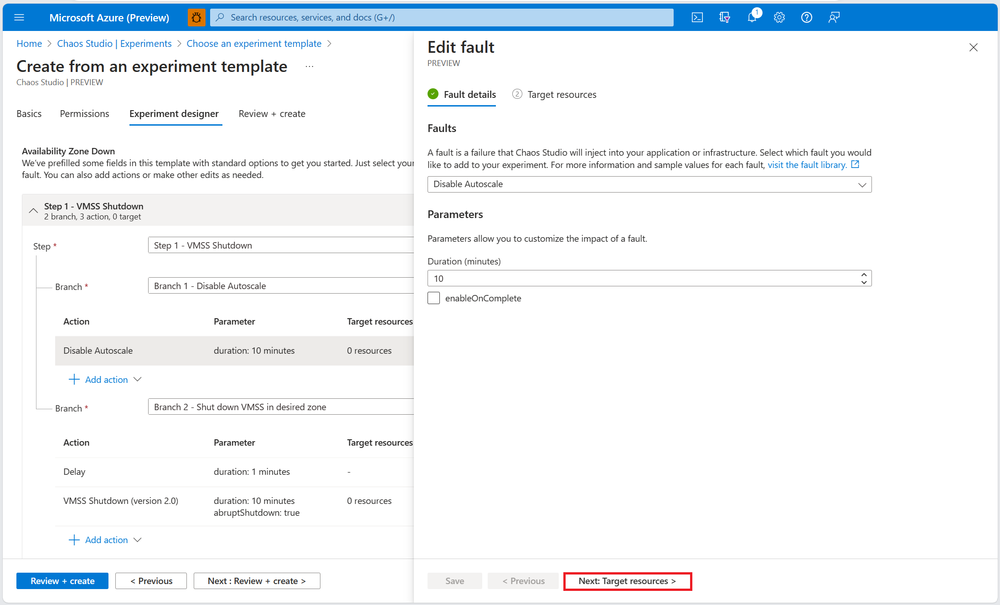](images/chaos-studio-tutorial-availability-zone-down-portal/fault-one-details.png#lightbox)
1. Select the autoscale setting resource that you want to use in the experiment. Select **Save**.

   [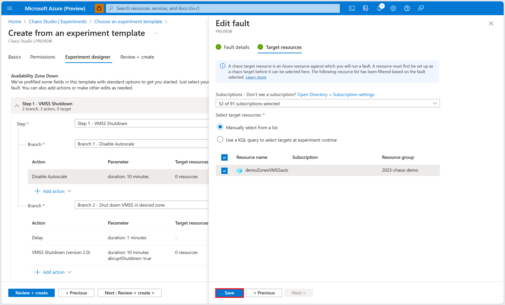](images/chaos-studio-tutorial-availability-zone-down-portal/fault-one-target.png#lightbox)
1. Within the **VMSS Shutdown (version 2.0)** fault, select **Edit**.

   [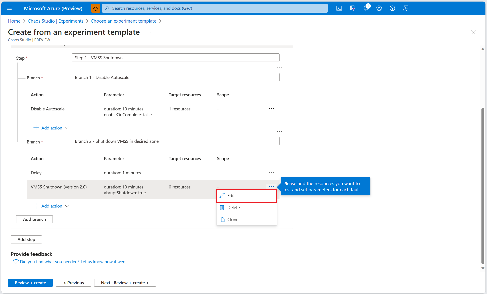](images/chaos-studio-tutorial-availability-zone-down-portal/fault-two-edit.png#lightbox)
1. Review fault parameters and select **Next: Target resources**.

   [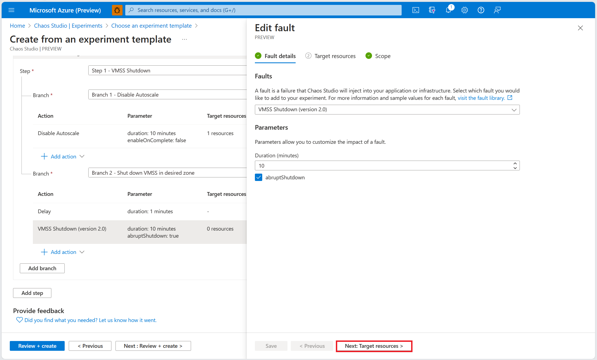](images/chaos-studio-tutorial-availability-zone-down-portal/fault-two-details.png#lightbox)
1. Select the virtual machine scale set resource that you want to use in the experiment. Select **Next: Scope**.

   [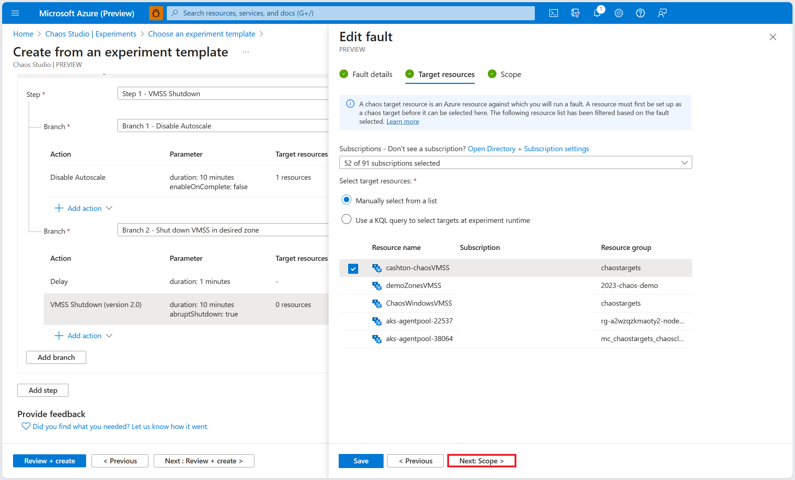](images/chaos-studio-tutorial-availability-zone-down-portal/fault-two-target.png#lightbox)
1. Select the zone(s) within your virtual machine scale set you would like to take down. Select **Save**.

   [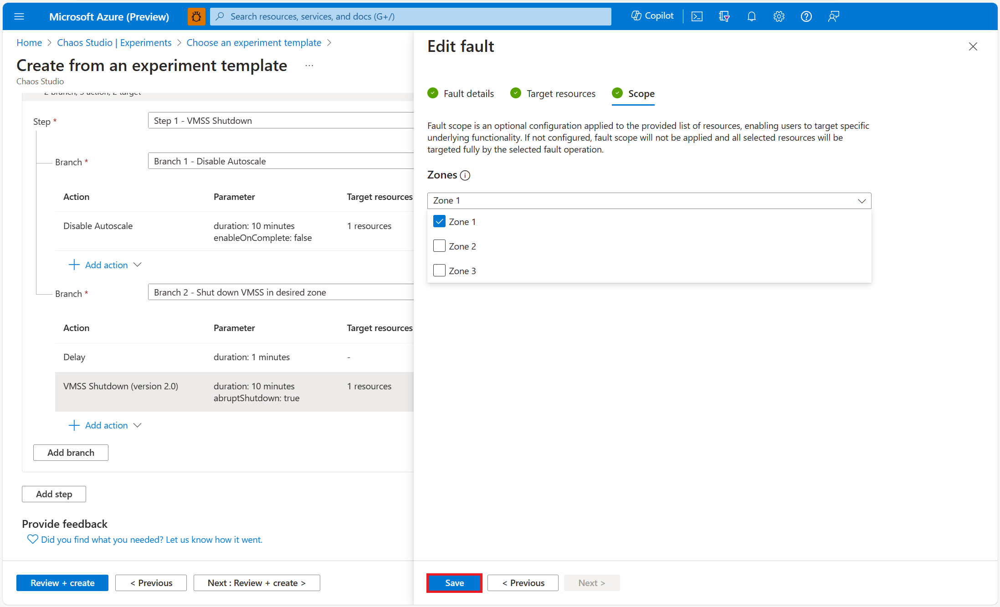](images/chaos-studio-tutorial-availability-zone-down-portal/scope.png#lightbox)
1. Select **Review + create** > **Create** to save the experiment.

## Run your experiment
You're now ready to run your experiment.

1. In the **Experiments** view, select your experiment. Select **Start** > **OK**.
1. When **Status** changes to *Running*, select **Details** for the latest run under **History** to see details for the running experiment.

## Next steps
Now that you've run an Availability Zone Down template experiment, you're ready to:
- [Manage your experiment](chaos-studio-run-experiment.md)
- [Create an experiment that induces an outage on an Azure Active Directory instance](chaos-studio-tutorial-aad-outage-portal.md)

