# Create a chaos experiment to shut down all targets in a zone

You can use dynamic targeting in a chaos experiment to choose a set of targets to run an experiment against, based on criteria evaluated at experiment runtime. This article shows how you can dynamically target a virtual machine scale set to shut down instances based on availability zone. Running this experiment can help you test failover to an Azure Virtual Machine Scale Sets instance in a different region if there's an outage.

You can use these same steps to set up and run an experiment for any fault that supports dynamic targeting. Currently, only virtual machine scale set shutdown supports dynamic targeting.

## Prerequisites

- An Azure subscription. [!INCLUDE [quickstarts-free-trial-note](../../includes/quickstarts-free-trial-note.md)]
- An Azure Virtual Machine Scale Sets instance.

## Enable Chaos Studio on your virtual machine scale sets

Azure Chaos Studio can't inject faults against a resource until that resource is added to Chaos Studio. To add a resource to Chaos Studio, create a [target and capabilities](chaos-studio-targets-capabilities.md) on the resource.

Virtual Machine Scale Sets has only one target type (`Microsoft-VirtualMachineScaleSet`) and one capability (`shutdown`). Other resources might have up to two target types. One target type is for service-direct faults. Another target type is for agent-based faults. Other resources also might have many other capabilities.

1. Open the [Azure portal](https://portal.azure.com).
1. Search for **Chaos Studio** in the search bar.
1. Select **Targets** and find your virtual machine scale set resource.
1. Select the virtual machine scale set resource and select **Enable targets** > **Enable service-direct targets**.

   [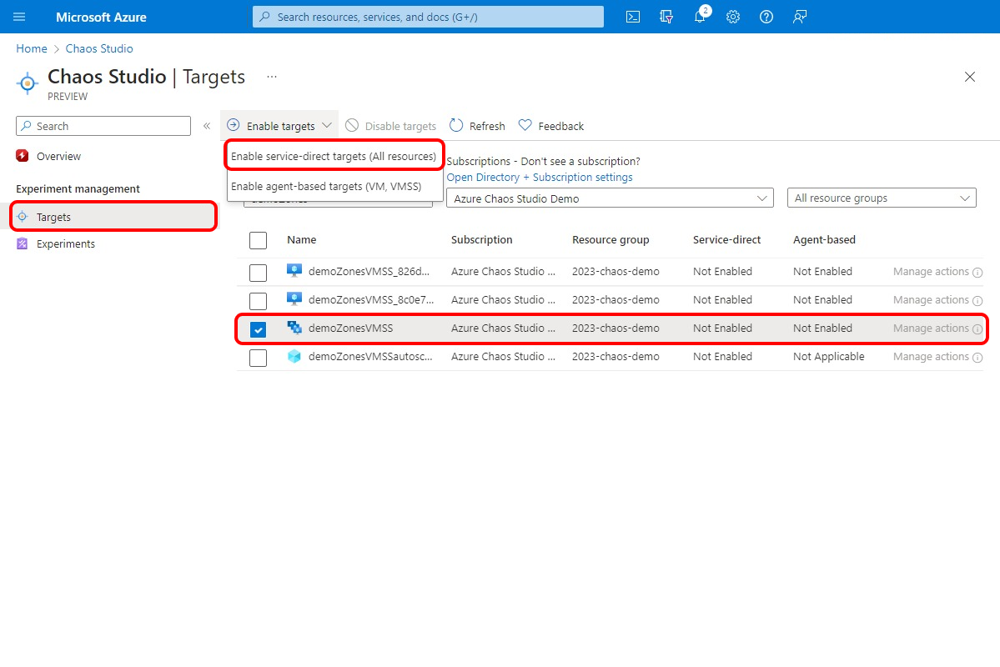 ](images/tutorial-dynamic-targets-enable.png#lightbox)
1. Select **Review + Enable** > **Enable**.

You've now successfully added your virtual machine scale set to Chaos Studio.

## Create an experiment

Now you can create your experiment. A chaos experiment defines the actions you want to take against target resources. The actions are organized and run in sequential steps. The chaos experiment also defines the actions you want to take against branches, which run in parallel.

1. In Chaos Studio, go to **Experiments** > **Create** > **New experiment**.

   [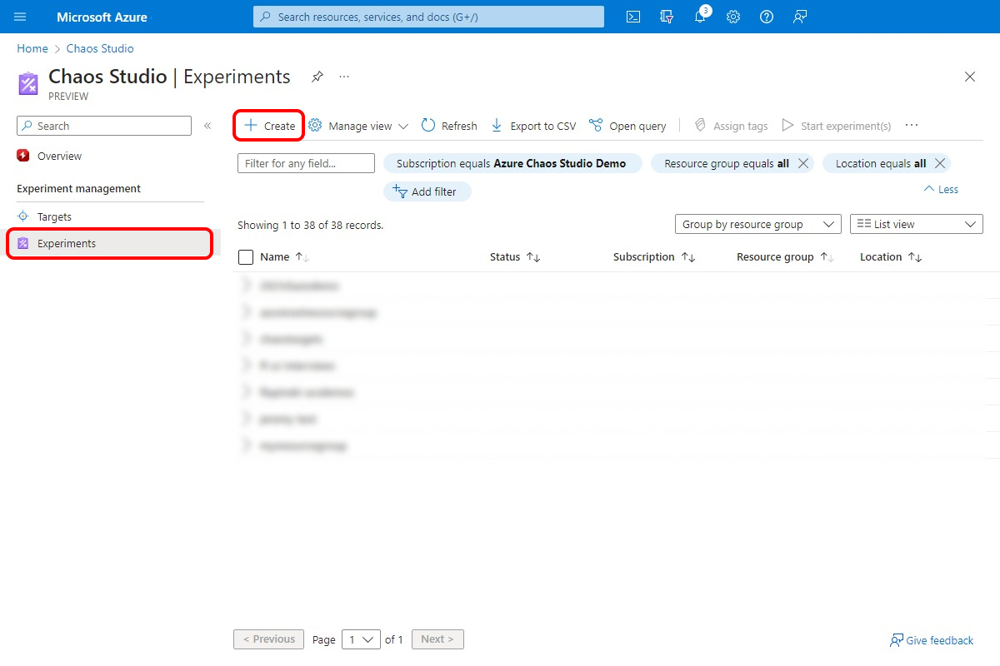](images/tutorial-dynamic-targets-experiment-browse.png#lightbox)
1. Add a name for your experiment that complies with resource naming guidelines. Select **Next: Experiment designer**.

   [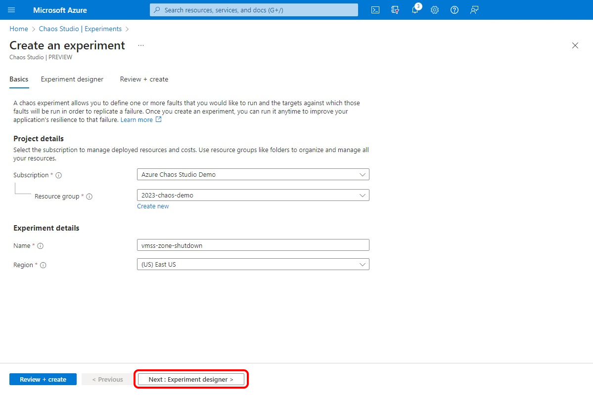](images/tutorial-dynamic-targets-create-exp.png#lightbox)
1. In **Step 1** and **Branch 1**, select **Add action** > **Add fault**.

   [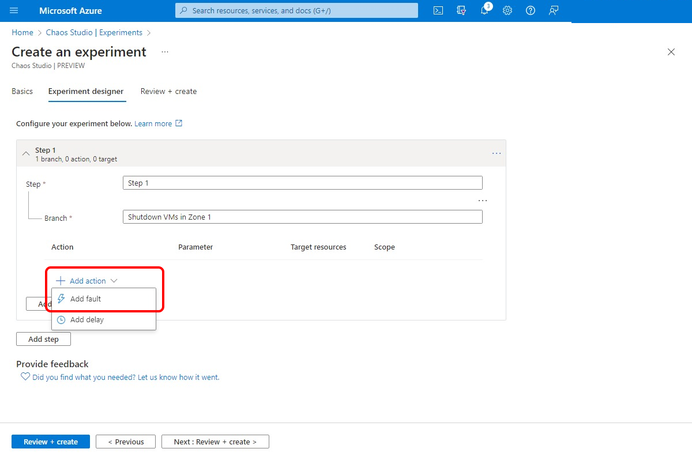](images/tutorial-dynamic-targets-experiment-fault.png#lightbox)
1. Select the **VMSS Shutdown (version 2.0)** fault. Select your desired duration and if you want the shutdown to be abrupt. Select **Next: Target resources**.

   
1. Select the virtual machine scale set resource that you want to use in the experiment. Select **Next: Scope**.

   [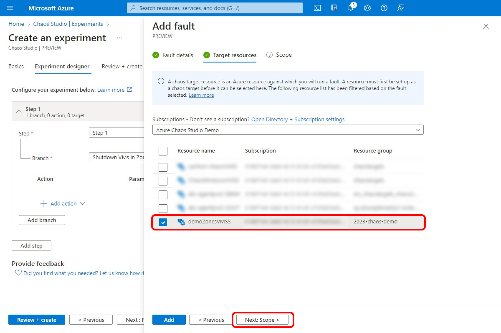](images/tutorial-dynamic-targets-fault-resources.png#lightbox)
1. In the **Zones** dropdown list, select the zone where you want virtual machines (VMs) in the Virtual Machine Scale Sets instance to be shut down. Select **Add**.

   [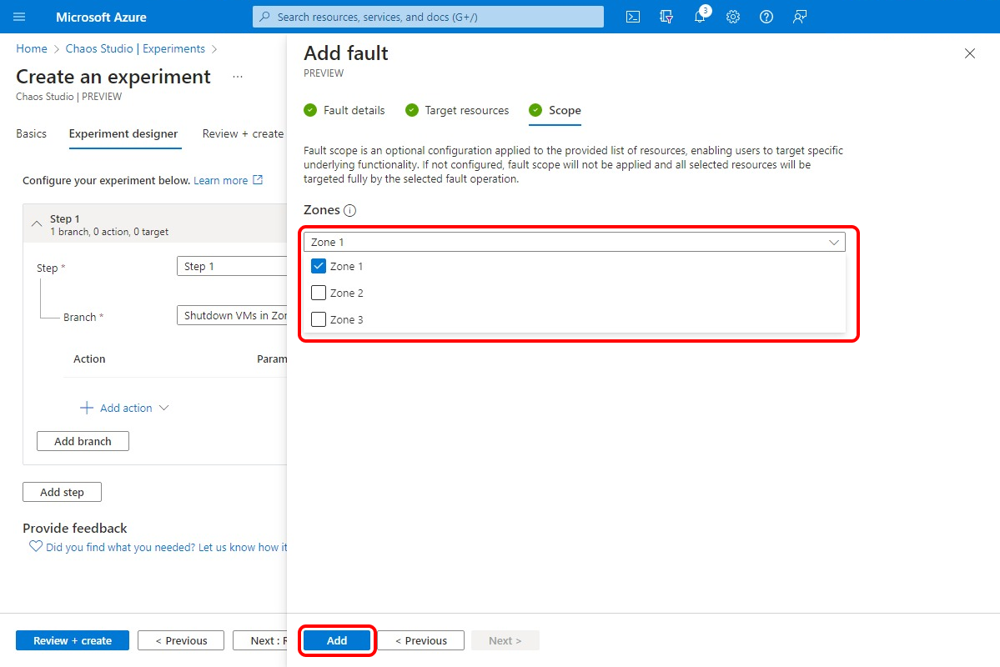](images/tutorial-dynamic-targets-fault-zones.png#lightbox)
1. Select **Review + create** > **Create** to save the experiment.

## Give the experiment permission to your virtual machine scale sets

When you create a chaos experiment, Chaos Studio creates a system-assigned managed identity that executes faults against your target resources. This identity must be given [appropriate permissions](chaos-studio-fault-providers.md) to the target resource for the experiment to run successfully. To use these steps for any resource and target type, modify the role assignment in step 3 to match the [appropriate role for that resource and target type](chaos-studio-fault-providers.md).

1. Go to your virtual machine scale set resource and select **Access control (IAM)** > **Add role assignment**.

   [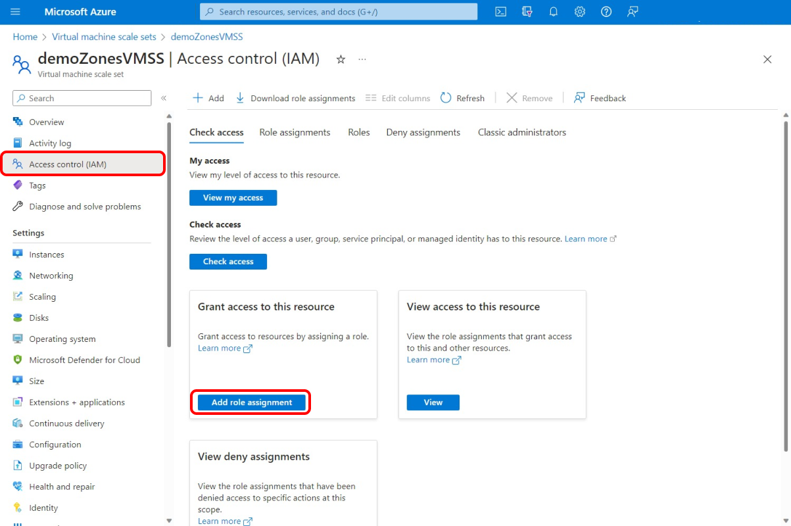](images/tutorial-dynamic-targets-vmss-iam.png#lightbox)
1. On the **Role** tab, select **Virtual Machine Contributor** and select **Next**.

   [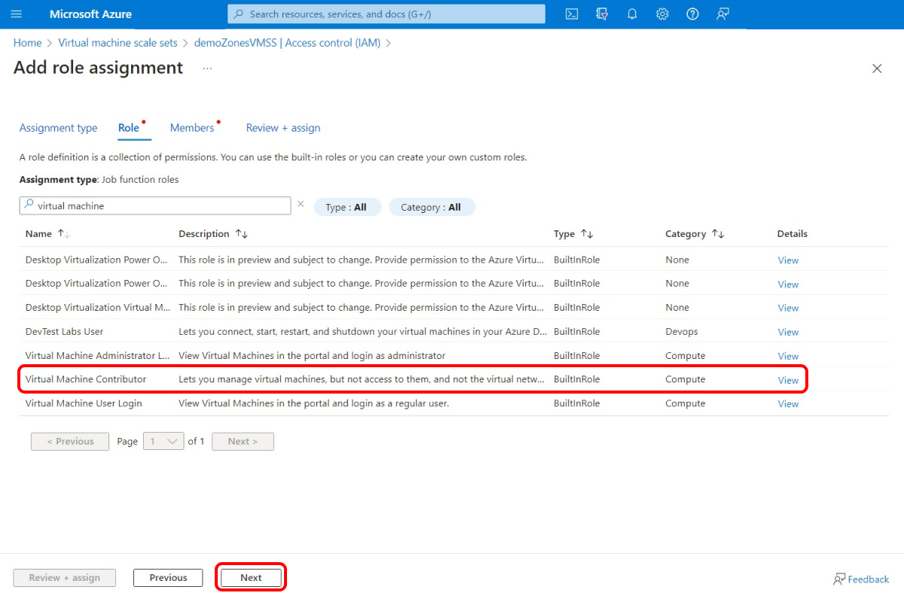](images/tutorial-dynamic-targets-role-selection.png#lightbox)
1. Choose **Select members** and search for your experiment name. Select your experiment and then choose **Select**. If there are multiple experiments in the same tenant with the same name, your experiment name is truncated with random characters added.

   [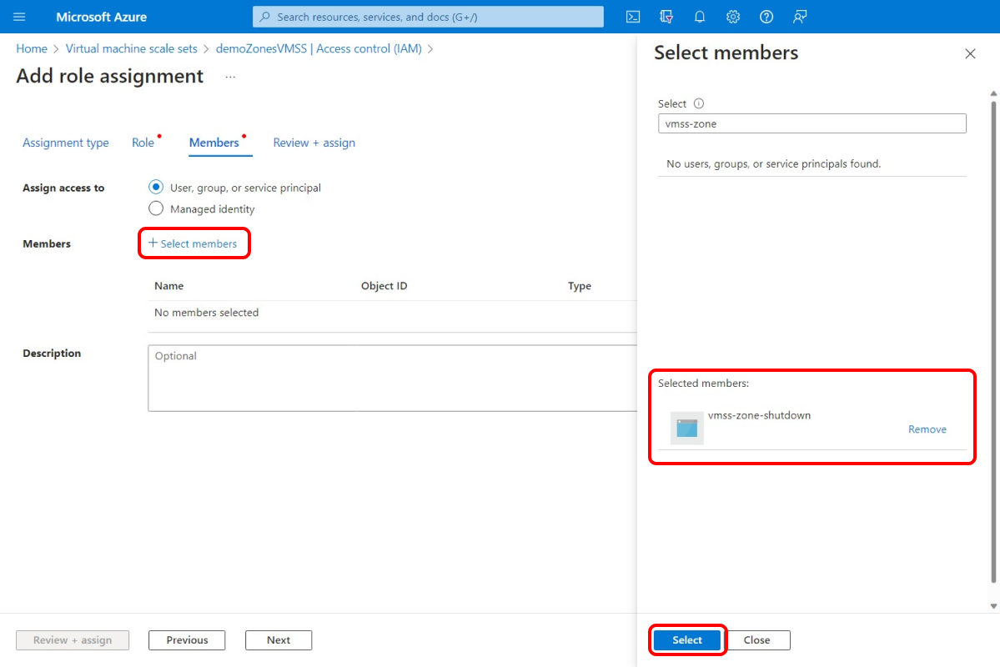](images/tutorial-dynamic-targets-role-assignment.png#lightbox)
1. Select **Review + assign** > **Review + assign**.

   [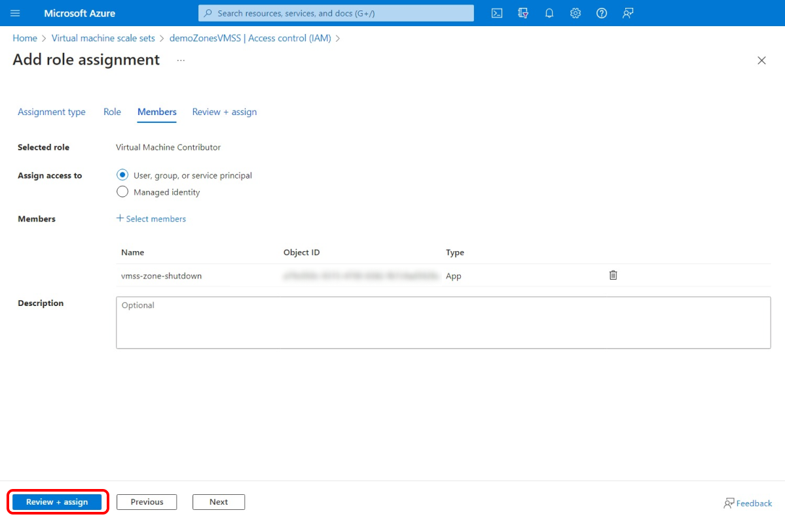](images/tutorial-dynamic-targets-role-confirmation.png#lightbox)

## Run your experiment

You're now ready to run your experiment.

1. In **Chaos Studio**, go to the **Experiments** view, select your experiment, and select **Start experiment(s)**.

   [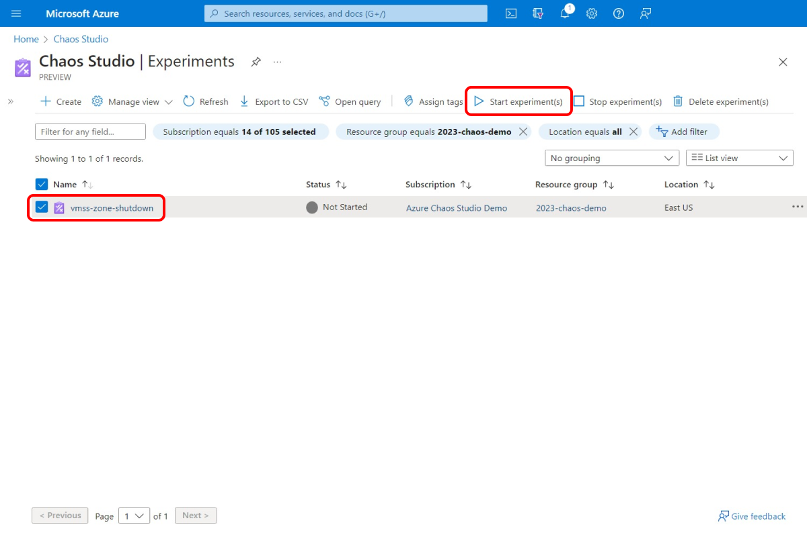](images/tutorial-dynamic-targets-start-experiment.png#lightbox)
1. Select **OK** to confirm that you want to start the experiment.
1. When the **Status** changes to *Running*, select **Details** for the latest run under **History** to see details for the running experiment. If any errors occur, you can view them in **Details**. Select a failed action and expand **Failed targets**.

To see the effect, use a tool like **Azure Monitor** or the **Virtual Machine Scale Sets** section of the portal to check if your virtual machine scale set targets are shut down. If they're shut down, check to see that the services running on your virtual machine scale sets are still running as expected.

In this example, the chaos experiment successfully shut down the instance in Zone 1, as expected.

[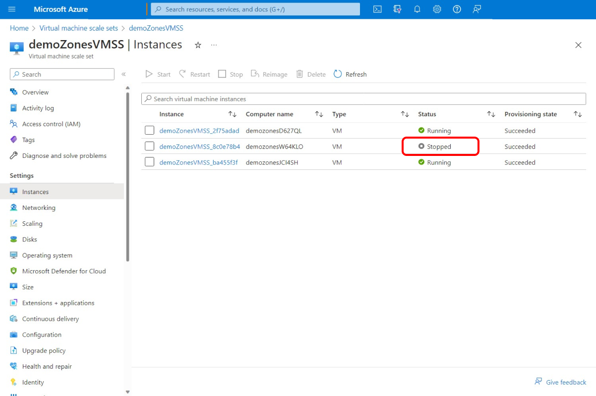](images/tutorial-dynamic-targets-view-vmss.png#lightbox)

## Next steps

> [!TIP]
> If your virtual machine scale set uses an autoscale policy, the policy provisions new VMs after this experiment shuts down existing VMs. To prevent this action, add a parallel branch in your experiment that includes the **Disable Autoscale** fault against the virtual machine scale set `microsoft.insights/autoscaleSettings` resource. Remember to add the `autoscaleSettings` resource as a target and assign the role.

Now that you've run a dynamically targeted virtual machine scale set shutdown experiment, you're ready to:
- [Create an experiment that uses agent-based faults](chaos-studio-tutorial-agent-based-portal.md)
- [Manage your experiment](chaos-studio-run-experiment.md)