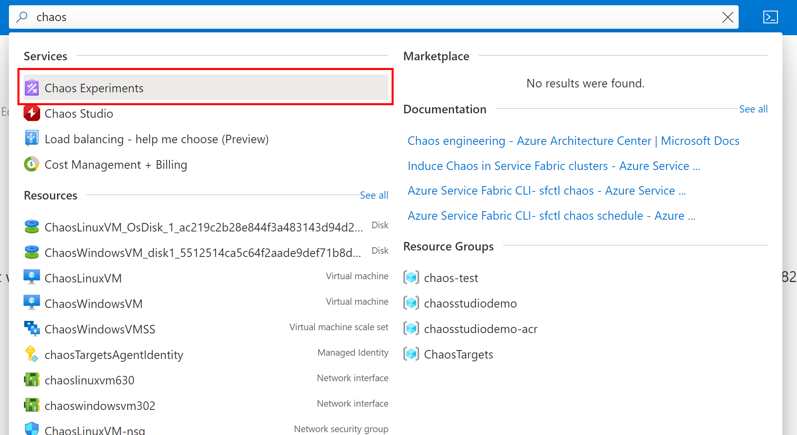
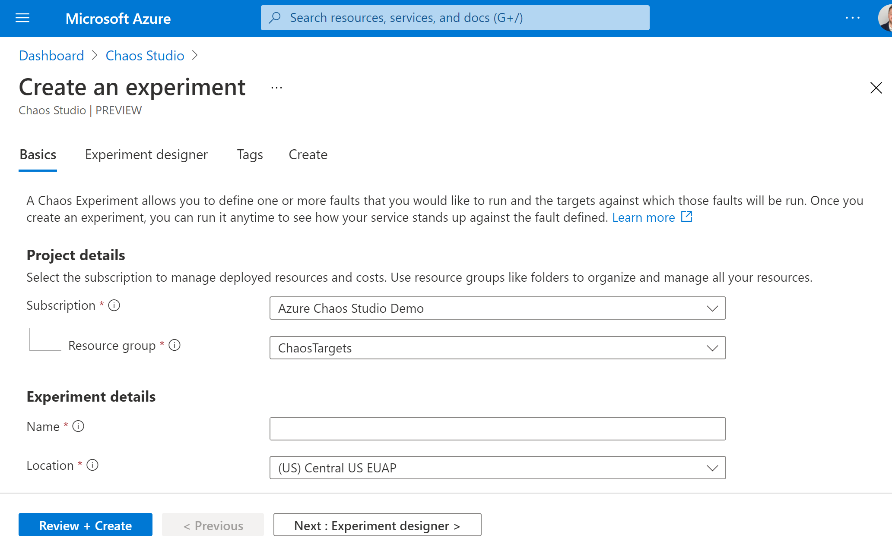
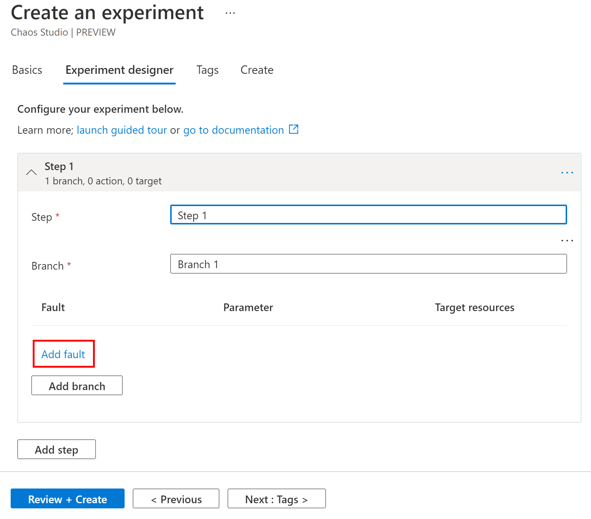
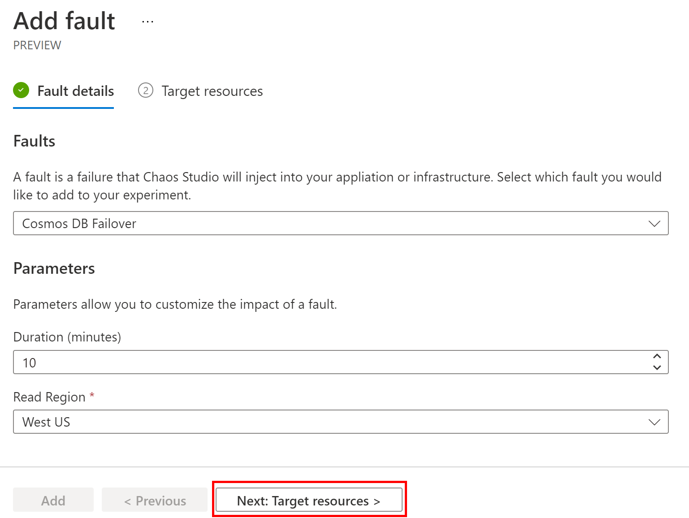
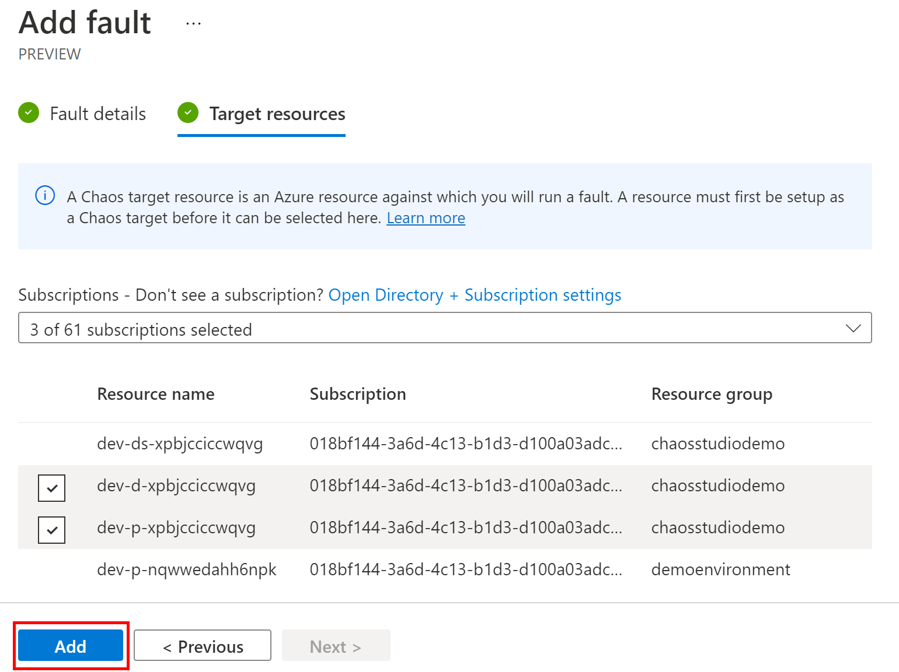
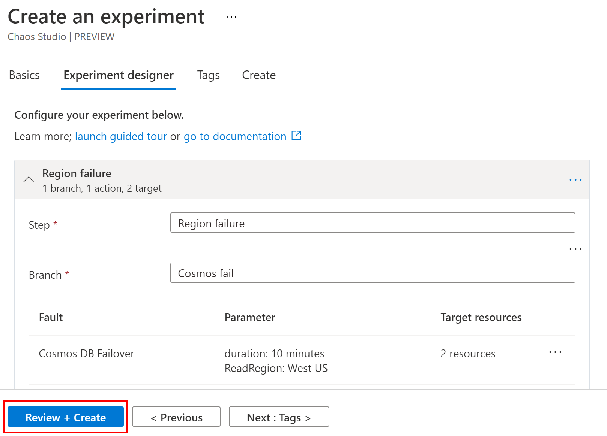
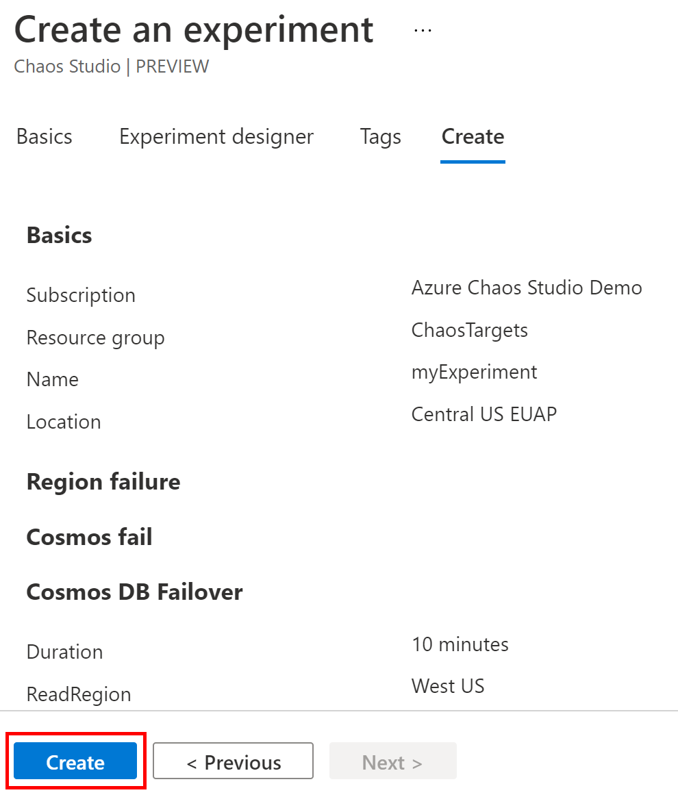
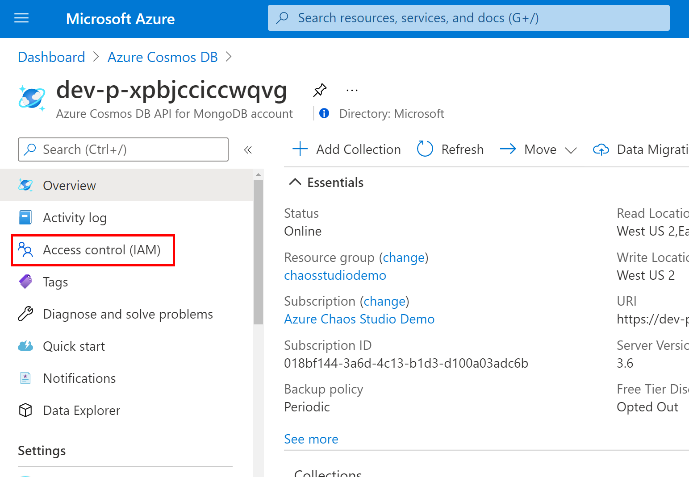
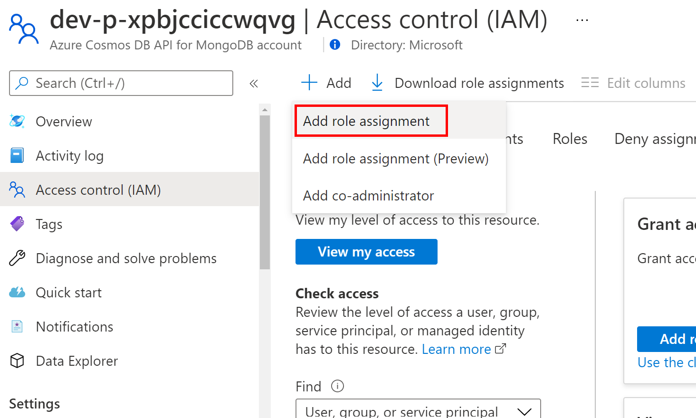
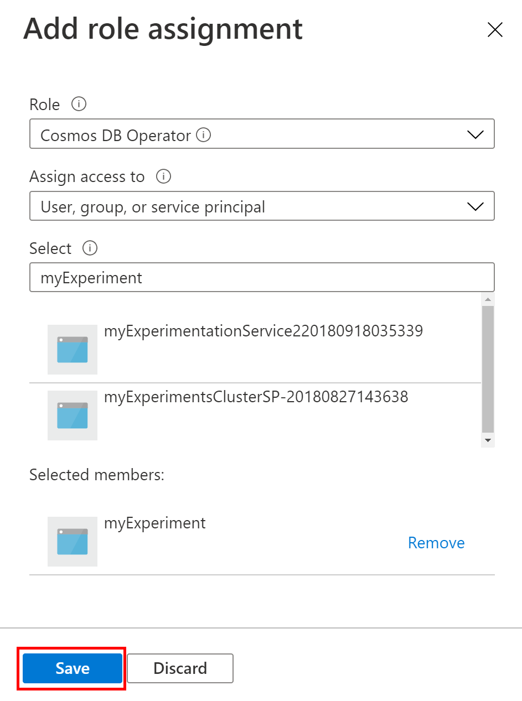

# Create an experiment that uses a service-direct fault

Chaos Studio supports two types of faults – service-direct faults, where the fault is injected service to service, and agent-based faults, where the fault is injected by an agent running in the guest operating system of a VM, virtual machine scale set, or other compute service. Service-direct faults don’t require the agent to be installed since they operate directly against an Azure resource. For example, a service-direct fault might cause latency in a CosmosDB instance or drop messages from an Event Hub. You can visit the [Fault Providers](chaos-studio-fault-providers.md) page to understand which resource types are supported for service-direct faults. In this walkthrough, we create a single-step, single-branch, single-action experiment that does a Cosmos DB failover.

## Set up fault targets

To set up a service-direct fault, you need to create a provider configuration for that resource type. You can only have one provider configuration per type (in this case, AzureCosmosDbChaos is the type) and you only need one provider configuration for all resources of that type. If you plan to use agent-based faults, you need to set up a separate provider configuration for the agents – this process is described in [create an experiment using agent-based faults](chaos-studio-tutorial-agent-based.md). Certain resource types, such as Virtual Machines, have both agent-based faults and service-direct faults. This requires a provider configuration for each fault type. A provider configuration must be created via REST API. In this example we use the `az rest` command to execute the REST API calls.

1. Save the following JSON as a file in the same location where you are running the Azure CLI (in Cloud Shell, you can drag-and-drop the JSON file to upload it). If setting up a provider configuration for a resource other than Cosmos DB, [reference this list of configuration types](chaos-studio-fault-providers.md).

    ```json
    {
      "properties": {
        "enabled": true,
        "providerConfiguration": {
          "type": "AzureCosmosDbChaos"
        }
      }
    }
    ```

2. Create the provider configuration using the REST API. Replace `$SUBSCRIPTION_ID` with the subscription ID of the subscription where your target resources are deployed. Replace `providerConfig.json` with the name of the JSON file you created in the previous step and replace `AzureCosmosDbChaos` with the [same provider configuration type you used above](chaos-studio-fault-providers.md).

    ```bash
    az rest --method put --url "https://management.azure.com/subscriptions/$SUBSCRIPTION_ID/providers/Microsoft.Chaos/chaosProviderConfigurations/AzureCosmosDbChaos?api-version=2021-06-21-preview" --body @providerConfig.json
    ```

3. When complete, we recommend validating that the resources defined in your experiment were successfully onboarded. Run the following command, replacing `$SUBSCRIPTION_ID` with the subscription ID where you created the experiment and `AzureCosmosDbChaos` with the provider configuration type you want to validate. This returns a JSON object with an array of all onboarded targets and their status.

    ```bash
    az rest --method get --url "https://management.azure.com/subscriptions/$SUBSCRIPTION_ID/providers/Microsoft.Chaos/chaosTargets?api-version=2021-06-21-preview&chaosProviderType=AzureCosmosDbChaos"
    ```


Note that the command for listing targets on a virtual machine scale set is slightly different. Replace `$SUBSCRIPTION_ID`, `$RESOURCE_GROUP`, and `$VMSS_NAME` with the subscription ID, resource group, and name of your virtual machine scale set:

```bash
az rest --method get --url "https://management.azure.com/subscriptions/$SUBSCRIPTION_ID/resourceGroups/$RESOURCE_GROUP/providers/Microsoft.Compute/virtualMachineScaleSets/$VMSS_NAME/providers/Microsoft.Chaos/chaosTargets?api-version=2021-06-21-preview&chaosProviderType=AzureVmssVmChaos
```

You are now ready to perform service-direct faults on your Cosmos DB instances.

## Create a chaos experiment

### Use the Azure portal
The Azure portal is the easiest way to create and manage experiments. Follow the instructions below to create an experiment using the portal.

1. Open the Azure portal with the Chaos Studio feature flag:
    * If using an @microsoft.com account, [click this link](https://ms.portal.azure.com/?microsoft_azure_chaos_assettypeoptions={%22chaosStudio%22:{%22options%22:%22%22},%22chaosExperiment%22:{%22options%22:%22%22}}&microsoft_azure_chaos=true).
    * If using an external account, [click this link](https://portal.azure.com/?feature.customPortal=false&microsoft_azure_chaos_assettypeoptions={%22chaosStudio%22:{%22options%22:%22%22},%22chaosExperiment%22:{%22options%22:%22%22}}).

2. In the Search bar at the top of the page, search for "Chaos Experiments" and select the service.

    

3. Click **Add an experiment**.

    

4. Fill in the subscription, resource group, and region where you want the experiment to be stored and give the experiment a name. Then click **Next : Experiment designer**.

    

5. You are now in the Experiment Designer. By default, you see one step with one branch and no actions. Steps execute sequentially, branches execute in parallel within a step, and actions execute sequentially within a branch. The next step only begins once all actions in all branches in the previous step complete and actions within a branch only starts once the previous action has completed. Optionally, give your step and branch friendly names, then click **Add fault** to add a fault to your first branch.

    

6. In the page that appears, select the **Cosmos DB Failover** fault from the fault dropdown and fill in the **Duration** and **Read Region** properties as appropriate for your environment. Descriptions and parameters for each fault are available in the [Fault Library](chaos-studio-fault-library.md). Click **Next : Target resources**.

    

   > [!WARNING]
   > The Experiment Designer may not have all faults available in the [Fault Library](chaos-studio-fault-library.md). If your experiment uses faults not available in Experiment Designer, use the [REST API](https://aka.ms/chaosrestapi) to edit your experiment.

7. Pick the resources that the fault will target. Only resources that have been onboarded to Chaos Studio (those that have a provider configuration for their resource type) and only resource types for which the fault is applicable appear in the list. Select the Cosmos DB instance(s) you would like to target and click **Add**.

    

8. Continue to add steps, branches, and faults. When done click **Review + Create**.

    

9. Verify that the details of your experiment are correct, then click **Create**.

    

10. Before running your experiment you must grant the experiment permission to the target resource(s). Navigate to the resource(s) you are targeting for fault injection and click on **Access control (IAM)**.

    

11. Click **Add** and click **Add role assignment**.
    
    

12. Under **Role** select the [appropriate role for the resource type](chaos-studio-fault-providers.md) and under **Select** search for the name of your experiment. When you create an experiment Chaos Studio creates a system-assigned managed identity for the experiment with the same name. This identity is used to inject faults against your resources. If an identity already exists with the experiment name, Chaos Studio truncates the experiment name and adds random characters to it. Select the identity for your experiment and click **Save**. Repeat this process for any resources targeted by your experiment.

    

Congratulations! You've created your first chaos experiment and set up resources for fault injection!

Next, **[run your experiment](chaos-studio-run-experiment.md) >>**

### Use the Chaos Studio REST API
If you are using features that aren't available in the portal yet or if you prefer to use REST APIs, follow the instructions below to create an experiment that uses service-direct faults.

1. Formulate your experiment JSON starting with the sample below, using the [Create Experiment API](https://aka.ms/chaosrestapi) and the [Fault Library](chaos-studio-fault-library.md) for property definitions.

    ```json
    {
      "location": "eastus2euap",
      "identity": {
        "type": "SystemAssigned"
      },
      "properties": {
        "steps": [
          {
            "name": "Step1",
            "branches": [
              {
                "name": "Branch1",
                "actions": [
                  {
                    "type": "continuous",
                    "selectorId": "Selector1",
                    "duration": "PT10M",
                    "parameters": [
                      {
                        "key": "ReadRegion",
                        "value": "East US 2"
                      }
                    ],
                    "name": "urn:provider:Azure-cosmosDb:Microsoft.Azure.Chaos.Fault.AzureCosmosDbFailover"
                  }
                ]
              }
            ]
          }
        ],
        "selectors": [
          {
            "id": "Selector1",
            "type": "List",
            "targets": [
              {
                "type": "ResourceId",
                "id": "/subscriptions/018bf144-3a6d-4c13-b1d3-d100a03adc6b/resourceGroups/chaosstudiodemo/providers/Microsoft.DocumentDB/databaseAccounts/myDB"
              }
            ]
          }
        ]
      }
    }
    ```

2. Create the experiment using the Azure CLI, replacing `$SUBSCRIPTION_ID`, `$RESOURCE_GROUP`, and `$EXPERIMENT_NAME` with the properties for your experiment. Make sure you have saved and uploaded your experiment JSON in Step 1, updating `experiment.json` with your JSON filename.

    ```bash
    az rest --method put --url "https://management.azure.com/subscriptions/$SUBSCRIPTION_ID/resourceGroups/$RESOURCE_GROUP/providers/Microsoft.Chaos/chaosExperiments/$EXPERIMENT_NAME?api-version=2021-06-21-preview" --body @experiment.json
    ```

    Each experiment creates a corresponding system-assigned managed identity. Note of the `principalId` for this identity in the response for the next step.
 
3. Give the experiment access to your resource(s) using the command below, replacing `$EXPERIMENT_PRINCIPAL_ID` with the principalId from the previous step and `$RESOURCE_ID` with the resource ID of the target resource (in this case, the Cosmos DB instance resource ID). Change the role to the appropriate [built-in role for that resource type](chaos-studio-fault-providers.md). Run this command for each resource targeted in your experiment. 

    ```bash
    az role assignment create --role "Cosmos DB Operator" --assignee-object-id $EXPERIMENT_PRINCIPAL_ID --scope $RESOURCE_ID
    ```

Congratulations! You've created your first chaos experiment and set up resources for fault injection!

Next, **[run your experiment](chaos-studio-run-experiment.md) >>**
