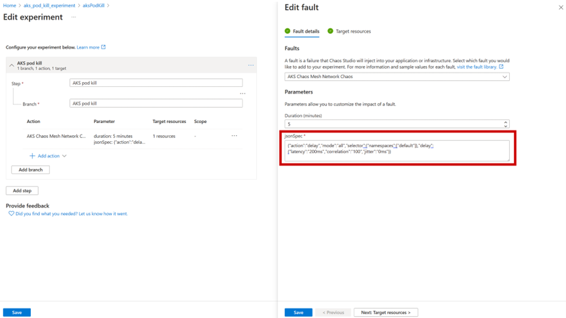

# Example Experiments

This article provides examples for creating experiments from your command line (CLI) and Azure portal parameter examples for various experiments. You can copy and paste the following commands into the CLI or Azure portal, and edit them for your specific resources. 

Here's an example of where you would copy and paste the Azure portal parameter into:

[](images/azure-portal-parameter-examples.png#lightbox)

> [!NOTE]
> Make sure your experiment has permission to operate on **ALL** resources within the experiment. These examples exclusively use **System-assigned managed identity**, but we also support User-assigned managed identity. For more information, see [Experiment permissions](chaos-studio-permissions-security.md). 
><br>
><br>
>View all available role assignments [here](chaos-studio-fault-providers.md) to determine which permissions are required for your target resources. 

---
Azure Kubernetes Service (AKS) Network Delay
---

### [Azure CLI](#tab/azure-CLI)
```AzCLI
PUT https://management.azure.com/subscriptions/6b052e15-03d3-4f17-b2e1-be7f07588291/resourceGroups/exampleRG/providers/Microsoft.Chaos/experiments/exampleExperiment?api-version=2024-01-01

{    

"identity": {
        "type": "SystemAssigned",
        "principalId": "35g5795t-8sd4-5b99-a7c8-d5asdh9as7",
        "tenantId": "asd79ash-7daa-95hs-0as8-f3md812e3md"
    },
    "tags": {},
    "location": "westus",
    "properties": {
        "provisioningState": "Succeeded",
        "selectors": [
            {
                "type": "List",
                "targets": [
                    {
                        "id": "/subscriptions/123hdq8-123d-89d7-5670-123123/resourceGroups/aks_network_delay_experiment/providers/Microsoft.ContainerService/managedClusters/nikhilAKScluster/providers/Microsoft.Chaos/targets/Microsoft-AzureKubernetesServiceChaosMesh",
                        "type": "ChaosTarget"
                    }
                ],
                "id": "Selector1"
            }
        ],
        "steps": [
            {
                "name": "AKS network latency",
                "branches": [
                    {
                        "name": "AKS network latency",
                        "actions": [
                            {
                                "type": "continuous",
                                "selectorId": "Selector1",
                                "duration": "PT5M",
                                "parameters": [
                                    {
                                        "key": "jsonSpec",
                                        "value": "{\"action\":\"delay\",\"mode\":\"all\",\"selector\":{\"namespaces\":[\"default\"]},\"delay\":{\"latency\":\"200ms\",\"correlation\":\"100\",\"jitter\":\"0ms\"}}"
                                    }
                                ],
                                "name": "urn:csci:microsoft:azureKubernetesServiceChaosMesh:networkChaos/2.1"
                            }
                        ]
                    }
                ]
            }
        ]
    }
}

```


### [Azure portal parameters](#tab/azure-portal)

```Azure portal
{"action":"delay","mode":"all","selector":{"namespaces":["default"]},"delay":{"latency":"200ms","correlation":"100","jitter":"0ms"}}
```
--- 
Azure Kubernetes Service (AKS) Pod Failure
---

### [Azure CLI](#tab/azure-CLI)
```AzCLI
PUT https://management.azure.com/subscriptions/6b052e15-03d3-4f17-b2e1-be7f07588291/resourceGroups/exampleRG/providers/Microsoft.Chaos/experiments/exampleExperiment?api-version=2024-01-01

{    

"identity": {
        "type": "SystemAssigned",
        "principalId": "35g5795t-8sd4-5b99-a7c8-d5asdh9as7",
        "tenantId": "asd79ash-7daa-95hs-0as8-f3md812e3md"
    },
    "tags": {},
    "location": "westus",
    "properties": {
        "provisioningState": "Succeeded",
        "selectors": [
            {
                "type": "List",
                "targets": [
                    {
                        "id": "/subscriptions/123hdq8-123d-89d7-5670-123123/resourceGroups/aks_pod_fail_experiment/providers/Microsoft.ContainerService/managedClusters/nikhilAKScluster/providers/Microsoft.Chaos/targets/Microsoft-AzureKubernetesServiceChaosMesh",
                        "type": "ChaosTarget"
                    }
                ],
                "id": "Selector1"
            }
        ],
        "steps": [
            {
                "name": "AKS pod kill",
                "branches": [
                    {
                        "name": "AKS pod kill",
                        "actions": [
                            {
                                "type": "continuous",
                                "selectorId": "Selector1",
                                "duration": "PT5M",
                                "parameters": [
                                    {
                                        "key": "jsonSpec",
                                        "value": "{\"action\":\"pod-failure\",\"mode\":\"all\",\"duration\":\"600s\",\"selector\":{\"namespaces\":[\"autoinstrumentationdemo\"]}}}"
                                    }
                                ],
                                "name": "urn:csci:microsoft:azureKubernetesServiceChaosMesh:podChaos/2.1"
                            }
                        ]
                    }
                ]
            }
        ]
    }
}

```


### [Azure portal parameters](#tab/azure-portal)

```Azure portal
{"action":"pod-failure","mode":"all","duration":"600s","selector":{"namespaces":["autoinstrumentationdemo"]}}
```
---
Azure Kubernetes Service (AKS) Memory Stress
---

### [Azure CLI](#tab/azure-CLI)
```AzCLI
PUT https://management.azure.com/subscriptions/6b052e15-03d3-4f17-b2e1-be7f07588291/resourceGroups/exampleRG/providers/Microsoft.Chaos/experiments/exampleExperiment?api-version=2024-01-01

{    

"identity": {
        "type": "SystemAssigned",
        "principalId": "35g5795t-8sd4-5b99-a7c8-d5asdh9as7",
        "tenantId": "asd79ash-7daa-95hs-0as8-f3md812e3md"
    },
    "tags": {},
    "location": "westus",
    "properties": {
        "provisioningState": "Succeeded",
        "selectors": [
            {
                "type": "List",
                "targets": [
                    {
                        "id": "/subscriptions/123hdq8-123d-89d7-5670-123123/resourceGroups/aks_memory_stress_experiment/providers/Microsoft.ContainerService/managedClusters/nikhilAKScluster/providers/Microsoft.Chaos/targets/Microsoft-AzureKubernetesServiceChaosMesh",
                        "type": "ChaosTarget"
                    }
                ],
                "id": "Selector1"
            }
        ],
        "steps": [
            {
                "name": "AKS memory stress",
                "branches": [
                    {
                        "name": "AKS memory stress",
                        "actions": [
                            {
                                "type": "continuous",
                                "selectorId": "Selector1",
                                "duration": "PT10M",
                                "parameters": [
                                    {
                                        "key": "jsonSpec",
                                        "value": "{\"mode\":\"all\",\"selector\":{\"namespaces\":[\"autoinstrumentationdemo\"]},\"stressors\":{\"memory\":{\"workers\":4,\"size\":\"95%\"}}"
                                    }
                                ],
                                "name": "urn:csci:microsoft:azureKubernetesServiceChaosMesh:stressChaos/2.1"
                            }
                        ]
                    }
                ]
            }
        ]
    }
}

```


### [Azure portal parameters](#tab/azure-portal)

```Azure portal
{"mode":"all","selector":{"namespaces":["autoinstrumentationdemo"]},"stressors":{"memory":{"workers":4,"size":"95%"}}
```
--- 
