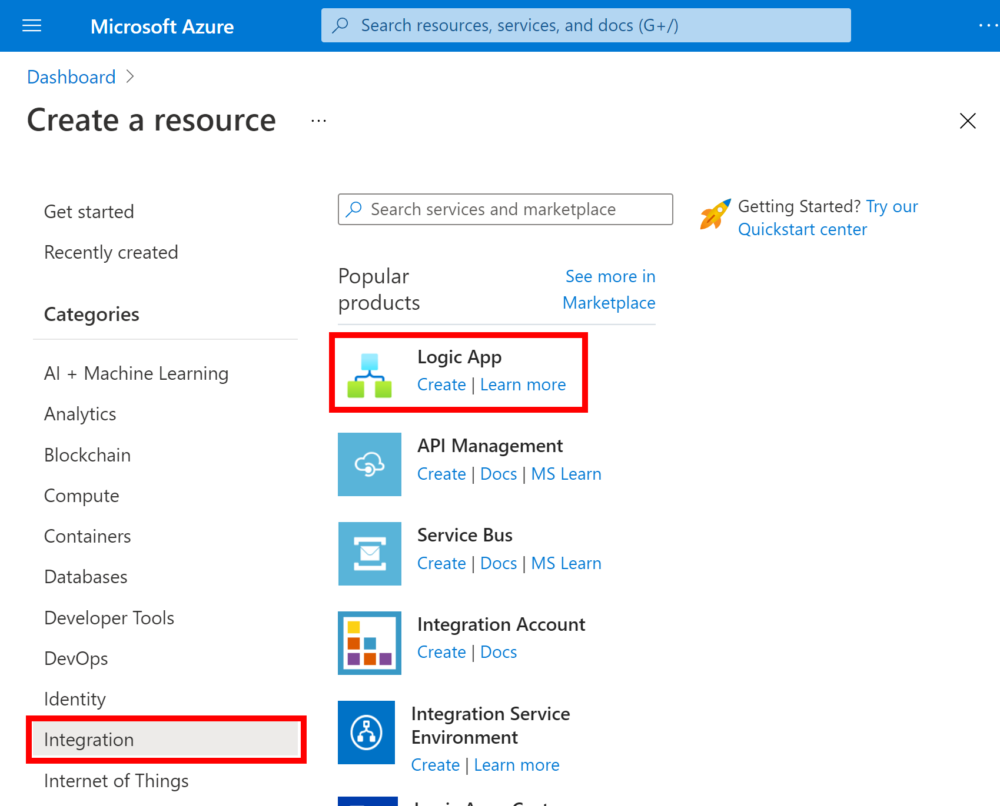
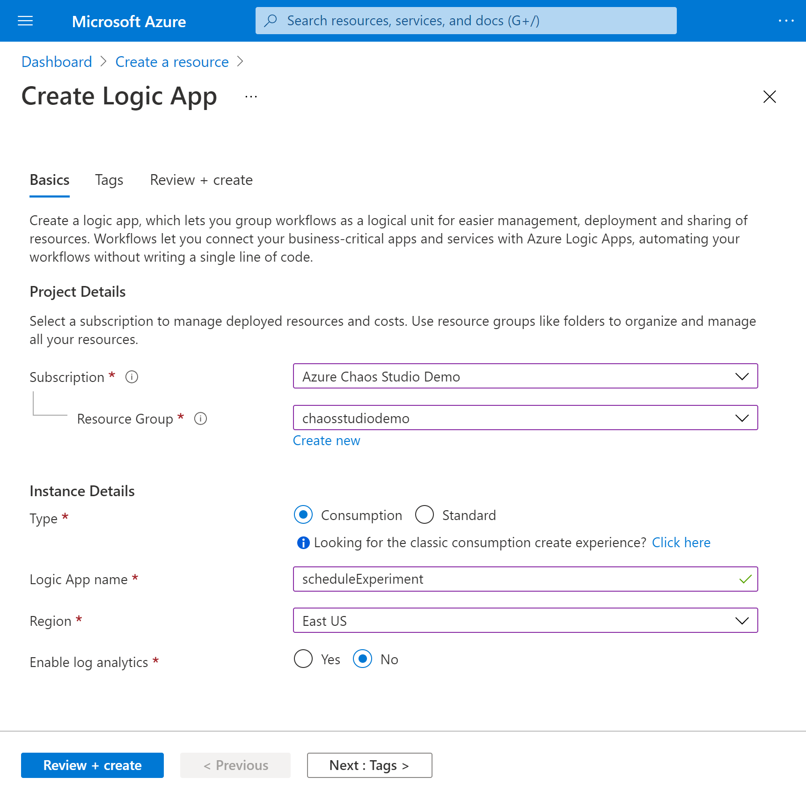
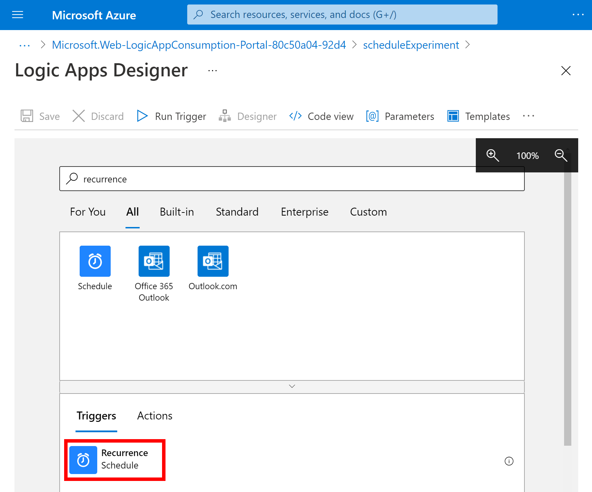
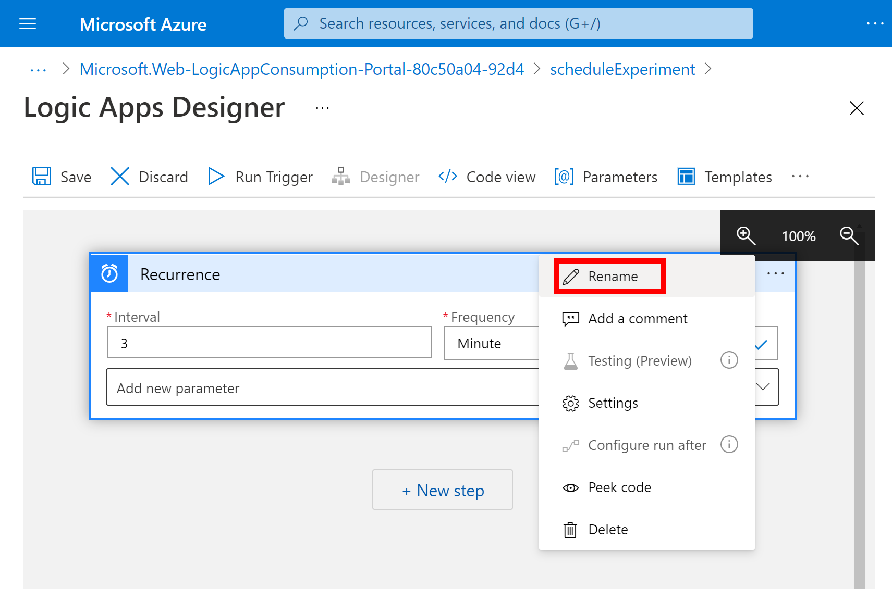
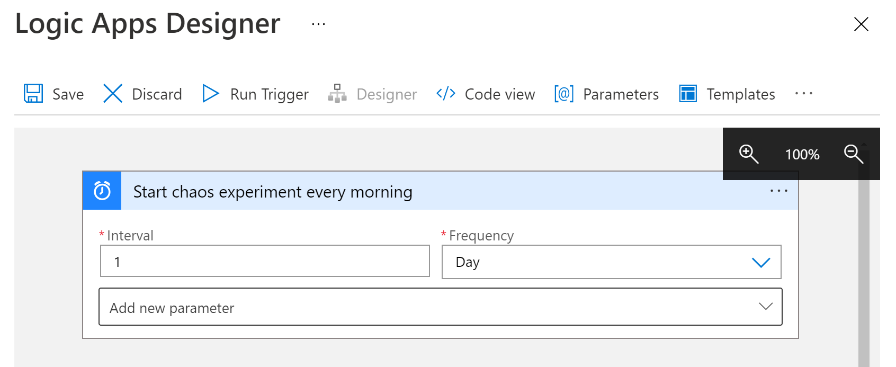
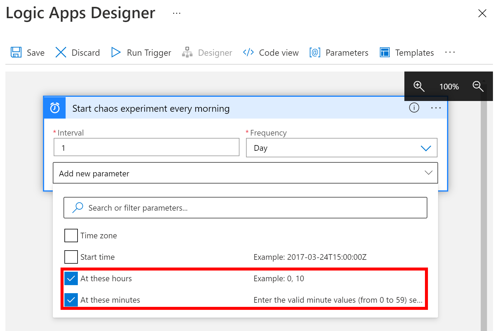
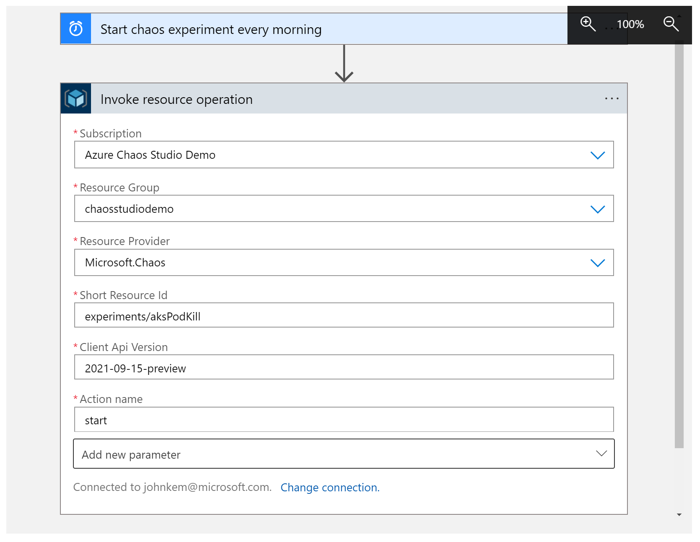
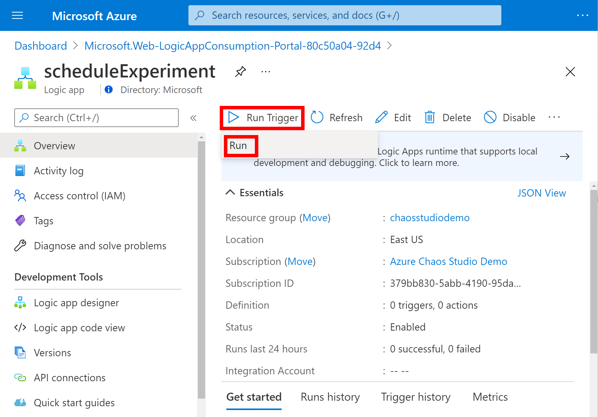
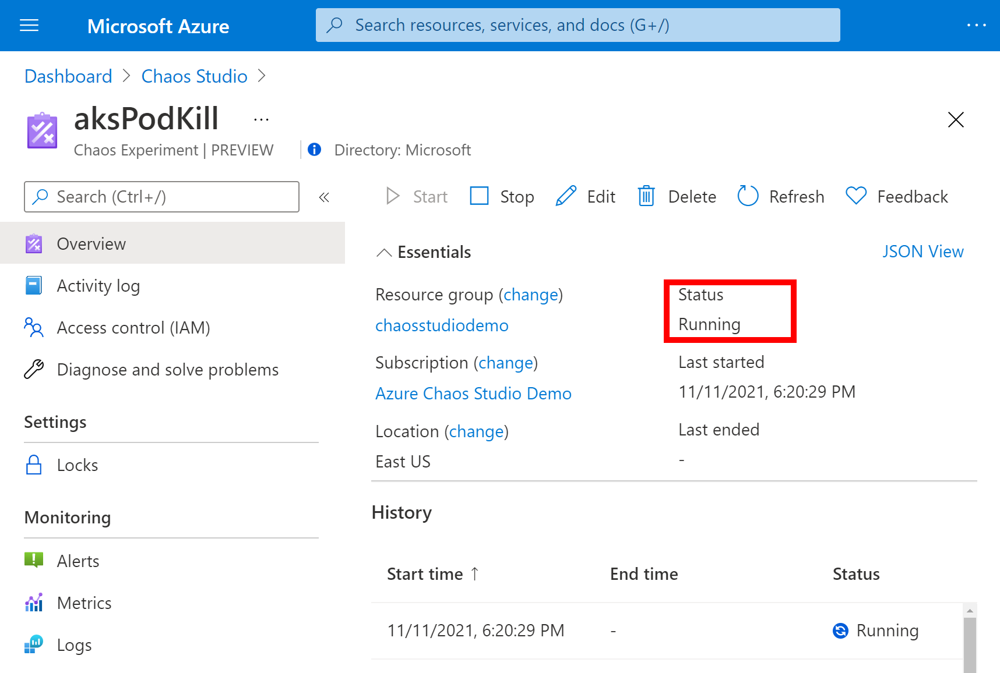

# Tutorial: Schedule a recurring experiment with Azure Chaos Studio Preview

Azure Chaos Studio Preview lets you run chaos experiments that intentionally fail part of your application or service to verify that it's resilient against those failures. It can be useful to run these chaos experiments periodically to ensure that your application's resilience hasn't regressed or to meet compliance requirements. In this tutorial, you use a [logic app](../logic-apps/logic-apps-overview.md) to trigger an experiment to run once a day.

In this tutorial, you learn how to:

> [!div class="checklist"]
> * Create a logic app.
> * Configure the logic app to trigger a chaos experiment to start once a day.
> * Test that the logic app is configured correctly.

## Prerequisites

- An Azure account with an active subscription. [Create an account for free](https://azure.microsoft.com/free/?WT.mc_id=A261C142F).
- A chaos experiment. [Create a chaos experiment by using the quickstart](chaos-studio-quickstart-azure-portal.md).
- All resources targeted in the chaos experiment must be [added to Chaos Studio](chaos-studio-targets-capabilities.md).

## Create a logic app
A logic app is an automated workflow that can execute based on a schedule. The logic app used in this tutorial starts a chaos experiment by using a recurrence schedule.

1. Sign in to the [Azure portal](https://portal.azure.com) with your Azure account credentials. On the Azure home page, select **Create a resource**.

1. On the Azure Marketplace menu, select **Integration** > **Logic App**.

   

1. On the **Create Logic App** pane, provide the information described here about the logic app that you want to create.

   

   | Property | Value | Description |
   |----------|-------|-------------|
   | **Subscription** | <*Azure-subscription-name*> | Your Azure subscription name. This example uses **Azure Chaos Studio Demo**. |
   | **Resource group** | chaosstudiodemo | The name for the [Azure resource group](../azure-resource-manager/management/overview.md), which is used to organize related resources. This example creates a new resource group named **chaosstudiodemo**. |
   | **Type** | Consumption | The [logic app resource type](../logic-apps/single-tenant-overview-compare.md). Set to **Consumption**. |
   | **Name** | scheduleExperiment | Your logic app's name, which can contain only letters, numbers, hyphens, underscores, parentheses, and periods. This example uses **scheduleExperiment**. |
   | **Location** | East US | The region where to store your logic app information. This example uses **East US**. |
   | **Enable log analytics** | No | Set up diagnostic logging for the logic app. Set to **No**. |

1. When you're done, select **Review + create**. After Azure validates the information about your logic app, select **Create**.

1. After Azure deploys your app, select **Go to resource**.

   Azure opens the Logic Apps template selection pane, which shows an introduction video, commonly used triggers, and logic app template patterns.

## Add the Recurrence trigger
Next, add the Recurrence [trigger](../logic-apps/logic-apps-overview.md#logic-app-concepts), which runs the workflow based on a specified schedule. Every logic app must start with a trigger, which fires when a specific event happens or when new data meets a specific condition.

1. Scroll down past the video and common triggers sections to the **Templates** section and select **Blank Logic App**.

   

1. In the Logic Apps Designer search box, enter **recurrence** and select the trigger named **Recurrence**.

   

1. On the **Recurrence** shape, select the **ellipses** (**...**) button, and then select **Rename**. Rename the trigger with the description **Start chaos experiment every morning**.

   

1. Inside the trigger, change these properties as described and shown here.

   

   | Property | Required | Value | Description |
   |----------|----------|-------|-------------|
   | **Interval** | Yes | 1 | The number of intervals to wait between checks |
   | **Frequency** | Yes | Day | The unit of time to use for the recurrence |

1. Under **Interval** and **Frequency**, open the **Add new parameter** list. Select these properties to add to the trigger:

   * **At these hours**
   * **At these minutes**

   

1. Now set the values for the properties as shown and described here.

   

   | Property | Value | Description |
   |----------|-------|-------------|
   | **At these hours** | 8 | This setting is available only when you set the **Frequency** to **Week** or **Day**. For this recurrence, select the hours of the day. This example runs at the **8**-hour mark. |
   | **At these minutes** | 00 | This setting is available only when you set the **Frequency** to **Week** or **Day**. For this recurrence, select the minutes of the day. This example runs once at the zero-hour mark. |

   This trigger fires every weekday at 8:00 AM. The **Preview** box shows the recurrence schedule. For more information, see [Schedule tasks and workflows](../connectors/connectors-native-recurrence.md) and [Workflow actions and triggers](../logic-apps/logic-apps-workflow-actions-triggers.md#recurrence-trigger).

1. Save your logic app. On the designer toolbar, select **Save**.

## Add a run chaos experiment action
Now that you have a trigger, add an [action](../logic-apps/logic-apps-overview.md#logic-app-concepts) that starts the experiment. This tutorial uses the **Invoke resource operation** action to start the experiment.

1. In the Logic App Designer, under the Recurrence trigger, select **New step**.

1. Under **Choose an operation**, enter **Invoke resource operation**. Select the option under **Actions** named **Invoke resource operation**.

    

1. Set the correct **Tenant** where your experiment is stored and select **Sign in**.

1. Sign in to your Azure account for that tenant.

1. Now set the values for the action properties as shown and described here.

   

   | Property | Value | Description |
   |----------|-------|-------------|
   | **Subscription** | <*Azure-subscription-name*> | The name of the Azure subscription where your chaos experiment is deployed. This example uses **Azure Chaos Studio Demo**. |
   | **Resource Group** | <*Resource-group-name*> | The name for the resource group where your chaos experiment is deployed. This example uses **chaosstudiodemo**. |
   | **Resource Provider** | `Microsoft.Chaos` | The Chaos Studio resource provider. |
   | **Short Resource Id** | `experiments/`<*Resource-group-name*> | The name of your chaos experiment preceded by **experiments/**. |
   | **Client Api Version** | `2021-09-15-preview` | The Chaos Studio REST API version. |
   | **Action name** | `start` | The name of the Chaos Studio experiment action. Always **start**. |

1. Save your logic app. On the designer toolbar, select **Save**.

## Test the logic app
Now, test the logic app to make sure it successfully starts your experiment.

1. Close the Logic Apps Designer.

1. On the logic app overview, select **Run Trigger** > **Run**.

    

1. Go to your chaos experiment in the Azure portal and verify that **Status** is set to **Running**.

    

## Clean up resources

If you're not going to continue to use this application, delete the logic app with the following steps:

1. On the logic app overview, select **Delete**.
1. Enter the logic app name and select **Delete**.

## Next steps

Now that you've set a schedule for your experiment, you can:
> [!div class="nextstepaction"]
> [Run and manage your experiment](chaos-studio-run-experiment.md)
