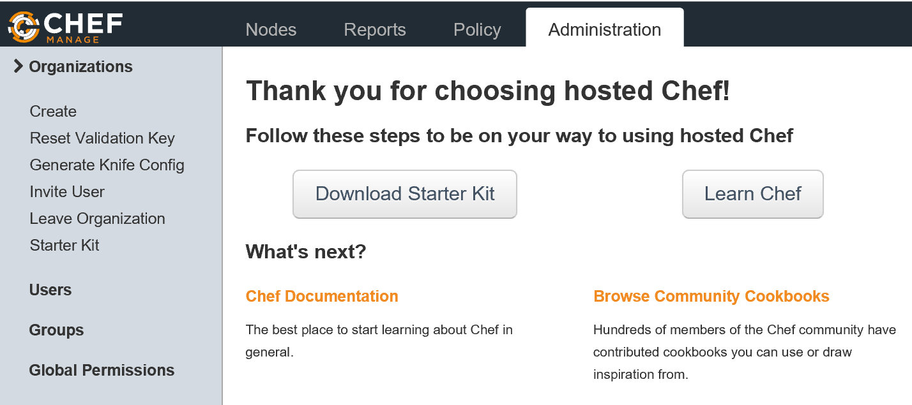
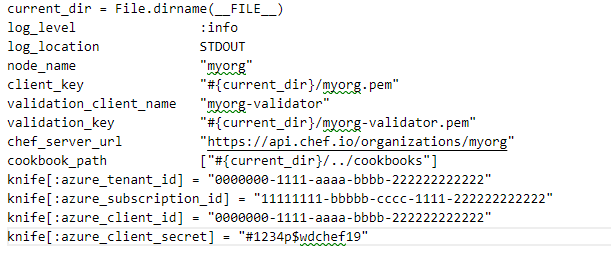

# Quickstart - Configure a Windows virtual machine in Azure using Chef

Chef enables you to deliver automation and desired state configurations.

With the latest cloud API release, Chef provides seamless integration with Azure, giving you the ability to provision and deploy configuration states through a single command.

In this article, you set up your Chef environment to provision Azure virtual machines and walk through creating a policy or cookbook and then deploying this cookbook to an Azure virtual machine.

## Chef basics

Before you begin with this article, [review the basic concepts of Chef](https://www.chef.io/chef).

The following diagram shows the high-level Chef architecture.


Chef has three main architectural components: 
- Chef Server - The management point and there are two options for the Chef Server: a hosted solution or an on-premises solution.
- Chef Client (node) - The agent that sits on the servers you are managing.
- Chef Workstation - The name for both the admin workstation (where you create policies and run management commands) and the software package of Chef tools.

Generally, you see **your workstation** as the location where you run commands and **Chef Workstation** for the software package.

For example, you download the knife command as part of the **Chef Workstation**, but you run knife commands from **your workstation** to manage infrastructure.

Chef also uses the concepts of *cookbooks* and *recipes*. These terms are the policies that are defined and applied to the servers, respectively.

## Preparing your workstation

First, prep your workstation by creating a directory to store Chef configuration files and cookbooks.

Create a directory named `C:\Chef`.

Download and install the latest [Azure CLI](https://docs.microsoft.com/cli/azure/install-azure-cli?view=azure-cli-latest) version on to your workstation.

## Configure Azure Service Principal

We'll be using a Service Principal to help us create Azure resources from our Chef Workstation.  To create the relevant Service Principal with the required permissions, run the following commands within PowerShell:
 
```powershell
Login-AzureRmAccount
Get-AzureRmSubscription
Select-AzureRmSubscription -SubscriptionName "<yourSubscriptionName>"
$myApplication = New-AzureRmADApplication -DisplayName "automation-app" -HomePage "https://chef-automation-test.com" -IdentifierUris "https://chef-automation-test.com" -Password "#1234p$wdchef19"
New-AzureRmADServicePrincipal -ApplicationId $myApplication.ApplicationId
New-AzureRmRoleAssignment -RoleDefinitionName Contributor -ServicePrincipalName $myApplication.ApplicationId
```

Take note of your SubscriptionID, TenantID, ClientID, and Client Secret (the password you set previously in this tutorial) as you will need these values. 

## Setup Chef Server

This guide assumes that you'll sign up for Hosted Chef.

If you're not already using a Chef Server, you can:

* Sign up for [Hosted Chef](https://manage.chef.io/signup), which is the fastest way to get started with Chef.
* Install a standalone Chef Server on linux-based machine, following the [installation instructions](https://docs.chef.io/install_server.html) from [Chef Docs](https://docs.chef.io/).

### Creating a Hosted Chef account

Sign up for a Hosted Chef account [here](https://manage.chef.io/signup).

During the sign-up process, you will be asked to create a new organization.


Once your organization is created, download the starter kit.



> [!NOTE]
> If you receive a prompt warning you that your keys will be reset, it’s okay to proceed as we have no existing infrastructure configured as yet.
>

This starter kit zip file contains your organization configuration files and user key in the `.chef` directory.

The `organization-validator.pem` must be downloaded separately, because it's a private key and private keys should not be stored on the Chef Server. From [Chef Manage](https://manage.chef.io/), go into the Administration section, and select "Reset Validation Key", which provides a file for you to download separately. Save the file to c:\chef.

### Configuring your Chef workstation

Extract the content of the `chef-starter.zip` to `c:\chef`.

Copy all files under `chef-starter\chef-repo\.chef` to your `c:\chef` directory.

Copy the `organization-validator.pem` file to `c:\chef`, if it's saved in `c:\Downloads`.

Your directory should now look something like the following example.

```powershell
    Directory: C:\Users\username\chef

Mode           LastWriteTime    Length Name
----           -------------    ------ ----
d-----    12/6/2018   6:41 PM           .chef
d-----    12/6/2018   5:40 PM           chef-repo
d-----    12/6/2018   5:38 PM           cookbooks
d-----    12/6/2018   5:38 PM           roles
-a----    12/6/2018   5:38 PM       495 .gitignore
-a----    12/6/2018   5:37 PM      1678 azuredocs-validator.pem
-a----    12/6/2018   5:38 PM      1674 user.pem
-a----    12/6/2018   5:53 PM       414 knife.rb
-a----    12/6/2018   5:38 PM      2341 README.md
```

You should now have five files and four directories (including the empty chef-repo directory) in the root of c:\chef.

### Edit knife.rb

The PEM files contain your organization and administrative private keys for communication and the knife.rb file contains your knife configuration. We will need to edit the knife.rb file.

Open the knife.rb file in the editor of your choice. The unaltered file should look something like:

```rb
current_dir = File.dirname(__FILE__)
log_level           :info
log_location        STDOUT
node_name           "mynode"
client_key          "#{current_dir}/user.pem"
chef_server_url     "https://api.chef.io/organizations/myorg"
cookbook_path       ["#{current_dir}/cookbooks"]
```

Add the following information to your knife.rb, replacing the placeholders with your information:

```rb
validation_client_name   "myorg-validator"
validation_key           "#{current_dir}/myorg.pem"
knife[:azure_tenant_id] =         "0000000-1111-aaaa-bbbb-222222222222"
knife[:azure_subscription_id] =   "11111111-bbbbb-cccc-1111-222222222222"
knife[:azure_client_id] =         "11111111-bbbbb-cccc-1111-2222222222222"
knife[:azure_client_secret] =     "#1234p$wdchef19"
```

These lines will ensure that Knife references the cookbooks directory under `c:\chef\cookbooks`.

Your `knife.rb` file should now look similar to the following example:



```rb
current_dir = File.dirname(__FILE__)
log_level                :info
log_location             STDOUT
node_name                "myorg"
client_key               "#{current_dir}/myorg.pem"
validation_client_name   "myorg-validator"
validation_key           "#{current_dir}/myorg-validator.pem"
chef_server_url          "https://api.chef.io/organizations/myorg"
cookbook_path            ["#{current_dir}/../cookbooks"]
knife[:azure_tenant_id] = "0000000-1111-aaaa-bbbb-222222222222"
knife[:azure_subscription_id] = "11111111-bbbbb-cccc-1111-222222222222"
knife[:azure_client_id] = "11111111-bbbbb-cccc-1111-2222222222222"
knife[:azure_client_secret] = "#1234p$wdchef19"
```

## Install Chef Workstation

Next, [download, and install the Chef Workstation](https://downloads.chef.io/chef-workstation/).

Install Chef Workstation to the default location.

On the desktop, you'll see a CW PowerShell. This tool is used to interact with Chef products. The CW PowerShell makes new commands available, such as `chef-run` and Chef CLI commands (such as `chef`). See your installed version of Chef Workstation and the Chef tools with `chef -v`. You can also check your Workstation version by selecting **About Chef Workstation** from the Chef Workstation App.

`chef --version` should return something like:

```
Chef Workstation: 0.4.2
  chef-run: 0.3.0
  chef-client: 15.0.300
  delivery-cli: 0.0.52 (9d07501a3b347cc687c902319d23dc32dd5fa621)
  berks: 7.0.8
  test-kitchen: 2.2.5
  inspec: 4.3.2
```

> [!NOTE]
> The order of the path is important! If your opscode paths are not in the correct order, problems will result.
>

Reboot your workstation before you continue.

### Install Knife Azure

This tutorial assumes that you're using the Azure Resource Manager to interact with your virtual machine.

Install the Knife Azure extension, which includes the Azure Plugin.

Run the following command.

    chef gem install knife-azure ––pre

> [!NOTE]
> The `–-pre` argument ensures you are receiving the latest RC version of the Knife Azure Plugin which provides access to the latest set of APIs.
>
>

It’s likely that a number of dependencies will also be installed at the same time.


To ensure everything is configured correctly, run the following command.

    knife azurerm server list

If everything is configured correctly, you will see a list of available Azure images scroll through.

Congratulations. Your workstation is set up!

## Creating a cookbook

A cookbook is used by Chef to define a set of commands that you wish to run on your managed client. Creating a cookbook is straightforward, just use the `chef generate cookbook` command to generate the cookbook template. This cookbook is for a web server that automatically deploys IIS.

Under your `C:\Chef directory`, run the following command.

    chef generate cookbook webserver

This command generates a set of files under the directory C:\Chef\cookbooks\webserver. Next, define the set of commands for the Chef client to run on the managed virtual machine.

The commands are stored in the file default.rb. In this file, define a set of commands that installs IIS, starts IIS, and copies a template file to the `wwwroot` folder.

Modify the C:\chef\cookbooks\webserver\recipes\default.rb file and add the following lines.

    powershell_script 'Install IIS' do
         action :run
         code 'add-windowsfeature Web-Server'
    end

    service 'w3svc' do
         action [ :enable, :start ]
    end

    template 'c:\inetpub\wwwroot\Default.htm' do
         source 'Default.htm.erb'
         rights :read, 'Everyone'
    end

Save the file once you are done.

## Creating a template

In this step, you'll generate a template file to use as the `default.html` page.

Run the following command to generate the template:

    chef generate template webserver Default.htm

Navigate to the `C:\chef\cookbooks\webserver\templates\default\Default.htm.erb` file. Edit the file by adding some simple *Hello World* HTML code, and then save the file.

## Upload the cookbook to the Chef Server

In this step, you make a copy of the cookbook that you have created on the local machine and upload it to the Chef Hosted Server. Once uploaded, the cookbook appears under the **Policy** tab.

    knife cookbook upload webserver


## Deploy a virtual machine with Knife Azure

Deploy an Azure virtual machine and apply the `Webserver` cookbook using the `knife` command.

The `knife` command will also install the IIS web service and default web page.

```bash
    knife azurerm server create `
    --azure-resource-group-name rg-chefdeployment `
    --azure-storage-account store `
    --azure-vm-name chefvm `
    --azure-vm-size 'Standard_DS2_v2' `
    --azure-service-location 'westus' `
    --azure-image-reference-offer 'WindowsServer' `
    --azure-image-reference-publisher 'MicrosoftWindowsServer' `
    --azure-image-reference-sku '2016-Datacenter' `
    --azure-image-reference-version 'latest' `
    -x myuser -P myPassword123 `
    --tcp-endpoints '80,3389' `
    --chef-daemon-interval 1 `
    -r "recipe[webserver]"
```

The `knife` command example creates a *Standard_DS2_v2* virtual machine with Windows Server 2016 installed within the West US region. Modify these values to per your app needs.

After running the command, browse to the Azure portal to see your machine begin to provision.


The command prompt appears next.


Once the deployment is complete, the public IP address of the new virtual machine is displayed. Paste this value into a web browser to view the new website. When we deployed the virtual machine, we opened port 80 so it should be available externally.   


This example uses creative HTML code.

You can also view the node's status [Chef Manage](https://manage.chef.io/). 


Don’t forget you can also connect through an RDP session from the Azure portal via port 3389.

## Next steps

> [!div class="nextstepaction"] 
> [Chef on Azure](/azure/chef/)