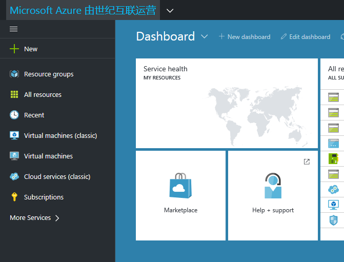

# Manage and connect to your subscription
Microsoft Azure operated by 21Vianet (Azure China 21Vianet) has unique URLs and endpoints for managing your environment. It's important to use the right connections to manage your environment. After you connect to the Azure environment, the normal operations for managing a service work if the component has been deployed.

## Connect by using the portal
Access to applications and services on Microsoft Azure China 21Vianet is through the [Azure portal](https://portal.azure.cn/), an [Azure Resource Manager](https://docs.microsoft.com/azure/azure-resource-manager/resource-group-overview) platform.

## Work with administrator roles
One account administrator role is created per Azure account, typically the person who signed up for or bought the Azure subscription. This role is authorized to use the [Account Center](https://account.windowsazure.cn/) to perform management tasks.

To sign in, the account administrator uses the organization ID (OrgID) created when the subscription was purchased. 

### Create a service administrator to manage the service deployment 
One service administrator role is created per Azure account and is authorized to manage services in Azure portal. With a new subscription, the account administrator is also the service administrator.

To create a service administrator:
1.	Log on to the Azure portal and click **Active Directory** from the left navigation menu.
2.	Under **Name**, click **Add a user**. Enter a user name, profile, and a temporary password for the new user.
3.	Click **View my bill**, select the subscription, and then click **Edit subscription details**.
4.	Change Service Administrator to the newly-created user.

### Create a co-administrator
Account administrators can create up to 199 co-administrator roles per subscription. This role has the same access privileges as the service administrator, but cannot change the association of subscriptions to Azure directories.
1.	Log on to Azure portal and click **Active Directory** on the left navigation menu.
2.	Under **Name**, click **Add a user**. Enter a user name, profile, and a temporary password for the new user.
3.	On the main menu bar, click **Setting**, then click **Administrators**.
4.	Click **Add**, then enter the user address from the earlier step. Use the original account domain. Select the subscription to which the co-administrator has access.
5.	Verify the change on the **Setting** page.

## Next steps
- [Azure portal](https://portal.azure.cn/)
- [Azure Resource Manager](https://docs.microsoft.com/azure/azure-resource-manager/resource-group-overview)
- [Account Center](https://account.windowsazure.cn/)

