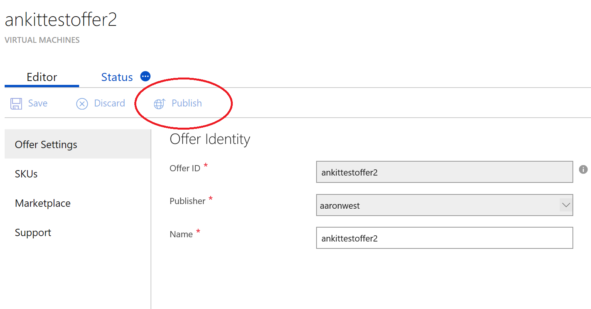
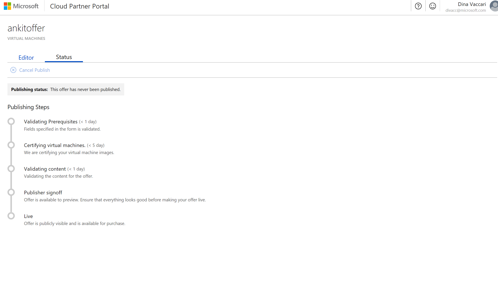
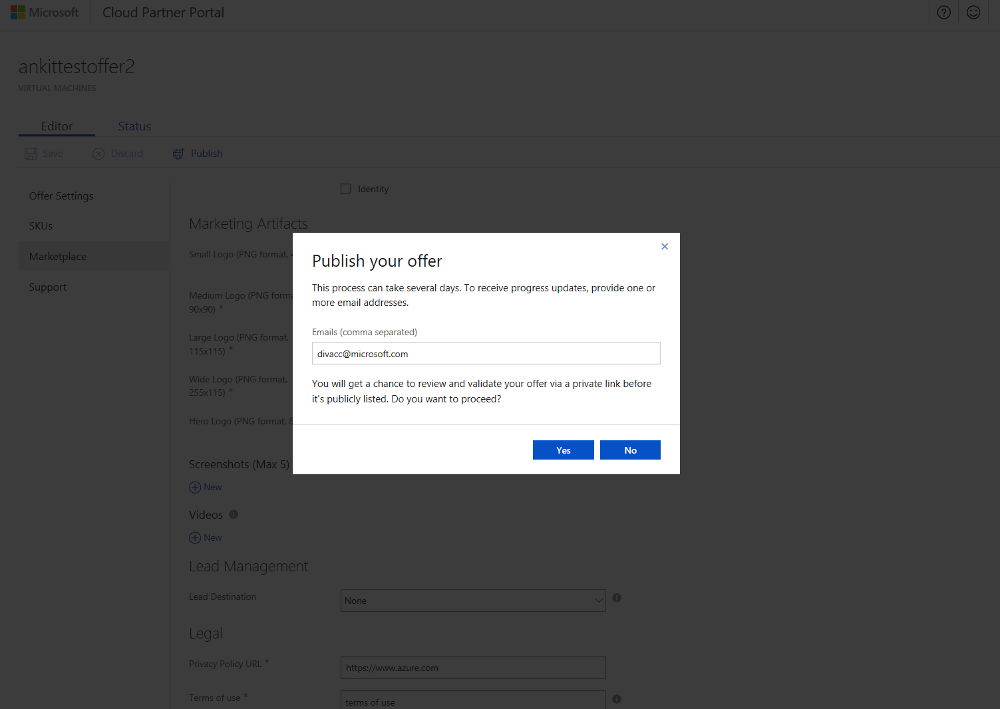
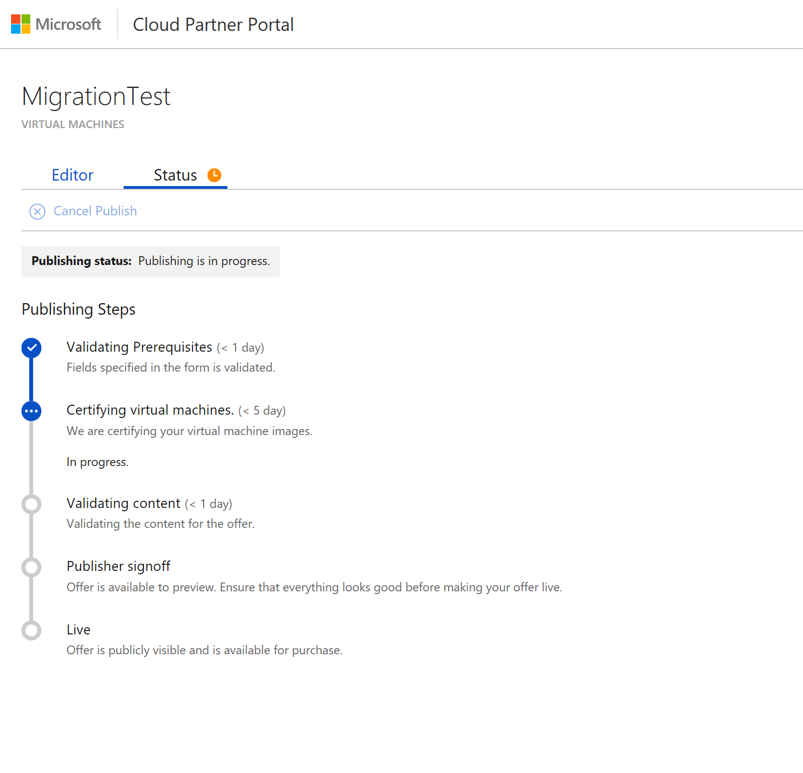
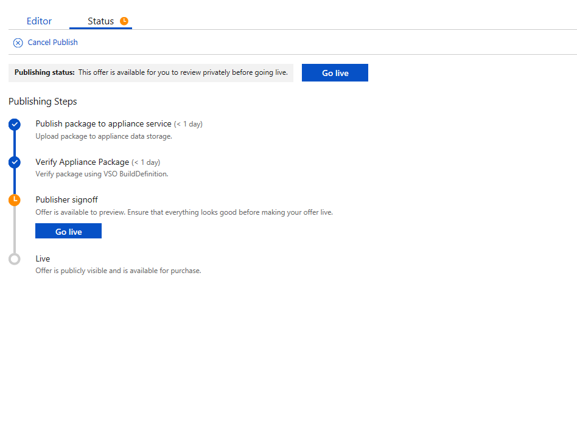
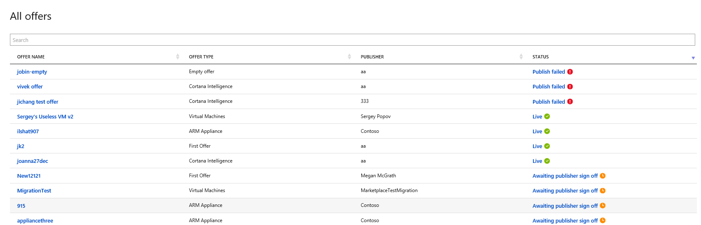

# How do I make my offer live on Azure marketplace?

Now that you’ve populated all the offer details, it’s time to publish your offer and make it live on Azure Marketplace.  There are a few stages the offer goes through, to make sure both your marketing content and your VM image meet the quality requirements to be Azure Certified and go live on the website. 

To start the Publish process, you will click “Publish” under the Editor tab  . This will start the validation process.

>If there are any errors , you will see  warning  next to the fields that require correction. You will need to resolve these prior to clicking the Publish button again.You can follow the progress of your offer getting published under the Status tab:

Under the Status tab, you will see the Publishing Steps and where your offer is in the process. Let’s walk through each of the publishing steps and discuss what happens at each step and how long you should estimate each step will take. 

##Validating prerequisites (<1 day) 	
When you click “Publish”, an automated check will take place to ensure you’ve populated all the required fields on your offer. If any fields are not populated, a     will appear next to the field and you will need to populate it accurately then click ‘Publish’ again.  

Once you’ve completed this step correctly, a pop-up will appear asking for an email address. This is the email that you will receive publishing status notifications for the remainder of the publishing process. Once you submit your email address, this step is complete.

##Certifying virtual machines (<5 days)
This step is where we run several tests to ensure your VM image meets the requirements for Azure Certified. All the guidance you will need to ensure you pass the certification requirements are [here](https://docs.microsoft.com/azure/marketplace-publishing/marketplace-publishing-vm-image-creation-prerequisites).

Since this step can take several days, you can log out of the Cloud Partner Portal. We will send you an email notification if there are any failures or errors that you need to address. If everything passes with success, the process will automatically move on to the Validating Content Step. 

## Validating content (<1 day)
Once your VM image is certified, we review all your marketing content to ensure that all URLs are valid and the content does not contain any explicit material. Again, no action is needed from you unless we send an email notification to you with actions you need to address.

Replication & Packaging (<3 days)	
During this stage, we are replicating your images to all global Azure data centers. 

Offer Available in Preview	
You will get a notification that your offer has completed the replication/packaging steps and is available to preview. During this step, you should preview your offer and make sure everything looks as it should be and that your VM properly deploys in the staging  environment. Note that only whitelisted offers  can do this verification. 

##Publisher sign-off
<2 days	Click Go Live and we will begin the replication and packaging steps to make your offer live in production and on the website. You will see the following status pipeline that you can follow your offer being pushed live globally. 

## Live		
Your offer is now Live on Azure Marketplace and Azure Portal, and customers will be able to view and deploy your virtual machine in their Azure subscriptions.
At any point, you can click on the All offers tab, and see the status for all your offers listed on the right column. You can click on the status to see the publishing flow status in detail for your offer.

Once live the offer will be available on Azure marketplace and portal.azure.com

