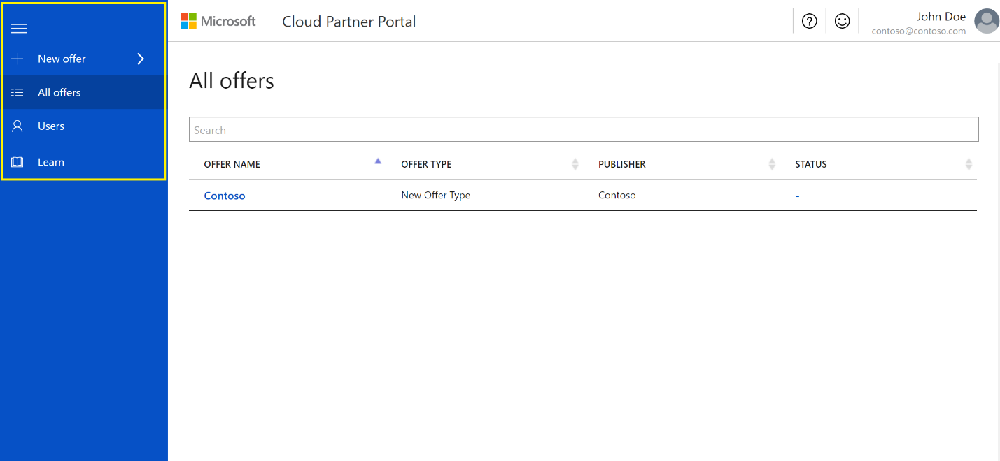
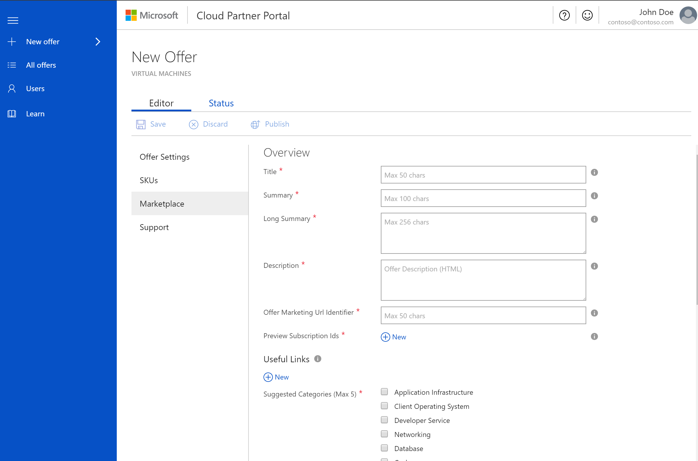

# Getting started with the Cloud Partner Portal
This document is a walkthrough of what to do on the Cloud Partner Portal which supports publishing for both [Azure Marketplace](https://azuremarketplace.microsoft.com/) and [AppSource](https://appsource.microsoft.com/) products. If you haven’t already, please take a look at the big picture of [What is the Cloud Partner Portal](./cloud-partner-portal-what-is-the-cloud-partner-portal.md).

## Portal tour
The Cloud Partner Portal contains everything you need to offer and operate a successful business on the cloud. Here’s a quick overview of the parts of this site that you will likely be interacting with most often.

### Left navigation bar
When you first land on the portal, you should see the collapsible navigation bar. This is where you can navigate among menu items.

Learn more about each item below:
1.	**New offer** – Kick off a new offer here, and review all [supported product types](./Cloud-partner-portal-products-that-can-get-published-via-portal.md).
2.	**All offers** – Check the state and status of all your current offers.
3.	**Users** – [Manage and control access for your company](./cloud-partner-portal-manage-users.md).
4.	**Learn** -  Jump-start your learning, and stay up-to-date on what’s new in the Partner Portal.
5.  **Insights** - Find insights and usage about your products and customers by visiting the Insights Portal.

### Offer page 
Continuing the tour, once you start a new offer or come back to edit your offer, you will work heavily in the offer page. This is where you configure all settings for your offer and check its status. 

1.	Add content or check your offer’s status by toggling between two top level modes: **Editor** and **Status**.
2.	Use the **Action bar** to explicitly manage your offer’s changes by saving and discarding your input.
3.	Navigate between the required **Forms** for each offer as you change your offer’s settings.

### Menu bar
Finally on the top of your screen you will always be able to navigate to the  top menu bar. This bar contains interactive actions for support and feedback, as well as all your Publisher account information.

1.	**Need help?** – If you are ever confused and need help, create a support request, and find links to the documentation.
2.	**Feedback** – Have something you want to say? Let us know here.
3.	**Publisher account** – When you first visit the portal you will see the publisher agreement contract to accept becoming a publisher. From then on, this is where you can make edits to your publisher profile or revisit the contract. This is also where you connect your Dev Center account to be able to sell your offers.

## Next steps	
Now that you've seen the tour of the Cloud Partner Portal, learn more about all the [supported product types](./Cloud-partner-portal-products-that-can-get-published-via-portal.md) that you can publish.

