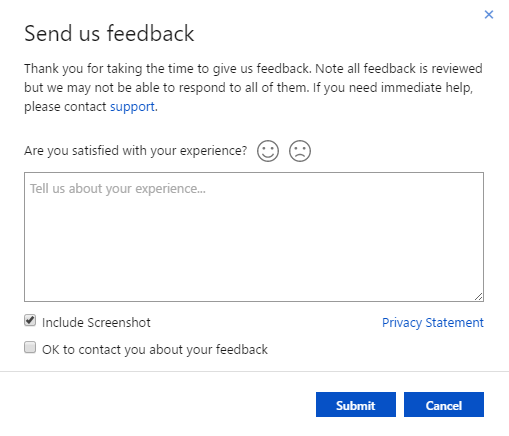

# Feedback: Marketplace publishing and Cloud partner portal

Microsoft wants to make the Azure Marketplace publishing process and cloud partner portal experience process as easy and as intuitive as possible. We’re looking to you to let us know if we hit the mark or if we have things to work on. We promise to triage and review all partner feedback. Will you take a minute and let us know what you think?.

To **submit your feedback**, Sign in to the  **[Cloud Partner Portal](https://cloudpartner.azure.com/)** and click the **smiley face in the top menu bar**.

Please share your experience. We would like to **contact you** if we require more information regarding your feedback. We respect your privacy and this will be only regarding your feedback.

We triage and review all our partner feedback but we may not be able to respond to all of them in time.**If you need immediate help, please contact [support](https://aka.ms/cloudpartnerportalsupport).**

