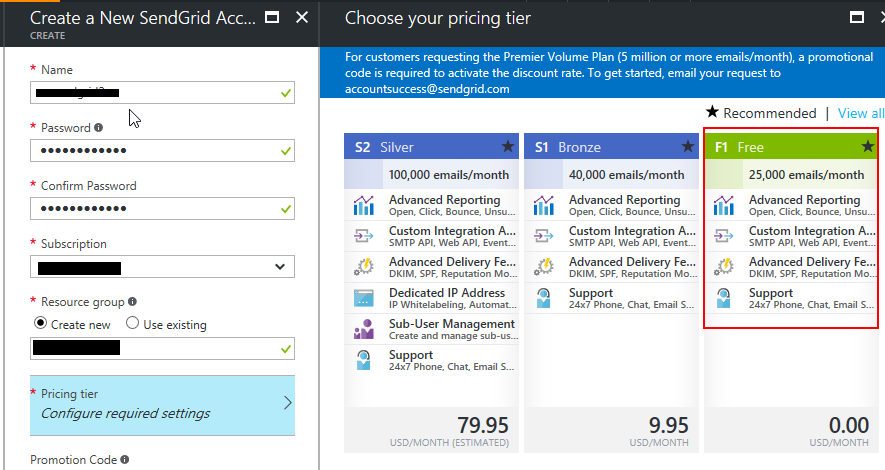
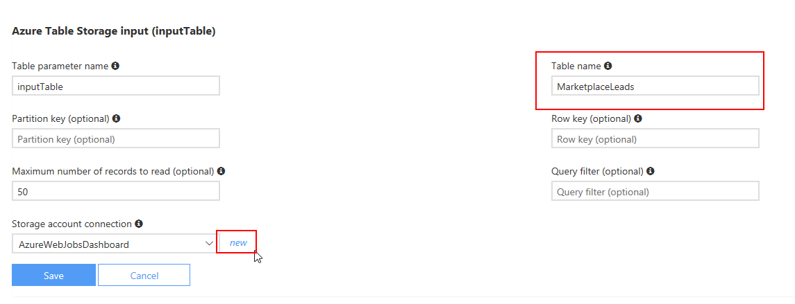
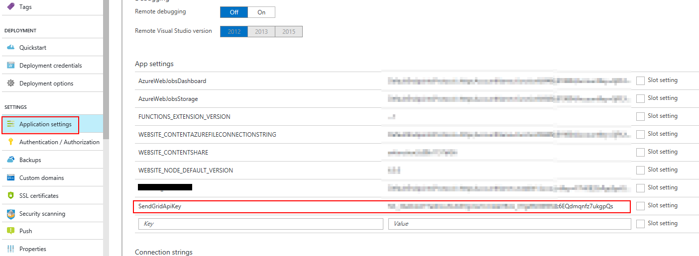

# Lead Management Instructions for Azure Table

This document provides you with instructions on how to setup your Azure Table so that Microsoft can provide you with sales leads. Azure Table is the best default choice for if you want to do something custom with how you store your leads.

1. If you don’t have an Azure account, then please first [go create one](https://azure.microsoft.com/pricing/free-trial/).

2. Once your Azure account is ready, go log into the [Azure portal](https://portal.azure.com) and create a storage account. See screenshot below for instructions and go here to [learn more about storage pricing](https://azure.microsoft.com/pricing/details/storage/).  
  

3. Next, copy the connection string for the key and paste it into the <b>Storage Account Connection String</b> field on the Cloud Partner Portal.   
  

  Sample final connection string:  
`{"connectionString":"DefaultEndpointsProtocol=https;AccountName=leadaccount;AccountKey=ObS0EW7tDmXrC8oNeG6IRHpx2IUioBQTQynQcR/MUMqrNqQ/RC6zctP8HfucNJO+ond7dJHTROO9ziiPNspjEg=="}`

You can use [Azure storage explorer](http://azurestorageexplorer.codeplex.com/) (third party app) or any other tool to see the data in your storage table or export the data.

### **(Optional)** Azure Functions + Azure Table
If you want to customize how you are receiving these leads, [Azure Functions](https://azure.microsoft.com/services/functions/) service provides ultimate flexibility to automate your lead generation process. Below is an example of how to create an Azure Function with a timer that runs every five minutes, looks in an Azure table for new records, and uses the free tier of SendGrid service to send a simple email notification.

1. [Create](https://portal.azure.com/#create/SendGrid.SendGrid) a free SendGrid service account in your Azure subscription.
  
    
  
2. Create a SendGrid API Key (click Manage key to go to SendGrid UI, click on Settings, API Keys, and create a Key that has Mail Send -> Full Access, save the API key).
 
    

3. [Create](https://portal.azure.com/#create/Microsoft.FunctionApp) an Azure Function app using the Hosting Plan option called “Consumption Plan”. 
  
    

4. Create a new function definition. 
  
    

5. Here if you want to get the function to send an update on a specific time, select the TimerTrigger-CSharp as the starter option.
  
    
  
6. Replace the “Develop” code with the one from the table below. You will want to edit the email addresses to match what you want them to be for sender and receiver.
This is just sample code, you can change it to make it better if necessary.
  
        #r "Microsoft.WindowsAzure.Storage"
        #r "SendGrid"
        using Microsoft.WindowsAzure.Storage.Table;
        using System;
        using SendGrid;
        using SendGrid.Helpers.Mail;

        public class MyRow : TableEntity
        {
            public string Name { get; set; }
        }

        public static void Run(TimerInfo myTimer, IQueryable<MyRow> inputTable, out Mail message, TraceWriter log)
        {
            // UTC datetime that is 5.5 minutes ago while the cron timer schedule is every 5 minutes
            DateTime dateFrom = DateTime.UtcNow.AddSeconds(-(5 * 60 + 30));
            var emailFrom = "YOUR EMAIL";
            var emailTo = "YOUR EMAIL";
            var emailSubject = "Azure Table Notification";

            // Look in the table for rows that were added recently
            var rowsList = inputTable.Where(r => r.Timestamp > dateFrom).ToList();

            // Check how many rows were added
            int rowsCount = rowsList.Count;
            
            if (rowsCount > 0)
            {
                log.Info($"Found {rowsCount} rows added since {dateFrom} UTC");

                // Configure the email message describing how many rows were added
                message = new Mail
                {
                    From = new Email(emailFrom),
                    Subject = emailSubject + " (" + rowsCount + " new rows)"
                };

                var personalization = new Personalization();
                personalization.AddTo(new Email(emailTo));
                message.AddPersonalization(personalization);

                var content = new Content
                {
                    Type = "text/plain",
                    Value = "Found " + rowsCount + " new rows added since " + dateFrom.ToString("yyyy-MM-dd HH:mm:ss") + " UTC"
                };
                message.AddContent(content);
            }
            else
            {
                // Do not send the email if no new rows were found
                message = null;
            }
        }
   

7. Click on “Integrate” and on “Inputs” to define the Azure Table connection:
  
    

8. Enter table name and define the connection string by clicking “new”.
  
    

9. Now define the Output as SendGrid and keep all the defaults.
  
    
    

10. Add SendGrid API Key to Function App Settings using Name “SendGridApiKey” and value obtained from API Keys in SendGrid UI
  
    
    

Once this is all configured, the Integrate section should contain code like this:

    {
      "bindings": [
        {
          "name": "myTimer",
          "type": "timerTrigger",
          "direction": "in",
          "schedule": "0 */5 * * * *"
        },
        {
          "type": "table",
          "name": "inputTable",
          "tableName": "MarketplaceLeads",
          "take": 50,
          "connection": "tdazuremarketplace_STORAGE",
          "direction": "in"
        },
        {
          "type": "sendGrid",
          "name": "message",
          "apiKey": "SendGridApiKey",
          "direction": "out"
        }
      ],
      "disabled": false
    }
  
And finally you must go back to the Develop UI of the function and click **Run** to start the timer. Now you're all set up to get notifications whenever a new lead comes in.
