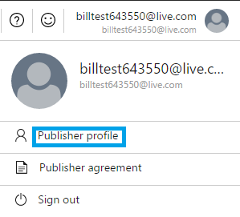

# Managing ‘Azure Marketplace’ and ‘Appsource’ Publisher Profile

This document is a walk through on viewing and managing users to your registered publisher profile. 

By this time, you have completed the steps to become an Azure Marketplace and Appsource publisher. The publisher profile is registered on the **[Cloud Partner Portal](https://cloudpartner.azure.com/)** following approval of your partner request.Your publisher profile will be apply to all the offers and SKUs published via from the account used during partner registration.  

(**If you haven’t registered your company as a Cloud Partner click [here](http://createopportunity.azurewebsites.net/)** )

Your publisher profile distinguishes your company on the Azure Marketplace and Appsource. It consists of your publisher ID, display name, and owner email(s). A well-managed profile will increase your visibility and help Marketplace users easily identify and select an appropriate offer.

**Publisher Profile**: It consists of Publisher ID, Display Name and Owner Email(s). 

> [!NOTE] 
> 
> Your publisher ID and registered owner email is not editable once you publish your first offer. You can view and edit (restricted to updating the publisher display name) your publisher profile from the ‘Cloud Partner Portal’. 

> [!NOTE]  
> Add users (contributors and owners) to your publishing profile from the **Users** section on the left navigation pane on the   **[Cloud Partner Portal](https://cloudpartner.azure.com/).** 

**To view and manage your publisher profile**, from the top-right menu bar, click the **Publisher profile tab**. 

**Link your Dev Center Account**: You can also link your existing Dev Center account with your publisher profile on the Cloud Partner Portal. First log on to the portal with the same email address used to register your Dev Center account. Once linked, your Dev Center account status, Dev Center account owner email, and Dev Center account name will display on your publisher profile page. 

> [!NOTE]
> Dev Center Account registration is mandatory for publishing paid market place SKU’s.

If you do not have a **[Developer Center Account](https://docs.microsoft.com/azure/marketplace-publishing/marketplace-publishing-accounts-creation-registration)** you can create one and add the registered email address as one of the owners on the Cloud Partner Portal  for your offer.  An owner can only add the registered email address to your publishing profile from the **User** section. Then, log on to the portal using the same email address, and link your Dev Center account. 

