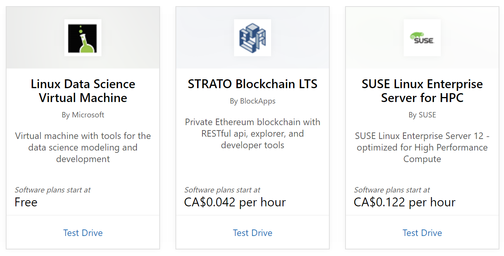
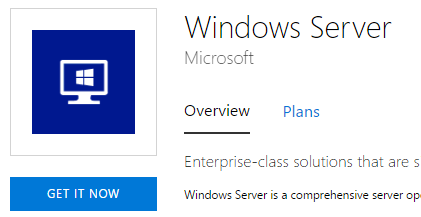
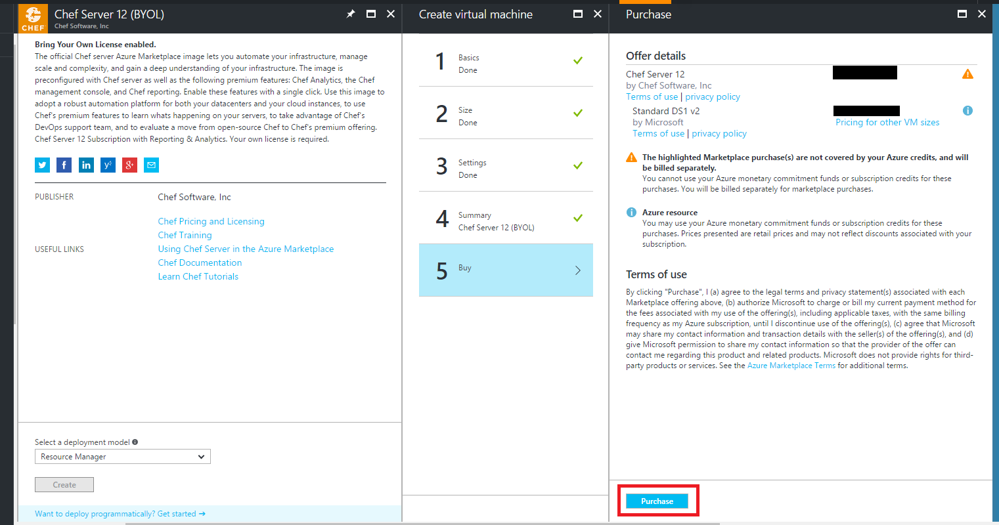
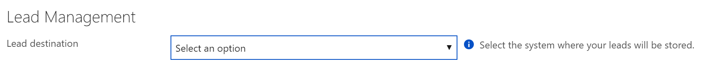

# Marketing Lead Management 
Customers are the center of any good business. In the transformation of today’s product acquisitions, marketers need to focus on connecting with customers directly and building a relationship. This is why generating high-quality leads is a vital tool for your sales cycle.
With the Cloud Partner Portal, we have enabled you to programmatically receive customer contact information **immediately** after a customer expresses interest or deploys your product. In this document, we will go through all you need to know about these generated leads, how to connect them to your CRM system, and how to integrate them into sales pipeline.

## What are these leads?
These leads are customers that are deploying your products from the Marketplace. Whether your product is listed on [Azure Marketplace](https://azuremarketplace.microsoft.com/) or [AppSource](https://appsource.com/), you will be able to receive leads of your customers interested in your product.
### Azure Marketplace
1.	Customer took a "Test Drive" for your offer. Test Drives are an accelerated opportunity for you to share your business instantly with potential customers without any barriers to entry. All Test Drives will generate a lead of a customer that was interested in trying your product to learn more.  Learn more about Test Drives at [Azure Marketplace Test Drive](https://azuremarketplace.azureedge.net/documents/azure-marketplace-test-drive-program.pdf).

    
 

2.	Customer consents to sharing their information after clicking the “Get it now” button. This lead is an initial interest lead, where we share a customer who has expressed interest in getting your product and is the top of the acquisition funnel.
 
    

3.	Customer clicks “Purchase” in the [Azure Portal](https://portal.azure.com/) when they are officially acquiring your product. This lead is an active lead, where we share a customer who has an Azure Subscription and has started to deploy your actual product.

     

### AppSource
1.	Customer took a "Test Drive" for your offer. Test Drives are an accelerated opportunity for you to share your business instantly with potential customers without any barriers to entry. All Test Drives will generate a lead of a customer that was interested in trying your product to learn more.  Learn more about Test Drives at [AppSource Test Drive](https://appsource.microsoft.com/blogs/want-to-try-an-app-take-a-test-drive).

    

2.	Customer consents to sharing their information after clicking the “Get it now” button. This lead is an initial interest lead, where we share a customer who has expressed interest in getting your product and is the top of the acquisition funnel.

    

3.	Customer clicks “Contact me" button on your offer. This lead is an active lead, where we share a customer who has actively asked to be followed up with about your product.

    

## Lead Data
Each lead you receive will have data passed in these specific fields. Since you will get leads from multiple steps along each customers' acquisition journey, the best way to handle the leads is to de-duplicate and personalize the follow-ups. This way each customer is getting an appropriate message, and you are creating an unique relationship every time.

|Field Name|Examples|
|----------|--------|
|ProductIds|	“checkpoint.check-point-r77-10sg-byol”, “bitnami.openedxcypress”, “docusign.3701c77e-1cfa-4c56-91e6-3ed0b622145a”    These are the assigned unique identifier for you and your specific offer. |
|CustomerInfo|	{ "FirstName":"John", "LastName":"Smith", "Email":"jsmith@microsoft.com", "Phone":"1234567890", "Country":"US", "Company":"Microsoft", "Title":"CTO" }  Note: Not all data will be available for each lead|
|LeadSource|	“AzureMarketplace”, “AzurePortal”, “TestDrive”,  “SPZA” (acronym for AppSource)|
|ActionCode	|“INS” – Stands for Installation. This is on Azure Marketplace or AppSource whenever a customer hits the button to acquire your product.  “PLT” –  Stands for Partner Led Trial. This is on AppSource whenever a customer hits the Contact me button.  “DNC” – Stands for Do Not Contact. This is on AppSource whenever a Partner who was cross listed on your app page gets requested to be contacted. We are sharing the heads up that this customer was cross listed on your app, but they do not need to be contacted.  “Create” – This is inside Azure Portal only and is whenever a customer purchases your offer to their account.  “StartTestDrive” – This is for Test Drives only and is whenever a customer starts their test drive.  |

We are actively working on enhancing leads, so if there is a data field that you do not see here but would like to have, please [send us your feedback](mailto:AzureMarketOnboard@microsoft.com).

## How to connect your CRM system with the Cloud Partner Portal 
To start getting leads, we’ve built our Lead Management connector on the Cloud Partner Portal so that you can easily plug in your CRM information, and we will make the connection for you. Now you can easily leverage the leads generated by the marketplace without a significant engineering effort to integrate with an external system.
 

We can write leads into a variety of CRM systems or directly to an Azure Storage Table where you can manage the leads however you’d like. Here are step by step instructions on how to connect each of the possible lead destinations:
<todo use updated markdown files as links from appsource/testdrive! Rewalk through the lead connections Non json just fields required now in separate pages>

*	Dynamics CRM Online - [Click here](./cloud-partner-portal-lead-management-instructions-dynamics.md) to get the instructions on how to configure Dynamics CRM Online for getting leads. 
*	Marketo - [Click here](./cloud-partner-portal-lead-management-instructions-marketo.md) to get the instructions for setting up Marketo Lead Configuration to get leads.
*	Salesforce - [Click here](./cloud-partner-portal-lead-management-instructions-salesforce.md) to get instructions for setting up your Salesforce instance to get leads.
*	Azure Table – [Click here](./cloud-partner-portal-lead-management-instructions-azure-table.md) to get the instructions for setting up your Azure storage account for getting leads in an Azure table. 

Once you have configured your lead destination properly and have hit Publish on your offer, we will validate the connection and send you a test lead. When you are viewing the offer before you go live, you can also test your lead connection by trying to acquire the offer yourself in the preview environment.  It's important to make sure that your lead settings stay up-to-date so that you don’t lose any leads, so make sure you update these connections whenever something has changed on your end.

## What next? 
Once the technical set up is in place, you should incorporate these leads into your current sales & marketing strategy and operational processes. We are very interested in better understanding your overall sales process and want to work closely with you on providing high-quality leads and enough data to make you successful. We welcome your feedback on how we can optimize and enhance the leads we send you with additional data to help make these customers successful.
Please let us know if you’re interested in [providing feedback](mailto:AzureMarketOnboard@microsoft.com) and suggestions to enable your sales team to be more successful with Marketplace Leads.

