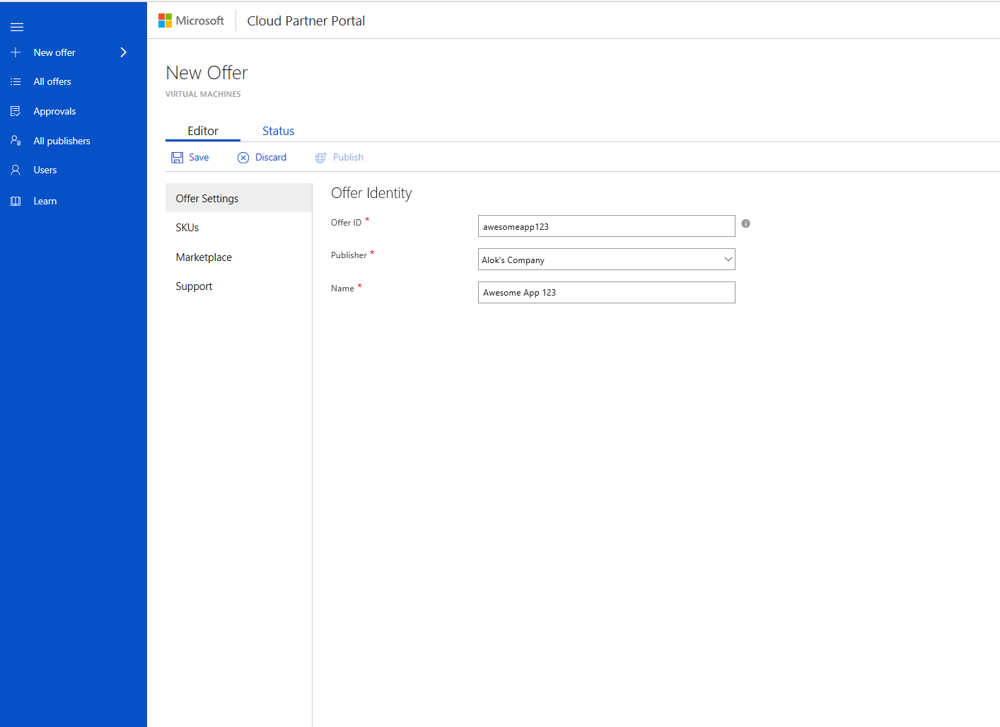

# Azure Marketplace sellers guide

Welcome to the Microsoft Azure Marketplace Sellers Guide. This guide is designed for business users and product managers at independent software vendors (ISVs) who are interested in selling their Azure certified virtual machine images to IT professionals and developers. With Azure customers located around the world, the [Azure Marketplace](https://azuremarketplace.microsoft.com/) can provide great reach and exposure for your products.

> [!NOTE]
> If you're interested in selling your finished software-as-a-service (SaaS) products to business users, you can investigate options to list them in [AppSource](https://appsource.microsoft.com).

By the end of this guide, you'll know where to find more detailed information on the following:

- What is the Azure Marketplace?
- How do I determine if my product fits with the Azure Marketplace?
- What are the benefits of selling on the Azure Marketplace?
- What are the prerequisites (technical and non-technical) to sell on the Azure Marketplace?
- How do I build Azure-compatible virtual hard disks (VHDs)?
- How do I apply and register as a seller?
- How do I create and publish my offer?
- How do I go to market and find available resources?
- What reporting and insights does the Azure Marketplace provide?
- Where can I get help and support?

Let's get started!

## What's the Azure marketplace?

The Azure Marketplace is an online applications and services marketplace that enables ISVs—from start-ups to enterprises—to offer their solutions to Azure customers around the world. The Azure Marketplace is how you, as an Azure publisher, can distribute and sell your innovative virtual machine image to other developers, ISVs, and IT professionals who want to quickly develop their cloud-based applications and mobile solutions in Azure. The Azure Marketplace supports a range of offerings, such as end-to-end data analytics applications with data processing, data storage, and analysis layers, or tiered e-commerce apps (data, service, and Internet).

Cloud customers face several challenges when searching for the right solutions to fit their unique needs. The Azure Marketplace provides a mechanism to solve these challenges and connect customers with innovative ISV solutions, as explained in the table below.

| Customer need | Azure Marketplace solution |
| --- | --- |
| Demands additional cloud platform functionality to meet business and technical needs | Offers a growing portfolio of complementary applications and services on Azure |
| Finds it challenging to discover the right application or service | Provides a one-stop shop to discover, search for, and purchase applications and services |
| Needs a scalable deployment mechanism for third-party applications and services | Enables the creation and configuration of scalable deployments for third-party applications and services |
| Requires new applications and services to integrate and work with existing solutions | Easily integrates third-party applications and services with existing solutions on Azure |

The Azure Marketplace brings the quality, choice, and strength of the Azure partner ecosystem to global customers. Key benefits include the following:

- Unified location for Azure-based offerings from Microsoft and partners
- More than 5,000 offers
- Integrated platform experience
- Streamlined configuration, deployment, and management

## Is the Azure marketplace right for my business?

By now you might be wondering if the Azure Marketplace is the right fit for your business, and, if it is, what will you get out of it? The Azure Marketplace creates new sales opportunities to offer customers your software and services that are available on Azure:

- **Sell into new customer markets with an expanded portfolio of solutions on Azure** : This is an opportunity to upsell and cross-sell Marketplace offerings with Azure services that are available to Microsoft Online Subscription Program (MOSP) and Microsoft Enterprise Agreement customers. You can easily incorporate Marketplace offerings into your customer solution and Azure scenario pitch.
- **Enhance business value and increase deal size with existing and new customer accounts** : The Azure Marketplace can help to grow deal size, address customer pain points when moving workloads to the cloud, and increase deal profitability. In short, you can increase business value by selling complete solutions and address critical Azure cloud platform gaps to meet customer requirements.
- **Appeal to a wider range of potential customers by selling Marketplace applications and services** : The Azure Marketplace can make it easier to find and retain new customers. Many businesses today need to transition workloads to the cloud and adapt to ever-changing infrastructure environments. You can provide the right applications and services to help them bridge the gap.
- **Complement and extend Azure functionality by bundling Marketplace offers with Azure services** : The Azure Marketplace can help you frame scenario-based conversations with your customers, letting you connect in real and concrete ways. You can also address specific platform gaps and customer needs by talking about end-to-end (E2E) solutions that matter. Finally, by selling solution bundles, you can get the most out of the Azure platform ecosystem to address almost any customer issue—and increase your sales.

## What&#39;s the customer base for the Azure marketplace?

Customers of the Azure Marketplace are a diverse bunch. Because Azure has one of the fastest-growing customer bases of all cloud providers, you&#39;ll gain access to IT professionals and developers in near-countless permutations—from start-ups to enterprises, across industries, in both the public and private sector.

## How does the Azure marketplace work?

It&#39;s really pretty easy: After you&#39;re approved, you create your Azure certified virtual machine image and publish it to the Azure Marketplace, where Azure customers can find, buy, and deploy your product in minutes. Even better, customers deploy your solution with confidence, knowing that the environment is configured for success on Azure and the infrastructure is ready to go within a few minutes.

The Cloud Partner Portal (CPP) is your hub for creating your offer on the Azure Marketplace. Virtual machine images are preconfigured with a fully installed operating system and one or more applications. To certify your image so that it&#39;s ready for publication, you have to meet certain prerequisites, which we&#39;ll discuss in the next section of this guide.

## What's next?

If you&#39;ve made it this far in the guide, you might be saying to yourself: &quot;I think the Azure Marketplace _really is_ the right fit for my product, but how do I get started?&quot; That&#39;s what this section is all about. Below you&#39;ll find information about getting up and running on the Azure Marketplace: becoming Azure certified, getting approved to sell your product, and creating your offer in the CPP (Figure 1).

Figure 1: Process for selling on the Azure Marketplace

At a high level, you&#39;ll meet a set of technical and non-technical prerequisites and prepare your virtual machine image. Then you&#39;ll nominate your product and register as a seller. Finally, you&#39;ll add marketing content and submit for publishing. You&#39;ll be able to review your offer in a preview/staging environment prior to making it live on the Azure Marketplace.

The first time you create an offer for the Azure Marketplace, you should plan on about _four weeks_ for basic onboarding. If possible, build in _six weeks_ prior to the launch of your offer to allow more time for media and publishing considerations.

## How do I become Azure certified?

The first step in creating your offer for the Azure Marketplace is to become Azure certified. That means compiling company information, agreeing to participation policies, downloading necessary tools, and building technical components (Figure 2).

Figure 2: Requirements for becoming Azure certified

### Technical prerequisites

Be sure to carefully review and meet all technical prerequisites in advance of the launch of your offer. You will need access to Windows or Linux, as well as Azure-compatible VHDs linked to testing tools.

While you can develop Azure VHDs either in the cloud or on-premises, we recommend that you develop your Azure VHD directly in the cloud using Remote Desktop Protocol. However, as a last resort, it&#39;s possible to download a VHD and develop it using [on-premises infrastructure](https://docs.microsoft.com/azure/marketplace-publishing/marketplace-publishing-vm-image-creation-on-premise).

For more detailed information, see the [technical prerequisites](https://docs.microsoft.com/azure/marketplace-publishing/marketplace-publishing-vm-image-creation-prerequisites) page.

### Non-technical prerequisites

To become part of the Azure Marketplace, you&#39;ll need to meet some non-technical prerequisites. First, review and agree to the terms of the [Azure Marketplace Participation Policies](https://azure.microsoft.com/support/legal/marketplace/participation-policies/). Please note that software and services offered in the Azure Marketplace must meet at least one of the following requirements:

- **Run on Microsoft Azure** : The primary function of the software or service must run on Microsoft Azure.
- **Deploy to Microsoft Azure** : You must describe in your listing information how the software or service is deployed on Microsoft Azure.
- **Integrate with or extend a Microsoft Azure service** : You must indicate in your listing information _which_ Azure service the software or service integrates with or extends, and _how_ the software or service integrates with or extends the Azure service.

You will also need to meet these business requirements, as described in the Azure Marketplace Participation Policies:

- Your company (or its subsidiary) must be located in a sell-from country supported by the Azure Marketplace.
- Your product must be licensed in a way that is compatible with billing models supported by the Azure Marketplace.
- You are responsible for making technical support available to customers in a commercially reasonable manner, whether free, paid, or through community support.
- You are required to license your software and any third-party software dependencies.
- You must provide content that meets criteria for your offering to be listed on [azure.microsoft.com](../../C:/Users/Lisa.Rosenberger/Desktop/azure.microsoft.com) and in the Azure Management Portal.

Finally, you'll need to agree to comply with the [Terms of Use](https://azure.microsoft.com/support/legal/website-terms-of-use/), [Microsoft Privacy Statement](http://www.microsoft.com/privacystatement/default.aspx), and [Microsoft Azure Certified Program Agreement](https://azure.microsoft.com/support/legal/marketplace/certified-program-agreement/) 

For a list of commonly asked questions, see the [Azure Marketplace FAQ](https://azure.microsoft.com/marketplace/faq/).

### Virtual machine image preparation

Now that you have reviewed all prerequisites and completed the necessary tasks, you can move forward with creating your virtual machine image offer as detailed in the [Virtual machine image publishing guide](https://docs.microsoft.com/azure/marketplace-publishing/marketplace-publishing-vm-image-creation).

This guide helps you prepare the VHD that you will deploy to the Azure Marketplace, which will become the foundation of your SKU. 

> [!NOTE]
> The process differs depending on whether you are providing a Linux-based or Windows-based SKU.

> [!NOTE]
>  This process can be performed in parallel with [account creation and registration](https://docs.microsoft.com/azure/marketplace-publishing/marketplace-publishing-accounts-creation-registration), which is described below.

### Azure certification

Earning _Azure certified_ status represents the successful completion of the onboarding process. This status instills confidence in customers that their IT professionals and developers are acquiring quality solutions that run on or are built with Azure technology from a trusted partner. Azure certified solutions include:

- Global vetting
- Determination of compatibility with the Azure platform
- Online image safety compliance
- No viruses or malware
- Supported billing model

## How do I nominate my product and get approved?

Now it's time to get approval to sell your product on the Azure Marketplace (Figure 3). Microsoft makes it easy to nominate your product, complete the publishing process, and register as a seller.

Figure 3: Steps for getting approved to sell on the Azure Marketplace

The first step toward approval is to [nominate](https://createopportunity.azurewebsites.net/) your product prior to registration and publication. Be aware that approval can take _up to three business days_.

Upon approval, you&#39;ll receive the following:

- Email receipt with a promo code waiving the $99 application fee for the Development Center and a profile in the CPP.
- Technical preapproval for Azure certified status, along with the option to create an offer and certify your VHD. (Your Development Center application must be approved before you can create your offer.)
- Instructions for publishing portal account details and an overview of the publishing process.
- Eligibility for a call with the Microsoft onboarding team to walk through the process and ask questions.
- Ability to publish a second offer. Second-time offers don&#39;t need to go through approval. They can go directly to the CPP, but the virtual machines still must be certified through the publishing process.
- Guidance on requesting help with publication. (Questions should be directed to the Marketplace Publisher [support link](https://support.microsoft.com/getsupport?wf=0&amp;tenant=ClassicCommercial&amp;oaspworkflow=start_1.0.0.0&amp;locale=en-us&amp;supportregion=en-us&amp;pesid=15635&amp;ccsid=636233723471685249).)

Finally, you&#39;ll [register your account](https://docs.microsoft.com/azure/marketplace-publishing/marketplace-publishing-accounts-creation-registration) as a Microsoft seller. Approval and vetting can take _up to two weeks_, so use this time to create your Azure Marketplace offer in the CPP.

## How do I create my offer in the Cloud Partner Portal?

You are now ready to create your offer and certify your virtual machine image! To do this, you&#39;ll use the Cloud Partner Portal (Figure 4). You can think of the CPP as your hub for [publishing and managing your solution](https://docs.microsoft.com/azure/marketplace-publishing/marketplace-publishing-getting-started).

Figure 4: Setting up a new offer through the Cloud Partner Portal

## What about best practices?

To help you get the most out of being a seller on the Azure Marketplace, we&#39;ve developed some tools and best practices that can make a big impact without taking a lot of time.

## Azure test drives

[Azure test drives](https://azure.microsoft.com/marketplace/test-drives/) are a great way to showcase your product to potential customers and give them the option to try before they buy. This can help to increase conversion and generate highly qualified leads.

After providing their contact information, customers can access your prebuilt test drive experience: a hands-on, self-guided trial of your product&#39;s key features and benefits demonstrated in a real-world implementation scenario. In this way, Azure test drives let you bring your product to life, right before your customers&#39; eyes.

Currently, publishing a test drive for your product is only available on the classic publishing portal. You can find documentation on how to do this by navigating [here](https://github.com/Azure/AzureTestDrive/wiki) on _How to Publish a New Test Drive_.

Learn more about Azure test drives [here](https://azuremarketplace.azureedge.net/documents/azure-marketplace-test-drive-program.pdf).

## Go-to-market checklist

Learn more about our [go-to-market programs](https://partner.microsoft.com/go-to-market/) that can help expand your organization&#39;s global reach. You can also leverage resources at the [partner marketing center](http://smartpartnermarketing.microsoft.com/isv).

Before your launch, we recommend taking a few steps to get rapid traction on your Azure Marketplace offer. Find out if you&#39;re ready to market your offer with a quick checklist:

- **I&#39;ve announced that my offer is available on the Azure Marketplace** by posting a blog, sending emails, or issuing a press release.
- **I&#39;m promoting my offer on my own website** , pointing customers to my offer on the Azure Marketplace, where they can learn, explore, trial, purchase, and deploy.
- **I&#39;ve published a test drive** so that customers can experience my offer running live on Azure over a coffee break.
- **I&#39;ve enabled on-demand lead generation** so that every time a customer clicks to deploy my application, I receive their name and contact information.
- **I&#39;ve connected with my partner manager** at Microsoft (if I have one) to explore additional opportunities.

## What about reports?

The Azure Marketplace offers reports on your orders, usage, and customers that are accessible via the Azure Marketplace [Publisher Reporting portal](https://reports.azure.com) (Figure 5). Raw data is provided in a navigable table and can be downloaded as a CSV or XLS file.

Figure 5: Accessing reports through the Publisher Reporting portal

This [video](https://player.vimeo.com/video/200859918) gives a sneak peek of report features and benefits, including:

- Types of reports: summary snapshot of orders, usage, and customer trends on the homepage
- Detailed orders, usage, and customer data
- Orders and usage shown as a monthly summary or as a six-month trend view
- Several insights shown as a standard
- Usage/orders by:

-
  - Market
  - Channel
  - Trending offers
  - Marketplace license type

Detailed reports show customer information—like company name, contact information, and geographic location down to the postal code—so you can comp your sellers. The following list includes the specific attributes we provide about your customers:

- Reseller
- FirstName
- LastName
- Email
- CompanyName
- TransactionDate
- SubscriptionName
- AzureSubscriptionId
- CloudInstanceName
- Order Count
- CustomerCountryRegion
- CustomerCity
- CustomerCommunicationCulture
- CustomerZipCode

We also offer training through help documentation, a glossary, and a recorded demo. If you need help or support with your reports, you can open a [Support ticket](https://support.microsoft.com/getsupport?wf=0&tenant=ClassicCommercial&oaspworkflow=start_1.0.0.0&locale=en-us&supportregion=en-us&pesid=15635&ccsid=636233723471685249).
