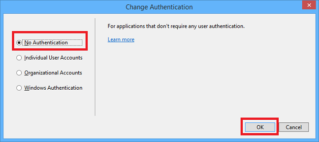

<properties linkid="develop-net-tutorials-multi-tier-web-site-3-web-role" pageTitle="Azure Cloud Service Tutorial: ASP.NET Web Role with Azure Storage Tables, Queues, and Blobs" metaKeywords="Azure tutorial, Azure storage tutorial, Azure multi-tier tutorial, ASP.NET MVC tutorial, Azure web role tutorial, Azure blobs tutorial, Azure tables tutorial, Azure queues tutorial" description="Learn how to create a multi-tier app using ASP.NET MVC and Azure. The app runs in a cloud service, with web role and worker roles, and uses Azure storage tables, queues, and blobs." metaCanonical="" services="cloud-services,storage" documentationCenter=".NET" title="Azure Cloud Service Tutorial: ASP.NET MVC Web Role, Worker Role, Azure Storage Tables, Queues, and Blobs" authors="tdykstra,riande" solutions="" manager="wpickett" editor="mollybos" />

# Building the web role for the Azure Email Service application - 3 of 5. 

This is the third tutorial in a series of five that show how to build and deploy the Azure Email Service sample application.  For information about the application and the tutorial series, see [the first tutorial in the series][firsttutorial].

In this tutorial you'll learn:

* How to create a solution that contains a Cloud Service project with a web role and a worker role. 
* How to work with Azure tables, blobs, and queues in MVC 5 controllers and views.
* How to handle concurrency conflicts when you are working with Azure tables.

## Segments of this tutorial

- [Create the Visual Studio solution](#cloudproject)
- [Update the Storage Client Library NuGet Package](#updatescl)
- [Configure the projects to use the storage emulator](#configurestorage)
- [Configure tracing and handle restarts](#tracing)
- [Add code to create tables, queue, and blob container in the Application_Start method](#createifnotexists)
- [Create and test the Mailing List](#mailinglist)
- [Create and test the Subscriber controller and views](#subscriber)
- [Create and test the Message controller and views](#message)
- [Create and test the Unsubscribe controller and view](#unsubscribe)
- [Next steps](#nextsteps)

  
<h2>Create the Visual Studio solution</h2>

You begin by creating a Visual Studio solution with a project for the web front-end and a project for one of the back-end Azure worker roles. You'll add the second worker role later. 

### Create a cloud service project with a web role and a worker role

1. Start Visual Studio.

2. From the **File** menu select **New Project**.

	![New Project menu][mtas-file-new-project]

3. Expand **C#** and select **Cloud** under **Installed Templates**, and then select **Azure Cloud Service**.  

4. Name the application **AzureEmailService** and click **OK**.

	![New Project dialog box][mtas-new-cloud-project]

5. In the **New Azure Cloud Service** dialog box, select **ASP.NET Web Role** and click the arrow that points to the right.

	![New Azure Cloud Project dialog box][mtas-new-cloud-service-dialog]

6. In the column on the right, hover the pointer over **WebRole1**, and then click the pencil icon to change the name of the web role. 

7. Enter MvcWebRole as the new name, and then press Enter.

	![New Azure Cloud Project dialog box - renaming the web role][mtas-new-cloud-service-dialog-rename]

8. Follow the same procedure to add a **Worker Role**, name it WorkerRoleA, and then click **OK**.

	![New Azure Cloud Project dialog box - adding a worker role][mtas-new-cloud-service-add-worker-a]

5. In the **New ASP.NET Project** dialog box, select the **MVC** template, select the **Web API** check box, and then click **Change Authentication**.

	![New Project dialog box][mtas-new-mvc4-project]

6. In the **Change Authentication** dialog box, click **No Authentication**, and then click **OK**. 

	

6. In the **New ASP.NET Project** dialog box, click **OK**.

### Set the page header, menu, and footer

In this section you update the headers, footers, and menu items that are shown on every page for the administrator web UI.  The application will have three sets of administrator web pages:  one for Mailing Lists, one for Subscribers to mailing lists, and one for Messages.

1. If you haven't already downloaded the [completed solution](http://code.msdn.microsoft.com/Windows-Azure-Multi-Tier-eadceb36), do that before continuing with the next step.

	In the remainder of the tutorial, when you need to add code you'll copy files from the downloaded project into the new project, instead of copying and pasting snippets. The tutorial will show and explain key parts of the code that you're copying.

	To add a file from the downloaded project, right-click the project you want to add the file to, or the folder you want to add it to, and choose **Add - Existing Item** from the context menu. Then navigate to where you downloaded the completed project, select the file(s) you want, and click **Add**. If the you get a **Destination File Exists** dialog box, click **Yes**. 

1. In the MvcWebRole project, add the *Views\Shared\_Layout.cshtml* file from the downloaded project (right-click the *Shared* folder under *Views* to add the file).

	This adds header, footer, and menu entries for Mailing List, Message, and Subscriber pages:

		<ul class="nav navbar-nav">
		    <li>@Html.ActionLink("Mailing Lists", "Index", "MailingList")</li>
		    <li>@Html.ActionLink("Messages", "Index", "Message")</li>
		    <li>@Html.ActionLink("Subscribers", "Index", "Subscriber")</li>
		</ul>

### Run the application locally

1. Press CTRL+F5 to run the application.

	If you're used to starting web projects that aren't Azure cloud service projects, you'll notice it takes longer than usual before you see the home page in the browser.

	![home page][mtas-home-page-before-adding-controllers]

	The delay is because Visual Studio starts the Azure compute emulator and Azure storage emulator.  You can see the compute emulator icon in the Windows system tray:

	![Compute emulator in system tray][mtas-compute-emulator-icon]

2. Close the browser.

<h2>Update the Storage Client Library NuGet Package</h2>

The API framework that you use to work with Azure Storage tables, queues, and blobs is the Storage Client Library (SCL). This API is included in a NuGet package in the Cloud Service project template. However, updates to the SCL are often released after the project templates were created, so it's always a good idea to check if an update is available for your SCL NuGet package.

1. In the Visual Studio **Tools** menu, hover over **Library Package Manager**, and then click **Manage NuGet Packages for Solution**.

	![Manage NuGet Packages for Solution in menu][mtas-manage-nuget-for-solution]

2. In the left pane of the **Manage NuGet Packages** dialog box, select **Updates**, then scroll down to the **Azure Storage** package and click **Update**.

	![Azure Storage package in Manage NuGet Packages dialog box][mtas-update-storage-nuget-pkg]

3. In the **Select Projects** dialog box, make sure both projects are selected, and then click **OK**.

	![Selecting both projects in the Select Projects dialog box][mtas-nuget-select-projects]
 
4. Accept the license terms to complete installation of the package, and then close the **Manage NuGet Packages** dialog box.

<h2>Configure the projects to use the storage emulator</h2>

The web role and worker role code that you'll add later will use a connection string named StorageConnectionString to connect to Azure Storage. In this section you'll add the setting to role properties and configure it to use the storage emulator. The second tutorial in the series shows how to configure the connection string to use an Azure storage account.

1. In **Solution Explorer**, right-click **MvcWebRole** under **Roles** in the **AzureEmailService** cloud project, and then choose **Properties**.

	![Web role properties][mtas-mvcwebrole-properties-menu]

2. Make sure that **All Configurations** is selected in the **Service Configuration** drop-down list.

2. Select the **Settings** tab and then click **Add Setting**.

3. Enter "StorageConnectionString" in the **Name** column.

4. Select **Connection String** in the **Type** drop-down list.  

6. Click the ellipsis (**...**) button at the right end of the line to open the **Storage Account Connection String** dialog box.

	![Right Click Properties][mtas-elip] 

7. In the **Create Storage Connection String** dialog, click the **Azure storage emulator** radio button, and then click **OK**. 

	The `Microsoft.WindowsAzure.Plugins.Diagnostics.ConnectionString` connection string is set to the storage emulator by default, so you don't have to change that.

2. Follow the same procedure that you used for the MvcWebRole to add the storage connection string for the WorkerRoleA role.

When you added a new setting with the **Add Settings** button, the new setting was added to the XML in the *ServiceDefinition.csdf* file and in each of the two *.cscfg* configuration files. The following XML is added by Visual Studio to the *ServiceDefinition.csdf* file.

      <ConfigurationSettings>
        <Setting name="StorageConnectionString" />
      </ConfigurationSettings>

The following XML is added to each *.cscfg* configuration file.

	   <Setting name="StorageConnectionString"
	   value="UseDevelopmentStorage=true" />

You can manually add settings to the *ServiceDefinition.csdf* file and the two *.cscfg* configuration files, but using the properties editor has the following advantages for connection strings:

- You only add the new setting in one place, and the correct setting XML is added to all three files.
- The correct XML is generated for the three settings files. The *ServiceDefinition.csdf* file defines settings that must be in each *.cscfg* configuration file. If the *ServiceDefinition.csdf* file and the two *.cscfg* configuration files settings are inconsistent, you can get the following error message from Visual Studio: *The current service model is out of sync. Make sure both the service configuration and definition files are valid.*

	![Invalid service configuration and definition files error][mtas-er1]

If you get this error, the properties editor will not work until you resolve the inconsistency problem manually by editing the files.

<h2>Configure tracing and handle restarts</h2>

1. In the MvcWebRole project, add the *WebRole.cs* file from the downloaded project.

This adds a method that configures logging, and calls it from the `OnStart` method that executes when the web role starts. The code in the new `ConfigureDiagnostics` method is explained in [the second tutorial][tut2].

This also adds code that runs when the web role is notified that it's about to be shut down. Azure Cloud Service applications are restarted approximately twice per month for operating system updates. (For more information on OS updates, see [Role Instance Restarts Due to OS Upgrades](http://blogs.msdn.com/b/kwill/archive/2012/09/19/role-instance-restarts-due-to-os-upgrades.aspx).) When a web application is going to be shut down, an `OnStop` event is raised. The web role boiler plate created by Visual Studio does not override the `OnStop` method, so the application will have only a few seconds to finish processing HTTP requests before it is shut down. You can add code to override the `OnStop` method in order to ensure that shutdowns are handled gracefully.

The file you just added contains the following `OnStop` method override.

		public override void OnStop()
		{
		    Trace.TraceInformation("OnStop called from WebRole");
		    var rcCounter = new PerformanceCounter("ASP.NET", "Requests Current", "");
		    while (rcCounter.NextValue() > 0)
		    {
		        Trace.TraceInformation("ASP.NET Requests Current = " + rcCounter.NextValue().ToString());
		        System.Threading.Thread.Sleep(1000);
		    }
		}

The `OnStop` method has up to 5 minutes to exit before the application is shut down. You could add a sleep call for 5 minutes to the `OnStop` method to give your application the maximum amount of time to process the current requests, but if your application is scaled correctly, it should be able to process the remaining requests in much less than 5 minutes. It is best to stop as quickly as possible, so that the application can restart as quickly as possible and continue processing requests.

Once a role is taken off-line by Azure, the load balancer stops sending requests to the role instance, and after that the `OnStop` method is called. If you don't have another instance of your role, no requests will be processed until your role completes shutting down and is restarted (which typically takes several minutes). That is one reason why the Azure service level agreement requires you to have at least two instances of each role in order to take advantage of the up-time guarantee.

In the code shown for the `OnStop` method, an ASP.NET performance counter is created for `Requests Current`. The `Requests Current` counter value contains the current number of requests, including those that are queued, currently executing, or waiting to be written to the client. The `Requests Current` value is checked every second, and once it falls to zero, the `OnStop` method returns. Once `OnStop` returns, the role shuts down.

Trace data is not saved when called from the `OnStop` method without performing an [On-Demand Transfer](http://msdn.microsoft.com/en-us/library/windowsazure/gg433075.aspx). You can view the `OnStop` trace information in real time with the  [dbgview](http://technet.microsoft.com/en-us/sysinternals/bb896647.aspx) utility from a remote desktop connection.

<h2>Add code to create tables, queue, and blob container in the Application_Start method</h2>

The web application will use the `MailingList` table, the `Message` table, the `azuremailsubscribequeue` queue, and the `azuremailblobcontainer` blob container. You could create these manually by using a tool such as Azure Storage Explorer, but then you would have to do that manually every time you started to use the application with a new storage account. In this section you'll add code that runs when the application starts, checks if the required tables, queues, and blob containers exist, and creates them if they don't. 

You could add this one-time startup code to the `OnStart` method in the *WebRole.cs* file, or to the *Global.asax* file. For this tutorial you'll initialize Azure Storage in the *Global.asax* file.

1. In **Solution Explorer**, right-click the MvcWebRole project, and add the *Global.asax.cs* file from the downloaded project.

You've added a new method that is called from the `Application_Start` method:

		private static void CreateTablesQueuesBlobContainers()
		{
		    var storageAccount = CloudStorageAccount.Parse(RoleEnvironment.GetConfigurationSettingValue("StorageConnectionString"));

		    var tableClient = storageAccount.CreateCloudTableClient();
		    var mailingListTable = tableClient.GetTableReference("MailingList");
		    mailingListTable.CreateIfNotExists();

		    var messageTable = tableClient.GetTableReference("Message");
		    messageTable.CreateIfNotExists();

		    var blobClient = storageAccount.CreateCloudBlobClient();
		    var blobContainer = blobClient.GetContainerReference("azuremailblobcontainer");
		    blobContainer.CreateIfNotExists();

		    var queueClient = storageAccount.CreateCloudQueueClient();
		    var subscribeQueue = queueClient.GetQueueReference("azuremailsubscribequeue");
		    subscribeQueue.CreateIfNotExists();
		}

In the following sections you build the components of the web application, and you can test them with development storage or your storage account without having to manually create tables, queues, or blob container first.

<h2>Create and test the Mailing List controller and views</h2>

The **Mailing List** web UI is used by administrators to create, edit and display mailing lists, such as "Contoso University History Department announcements" and "Fabrikam Engineering job postings".

### Add the MailingList entity class to the Models folder

The `MailingList` entity class is used for the rows in the `MailingList` table that contain information about the list, such as its description and the "From" email address for emails sent to the list.  

1. In the `Models` folder in the MVC project, add the *MailingList.cs* file from the downloaded project.

	You'll use the `MailingList` entity class for reading and writing mailing list rows in the mailinglist table.

	    public class MailingList : TableEntity
	    {
	        public MailingList()
	        {
	            this.RowKey = "mailinglist";
	        }
	
	        [Required]
	        [RegularExpression(@"[\w]+",
	         ErrorMessage = @"Only alphanumeric characters and underscore (_) are allowed.")]
	        [Display(Name = "List Name")]
	        public string ListName
	        {
	            get
	            {
	                return this.PartitionKey;
	            }
	            set
	            {
	                this.PartitionKey = value;
	            }
	        }
	
	        [Required]
	        [Display(Name = "'From' Email Address")]
	        public string FromEmailAddress { get; set; }
	
	        public string Description { get; set; }
	    }
			

	The Azure Storage API requires that entity classes for table operations derive from [TableEntity][]. `TableEntity` defines `PartitionKey`, `RowKey`, `TimeStamp`, and `ETag` fields. The `TimeStamp` and `ETag` properties are used by the system. You'll see how the `ETag` property is used for concurrency handling later in the tutorial. 

	(There is also a [DynamicTableEntity] class for use when you want to work with table rows as Dictionary collections of key value pairs instead of by using predefined model classes. For more information, see [Azure Storage Client Library 2.0 Tables Deep Dive][deepdive].)

	The `mailinglist` table partition key is the list name. In this entity class the partition key value can be accessed either by using the `PartitionKey` property (defined in the `TableEntity` class) or the `ListName` property (defined in the `MailingList` class).  The `ListName` property uses `PartitionKey` as its backing variable. Defining the `ListName` property enables you to use a more descriptive variable name in code and makes it easier to program the web UI, since formatting and validation DataAnnotations attributes can be added to the `ListName` property, but they can't be added directly to the `PartitionKey` property.

	The `RegularExpression` attribute on the `ListName` property causes MVC to validate user input to ensure that the list name value entered only contains alphanumeric characters or underscores. This restriction was implemented in order to keep list names simple so that they can easily be used in query strings in URLs. 

	>[WACOM.NOTE] If you wanted the list name format to be less restrictive, you could allow other characters and URL-encode list names when they are used in query strings. However, certain characters are not allowed in Azure Table partition keys or row keys, and you would have to exclude at least those characters. For information about characters that are not allowed or cause problems in the partition key or row key fields, see [Understanding the Table Service Data Model][tabledatamodel] and [% Character in PartitionKey or RowKey][percentinkeyfields].

	The `MailingList` class defines a default constructor that sets `RowKey` to the hard-coded string "mailinglist", because all of the mailing list rows in this table have that value as their row key. (For an explanation of the table structure, see the [first tutorial in the series][firsttutorial].) Any constant value could have been chosen for this purpose, as long as it could never be the same as an email address, which is the row key for the subscriber rows in this table.

	The list name and the "from" email address must always be entered when a new `MailingList` entity is created, so they have `Required` attributes.

	The `Display` attributes specify the default caption to be used for a field in the MVC UI. 

### Add the MailingList MVC controller

1. In the *Controllers* folder in the MVC project, add the *MailingListController.cs* file from the downloaded project.

	The controller's default constructor creates a `CloudTable` object to use for working with the `mailinglist` table.

	    public class MailingListController : Controller
	    {
	        private CloudTable mailingListTable;
	
	        public MailingListController()
	        {
	            var storageAccount = Microsoft.WindowsAzure.Storage.CloudStorageAccount.Parse(RoleEnvironment.GetConfigurationSettingValue("StorageConnectionString"));
	
	            var tableClient = storageAccount.CreateCloudTableClient();
	            mailingListTable = tableClient.GetTableReference("mailinglist");
		
	The code gets the credentials for your Azure Storage account from the Cloud Service project settings file in order to make a connection to the storage account. (You'll configure those settings later in this tutorial, before you test the controller.)

	Next is a `FindRowAsync` method that is called whenever the controller needs to look up a specific mailing list entry of the `MailingList` table, for example to edit a mailing list entry. The code retrieves a single `MailingList` entity by using the partition key and row key values passed in to it. The rows that this controller edits are the ones that have "MailingList" as the row key, so "MailingList" could have been hard-coded for the row key, but specifying both partition key and row key is a pattern used for the `FindRow` methods in all of the controllers.

	>[WACOM.NOTE] The application uses ASP.NET 4.5 async code for I/O operations in the web role in order to use server resources efficiently. For information about async code in web application, see [Use .NET 4.5’s async support to avoid blocking calls](http://www.asp.net/aspnet/overview/developing-apps-with-windows-azure/building-real-world-cloud-apps-with-windows-azure/web-development-best-practices#async).

		private async Task<MailingList> FindRowAsync(string partitionKey, string rowKey)
		{
		    var retrieveOperation = TableOperation.Retrieve<MailingList>(partitionKey, rowKey);
		    var retrievedResult = await mailingListTable.ExecuteAsync(retrieveOperation);
		    var mailingList = retrievedResult.Result as MailingList;
		    if (mailingList == null)
		    {
		        throw new Exception("No mailing list found for: " + partitionKey);
		    }
		    return mailingList;
		}

	The code in this `FindRow` method returns a mailing list row. The code in the corresponding `FindRow` method in the `Subscriber` controller returns a subscriber row from the same `mailinglist` table. The code in the two methods is identical except for the the model type used with the [TableOperation.Retrieve](http://msdn.microsoft.com/en-us/library/windowsazure/microsoft.windowsazure.storage.table.tableoperation.retrieve.aspx) method.

		private async Task<Subscriber> FindRowAsync(string partitionKey, string rowKey)
		{
		    var retrieveOperation = TableOperation.Retrieve<Subscriber>(partitionKey, rowKey);
		    var retrievedResult = await mailingListTable.ExecuteAsync(retrieveOperation);
		    var subscriber = retrievedResult.Result as Subscriber;
		    if (subscriber == null)
		    {
		        throw new Exception("No subscriber found for: " + partitionKey + ", " + rowKey);
		    }
		    return subscriber;
		}

	The `TableOperation` object returned by the `TableOperation.Retrieve` method specifies the schema (the properties) of the row or rows that you expect the query to return. A single table may have different schemas in different rows. Typically you specify the same model type when reading a row that was used to create the row.
        
	The **Index** page displays all of the mailing list rows, so the query in the `Index` method returns all `MailingList` entities that have "mailinglist" as the row key (the other rows in the table have email address as the row key, and they contain subscriber information).

		var query = new TableQuery<MailingList>()
		    .Where(TableQuery.GenerateFilterCondition
		        ("RowKey", QueryComparisons.Equal, "mailinglist"));
		TableContinuationToken token = null;
		OperationContext ctx = new OperationContext();
		TableQuerySegment<MailingList> currentSegment = null;
		while (currentSegment == null || currentSegment.ContinuationToken != null)
		{
		    currentSegment = await mailingListTable.ExecuteQuerySegmentedAsync
		        (query, token, webUIRetryPolicy, ctx);
		    lists.AddRange(currentSegment.Results);
		    token = currentSegment.ContinuationToken;
		}

	The `ExecuteQuerySegmentedAsync` method breaks large result sets into segments. It returns up to 1,000 rows. When you execute a query that would retrieve more than 1,000 rows, you get 1,000 rows and a continuation token. You can use the continuation token to execute another query that starts where the previous one left off. The code shown is simplified for a sample application: it aggregates all segments into one list. For a production application you'd implement paging code. For more information about large result sets and continuation tokens, see [How to get most out of Azure Tables][howtogetthemost] and [Azure Tables: Expect Continuation Tokens, Seriously](http://blog.smarx.com/posts/windows-azure-tables-expect-continuation-tokens-seriously).

	When you create the `OperationContext` object, you can set the `ClientID` property value in order to provide a unique identifier that will be included in logs written by Azure Storage. You can use this identifier to trace storage operation logs to the code that caused the storage service activity. For information about Azure storage logging, see [Azure Storage Logging: Using Logs to Track Storage Requests](http://blogs.msdn.com/b/windowsazurestorage/archive/2011/08/03/windows-azure-storage-logging-using-logs-to-track-storage-requests.aspx).

	With the SCL 2.1 and later API you can also use LINQ for your table queries. For a code sample that shows how to use LINQ, see [PhluffyFotos](http://code.msdn.microsoft.com/PhluffyFotos-Sample-7ecffd31).

	If you don't specify a retry policy, the API automatically retries three times with exponentially increasing timeout limits. For a web interface with a user waiting for a page to appear, this could result in unacceptably long wait times. Therefore, this code specifies linear retries (so the timeout limit doesn't increase each time) and a timeout limit that is reasonable for the user to wait. The retry policy is specified in the `webUIRetryPolicy` object that is passed to the `ExecuteQuerySegmentedAsync` method. The `webUIRetryPolicy` object is defined in the controller constructor:

		private TableRequestOptions webUIRetryPolicy;
		
		public MailingListController()
		{
		    // Other constructor code not shown.

		    webUIRetryPolicy = new TableRequestOptions()
		    {
		        MaximumExecutionTime = TimeSpan.FromSeconds(1.5),
		        RetryPolicy = new LinearRetry(TimeSpan.FromSeconds(3), 3)
		    };
		}

	The `Index` method includes a try-catch block that is designed to handle timeout conditions. 

		try
		{
		    // Code not shown for retrieving MailingList rows.
 		}
		catch (StorageException se)
		{
		    ViewBag.errorMessage = "Timeout error, try again. ";
		    Trace.TraceError(se.Message);
		    return View("Error");
		}

	When the user clicks the **Create** button on the **Create** page, the MVC model binder creates a `MailingList` entity from input entered in the view, and the `HttpPost Create` method adds the entity to the table.

		[HttpPost]
		[ValidateAntiForgeryToken]
		public async Task<ActionResult> Create(MailingList mailingList)
		{
		    if (ModelState.IsValid)
		    {
		        var insertOperation = TableOperation.Insert(mailingList);
		        await mailingListTable.ExecuteAsync(insertOperation);
		        return RedirectToAction("Index");
		    }
		
		    return View(mailingList);
		}

	For the **Edit** page, the `HttpPost Edit` method updates the row.

		var replaceOperation = TableOperation.Replace(mailingList);
		await mailingListTable.ExecuteAsync(replaceOperation);

	In the `HttpPost Edit` method a catch block handles concurrency errors. 

		catch (StorageException ex)
		{
		    if (ex.RequestInformation.HttpStatusCode == 412)
		    {
		        // Concurrency error
		        var retrieveOperation = TableOperation.Retrieve<MailingList>(partitionKey, rowKey);
		        var retrievedResult = mailingListTable.Execute(retrieveOperation);
		        var currentMailingList = retrievedResult.Result as MailingList;
		        if (currentMailingList == null)
		        {
		            ModelState.AddModelError(string.Empty, "The record you attempted to edit "
		                + "was deleted by another user after you got the original value. The "
		                + "edit operation was canceled. Click the Back to List hyperlink.");
		        }
		        if (currentMailingList.FromEmailAddress != editedMailingList.FromEmailAddress)
		        {
		            ModelState.AddModelError("FromEmailAddress", "Current value: " + currentMailingList.FromEmailAddress);
		        }
		        if (currentMailingList.Description != editedMailingList.Description)
		        {
		            ModelState.AddModelError("Description", "Current value: " + currentMailingList.Description);
		        }
		        ModelState.AddModelError(string.Empty, "The record you attempted to edit "
		            + "was modified by another user after you got the original value. The "
		            + "edit operation was canceled and the current values in the database "
		            + "have been displayed. If you still want to edit this record, click "
		            + "the Save button again. Otherwise click the Back to List hyperlink.");
		         ModelState.SetModelValue("ETag", new ValueProviderResult(currentMailingList.ETag, currentMailingList.ETag, null));
		    }
		    else
		    {
		        throw; 
		    }
		}

	A concurrency exception is raised if a user selects a mailing list for editing, then while the **Edit** page is displayed in the browser another user edits the same mailing list. When that happens, the code displays a warning message and indicates which fields were changed by the other user.  The TSL API uses the `ETag` to check for concurrency conflicts. Every time a table row is updated, the `ETag` value is changed.  When you get a row to edit, you save the `ETag` value, and when you execute an update or delete operation you pass in the `ETag` value that you saved. (The `Edit` view has a hidden field for the ETag value.) If the update operation finds that the `ETag` value on the record you are updating is different than the `ETag` value that you passed in to the update operation, it raises a concurrency exception. If you don't care about concurrency conflicts, you can set the ETag field to an asterisk ("*") in the entity that you pass in to the update operation, and conflicts are ignored. 

	Note: The HTTP 412 error is not unique to concurrency errors. It can be raised for other errors by the SCL API.

	For the **Delete** page, the `HttpPost Delete` method deletes the `MailingList` row along with any `Subscriber` rows that are associated with it in the `MailingList` table.

		[HttpPost, ActionName("Delete")]
		[ValidateAntiForgeryToken]
		public async Task<ActionResult> DeleteConfirmed(string partitionKey)
		{
		    // Delete all rows for this mailing list, that is, 
		    // Subscriber rows as well as MailingList rows.
		    // Therefore, no need to specify row key.
		
		    // Get all rows for this mailing list. For a production app where this 
		    // could return too many split the work up into segments.
		    var query = new TableQuery<MailingList>().Where(TableQuery.GenerateFilterCondition("PartitionKey", QueryComparisons.Equal, partitionKey));
		    TableContinuationToken token = null;
		    OperationContext ctx = new OperationContext();
		    TableQuerySegment<MailingList> currentSegment = null;
		    List<MailingList> listRows = new List<MailingList>();
		    while (currentSegment == null || currentSegment.ContinuationToken != null)
		    {
		        currentSegment = await mailingListTable.ExecuteQuerySegmentedAsync(query, token, webUIRetryPolicy, ctx);
		        listRows.AddRange(currentSegment.Results);
		        token = currentSegment.ContinuationToken;
		    }
		
		    // Delete the rows in batches of 100.
		    var batchOperation = new TableBatchOperation();
		    int itemsInBatch = 0;
		    foreach (MailingList listRow in listRows)
		    {
		        batchOperation.Delete(listRow);
		        itemsInBatch++;
		        if (itemsInBatch == 100)
		        {
		            await mailingListTable.ExecuteBatchAsync(batchOperation);
		            itemsInBatch = 0;
		            batchOperation = new TableBatchOperation();
		        }
		    }
		    if (itemsInBatch > 0)
		    {
		        await mailingListTable.ExecuteBatchAsync(batchOperation);
		    }
		    return RedirectToAction("Index");
		}

	In case a large number of subscribers need to be deleted, the code deletes the records in batches. The transaction cost of deleting one row is the same as deleting 100 rows in a batch. The maximum number of operations that you can perform in one batch is 100. 

	Although the loop processes both `MailingList` rows and `Subscriber` rows, it reads them all into the `MailingList` entity class because the only fields needed for the `Delete` operation are the `PartitionKey`, `RowKey`, and `ETag` fields.

### Add the MailingList MVC views

2. In the *Views* folder in the MVC project, create a new folder and name it *MailingList*.

1. In the new *Views\MailingList* folder, add all four of the *.cshtml* files from the downloaded project.

In the *Edit.cshtml* file notice the hidden field that is included to preserve the `ETag` value which is used for handling concurrency conflicts.

		@using (Html.BeginForm()) {
		    @Html.AntiForgeryToken()
		    @Html.ValidationSummary(true)
		
		    @Html.HiddenFor(model => model.ETag)

Notice also that the `ListName` field has a `DisplayFor` helper instead of an `EditorFor` helper. 

		

		    @Html.LabelFor(model => model.ListName, htmlAttributes: new { @class = "control-label col-md-2" })
		    

		        @Html.DisplayFor(model => model.ListName, new { htmlAttributes = new { @class = "form-control" } })
		    

		

		
		

		    @Html.LabelFor(model => model.Description, htmlAttributes: new { @class = "control-label col-md-2" })
		    

		        @Html.EditorFor(model => model.Description, new { htmlAttributes = new { @class = "form-control" } })
		        @Html.ValidationMessageFor(model => model.Description, "", new { @class = "text-danger" })
		    

		

		
		

		    @Html.LabelFor(model => model.FromEmailAddress, htmlAttributes: new { @class = "control-label col-md-2" })
		    

		        @Html.EditorFor(model => model.FromEmailAddress, new { htmlAttributes = new { @class = "form-control" } })
		        @Html.ValidationMessageFor(model => model.FromEmailAddress, "", new { @class = "text-danger" })
		    

		

We didn't enable the **Edit** page to change the list name, because that would have required complex code in the controller:  the `HttpPost Edit` method would have had to delete the existing mailing list row and all associated subscriber rows, and re-insert them all with the new key value. In a production application you might decide that the additional complexity is worthwhile. As you'll see later, the `Subscriber` controller does allow list name changes, since only one row at a time is affected.

In the *Index.cshtml* file, the **Edit** and **Delete** hyperlinks specify partition key and row key query string parameters in order to identify a specific row.  For `MailingList` entities only the partition key is actually needed since row key is always "MailingList", but both are kept so that the MVC view code is consistent across all controllers and views.

		<td>
		    @Html.ActionLink("Edit", "Edit", new { PartitionKey = item.PartitionKey, RowKey=item.RowKey }) |
		    @Html.ActionLink("Delete", "Delete", new { PartitionKey = item.PartitionKey, RowKey=item.RowKey  })
		</td>

### Make MailingList the default controller

1. Open *Route.config.cs* in the *App_Start* folder.

2. In the line that specifies defaults, change the default controller from "Home" to "MailingList".

         routes.MapRoute(
             name: "Default",
             url: "{controller}/{action}/{id}",
             defaults: new { controller = "MailingList", action = "Index", id = UrlParameter.Optional }

### Test the application

1. Run the project by pressing CTRL+F5.

	![Empty MailingList Index page][mtas-mailing-list-empty-index-page]

2. Use the **Create** function to add some mailing lists, and try the **Edit** and **Delete** functions to make sure they work.

	![MailingList Index page with rows][mtas-mailing-list-index-page]

<h2>SubscriberCreate and test the Subscriber controller and views</h2>

The **Subscriber** web UI is used by administrators to add new subscribers to a mailing list, and to edit, display, and delete existing subscribers. 

### Add the Subscriber entity class to the Models folder

The `Subscriber` entity class is used for the rows in the `MailingList` table that contain information about subscribers to a list. These rows contain information such as the person's email address and whether the address is verified.  

1. In the *Models* folder in the MVC project, add the *Subscriber.cs* file from the downloaded project.

Like the `MailingList` entity class, the `Subscriber` entity class is used to read and write rows in the `mailinglist` table.

		    public class Subscriber : TableEntity
		    {
		        [Required]
		        public string ListName
		        {
		            get
		            {
		                return this.PartitionKey;
		            }
		            set
		            {
		                this.PartitionKey = value;
		            }
		        }
		
		        [Required]
		        [Display(Name = "Email Address")]
		        public string EmailAddress
		        {
		            get
		            {
		                return this.RowKey;
		            }
		            set
		            {
		                this.RowKey = value;
		            }
		        }
		
		        public string SubscriberGUID { get; set; }
		
                public bool? Verified { get; set; }
		    }
		

`Subscriber` rows use the email address instead of the constant "mailinglist" for the row key.  (For an explanation of the table structure, see the [first tutorial in the series][firsttutorial].) Therefore an `EmailAddress` property is defined that uses the `RowKey` property as its backing field, the same way that `ListName` uses `PartitionKey` as its backing field. As explained earlier, this enables you to put formatting and validation DataAnnotations attributes on the properties.

The `SubscriberGUID` value is generated when a `Subscriber` entity is created. It is used in subscribe and unsubscribe links to help ensure that only authorized persons can subscribe or unsubscribe email addresses. 

When a row is initially created for a new subscriber, the `Verified ` value is `false`. The `Verified` value changes to `true` only after the new subscriber clicks the **Confirm** hyperlink in the welcome email. If a message is sent to a list while a subscriber has `Verified` = `false`, no email is sent to that subscriber.

The `Verified` property in the `Subscriber` entity is defined as nullable. When you specify that a query should return `Subscriber` entities, it is possible that some of the retrieved rows might not have a `Verified` property. Therefore the `Subscriber` entity defines its `Verified` property as nullable so that it can more accurately reflect the actual content of a row if table rows that don't have a *Verified* property are returned by a query. You might be accustomed to working with SQL Server tables, in which every row of a table has the same schema. In an Azure Storage table, each row is just a collection of properties, and each row can have a different set of properties. For example, in the Azure Email Service sample application, rows that have "MailingList" as the row key don't have a `Verified` property.  If a query returns a table row that doesn't have a `Verified` property, when the `Subscriber` entity class is instantiated, the `Verified` property in the entity object will be null.  If the property were not nullable, you would get the same value of `false` for rows that have `Verified` = `false` and for rows that don't have a `Verified` property at all. Therefore, a best practice for working with Azure Tables is to make each property of an entity class nullable in order to accurately read rows that were created by using different entity classes or different versions of the current entity class. 

### Add the Subscriber MVC controller

1. In **Solution Explorer**, right-click the *Controllers* folder in the MVC project, and choose **Add Existing Item**.

2. Navigate to the folder where you downloaded the sample application, select the *SubscriberController.cs* file in the *Controllers* folder, and click **Add**. (Make sure that you get *Subscriber.cs* and not *Subscribe.cs*; you'll add *Subscribe.cs* later.)

Most of the code in this controller is similar to what you saw in the `MailingList` controller. Even the table name is the same because subscriber information is kept in the `MailingList` table. 

In addition to the `FindRowAsync` method there's a `FindRow` method, since there is a need to call it from a catch block, and you can't call an async method from a catch block.

After the `FindRow` methods you see a `GetListNamesAsync` method. This method gets the data for a drop-down list on the **Create** and **Edit** pages, from which you can select the mailing list to subscribe an email address to.

		private async Task<List<MailingList>> GetListNamesAsync()
		{
		    List<MailingList> lists = new List<MailingList>();
		    var query = (new TableQuery<MailingList>().Where(TableQuery.GenerateFilterCondition("RowKey", QueryComparisons.Equal, "mailinglist")));
		    TableContinuationToken token = null;
		    OperationContext ctx = new OperationContext();
		    TableQuerySegment<MailingList> currentSegment = null;
		    while (currentSegment == null || currentSegment.ContinuationToken != null)
		    {
		        currentSegment = await mailingListTable.ExecuteQuerySegmentedAsync(query, token, webUIRetryPolicy, ctx);
		        lists.AddRange(currentSegment.Results);
		        token = currentSegment.ContinuationToken;
		    }
		    return lists;
		}

This is the same query you saw in the `MailingList` controller. For the drop-down list you want rows that have information about mailing lists, so you select only those that have RowKey = "mailinglist".

For the method that retrieves data for the **Index** page, you want rows that have subscriber information, so you select all rows that do not have RowKey = "MailingList".

		var query = (new TableQuery<Subscriber>()
		    .Where(TableQuery.GenerateFilterCondition
		        ("RowKey", QueryComparisons.NotEqual, "mailinglist")));

Notice that the query specifies that data will be read into `Subscriber` objects (by specifying `<Subscriber>`) but the data will be read from the `mailinglist` table.

The number of subscribers could grow to be too large to handle this way in a single query. As noted earlier, in a production application you would implement paging using continuation tokens.  

In the `HttpGet Create` method, you set up data for the drop-down list; and in the `HttpPost` method, you set default values before saving the new entity.

		public async Task<ActionResult> Create()
		{
		    var lists = await GetListNamesAsync();
		    ViewBag.ListName = new SelectList(lists, "ListName", "Description");
		    var model = new Subscriber() { Verified = false };
		    return View(model);
		}
		[HttpPost]
		[ValidateAntiForgeryToken]
		public async Task<ActionResult> Create(Subscriber subscriber)
		{
		    if (ModelState.IsValid)
		    {
		        subscriber.SubscriberGUID = Guid.NewGuid().ToString();
		        if (subscriber.Verified.HasValue == false)
		        {
		            subscriber.Verified = false;
		        }
		
		        var insertOperation = TableOperation.Insert(subscriber);
		        await mailingListTable.ExecuteAsync(insertOperation);
		        return RedirectToAction("Index");
		    }
		
		    var lists = await GetListNamesAsync();
		    ViewBag.ListName = new SelectList(lists, "ListName", "Description", subscriber.ListName);
		
		    return View(subscriber);
		}

The `HttpPost Edit` page is more complex than what you saw in the `MailingList` controller because the `Subscriber` page enables you to change the list name or email address, both of which are key fields. If the user changes one of these fields, you have to delete the existing record and add a new one instead of updating the existing record. The following code shows the part of the edit method that handles the different procedures for key versus non-key changes:
     
		UpdateModel(editedSubscriber, string.Empty, null, excludeProperties);
		if (editedSubscriber.PartitionKey == partitionKey && editedSubscriber.RowKey == rowKey)
		{
		    //Keys didn't change -- Update the row
		    var replaceOperation = TableOperation.Replace(editedSubscriber);
		    await mailingListTable.ExecuteAsync(replaceOperation);
		}
		else
		{
		    // Keys changed, delete the old record and insert the new one.
		    if (editedSubscriber.PartitionKey != partitionKey)
		    {
		        // PartitionKey changed, can't do delete/insert in a batch.
		        var deleteOperation = TableOperation.Delete(new Subscriber { PartitionKey = partitionKey, RowKey = rowKey, ETag = editedSubscriber.ETag });
		        await mailingListTable.ExecuteAsync(deleteOperation);
		        var insertOperation = TableOperation.Insert(editedSubscriber);
		        await mailingListTable.ExecuteAsync(insertOperation);
		    }
		    else
		    {
		        // RowKey changed, do delete/insert in a batch.
		        var batchOperation = new TableBatchOperation();
		        batchOperation.Delete(new Subscriber { PartitionKey = partitionKey, RowKey = rowKey, ETag = editedSubscriber.ETag });
		        batchOperation.Insert(editedSubscriber);
		        await mailingListTable.ExecuteBatchAsync(batchOperation);
		    }
		}

The parameters that the MVC model binder passes to the `Edit` method include the original list name and email address values (in the `partitionKey` and `rowKey` parameters) and the values entered by the user (in the `listName` and `emailAddress` parameters): 

		public async Task<ActionResult> Edit(string partitionKey, string rowKey, string listName, string emailAddress, Subscriber editedSubscriber)

The parameters passed to the `UpdateModel` method exclude `PartitionKey` and `RowKey` properties from model binding:

		var excludeProperties = new string[] { "PartitionKey", "RowKey" };
            
The reason for this is that the `ListName` and `EmailAddress` properties use `PartitionKey` and `RowKey` as their backing properties, and the user might have changed one of these values. When the model binder updates the model by setting the `ListName` property, the `PartitionKey` property is automatically updated. If the model binder were to update the `PartitionKey` property with that property's original value after updating the `ListName` property, it would overwrite the new value that was set by the `ListName` property. The `EmailAddress` property automatically updates the `RowKey` property in the same way.  

After updating the `editedSubscriber` model object, the code then determines whether the partition key or row key was changed. If either key value changed, the existing subscriber row has to be deleted and a new one inserted. If only the row key changed, the deletion and insertion can be done in an atomic batch transaction.

Notice that the code creates a new entity to pass in to the `Delete` operation:

            // RowKey changed, do delete/insert in a batch.
            var batchOperation = new TableBatchOperation();
            batchOperation.Delete(new Subscriber { PartitionKey = partitionKey, RowKey = rowKey, ETag = editedSubscriber.ETag });
            batchOperation.Insert(editedSubscriber);
            await mailingListTable.ExecuteBatchAsync(batchOperation);

Entities that you pass in to operations in a batch must be distinct entities. For example, you can't create a `Subscriber` entity, pass it in to a `Delete` operation, then change a value in the same `Subscriber` entity and pass it in to an `Insert` operation. If you did that, the state of the entity after the property change would be in effect for both the Delete and the Insert operation.

Operations in a batch must all be on the same partition. Because a change to the list name changes the partition key, it can't be done in a transaction.

### Add the Subscriber MVC views

2. In **Solution Explorer**, create a new folder under the *Views* folder in the MVC project, and name it *Subscriber*.

1. Right-click the new *Views\Subscriber* folder, and choose **Add Existing Item**.

2. Navigate to the folder where you downloaded the sample application, select all five of the .cshtml files in the *Views\Subscriber* folder, and click **Add**.

In the *Edit.cshtml* file, a hidden field is included for the `SubscriberGUID` value, since that field is not shown and so is not automatically provided in a form field

		@using (Html.BeginForm()) {
		    @Html.AntiForgeryToken()
		    @Html.ValidationSummary(true)
		    @Html.HiddenFor(model => model.SubscriberGUID)
            @Html.HiddenFor(model => model.ETag)
						

### Test the application

1. Run the project by pressing CTRL+F5, and then click **Subscribers**.

	![Empty Subscriber Index page][mtas-subscribers-empty-index-page]

2. Use the **Create** function to add some mailing lists, and try the **Edit** and **Delete** functions to make sure they work.

	![Subscribers Index page with rows][mtas-subscribers-index-page]

<h2>Create and test the Message controller and views</h2>

The **Message** web UI is used by administrators to create, edit, and display information about messages that are scheduled to be sent to mailing lists.

### Add the Message entity class to the Models folder

1. In the *Models* folder in the MVC project, add the *Message.cs* file from the downloaded project.

The `Message` entity class is used for the rows in the `Message` table that contain information about a message that is scheduled to be sent to a list. These rows include information such as the subject line, the list to send a message to, and the scheduled date to send it.

	    public class Message : TableEntity
	    {
	        private DateTime? _scheduledDate;
	        private long _messageRef;
	
	        public Message()
	        {
	            this.MessageRef = DateTime.Now.Ticks;
	            this.Status = "Pending";
	        }
	
	        [Required]
	        [Display(Name = "Scheduled Date")]
	        // DataType.Date shows Date only (not time) and allows easy hook-up of jQuery DatePicker
	        [DataType(DataType.Date)]
	        public DateTime? ScheduledDate 
	        {
	            get
	            {
	                return _scheduledDate;
	            }
	            set
	            {
	                _scheduledDate = value;
	                this.PartitionKey = value.Value.ToString("yyyy-MM-dd");
	            }
	        }
	        
	        public long MessageRef 
	        {
	            get
	            {
	                return _messageRef;
	            }
	            set
	            {
	                _messageRef = value;
	                this.RowKey = "message" + value.ToString();
	            }
	        }
	
	        [Required]
	        [Display(Name = "List Name")]
	        public string ListName { get; set; }
	
	        [Required]
	        [Display(Name = "Subject Line")]
	        public string SubjectLine { get; set; }
	
	        // Pending, Queuing, Processing, Complete
	        public string Status { get; set; }
	    }
		
The `Message` class defines a default constructor that sets the `MessageRef` property to a unique value for the message. Since this value is part of the row key, the setter for the `MessageRef` property automatically sets the `RowKey` property also. The `MessageRef` property setter concatenates the "message" literal and the `MessageRef` value and puts that in the `RowKey` property.

The `MessageRef` value is created by getting the `Ticks` value from `DateTime.Now`. This ensures that by default when displaying messages in the web UI they will be displayed in the order in which they were created for a given scheduled date (`ScheduledDate` is the partition key). You could use a GUID to make message rows unique, but then the default retrieval order would be random.

The default constructor also sets default status of Pending for new `message` rows.

For more information about the `Message` table structure, see the [first tutorial in the series][firsttutorial].

### Add the Message MVC controller

1. In the *Controllers* folder in the MVC project, add the *MessageController.cs* file from the downloaded project.

Most of the code in this controller is similar to what you saw in the `Subscriber` controller. What is new here is code for working with blobs. For each message, the HTML and plain text content of the email is uploaded in the form of .htm and .txt files and stored in blobs.

Blobs are stored in blob containers. The Azure Email Service application stores all of its blobs in a single blob container named "azuremailblobcontainer", and code in the controller constructor gets a reference to this blob container:

		var blobClient = storageAccount.CreateCloudBlobClient();
		blobContainer = blobClient.GetContainerReference("azuremailblobcontainer");

For each file that a user selects to upload, the MVC view provides an `HttpPostedFile` object that contains information about the file. When the user creates a new message, the `HttpPostedFile` object is used to save the file to a blob. When the user edits a message, the user can choose to upload a replacement file or leave the blob unchanged.

The controller includes a method that the `HttpPost Create` and `HttpPost Edit` methods call to save a blob:

		private async Task SaveBlobAsync(string blobName, HttpPostedFileBase httpPostedFile)
		{
		    // Retrieve reference to a blob.
		    var blob = blobContainer.GetBlockBlobReference(blobName);
		    // Create the blob or overwrite the existing blob by uploading a local file.
		    using (var fileStream = httpPostedFile.InputStream)
		    {
		        await blob.UploadFromStreamAsync(fileStream);
		    }
		}

The `HttpPost Create` method saves the two blobs and then adds the `Message` table row. Blobs are named by concatenating the `MessageRef` value with the file name extension ".htm" or ".txt". 

		[HttpPost]
		[ValidateAntiForgeryToken]
		public async Task<ActionResult> Create(Message message, HttpPostedFileBase file, HttpPostedFileBase txtFile)
		{
		    if (file == null)
		    {
		        ModelState.AddModelError(string.Empty, "Please provide an HTML file path");
		    }
		
		    if (txtFile == null)
		    {
		        ModelState.AddModelError(string.Empty, "Please provide a Text file path");
		    }
		
		    if (ModelState.IsValid)
		    {
		        await SaveBlobAsync(message.MessageRef + ".htm", file);
		        await SaveBlobAsync(message.MessageRef + ".txt", txtFile);
		
		        var insertOperation = TableOperation.Insert(message);
		        await messageTable.ExecuteAsync(insertOperation);
		
		        return RedirectToAction("Index");
		    }
		
		    var lists = await GetListNamesAsync();
		    ViewBag.ListName = new SelectList(lists, "ListName", "Description");
		    return View(message);
		}

The `HttpGet Edit` method validates that the retrieved message is in `Pending` status so that the user can't change a message once worker role B has begun processing it.  Similar code is in the `HttpPost Edit` method and the `Delete` and `DeleteConfirmed` methods.

		if (message.Status != "Pending")
		{
		    throw new Exception("Message can't be edited because it isn't in Pending status.");
		}

In the `HttpPost Edit` method, the code saves a new blob only if the user chose to upload a new file. 

		if (httpFile == null)
		{
		    // They didn't enter a path or navigate to a file, so don't update the file.
		    excludePropLst.Add("HtmlPath");
		}
		else
		{
		    // They DID enter a path or navigate to a file, assume it's changed.
		    await SaveBlobAsync(editedMsg.MessageRef + ".htm", httpFile);
		}
		
		if (txtFile == null)
		{
		    excludePropLst.Add("TextPath");
		}
		else
		{
		    await SaveBlobAsync(editedMsg.MessageRef + ".txt", txtFile);
		}

If the scheduled date is changed, the partition key is changed, and a row has to be deleted and inserted. This can't be done in a single transaction because it affects more than one partition.

		var deleteOperation = TableOperation.Delete(new Message { PartitionKey = partitionKey, RowKey = rowKey, ETag = editedMsg.ETag });
		await messageTable.ExecuteAsync(deleteOperation);
		var insertOperation = TableOperation.Insert(editedMsg);
		await messageTable.ExecuteAsync(insertOperation);

The `HttpPost Delete` method deletes the blobs when it deletes the row in the table:

		[HttpPost, ActionName("Delete")]
		public async Task<ActionResult> DeleteConfirmed(String partitionKey, string rowKey)
		{
		    // Get the row again to make sure it's still in Pending status.
		    var message = await FindRowAsync(partitionKey, rowKey);
		    if (message.Status != "Pending")
		    {
		        throw new Exception("Message can't be deleted because it isn't in Pending status.");
		    }
		
		    await DeleteBlobAsync(message.MessageRef + ".htm");
		    await DeleteBlobAsync(message.MessageRef + ".txt");
		    var deleteOperation = TableOperation.Delete(message);
		    messageTable.Execute(deleteOperation);
		    return RedirectToAction("Index");
		}
		
		private async Task DeleteBlobAsync(string blobName)
		{
		    var blob = blobContainer.GetBlockBlobReference(blobName);
		    await blob.DeleteAsync();
		}

### Add the Message MVC views

2. In the MVC project, create a new folder under the *Views* folder, and name it `Message`.

1. In the new *Views\Message* folder, add all five of the *.cshtml* files from the downloaded project.

The `HttpPost Edit` method needs the partition key and row key, so the code in the  *Edit.cshtml* file provides these in hidden fields.

		@using (Html.BeginForm("Edit", "Message", FormMethod.Post, new { enctype = "multipart/form-data" }))
		{
		    @Html.AntiForgeryToken()
		    @Html.ValidationSummary(true)
            @Html.HiddenFor(model => model.ETag)
		    <fieldset>
		        <legend>Message</legend>
		        @Html.HiddenFor(model => model.MessageRef)
		        @Html.HiddenFor(model => model.PartitionKey)
		        @Html.HiddenFor(model => model.RowKey)
				
The hidden fields were not needed in the `Subscriber` controller because (a) the `ListName` and `EmailAddress` properties in the `Subscriber` model update the `PartitionKey` and `RowKey` properties, and (b) the `ListName` and `EmailAddress` properties were included with `EditorFor` helpers in the Edit view. When the MVC model binder for the `Subscriber` model updates the `ListName` property, the `PartitionKey` property is automatically updated, and when the MVC model binder updates the `EmailAddress` property in the `Subscriber` model, the `RowKey` property is automatically updated. In the `Message` model, the fields that map to partition key and row key are not editable fields, so they don't get set that way.

A hidden field is also included for the `MessageRef` property. This is the same value as the partition key, but it is included in order to enable better code clarity in the `HttpPost Edit` method. Including the `MessageRef` hidden field enables the code in the `HttpPost Edit` method to refer to the `MessageRef` value by that name when it constructs file names for the blobs. 
   
The Message **Index** view in the *Index.cshtml* file is different from the other **Index** views in that the **Edit** and **Delete** links are shown only for messages that are in `Pending` status:

		<td>
		    @if (item.Status == "Pending")
		    {
		        @Html.ActionLink("Edit", "Edit", new { PartitionKey = item.PartitionKey, RowKey = item.RowKey })  @: | 
		        @Html.ActionLink("Delete", "Delete", new { PartitionKey = item.PartitionKey, RowKey = item.RowKey }) @: |
		    }
		    @Html.ActionLink("Details", "Details", new { PartitionKey = item.PartitionKey, RowKey = item.RowKey })
		</td>
				
This helps prevent the user from making changes to a message after worker role A has begun to process it.

### Test the application

1. Run the project by pressing CTRL+F5, then click **Messages**.

	![Empty Message Index page][mtas-message-empty-index-page]

2. Use the **Create** function to add some mailing lists, and try the **Edit** and **Delete** functions to make sure they work.

	![Subscribers Index page with rows][mtas-message-index-page]

<h2>Create and test the Unsubscribe controller and view</h2>

Next, you'll implement the UI for the unsubscribe process.

This tutorial only includes instructions for building the controller for the unsubscribe process, not the subscribe process. As [the first tutorial][firsttutorial] explained, the UI and service method for the subscription process are included in the download but have been left out of tutorial instructions because the sample application doesn't implement security for the service method. For testing purposes you can use the **Subscriber** administrator pages to subscribe email addresses to lists.

### Add the Unsubscribe view model to the Models folder

1. In the `Models` folder in the MVC project, add the `UnsubscribeVM.cs` file from the downloaded project.

The `UnsubscribeVM` view model is used to pass data between the `Unsubscribe` controller and its view.  

	    public class UnsubscribeVM
	    {
	        public string EmailAddress { get; set; }
	        public string ListName { get; set; }
	        public string ListDescription { get; set; }
	        public string SubscriberGUID { get; set; }
	        public bool? Confirmed { get; set; }
	    }

Unsubscribe links contain the `SubscriberGUID`. That value is used to get the email address, list name, and list description from the `MailingList` table. The view displays the email address and the description of the list that is to be unsubscribed from, and it displays a **Confirm** button that the user must click to complete the unsubscription process.

### Add the Unsubscribe controller

1. In the `Controllers` folder in the MVC project, add the *UnsubscribeController.cs* file from the downloaded project.

This controller has an `HttpGet Index` method that displays the initial unsubscribe page, and an `HttpPost Index` method that processes the **Confirm** or **Cancel** button.

The `HttpGet Index` method uses the GUID and list name in the query string to get the `MailingList` table row for the subscriber. Then it puts all the information needed by the view into the view model and displays the **Unsubscribe** page. It sets the `Confirmed` property to null in order to tell the view to display the initial version of the **Unsubscribe** page.

		public async Task<ActionResult> Index(string id, string listName)
		{
		    if (string.IsNullOrEmpty(id) == true || string.IsNullOrEmpty(listName))
		    {
		        ViewBag.errorMessage = "Empty subscriber ID or list name.";
		        return View("Error");
		    }
		    TableRequestOptions reqOptions = new TableRequestOptions()
		    {
		        MaximumExecutionTime = TimeSpan.FromSeconds(1.5),
		        RetryPolicy = new LinearRetry(TimeSpan.FromSeconds(3), 3)
		    };
		    string filter = TableQuery.CombineFilters(
		        TableQuery.GenerateFilterCondition("PartitionKey", QueryComparisons.Equal, listName),
		        TableOperators.And,
		        TableQuery.GenerateFilterCondition("SubscriberGUID", QueryComparisons.Equal, id));
		    var query = new TableQuery<Subscriber>().Where(filter);
		    TableContinuationToken token = null;
		    OperationContext ctx = new OperationContext() { ClientRequestID = "" };
		    TableQuerySegment<Subscriber> currentSegment = null;
		    currentSegment = await mailingListTable.ExecuteQuerySegmentedAsync(query, token, reqOptions, ctx);
		    var subscriber = currentSegment.Results.ToList().Single();
		
		    if (subscriber == null)
		    {
		        ViewBag.Message = "You are already unsubscribed";
		        return View("Message");
		    }
		
		    var unsubscribeVM = new UnsubscribeVM();
		    unsubscribeVM.EmailAddress = MaskEmail(subscriber.EmailAddress);
		    var mailingList = await FindRowAsync(subscriber.ListName, "mailinglist");
		    unsubscribeVM.ListDescription = mailingList.Description;
		    unsubscribeVM.SubscriberGUID = id;
		    unsubscribeVM.Confirmed = null;
		    return View(unsubscribeVM);
		}

Note: The SubscriberGUID is not in the partition key or row key, so the performance of this query will degrade as partition size (the number of email addresses in a mailing list) increases.  For information about alternatives to make this query more scalable, see [the first tutorial in the series][firsttutorial].

The `HttpPost Index` method again uses the GUID and list name to get the subscriber information and populates the view model properties. Then, if the **Confirm** button was clicked, it deletes the subscriber row in the `MailingList` table. If the **Confirm** button was pressed it also sets the `Confirm` property to `true`, otherwise it sets the `Confirm` property to `false`. The value of the `Confirm` property is what tells the view to display the confirmed or canceled version of the **Unsubscribe** page.
		
		[HttpPost] 
		[ValidateAntiForgeryToken]
		public async Task<ActionResult> Index(string subscriberGUID, string listName, string action)
		{
		    TableRequestOptions reqOptions = new TableRequestOptions()
		    {
		        MaximumExecutionTime = TimeSpan.FromSeconds(1.5),
		        RetryPolicy = new LinearRetry(TimeSpan.FromSeconds(3), 3)
		    };
		    string filter = TableQuery.CombineFilters(
		        TableQuery.GenerateFilterCondition("PartitionKey", QueryComparisons.Equal, listName),
		        TableOperators.And,
		        TableQuery.GenerateFilterCondition("SubscriberGUID", QueryComparisons.Equal, subscriberGUID));
		    var query = new TableQuery<Subscriber>().Where(filter);
		    TableContinuationToken token = null;
		    OperationContext ctx = new OperationContext() { ClientRequestID = "" };
		    TableQuerySegment<Subscriber> currentSegment = null;
		    currentSegment = await mailingListTable.ExecuteQuerySegmentedAsync(query, token, reqOptions, ctx);
		    var subscriber = currentSegment.Results.ToList().Single();
		
		    var unsubscribeVM = new UnsubscribeVM();
		    unsubscribeVM.EmailAddress = MaskEmail(subscriber.EmailAddress);
		    var mailingList = await FindRowAsync(subscriber.ListName, "mailinglist");
		    unsubscribeVM.ListDescription = mailingList.Description;
		    unsubscribeVM.SubscriberGUID = subscriberGUID;
		    unsubscribeVM.Confirmed = false;
		
		    if (action == "Confirm")
		    {
		        unsubscribeVM.Confirmed = true;
		        var deleteOperation = TableOperation.Delete(subscriber);
		        mailingListTable.Execute(deleteOperation);
		    }
		
		    return View(unsubscribeVM);
		}

### Create the MVC views

2. In the *Views* folder in the MVC project, create a new folder and name it *Unsubscribe*.

1. In the new *Views\Unsubscribe* folder, add the *Index.cshtml* file from the downloaded project.

In the *Index.cshtml* file, the `Layout = null` line specifies that the _Layout.cshtml file should not be used to display this page. The **Unsubscribe** page displays a  simple UI without the headers and footers that are used for the administrator pages.

		
		@model MvcWebRole.Models.UnsubscribeVM
		
		@{
		    ViewBag.Title = "Unsubscribe";
		    Layout = null;
		}

In the body of the page, the `Confirmed` property determines what will be displayed on the page:  **Confirm** and **Cancel** buttons if the property is null, unsubscribe-confirmed message if the property is true, unsubscribe-canceled message if the property is false.

		@using (Html.BeginForm()) {
		    @Html.AntiForgeryToken()
		    @Html.ValidationSummary(true)
		    <fieldset>
		        <legend>Unsubscribe from Mailing List</legend>
		        @Html.HiddenFor(model => model.SubscriberGUID)
                @Html.HiddenFor(model => model.EmailAddress)
                @Html.HiddenFor(model => model.ListName)
		        @if (Model.Confirmed == null) {
		            

		                Do you want to unsubscribe  @Html.DisplayFor(model => model.EmailAddress) from:  @Html.DisplayFor(model => model.ListDescription)?
		           

		             
		            

		                <input type="submit" value="Confirm" name="action"/> 
		                &nbsp; &nbsp;
		                <input type="submit" value="Cancel" name="action"/>
		            

		        }
		        @if (Model.Confirmed == false) {
		            

		                @Html.DisplayFor(model => model.EmailAddress)  will NOT be unsubscribed from: @Html.DisplayFor(model => model.ListDescription).
		            

		        }
		        @if (Model.Confirmed == true) {
		            

		                @Html.DisplayFor(model => model.EmailAddress)  has been unsubscribed from:  @Html.DisplayFor(model => model.ListDescription).
		            

		        }
		    </fieldset>
		}

### Test the application

1. Run the project by pressing CTRL-F5, and then click **Subscribers**.

2. Click **Create** and create a new subscriber for any mailing list that you created when you were testing earlier.

	Leave the browser window open on the **Subscribers** **Index** page.

3. Open **Server Explorer**, and then select the **Azure / Storage / (Development)** node.

4. Expand **Tables**, right-click the **MailingList** table, and then click **View Table**.

5. Double-click the subscriber row that you added.

6. In the **Edit Entity** dialog box, select and copy the `SubscriberGUID` value.

	![Azure Storage Explorer][mtas-ase-edit-entity-unsubscribe]

7. Switch back to your browser window.  In the address bar of the browser, change "Subscriber" in the URL to "unsubscribe?ID=[guidvalue]&listName=[listname]" where [guidvalue] is the GUID that you copied from Azure Storage Explorer, and [listname] is the name of the mailing list.  For example:

        http://127.0.0.1/unsubscribe?ID=b7860242-7c2f-48fb-9d27-d18908ddc9aa&listName=contoso1

	The version of the **Unsubscribe** page that asks for confirmation is displayed:

	![Unsubscribe page][mtas-unsubscribe-page]

2. Click **Confirm** and you see confirmation that the email address has been unsubscribed.

	![Unsubscribe confirmed page][mtas-unsubscribe-confirmed-page]

3. Go back to the **Subscribers** **Index** page to verify that the subscriber row is no longer there.

<h2>Next steps</h2>

As explained in [the first tutorial in the series][firsttutorial], this tutorial doesn't show the components of the subscribe process because the ASP.NET Web API service method doesn't implement shared secret security. However, the IP restriction that you set up in the second tutorial also protects the service method and you can add the subscribe functionality by copying the following files from the downloaded project.

For the ASP.NET Web API service method:

* Controllers\SubscribeAPI.cs

For the web page that subscribers get when they click on the **Confirm** link in the email that is generated by the service method:

* Models\SubscribeVM.cs
* Controllers\SubscribeController.cs
* Views\Subscribe\Index.cshtml

In the [next tutorial][nexttutorial] you'll configure and program worker role A, the worker role that schedules emails.

For links to additional resources for working with Azure Storage tables, queues, and blobs, see [the last tutorial in this series][tut5ns].

<a href="/en-us/develop/net/tutorials/multi-tier-web-site/4-worker-role-a/" class="site-arrowboxcta download-cta">Tutorial 4</a>

[alternativearchitecture]: #alternativearchitecture

[tut5]: /en-us/develop/net/tutorials/multi-tier-web-site/5-worker-role-b/
[tut5ns]: /en-us/develop/net/tutorials/multi-tier-web-site/5-worker-role-b/#nextsteps
[tut2]: /en-us/develop/net/tutorials/multi-tier-web-site/2-download-and-run/
[firsttutorial]: /en-us/develop/net/tutorials/multi-tier-web-site/1-overview/
[nexttutorial]: /en-us/develop/net/tutorials/multi-tier-web-site/4-worker-role-a/

[TableEntity]: http://msdn.microsoft.com/en-us/library/windowsazure/microsoft.windowsazure.storage.table.tableentity.aspx
[DynamicTableEntity]: http://msdn.microsoft.com/en-us/library/windowsazure/microsoft.windowsazure.storage.table.dynamictableentity.aspx
[managementportal]: http://manage.windowsazure.com

[percentinkeyfields]: http://blogs.msdn.com/b/windowsazurestorage/archive/2012/05/28/partitionkey-or-rowkey-containing-the-percent-character-causes-some-windows-azure-tables-apis-to-fail.aspx
[tabledatamodel]: http://msdn.microsoft.com/en-us/library/windowsazure/dd179338.aspx 
[deepdive]: http://blogs.msdn.com/b/windowsazurestorage/archive/2012/11/06/windows-azure-storage-client-library-2-0-tables-deep-dive.aspx
[howtogetthemost]: http://blogs.msdn.com/b/windowsazurestorage/archive/2010/11/06/how-to-get-most-out-of-windows-azure-tables.aspx

[mtas-home-page-before-adding-controllers]: ./media/cloud-services-dotnet-multi-tier-app-storage-1-web-role/mtas-home-page-before-adding-controllers.png
[mtas-menu-in-layout]: ./media/cloud-services-dotnet-multi-tier-app-storage-1-web-role/mtas-menu-in-layout.png
[mtas-footer-in-layout]: ./media/cloud-services-dotnet-multi-tier-app-storage-1-web-role/mtas-footer-in-layout.png
[mtas-title-and-logo-in-layout]: ./media/cloud-services-dotnet-multi-tier-app-storage-1-web-role/mtas-title-and-logo-in-layout.png
[mtas-new-cloud-service-dialog-rename]: ./media/cloud-services-dotnet-multi-tier-app-storage-1-web-role/mtas-new-cloud-service-dialog-rename.png
[mtas-new-mvc4-project]: ./media/cloud-services-dotnet-multi-tier-app-storage-1-web-role/mtas-new-mvc4-project.png
[mtas-new-cloud-service-dialog]: ./media/cloud-services-dotnet-multi-tier-app-storage-1-web-role/mtas-new-cloud-service-dialog.png
[mtas-new-cloud-project]: ./media/cloud-services-dotnet-multi-tier-app-storage-1-web-role/mtas-new-cloud-project.png
[mtas-new-cloud-service-add-worker-a]: ./media/cloud-services-dotnet-multi-tier-app-storage-1-web-role/mtas-new-cloud-service-add-worker-a.png
[mtas-mailing-list-empty-index-page]: ./media/cloud-services-dotnet-multi-tier-app-storage-1-web-role/mtas-mailing-list-empty-index-page.png
[mtas-mailing-list-index-page]: ./media/cloud-services-dotnet-multi-tier-app-storage-1-web-role/mtas-mailing-list-index-page.png
[mtas-file-new-project]: ./media/cloud-services-dotnet-multi-tier-app-storage-1-web-role/mtas-file-new-project.png
[mtas-opening-layout-cshtml]: ./media/cloud-services-dotnet-multi-tier-app-storage-1-web-role/mtas-opening-layout-cshtml.png

[mtas-add-existing-item-to-models]: ./media/cloud-services-dotnet-multi-tier-app-storage-1-web-role/mtas-add-existing-item-to-models.png
[mtas-add-existing-item-to-controllers]: ./media/cloud-services-dotnet-multi-tier-app-storage-1-web-role/mtas-add-existing-item-to-controllers.png
[mtas-add-existing-item-to-views]: ./media/cloud-services-dotnet-multi-tier-app-storage-1-web-role/mtas-add-existing-item-to-views.png
[mtas-mvcwebrole-properties-menu]: ./media/cloud-services-dotnet-multi-tier-app-storage-1-web-role/mtas-mvcwebrole-properties-menu.png

[mtas-subscribers-empty-index-page]: ./media/cloud-services-dotnet-multi-tier-app-storage-1-web-role/mtas-subscribers-empty-index-page.png
[mtas-subscribers-index-page]: ./media/cloud-services-dotnet-multi-tier-app-storage-1-web-role/mtas-subscribers-index-page.png
[mtas-message-empty-index-page]: ./media/cloud-services-dotnet-multi-tier-app-storage-1-web-role/mtas-message-empty-index-page.png
[mtas-message-index-page]: ./media/cloud-services-dotnet-multi-tier-app-storage-1-web-role/mtas-message-index-page.png
[mtas-ase-edit-entity-unsubscribe]: ./media/cloud-services-dotnet-multi-tier-app-storage-1-web-role/mtas-ase-edit-entity-unsubscribe.png
[mtas-ase-unsubscribe]: ./media/cloud-services-dotnet-multi-tier-app-storage-1-web-role/mtas-ase-unsubscribe.png
[mtas-unsubscribe-page]: ./media/cloud-services-dotnet-multi-tier-app-storage-1-web-role/mtas-unsubscribe-query-page.png
[mtas-unsubscribe-confirmed-page]: ./media/cloud-services-dotnet-multi-tier-app-storage-1-web-role/mtas-unsubscribe-confirmation-page.png
[mtas-er1]: ./media/cloud-services-dotnet-multi-tier-app-storage-1-web-role/mtas-er1.png
[mtas-4]: ./media/cloud-services-dotnet-multi-tier-app-storage-1-web-role/mtas-4.png
[mtas-3]: ./media/cloud-services-dotnet-multi-tier-app-storage-1-web-role/mtas-3.png
[mtas-5]: ./media/cloud-services-dotnet-multi-tier-app-storage-1-web-role/mtas-5.png
[mtas-enter]: ./media/cloud-services-dotnet-multi-tier-app-storage-1-web-role/mtas-enter.png
[mtas-elip]: ./media/cloud-services-dotnet-multi-tier-app-storage-1-web-role/mtas-elip.png
[mtas-manage-nuget-for-solution]: ./media/cloud-services-dotnet-multi-tier-app-storage-1-web-role/mtas-manage-nuget-for-solution.png
[mtas-update-storage-nuget-pkg]: ./media/cloud-services-dotnet-multi-tier-app-storage-1-web-role/mtas-update-storage-nuget-pkg.png
[mtas-nuget-select-projects]: ./media/cloud-services-dotnet-multi-tier-app-storage-1-web-role/mtas-nuget-select-projects.png
[mtas-compute-emulator-icon]: ./media/cloud-services-dotnet-multi-tier-app-storage-1-web-role/mtas-compute-emulator-icon.png

