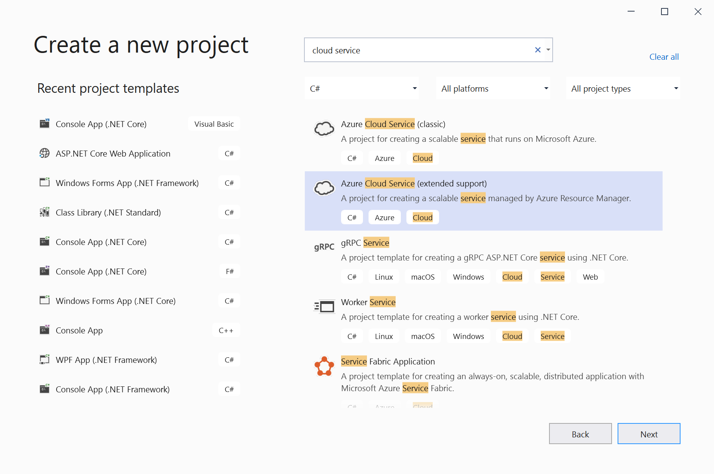
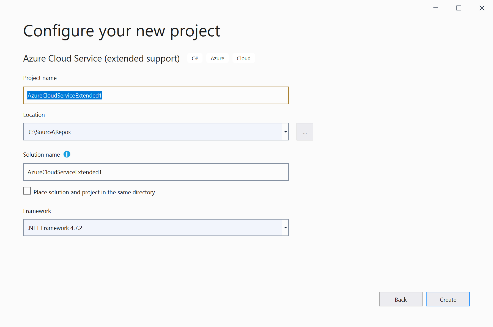
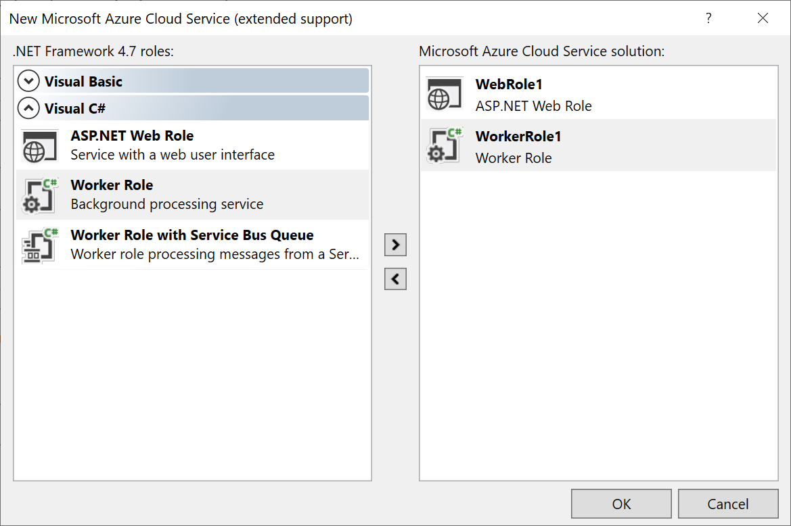
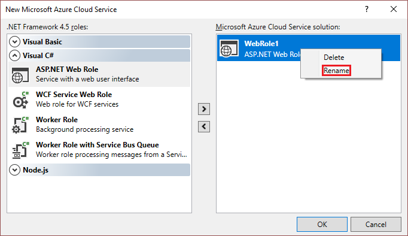
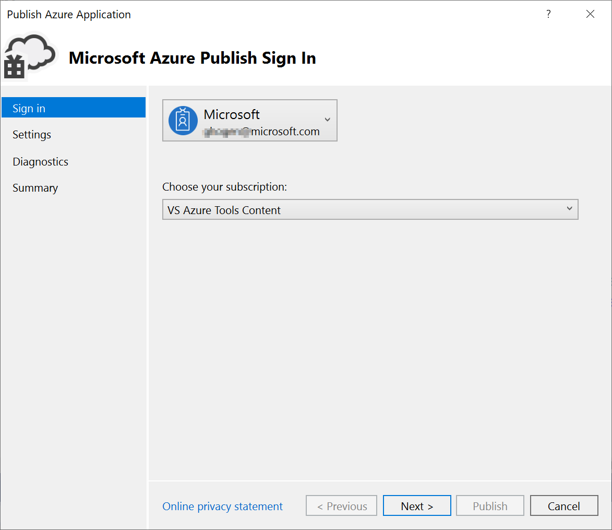
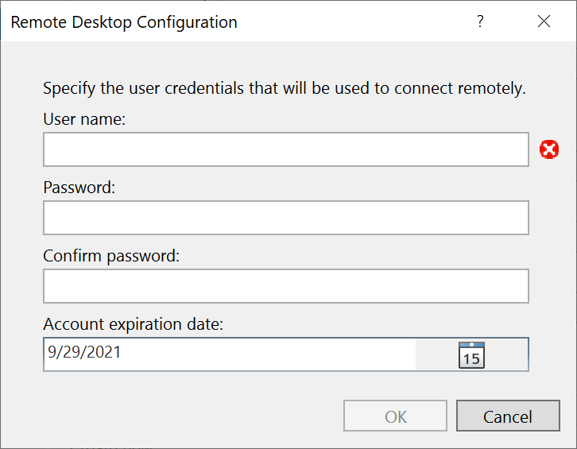
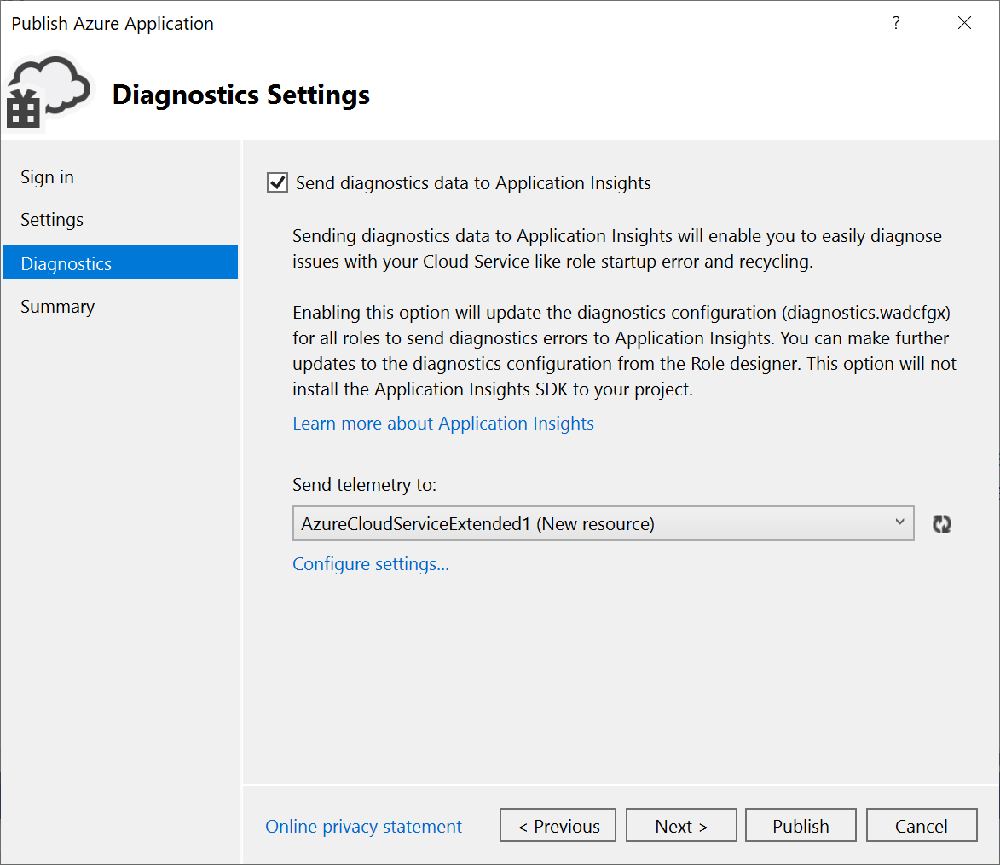
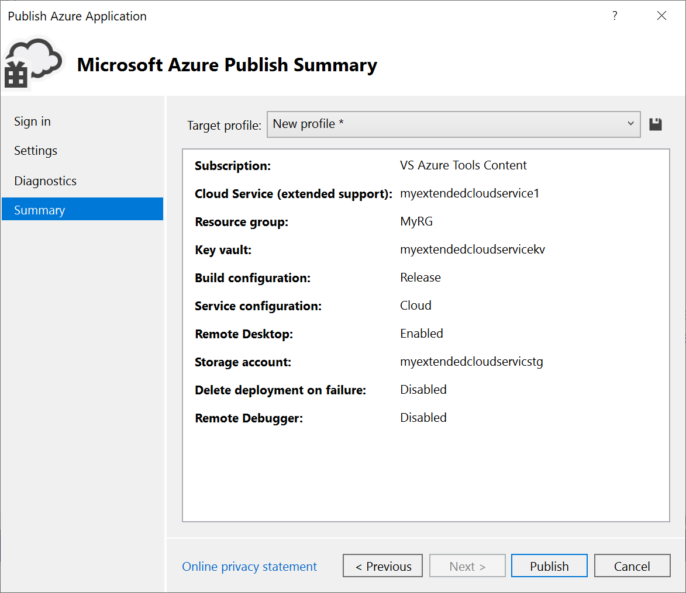

# Create and deploy a Azure Cloud Service (extended support) using Visual Studio

Starting with [Visual Studio 2019 version 16.9](https://visualstudio.microsoft.com/vs/preview/) (currently in preview), you can work with cloud services using Azure Resource Manager (ARM), which greatly simplifies and modernizes maintenance and management of Azure resources. This is enabled by a new Azure service referred to as Cloud Services (extended support). You can publish an existing cloud service to Cloud Services (extended support). For information on this Azure service, see [Cloud Services (extended support) documentation](overview.md).

> [!IMPORTANT]
> Cloud Services (extended support) is currently in public preview.
> This preview version is provided without a service level agreement, and it's not recommended for production workloads. Certain features might not be supported or might have constrained capabilities. 
> For more information, see [Supplemental Terms of Use for Microsoft Azure Previews](https://azure.microsoft.com/support/legal/preview-supplemental-terms/).

## Register the feature for your subscription
Cloud Services (extended support) is currently in preview. Register the feature for your subscription as follows:

```powershell
Register-AzProviderFeature -FeatureName CloudServices -ProviderNamespace Microsoft.Compute
```
For more information see [Prerequisites for deploying Cloud Services (extended support)](deploy-prerequisite.md)

## Create a project

Visual Studio provides a project template that lets you create an Azure Cloud Service with extended support, named **Azure Cloud Service (extended support)**. A Cloud Service is a simple general-purpose Azure service. Once the project has been created, Visual Studio enables you to configure, debug, and deploy the Cloud Service to Azure.

### To create an Azure Cloud Service (extended support) project in Visual Studio

This section walks you through creating an Azure Cloud Service project in Visual Studio with one or more web roles.

1. From the start window, choose **Create a new project**.

1. In the search box, type in *Cloud*, and then choose **Azure Cloud Service (extended support)**.

   

1. Give the project a name and choose **Create**.

   

1. In the **New Microsoft Azure Cloud Service** dialog, select the roles that you want to add, and choose the right arrow button to add them to your solution.

    

1. To rename a role that you've added, hover on the role in the **New Microsoft Azure Cloud Service** dialog, and, from the context menu, select **Rename**. You can also rename a role within your solution (in the **Solution Explorer**) after it has been added.

    

The Visual Studio Azure project has associations to the role projects in the solution. The project also includes the *service definition file* and *service configuration file*:

- **Service definition file** - Defines the run-time settings for your application, including what roles are required, endpoints, and virtual machine size.
- **Service configuration file** - Configures how many instances of a role are run and the values of the settings defined for a role.

For more information about these files, see [Configure the Roles for an Azure Cloud Service with Visual Studio](/visualstudio/azure/vs-azure-tools-configure-roles-for-cloud-service).

## Publish a Cloud Service

1. Create or open an Azure Cloud Service project in Visual Studio.

1. In **Solution Explorer**, right-click the project, and, from the context menu, select **Publish**.

   

1. **Account** - Select an account or select **Add an account** in the account dropdown list.

1. **Choose your subscription** - Choose the subscription to use for your deployment. The subscription you use for deploying Cloud Services (extended support) needs to have Owner or Contributor roles assigned via role-based access control (RBAC). If your subscription does not have any one of these roles, see [Steps to add a role assignment](../role-based-access-control/role-assignments-steps.md) to add this before proceeding further.

1. Choose **Next** to move to the **Settings** page.

   

1. **Cloud service** - Using the dropdown, either select an existing Cloud Service, or select **Create new**, and create a Cloud Service. The data center displays in parentheses for each Cloud Service. It is recommended that the data center location for the Cloud Service be the same as the data center location for the storage account.

   If you choose to create a new Cloud Service, you'll see the **Create Cloud Service (extended support)** dialog. Specify the location and resource group you want to use for the Cloud Service.

   

1. **Build configuration** - Select either **Debug** or **Release**.

1. **Service configuration** - Select either **Cloud** or **Local**.

1. **Storage account** - Select the storage account to use for this deployment, or **Create new** to create a storage account. The region displays in parentheses for each storage account. It is recommended that the data center location for the storage account is the same as the data center location for the Cloud Service (Common Settings).

   The Azure storage account stores the package for the application deployment. After the application is deployed, the package is removed from the storage account.

1. **Key Vault** - Specify the Key Vault that contains the secrets for this Cloud Service. This is enabled if remote desktop is enabled or certificates are added to the configuration.

1. **Enable Remote Desktop for all roles** - Select this option if you want to be able to remotely connect to the service. You'll be asked to specify credentials.

   

1. Choose **Next** to move to the **Diagnostics settings** page.

   

   Diagnostics enables you to troubleshoot an Azure Cloud Service (or Azure virtual machine). For information about diagnostics, see [Configuring Diagnostics for Azure Cloud Services and Virtual Machines](/visualstudio/azure/vs-azure-tools-diagnostics-for-cloud-services-and-virtual-machines). For information about Application Insights, see [What is Application Insights?](../azure-monitor/app/app-insights-overview.md).

1. Choose **Next** to move to the **Summary** page.

   

1. **Target profile** - You can choose to create a publishing profile from the settings that you have chosen. For example, you might create one profile for a test environment and another for production. To save this profile, choose the **Save** icon. The wizard creates the profile and saves it in the Visual Studio project. To modify the profile name, open the **Target profile** list, and then choose **Manage…**.

   > [!Note]
   > The publishing profile appears in Solution Explorer in Visual Studio, and the profile settings are written to a file with an .azurePubxml extension. Settings are saved as attributes of XML tags.

1. Once you configure all the settings for your project's deployment, select **Publish** at the bottom of the dialog. You can monitor the process status in the **Azure Activity Log** output window in Visual Studio.

Congratulations! You've published your extended support Cloud Service project to Azure. To publish again with the same settings, you can reuse the publishing profile, or repeat these steps to create a new one.

## Clean up Azure resources

To clean up the Azure resources you created by following this tutorial, go to the [Azure portal](https://portal.azure.com), choose **Resource groups**, find and open the resource group you used to create the service, and choose **Delete resource group**.

## Next steps

Set up continuous integration (CI) using the **Configure** button on the **Publish** screen. For more information, see [Azure Pipelines documentation](/azure/devops/pipelines).