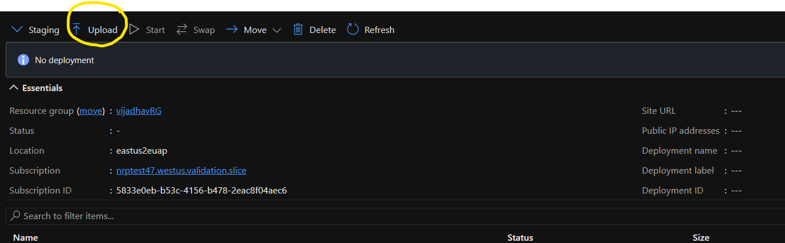
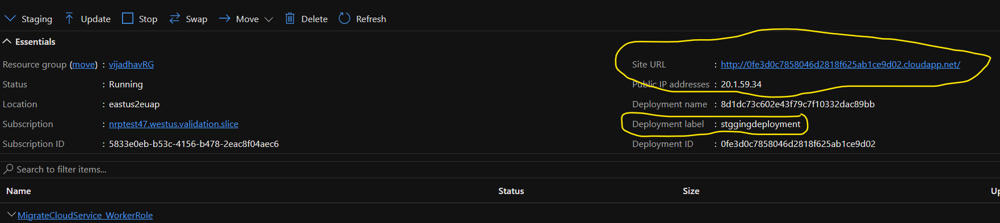
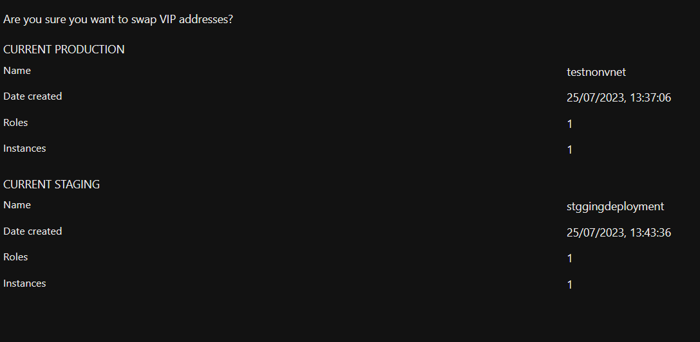
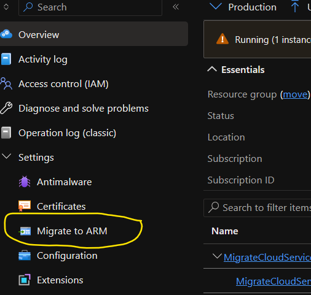

# Migrate cloud services not in a virtual network to a virtual network

Some legacy cloud services are still running without Vnet support. While there's a process for migrating directly through the portal, there are certain considerations that should be made prior to migration. This article walks you through the process of migrating a non Vnet supporting Cloud Service to a Vnet supporting Cloud Service.

## Advantages of this approach

- No required changes in your configurations. Use the same configurations to deploy a staging deployment.
- Your DNS and Public IP address is preserved.
- Less downtime.

## Migration procedure using the Azure portal

1. Create a non vnet classic cloud service in the same region as the vnet you want to migrate to. In the Azure portal, select the 'Staging' drop-down.
    

1. Create a deployment with same configuration as existing deployment by selecting 'Upload' next to the staging drop-down. The platform creates a Default Vnet deployment in staging slot.
    

1. Once staging deployment is created, the URL, IP address, and label populate.
    
The staging deployment has a different Deployment Name, Deployment ID, and Public IP Address different to the production deployment.

1. After verifying the data, select 'Swap' to swap the production and staging deployments.
    
This operation swaps both the deployments. After swapping, you'll find staging deployment in production slot with the DNS and IP address of production deployment with the production deployment will be present in staging slot.

1. You can now safely delete the staging slot.

1. Trigger the Cloud Service Migration Operation.
    

## Next steps
- [Overview of Platform-supported migration of IaaS resources from classic to Azure Resource Manager](../virtual-machines/migration-classic-resource-manager-overview.md)
- Migrate to Cloud Services (extended support) using the [Azure portal](in-place-migration-portal.md)
- Migrate to Cloud Services (extended support) using [PowerShell](in-place-migration-powershell.md)
