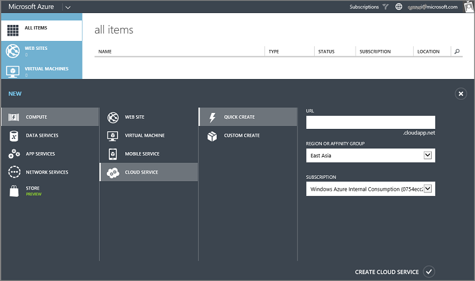
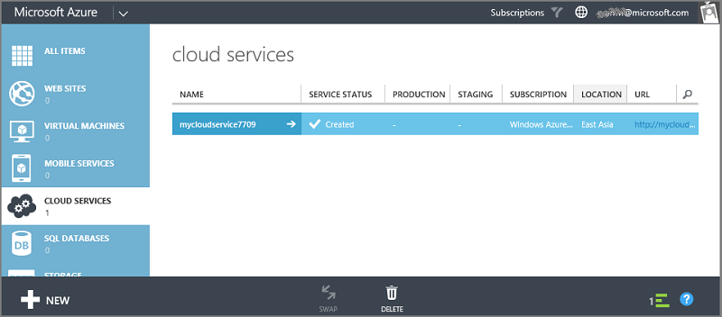
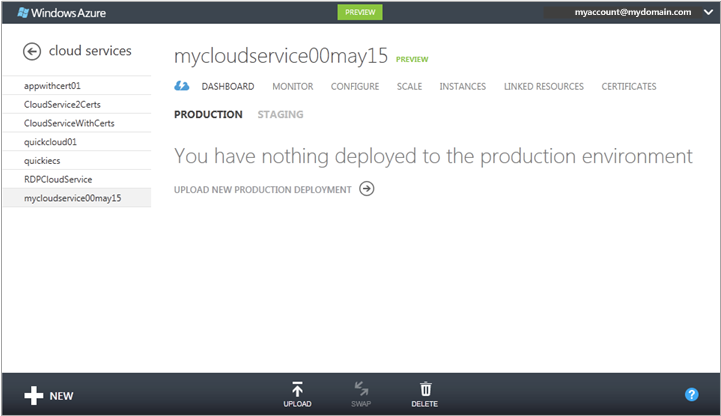
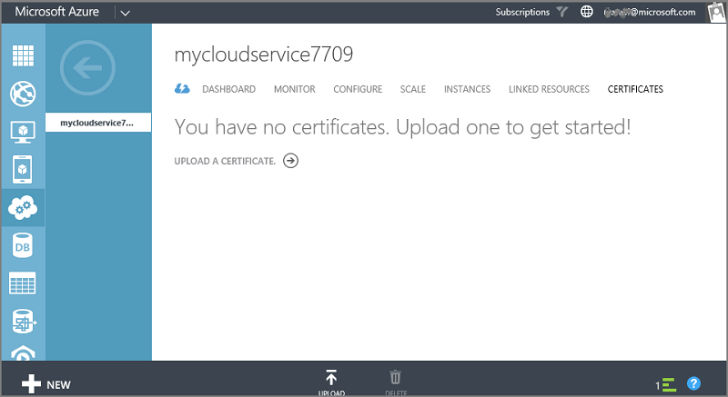
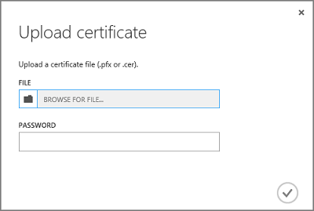
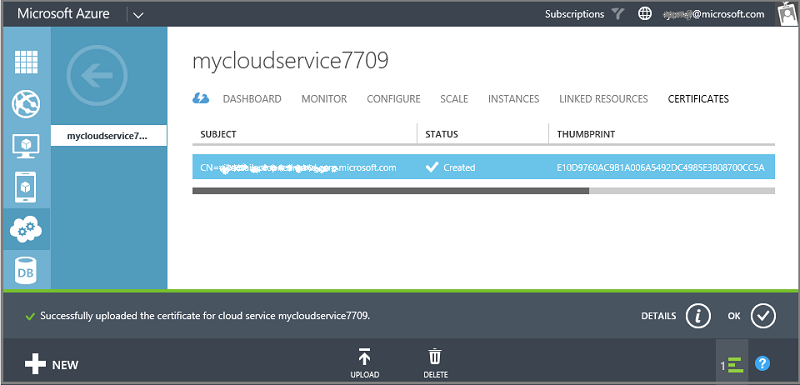
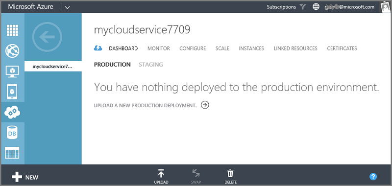
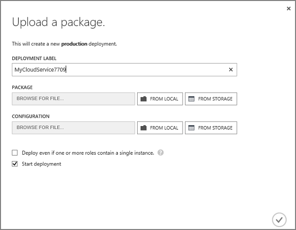
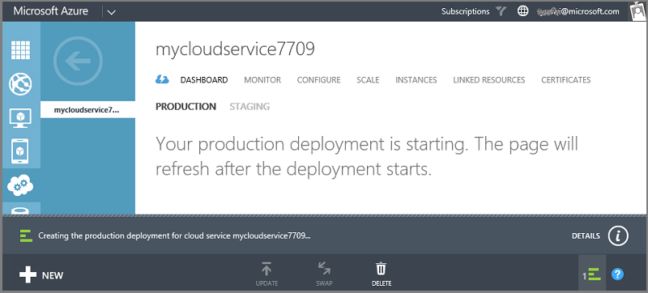
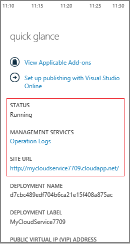

<properties linkid="manage-services-how-to-create-and-deploy-a-cloud-service" urlDisplayName="How to create and deploy" pageTitle="How to create and deploy a cloud service - Azure" metaKeywords="Azure creating cloud service, deleting cloud service" description="Learn how to create and deploy a cloud service using the Quick Create method in Azure." metaCanonical="" services="cloud-services" documentationCenter="" title="How to Create and Deploy a Cloud Service" authors="ryanwi" solutions="" manager="" editor="" />

#How to Create and Deploy a Cloud Service

[WACOM.INCLUDE [disclaimer](../includes/disclaimer.md)]

The Azure Management Portal provides two ways for you to create and deploy a cloud service: **Quick Create** and **Custom Create**. 

This topic explains how to use the Quick Create method to create a new cloud service and then use **Upload** to upload and deploy a cloud service package in Azure. When you use this method, the Azure Management Portal makes available convenient links for completing all requirements as you go. If you're ready to deploy your cloud service when you create it, you can do both at the same time using **Custom Create**. 

**Note**   If you plan to publish your cloud service from Windows Team Foundation Services (TFS), use Quick Create, and then set up TFS publishing from **Quick Start** or the dashboard. For more information, see [Continuous Delivery to Azure by Using Team Foundation Service Preview][TFSTutorialForCloudService], or see help for the **Quick Start** page.

##Table of Contents##

* [Concepts](#concepts)
* [Prepare your app](#prepare)
* [Before you begin](#begin)
* [How to: Create a cloud service using Quick Create](#quick)
* [How to: Upload a certificate for a cloud service](#uploadcertificate)
* [How to: Deploy a cloud service](#deploy)

<h2>Concepts</h2>
Three components are required in order to deploy an application as a cloud service in Azure:

>- **service definition file**   The cloud service definition file (.csdef) defines the service model, including the number of roles.

>- **service configuration file**   The cloud service configuration file (.cscfg) provides configuration settings for the cloud service and individual roles, including the number of role instances.

>- **service package**   The service package (.cspkg) contains the application code and the service definition file.

<h2>Prepare your app</h2>
Before you can deploy a cloud service, you must create the cloud service package (.cspkg) from your application code and a cloud service configuration file (.cscfg). Each cloud service package contains application files and configurations. The service configuration file provides the configuration settings.

The Azure SDK provides tools for preparing these required deployment files. You can install the SDK from the [Azure Downloads](http://www.windowsazure.com/en-us/develop/downloads/) page, in the language in which you prefer to develop your application code.

If you're new to cloud services, you can download a sample cloud service package (.cspkg) and service configuration file (.cscfg) to work with from the [Azure Code Samples](http://code.msdn.microsoft.com/windowsazure/). 

Three cloud service features require special configurations before you export a service package:

- If you want to deploy a cloud service that uses Secure Sockets Layer (SSL) for data encryption, configure your application for SSL. For more information, see [How to Configure an SSL Certificate on an HTTPS Endpoint](http://msdn.microsoft.com/en-us/library/windowsazure/ff795779.aspx).

- If you want to configure Remote Desktop connections to role instances, configure the roles for Remote Desktop. For more information about preparing the service definition file for remote access, see [Overview of Setting Up a Remote Desktop Connection for a Role](http://msdn.microsoft.com/en-us/library/windowsazure/gg433010.aspx).

- If you want to configure verbose monitoring for your cloud service, enable Azure Diagnostics for the cloud service. *Minimal monitoring* (the default monitoring level) uses performance counters gathered from the host operating systems for role instances (virtual machines). "Verbose monitoring* gathers additional metrics based on performance data within the role instances to enable closer analysis of issues that occur during application processing. To find out how to enable Azure Diagnostics, see [Enabling Diagnostics in Azure](http://www.windowsazure.com/en-us/develop/net/common-tasks/diagnostics/).

<h2>Before you begin</h2>

- If you haven't installed the Azure SDK, click **Install Azure SDK** to open the [Azure Downloads page](http://www.windowsazure.com/en-us/develop/downloads/), and then download the SDK for the language in which you prefer to develop your code. (You'll have an opportunity to do this later.)

- If any role instances require a certificate, create the certificates. Cloud services require a .pfx file with a private key. You can upload the certificates to Azure as you create and deploy the cloud service. For information about creating certificates, see [How to Configure an SSL Certificate on an HTTPS Endpoint](http://msdn.microsoft.com/en-us/library/windowsazure/ff795779.aspx).

- If you plan to deploy the cloud service to an affinity group, create the affinity group. You can use an affinity group to deploy your cloud service and other Azure services to the same location in a region. You can create the affinity group in the **Networks** area of the Management Portal, on the **Affinity Groups** page. For more information, see help for the **Affinity Groups** page.

<h2>How to: Create a cloud service using Quick Create</h2>

1. In the [Management Portal](http://manage.windowsazure.com/), click **New**, click **Cloud Service**, and then click **Quick Create**.

	

2. In **URL**, enter a subdomain name to use in the public URL for accessing your cloud service in production deployments. The URL format for production deployments is: http://*myURL*.cloudapp.net.

3. In **Region/Affinity Group**, select the geographic region or affinity group to deploy the cloud service to. Select an affinity group if you want to deploy your cloud service to the same location as other Azure services within a region.

	> [WACOM.NOTE]
	> To create an affinity group, open the **Networks** area of the Management Portal, click **Affinity Groups**, and then click either **Create a new affinity group** or **Create**. You can use affinity groups that you created in the earlier Azure Management Portal. And you can create and manage affinity groups using the Azure Service Management API. For more information, see [Operations on Affinity Groups](http://msdn.microsoft.com/en-us/library/windowsazure/ee460798.aspx).

4. Click **Create Cloud Service**.

	You can monitor the status of the process in the message area at the bottom of the window.

	The **Cloud Services** area opens, with the new cloud service displayed. When the status changes to Created, cloud service creation has completed successfully.

	

	If any roles in the cloud service require a certificate for Secure Sockets Layer (SSL) data encryption, and the certificate has not been uploaded to Azure, you must upload the certificate before you deploy the cloud service. After you upload a certificate, any Windows applications that are running in the role instances can access the certificate.

<h2>How to: Upload a certificate for a cloud service</h2>

1. In the [Management Portal](http://manage.windowsazure.com/), click **Cloud Services**. Then click the name of the cloud service to open the dashboard.

	

2. Click **Certificates** to open the **Certificates** page, shown below.

	

3. Click either **Add new certificate** or **Upload**.
 **Add a Certificate** opens.

	

4. In **Certificate file**, use **Browse** to select the certificate (.pfx file) to use.

5. In **Password**, enter the private key for the certificate.

6. Click OK (checkmark).

	You can watch the progress of the upload in the message area, shown below. When the upload completes, the certificate is added to the table. In the message area, click the down arrow to close the message, or click X to remove the message.

	

	You can deploy your cloud service from the dashboard or from **Quick Start**.

<h2>How to: Deploy a cloud service</h2>

1. In the [Management Portal](http://manage.windowsazure.com/), click **Cloud Services**. Then click the name of the cloud service to open the dashboard.

2. Click **Quick Start** (the icon to the left of **Dashboard**) to open the **Quick Start** page, shown below. (You can also deploy your cloud service by using **Upload** on the dashboard.)

	

3. If you haven't installed the Azure SDK, click **Install Azure SD**K to open the [Azure Downloads page](http://www.windowsazure.com/en-us/develop/downloads/), and then download the SDK for the language in which you prefer to develop your code.

	On the downloads page, you can also install client libraries and source code for developing web apps in Node.js, Java, PHP, and other languages, which you can deploy as scalable Azure cloud services.

	> [WACOM.NOTE]
	> For cloud services created earlier (known earlier as *hosted services*), you'll need to make sure the guest operating systems on the virtual machines (role instances) are compatible with the Azure SDK version you install.  For more information, see the [Azure SDK release notes](http://msdn.microsoft.com/en-us/library/windowsazure/hh552718.aspx).

4. Click either **New Production Deployment** or **New Staging Deployment**. 

	If you'd like to test your cloud service in Azure before deploying it to production, you can deploy to staging. In the staging environment, the cloud service's globally unique identifier (GUID) identifies the cloud service in URLs (*GUID*.cloudapp.net). In the production environment, the friendlier DNS prefix that you assign is used (for example, *myservice*.cloudapp.net). When you're ready to promote your staged cloud service to production, use **Swap** to redirect client requests to that deployment.

	When you select a deployment environment, **Upload a Package** opens.

	
 
5. In **Deployment name**, enter a name for the new deployment - for example, MyCloudServicev1.

6. In **Package**, use **Browse** to select the service package file (.cspkg) to use.

7. In **Configuration**, use **Browse** to select the service configure file (.cscfg) to use.

8. If the cloud service will include any roles with only one instance, select the **Deploy even if one or more roles contain a single instance** check box to enable the deployment to proceed.

 Azure can only guarantee 99.95 percent access to the cloud service during maintenance and service updates if every role has at least two instances. If needed, you can add additional role instances on the **Scale** page after you deploy the cloud service. For more information, see [Service Level Agreements](http://www.windowsazure.com/en-us/support/legal/sla/).

9. Click OK (checkmark) to begin the cloud service deployment.

	You can monitor the status of the deployment in the message area. Click the down arrow to hide the message.

	

###To verify that your deployment completed successfully###

1. Click **Dashboard**.

2. Under **quick glance**, click the site URL to open your cloud service in a web browser.

[TFSTutorialForCloudService]: http://go.microsoft.com/fwlink/?LinkID=251796&clcid=0x409

	

