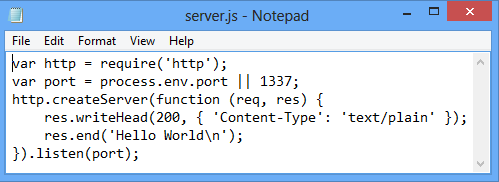

<properties urlDisplayName="Cloud Service" pageTitle="Node.js Getting Started Guide - Azure Tutorial" metaKeywords="Azure node.js getting started, Azure Node.js tutorial, Azure Node.js tutorial" description="An end-to-end tutorial that helps you develop a simple Node.js web application and deploy it to Azure." metaCanonical="" services="cloud-services" documentationCenter="nodejs" title="Build and deploy a Node.js application to an Azure Cloud Service" authors="larryfr" solutions="" manager="wpickett" editor="" />

<tags ms.service="cloud-services" ms.workload="tbd" ms.tgt_pltfrm="na" ms.devlang="nodejs" ms.topic="article" ms.date="09/17/2014" ms.author="wpickett" />

# Build and deploy a Node.js application to an Azure Cloud Service

On completing this guide, you will have a simple Node.js application running 
in an Azure Cloud Service. Cloud Services are the building blocks of 
scalable cloud applications in Azure. They allow the separation and independent
management and scale-out of front-end and back-end components of your application.  Cloud Services 
provide a robust dedicated virtual machine for hosting each role reliably.

For more information on Cloud Services, and how they compare to Azure Websites and Virtual machines, see [Azure Websites, Cloud Services and Virtual Machines comparison](http://azure.microsoft.com/en-us/documentation/articles/choose-web-site-cloud-service-vm/).

<strong>Looking to build a simple website?</strong>

If your scenario involves just a simple website front-end, consider <a href="/en-us/documentation/articles/web-sites-nodejs-develop-deploy-mac/">using a lightweight Azure Website.</a> You can easily upgrade to a Cloud Service as your website grows and your requirements change.

 

By following this tutorial, you will build a simple web application hosted inside a web role. You
will use the compute emulator to test your application locally and then you will deploy it
using PowerShell command-line tools.

A screenshot of the completed application is below:

## Creating a New Node Application

Perform the following tasks to create a new Azure Cloud Service project, along with basic Node.js scaffolding:

1. From the **Start Menu** or **Start Screen**, search for **Azure PowerShell**. Finally, right-click **Azure PowerShell** and select **Run As Administrator**.

	![Azure PowerShell icon][powershell-menu]

	[WACOM.INCLUDE [install-dev-tools](../includes/install-dev-tools.md)]

2.  Create a new **node** directory on your C drive, and change to the c:\\node directory:
	
	![A command prompt displaying the commands 'mkdir c:\\node' and 'cd node'.][mkdir]

3.  Enter the following cmdlet to create a new solution:

        PS C:\node> New-AzureServiceProject helloworld

    	You will see the following response:

	

	The **New-AzureServiceProject** cmdlet generates a basic structure for creating a new Azure Node application which will be published to a Cloud Service. It contains configuration files necessary for publishing to Azure. The cmdlet also changes your working directory to the directory for the service.

	The files created by the **New-AzureServiceProject** cmdlet are:

	-   **ServiceConfiguration.Cloud.cscfg**,
        **ServiceConfiguration.Local.cscfg** and **ServiceDefinition.csdef** are
        Azure-specific files necessary for publishing your
        application.
		
	For more information about these files, see
        [Overview of Creating a Hosted Service for Azure][].

	-   **deploymentSettings.json** stores local settings that are used by
        the Azure PowerShell deployment cmdlets.

4.  Enter the following command to add a new web role using the
    **Add-AzureNodeWebRole cmdlet**:

        PS C:\node\helloworld> Add-AzureNodeWebRole

	You will see the following response:

	

	The **Add-AzureNodeWebRole** cmdlet creates a new directory for your application and generates scaffolding for a basic Node.js application. It also modifies the **ServiceConfiguration.Cloud.csfg**, **ServiceConfiguration.Local.csfg**, and **ServiceDefinition.csdef** files created in the previous step to add configuration entries for the new role.

	

	<b>Note</b>
	
By default if you do not provide a role name, one will be created for you. You can provide a name as the first parameter to <b>Add-AzureNodeWebRole</b>. For example, <code>Add-AzureNodeWebRole MyRole</code>

	

5.  Use the following commands to navigate to the **WebRole1** directory, and then open the the **server.js** file in notepad. 

	PS C:\\node\\helloworld> cd WebRole1
        PS C:\node\helloworld\WebRole1> notepad server.js

	The **server.js** file was created by the **Add-AzureNodeWebRole** cmdlet, and contains the following starter code. This code is similar to the "Hello World" sample on the [nodejs.org][] website, except:

   	-   The port has been changed to allow the application to find the 
        correct port assigned to it by the cloud environment.
   	-   Console logging has been removed.

	

## Running Your Application Locally in the Emulator

One of the tools installed by the Azure SDK is the Azure
compute emulator, which allows you to test your application locally. The
compute emulator simulates the environment your application will run in
when it is deployed to the cloud. Perform the following steps to test the application in the emulator.

1.  Close Notepad and switch back to the Windows PowerShell window.
  	Enter the following cmdlet to run your service in the emulator:

        PS C:\node\helloworld\WebRole1> Start-AzureEmulator -Launch

	The **-Launch** parameter specifies that the tools should automatically open a browser window and display the application once it is running in the emulator. A browser opens and displays "Hello World," as shown in the screenshot below. This indicates that the service is running in the compute emulator and is working correctly.

	

2.  To stop the compute emulator, use the **Stop-AzureEmulator** command:
	
	PS C:\node\helloworld\WebRole1> Stop-AzureEmulator

## Deploying the Application to Azure

	[WACOM.INCLUDE [create-account-note](../includes/create-account-note.md)]

###Downloading the Azure Publishing Settings

In order to deploy your application to Azure, you must first download the publishing settings for your Azure subscription. The following steps guide you through this process:

1.  From the Windows PowerShell window, launch the download page by running the following cmdlet:

        PS C:\node\helloworld\WebRole1> Get-AzurePublishSettingsFile

	This will use your browser to navigate to the publish settings download page. You may be prompted to log in with a Microsoft Account. If so, use the account associated with your Azure subscription.

	Save the downloaded profile to a file location you can easily access.

2.  In the Azure PowerShell window, use the following cmdlet to configure the Windows PowerShell for Node.js cmdlets to use the Azure publishing profile you downloaded:

        PS C:\node\helloworld\WebRole1> Import-AzurePublishSettingsFile [path to file]

	

	<b>Note</b>
	
After importing the publish settings, consider deleting the downloaded .publishSettings file as it contains information that can be used by others to access your account.

	

    

### Publishing the Application

1.  Publish the application using the **Publish-AzureServiceProject** cmdlet,
    as shown below.

        PS C:\node\helloworld\WebRole1> Publish-AzureServiceProject -ServiceName NodeHelloWorld -Location "East US" -Launch

	- The **servicename** parameter specifies the name used for this deployment. This must be a unique name otherwise the publish process will fail.

	- The **location** parameter specifies the datacenter that the application will be hosted in. To see a list of available datacenters, use the **Get-AzureLocation** cmdlet.

	- The **launch** parameter will launch your browser and navigate to the hosted service after deployment has completed.

	After publishing succeeds, you will see a response similar to the following:

	

	The **Publish-AzureServiceProject** cmdlet performs the following steps:

1.  Creates a package that will be deployed to Azure. The package contains all the files in your node.js application folder.

2.  Creates a new **storage account** if one does not exist. The Azure storage account is used to store the application package during deployment. You can safely delete the storage account after deployment is done.

3.  Creates a new **cloud service** if one does not already exist. A **cloud service** is the container in which your application is hosted when it is deployed to Azure. For more information, see [Overview of Creating a Hosted Service for Azure][].

4.  Publishes the deployment package to Azure.

	> [AZURE.NOTE]
	> It can take 5 - 7 minutes for the application to deploy and become available when first published.

	Once the deployment has completed, a browser window will open and navigate to the cloud service.

	

	Your application is now running on Azure!

## Stopping and Deleting Your Application

After deploying your application, you may want to disable it so you can avoid extra costs. Azure bills web role instances per hour of server time consumed. Server time is consumed once your application is deployed, even if the instances are not running and are in the stopped state.

1.  In the Windows PowerShell window, stop the service deployment created in the previous section with the following cmdlet:

        PS C:\node\helloworld\WebRole1> Stop-AzureService

	Stopping the service may take several minutes. When the service is stopped, you receive a message indicating that it has stopped.

	

2.  To delete the service, call the following cmdlet:

        PS C:\node\helloworld\WebRole1> Remove-AzureService

	When prompted, enter **Y** to delete the service.

	Deleting the service may take several minutes. After the service has been deleted you receive a message indicating that the service was deleted.

	

	

	<strong>Note</strong>
	
Deleting the service does not delete the storage account that was created when the service was initially published, and you will continue to be billed for storage used. For more information on
deleting a storage account, see <a href="http://msdn.microsoft.com/en-us/library/windowsazure/hh531562.aspx">How to Delete a Storage Account from an Azure Subscription</a>.

[The Windows Start menu with the Azure SDK Node.js entry expanded]: ./media/cloud-services-nodejs-develop-deploy-app/azure-powershell-menu.png
[mkdir]: ./media/cloud-services-nodejs-develop-deploy-app/getting-started-6.png
[nodejs.org]: http://nodejs.org/
[A directory listing of the helloworld folder.]: ./media/cloud-services-nodejs-develop-deploy-app/getting-started-7.png
[Overview of Creating a Hosted Service for Azure]: http://msdn.microsoft.com/en-us/library/windowsazure/jj155995.aspx
[A directory listing of the WebRole1 folder]: ./media/cloud-services-nodejs-develop-deploy-app/getting-started-8.png
[The menu displayed when right-clicking the Azure emulator from the task bar.]: ./media/cloud-services-nodejs-develop-deploy-app/getting-started-11.png
[A browser window displaying http://www.windowsazure.com/ with the Free Trial link highlighted]: ./media/cloud-services-nodejs-develop-deploy-app/getting-started-12.png
[A browser window displaying the liveID sign in page]: ./media/cloud-services-nodejs-develop-deploy-app/getting-started-13.png
[Internet Explorer displaying the save as dialog for the publishSettings file.]: ./media/cloud-services-nodejs-develop-deploy-app/getting-started-14.png

[The full status output of the Publish-AzureService command]: ./media/cloud-services-nodejs-develop-deploy-app/node20.png
[How to Delete a Storage Account from an Azure Subscription]: https://www.windowsazure.com/en-us/manage/services/storage/how-to-manage-a-storage-account/
[powershell-menu]: ./media/cloud-services-nodejs-develop-deploy-app/azure-powershell-start.png
