<properties 
	pageTitle="Node.js deploying with Cloud9 - Azure tutorial" 
	description="Learn how to use Cloud9 IDE to develop, build, and deploy a Node.js application to Azure." 
	services="cloud-services" 
	documentationCenter="nodejs" 
	authors="MikeWasson" 
	manager="wpickett" 
	editor=""/>

<tags 
	ms.service="cloud-services" 
	ms.workload="tbd" 
	ms.tgt_pltfrm="na" 
	ms.devlang="nodejs" 
	ms.topic="article" 
	ms.date="02/25/2015" 
	ms.author="mwasson"/>

# Deploying an Azure App from Cloud9

This tutorial describes how to use Cloud9 IDE to develop, build, and
deploy a Node.js application to Azure.

In this tutorial you will learn how to:

-   Create a Cloud9 IDE project
-   Deploy the project to Azure
-   Update an existing Azure deployment
-   Move projects between staging and production deployments

[Cloud9 IDE][] provides a cross-platform, browser-based development
environment. One of the features Cloud9 supports for Node.js projects is
that you can directly deploy to Azure from within the IDE.
Cloud9 also integrates with the GitHub and BitBucket repository
services, so it's easy to share your project with others.

Using Cloud9, you can develop and deploy an application to Azure
from many modern browsers and operating systems, without having to
install additional development tools or SDKs locally. The steps below
are demonstrated using Google Chrome on a Mac.

## Signup

To use Cloud9, you first need to visit their website and [register for a
subscription][Cloud9 IDE]. You can sign in with either an existing
GitHub or BitBucket account, or create a Cloud9 account. A free
subscription offering is available, as well as a paid offering which
provides more features. For more information, see [Cloud9 IDE][].

## Create a Node.js Project

1.  Sign in to Cloud9, click the **+** symbol beside **My Projects**,
    and then select **Create a new project**.

	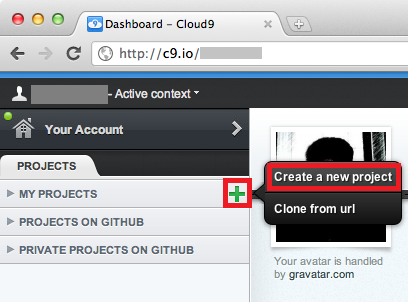

2.  In the **Create a new project** dialog, enter a project name,
    access, and project type. Click **Create** to create the project.

	

	> [AZURE.NOTE] Some options require a paid Cloud9 plan.
	   
	> [AZURE.NOTE] The project name of your Cloud9 project is not used when deploying to Azure.

3.  After the project has been created, click **Start Editing**. If this is the first time you have used the Cloud9 IDE, you will be offered the option to take a tour of the service. If you wish to skip the tour and view it at a later date, select **Just the editor,please**.

	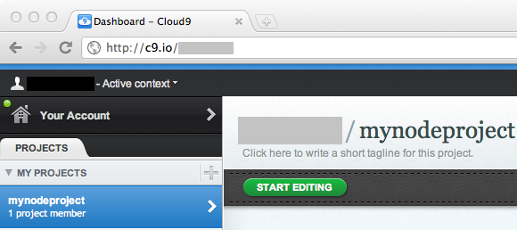

4.  To create a new Node application, select **File** and then **New
    File**.

	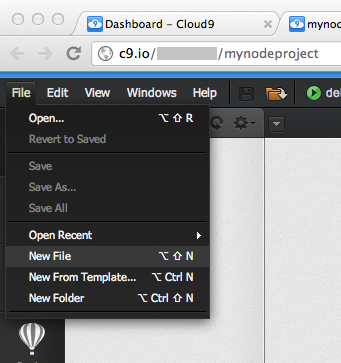

5.  A new tab titled **Untitled1** will be displayed. Enter the
    following code on the **Untitled1** tab to create the Node
    application:

        var http = require('http');
        var port = process.env.PORT;
        http.createServer(function(req,res) {
            res.writeHead(200, { 'Content-Type': 'text/plain' });
            res.end('hello azure\n');
        }).listen(port);
	
	> [AZURE.NOTE] Using process.env.PORT ensures that the application picks up the correct port whether ran in the Cloud9 debugger or when deployed to Azure.

6.  To save the code, select **File** and then **Save as**. In the
    **Save As** dialog, enter **server.js** as the file name, and then
    click **Save**.

	> [AZURE.NOTE] You may notice a warning symbol indicating that the req variable is unused. You may safely ignore this warning.

	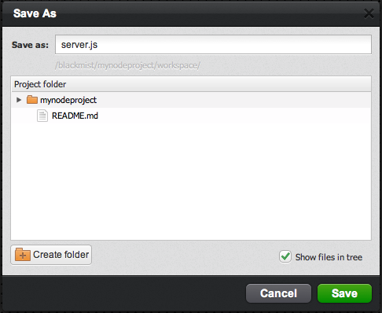

## Run the Application

> [AZURE.NOTE] While the steps provided in this section are sufficient for a Hello World application, for applications that use external modules you may need to select a specific version of Node.js for the debug environment. To do this, select **Configure...** from the debug dropdown, and then select the specific version of Node.js. For example, you may receive authentication errors when using the 'azure' module if you do not have Node.js 0.6.x selected.

1.  Click **Debug** to run the application in the Cloud9 debugger.
	
	

2.  An output window will be displayed. Click on the URL listed to
    access your application through a browser window.

	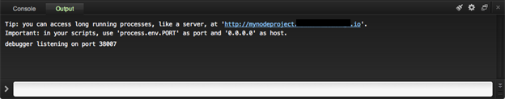

	The resulting application will look as follows:

	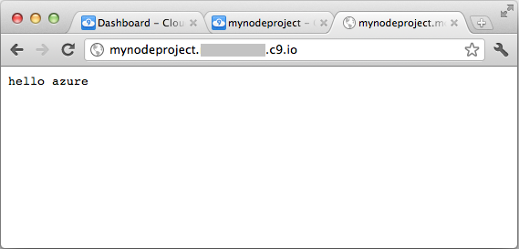

3.  To stop debugging the application, click **stop**.

## Create an Azure Account

To deploy your application to Azure, you need an account. If you
do not already have an Azure account, you can sign up for a free
trial by following these steps:

[AZURE.INCLUDE [create-azure-account](../includes/create-azure-account.md)]

## Create a Deployment

1.  To create a new deployment, select **Deploy**, and then click **+** to create a deploy server.

    ![create a new deployment][create a new deployment]

2.  In the **Add a deploy target** dialog, enter a deployment name and then select **Azure** in the **Choose type** list. The deployment name you specify will be used to identify the deployment within Cloud9; it will not correspond to a deployment name within Azure.

3.  If this is the first time you have created a Cloud9 deployment that uses Azure, you must configure your Azure publish settings. Perform the following steps to download and install these settings into the Cloud9:

    1.  Click **Download Azure Settings**.

        

        This will open the Azure Management Portal and prompt you to download the Azure publishing settings. You will be required to log in to your Azure account before you can begin.

    2.  Save the publishing settings file to your local drive.

    3.  In the **Add a deploy target** dialog, select **Choose File**,
        and then select the file downloaded in the previous step.

    4.  After selecting the file, click **Upload**.

4.  Click **+ Create new** to create a new hosted service. A *hosted service* is the container in which your application is hosted when it is deployed to Azure. For more information, see [Overview of Creating a Hosted Service for Azure][].

	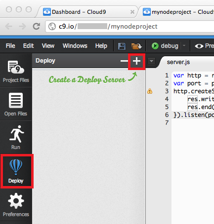

5.  You will be prompted for the name of the new hosted service and configuration options such as the number of instances, host OS, and data center. The deployment name specified will be used as the hosted service name in Azure. This name must be unique within the Azure system.
	
	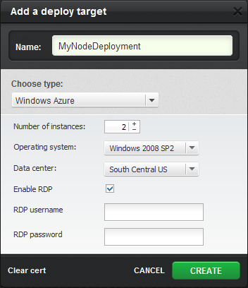

	> [AZURE.NOTE] In the **Add a deploy target** dialog, any existing Azure hosted services will be listed under the **Choose existing deployment** section; selecting an existing hosted service will result in this project being deployed to that service.

	> [AZURE.NOTE] Selecting **Enable RDP** and providing a username and password will enable remote desktop for your deployment.

## Deploy to the Azure Production Environment

1.  Select the deployment you created in the previous steps. A dialog
    will appear that provides information about this deployment, as well
    as the production URL that will be used after deployment to Windows
    Azure.

	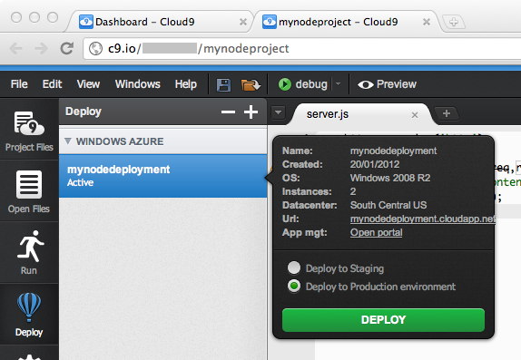

2.  Select **Deploy to Production environment**.

3.  Click **Deploy** to begin deployment.

4.  If this is the first time you have deployed this project to Azure, you will receive an error of **'No web.config found'**. Select **Yes** to create the file. This will add a 'Web.cloud.config' file to your project.
	
	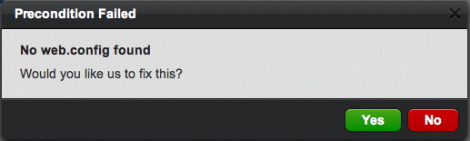

5.  If this is the first time you have deployed this project to Azure, you will receive an error of **'No 'csdef' file present'**. Select **Yes** to create the .csdef file. This will add a'ServiceDefinition.csdef' file to your project.    ServiceDefinition.csdef is an Azure-specific files necessary for publishing your application. For more information, see [Overview of Creating a Hosted Service for Azure][].

6.  You will be prompted to select the instance size for this application. Select **Small**, and then click **Create**. For more details about Azure VM sizes, see [How to Configure Virtual Machine Sizes][].

	

7.  The deployment entry will display the status of the deployment process. Once complete, the deployment will display as **Active**.

	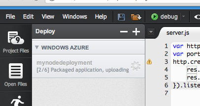

	> [AZURE.NOTE] Projects deployed through the Cloud 9 IDE are assigned a GUID as the deployment name in Azure.

8.  The deployment dialog includes a link to the production URL. When the deployment is complete, click the URL to browse to your application running in Azure.

	

## Update the Application

When you make changes to your application, you can use Cloud9 to deploy the updated application to the same Azure hosted service.

1.  In the server.js file, update your code so that "hello azure v2" is printed to the screen. You can replace the existing code with the following updated code:

        var http = require('http');
        var port = process.env.PORT;
        http.createServer(function(req,res) {
            res.writeHead(200, { 'Content-Type': 'text/plain' });
            res.end('hello azure v2\n');
        }).listen(port);

2.  To save the code, select **File** and then **Save**.

## Deploy the update to the Azure Staging Environment

1.  Select **Deploy to Staging**.

2.  Click **Deploy** to begin deployment.

	Each Azure hosted service supports two environments, staging and production. The staging environment is exactly like the production environment, except that you can only access the staged application with an obfuscated, GUID-based URL that is generated by Azure. You can use the staging environment to test your application, and after verifying changes you can move the staging version into production by performing a virtual IP (VIP) swap, as described later in this tutorial.

3.  When your application is deployed to staging, the guid-based staging URL will be displayed in the Console output, as shown in the screenshot below. Click the URL to open your staged application in a browser.

	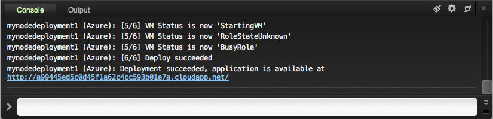

## Move the Update to Production using VIP Swap

When a service is deployed to either the production or staging
environments, a virtual IP address (VIP), is assigned to the service in
that environment. When you want to move a service from the staging
environment to the production environment, you can do so without
redeploying by doing a VIP Swap, which swaps the staging and production
deployments. A VIP swap puts your tested, staged application into
production with no downtime in the production environment. For more
details, see [Overview of Managing Deployments in Azure.][]

1.  In the deploy dialog, click on the **Open portal** link to open the
    Azure Management Portal.

	![Link from deploy dialog to Azure Management Portal][Link from deploy dialog to Azure Management Portal]

2.  Sign in to the portal with your credentials.

3.  On the left of the web page, select **Hosted Services, Storage
    Accounts & CDN**, and then click **Hosted Services**.

	![Azure Management Portal][Azure Management Portal]

	The results pane shows the hosted service with the name you specified in Cloud9, and two deployments, one with the    **Environment** value **Staging**, the second **Production**.

4.  To perform the VIP Swap, select the hosted service, and then click **Swap VIP** in the ribbon.

	

5.  Click **OK** in the Swap VIPs dialog that appears.

6.  Browse to your production application. You will see that the version of the application previously deployed to stage is now in production.

	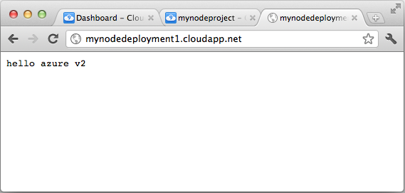

## Using Remote Desktop

If you enabled RDP and specified a username and password when creating your deployment, you can use Remote Desktop to connect to your Hosted Service by selecting a specific instance, and then selecting Connect on
the ribbon.

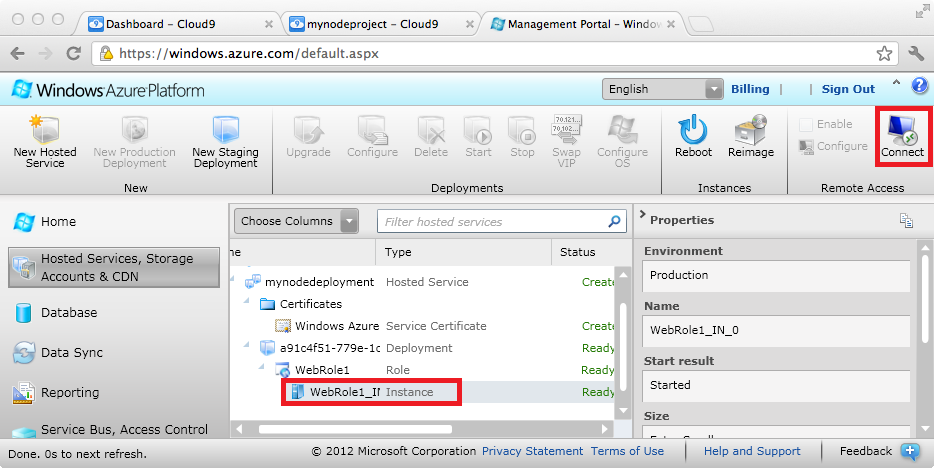

When you click Connect, you will be prompted to open or download a .RDP file. This file contains the information required to connect to your remote desktop session. Running this file on a Windows system will prompt you for the username and password you entered when creating your deployment, and will then connect you to the desktop of the selected
instance.

> [AZURE.NOTE] The .RDP file to connect to the hosted instance of your application will only work with the Remote Desktop application on
WIndows.

## Stop and Delete the Application

Azure bills role instances per hour of server time consumed, and server time is consumed while your application is deployed, even if the instances are not running and are in the stopped state. In addition,
server time is consumed by both production and stage deployments.

Cloud9 focuses on providing an IDE and does not provide a direct method of stopping or deleting an application once it has been deployed to Azure. In order to delete an application hosted in Azure, perform the following steps:

1.  In the deploy dialog, click on the **Open portal** link to open the Azure Management Portal.

	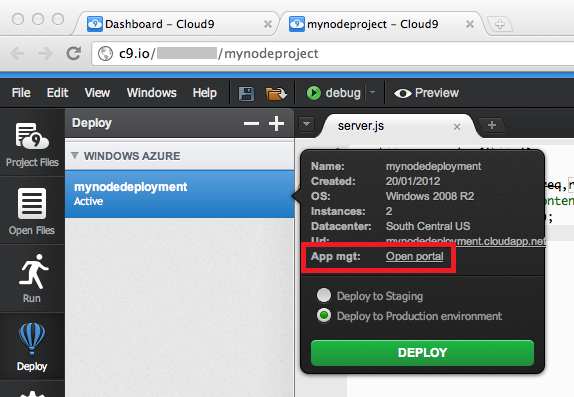

2.  Sign in to the portal with your credentials.

3.  On the left of the web page, select **Hosted Services, Storage Accounts & CDN**, and then click **Hosted Services**.

4.  Select the staging deployment (indicated by the **Environment** value). Click **Delete** in the ribbon to delete the application.

	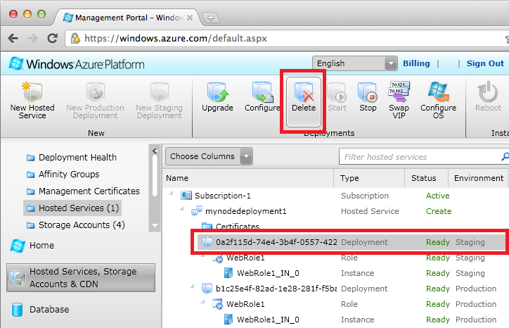

5.  Select the production deployment, and click **Delete** to delete that application as well.

## Additional Resources

-   [Cloud9 documentation][]

  [Cloud9 IDE]: http://cloud9ide.com/ 
  [Overview of Creating a Hosted Service for Azure]: http://msdn.microsoft.com/library/windowsazure/jj155995.aspx
  [How to Configure Virtual Machine Sizes]: http://msdn.microsoft.com/library/windowsazure/ee814754.aspx
  [Overview of Managing Deployments in Azure.]: http://msdn.microsoft.com/library/windowsazure/gg433027.aspx
  [Cloud9 documentation]: http://go.microsoft.com/fwlink/?LinkId=241421&clcid=0x409
