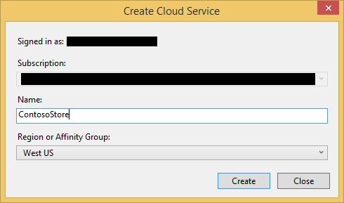
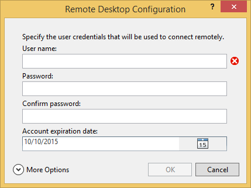

<properties
	pageTitle="Python web and worker roles with Python Tools 2.2 for Visual Studio | Microsoft Azure"
	description="Overview of using Python Tools for Visual Studio to create Azure cloud services including web roles and worker roles."
	services="cloud-services"
	documentationCenter="python"
	authors="thraka"
	manager="wpickett"
	editor=""/>

<tags
	ms.service="cloud-services"
	ms.workload="tbd"
	ms.tgt_pltfrm="na"
	ms.devlang="python"
	ms.topic="hero-article"
	ms.date="08/30/2015"
	ms.author="adegeo"/>

# Python web and worker roles with Python Tools 2.2 for Visual Studio

This article provides an overview of using Python web and worker roles using [Python Tools for Visual Studio][].

## Prerequisites

 - Visual Studio 2013 or 2015
 - [Python Tools 2.2 for Visual Studio][] (PTVS)
 - [Azure SDK Tools for VS 2013][] or [Azure SDK Tools for VS 2015][]
 - [Python 2.7 32-bit][] or [Python 3.4 32-bit][]

[AZURE.INCLUDE [create-account-and-websites-note](../includes/create-account-and-websites-note.md)]

## What are Python web and worker roles?

Azure provides three compute models for running applications: [Web Apps feature in Azure App Service][execution model-web sites], [Azure Virtual Machines][execution model-vms], and [Azure Cloud Services][execution model-cloud services]. All three models support Python. Cloud Services, which include web and worker roles, provide *Platform as a Service (PaaS)*. Within a cloud service, a web role provides a dedicated Internet Information Services (IIS) web server to host front-end web applications, while a worker role can run asynchronous, long-running or perpetual tasks independent of user interaction or input.

For more information, see [What is a Cloud Service?].

> [AZURE.NOTE] *Looking to build a simple website?*
If your scenario involves just a simple website front-end, consider using the lightweight Web Apps feature in Azure App Service. You can easily upgrade to a Cloud Service as your website grows and your requirements change. See the <a href="/develop/python/">Python Developer Center</a> for articles that cover development of the Web Apps feature in Azure App Service.
 

## Project creation

In Visual Studio, you can select **Azure Cloud Service** in the **New Project** dialog box, under **Python**.

In the Azure Cloud Service wizard, you can create new web and worker roles.

The worker role template comes with boilerplate code to connect to a Azure storage account or Azure Service Bus.

You can add web or worker roles to an existing cloud service at any time.  You can choose to add existing projects in your solution, or create new ones.

Your cloud service can contain roles implemented in different languages.  For example, you can have a Python web role implemented using Django, with Python, or with C# worker roles.  You can easily communicate between your roles using Service Bus queues or storage queues.

## Run locally

If you set your cloud service project as the startup project and press F5, the cloud service will run in the local Azure emulator.

Although PTVS supports launching in the emulator, debugging (for example, breakpoints) will not work.

To debug your web and worker roles, you can set the role project as the startup project and debug that instead.  You can also set multiple startup projects.  Right-click the solution and then select **Set StartUp Projects**.

## Publish to Azure

To publish, right-click the cloud service project in the solution and then select **Publish**.

On the settings page, select the cloud service you want to publish to.

You can create a new cloud service if you don't already have one available.

It's also useful to enable remote desktop connections to the machine(s) for debugging failures.

When you are done configuring settings, click **Publish**.

Some progress will appear in the output window, then you'll see the Microsoft Azure Activity Log window.

Deployment will take several minutes to complete, then your web and/or worker roles will be running on Azure!

## Next steps

For more detailed information about working with web and worker roles in Python Tools for Visual Studio, see the PTVS documentation:

- [Cloud Service Projects][]

For more details about using Azure services from your web and worker roles, such as using Azure Storage or Service Bus, see the following articles.

- [Blob Service][]
- [Table Service][]
- [Queue Service][]
- [Service Bus Queues][]
- [Service Bus Topics][]

<!--Link references-->

[What is a Cloud Service?]: ./cloud-services/cloud-services-choose-me.md
[execution model-web sites]: ./app-service-web/app-service-web-overview.md
[execution model-vms]: ./virtual-machines/virtual-machines-windows-about.md
[execution model-cloud services]: ./cloud-services/cloud-services-choose-me.md
[Python Developer Center]: /develop/python/

[Blob Service]: ./storage/storage-python-how-to-use-blob-storage.md
[Queue Service]: ./storage/storage-python-how-to-use-queue-storage.md
[Table Service]: ./storage/storage-python-how-to-use-table-storage.md
[Service Bus Queues]: ./service-bus/service-bus-python-how-to-use-queues.md
[Service Bus Topics]: ./service-bus/service-bus-python-how-to-use-topics-subscriptions.md

<!--External Link references-->

[Python Tools for Visual Studio]: http://aka.ms/ptvs
[Python Tools for Visual Studio Documentation]: http://aka.ms/ptvsdocs
[Cloud Service Projects]: http://go.microsoft.com/fwlink/?LinkId=624028
[Python Tools 2.2 for Visual Studio]: http://go.microsoft.com/fwlink/?LinkID=624025
[Azure SDK Tools for VS 2013]: http://go.microsoft.com/fwlink/?LinkId=323510
[Azure SDK Tools for VS 2015]: http://go.microsoft.com/fwlink/?LinkId=518003
[Python 2.7 32-bit]: http://go.microsoft.com/fwlink/?LinkId=517190
[Python 3.4 32-bit]: http://go.microsoft.com/fwlink/?LinkId=517191
