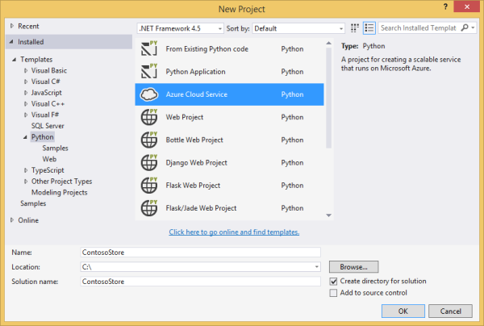
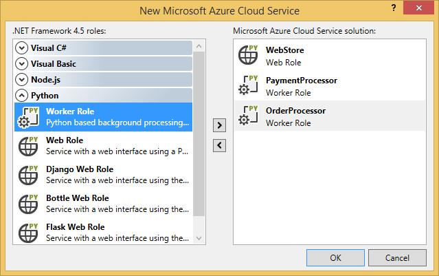
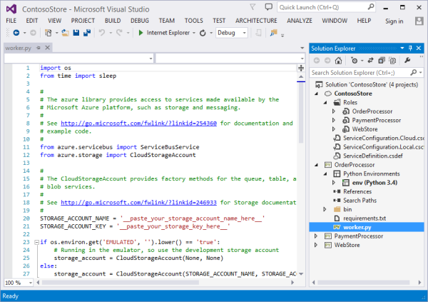
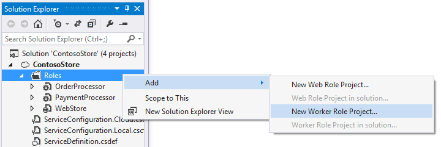
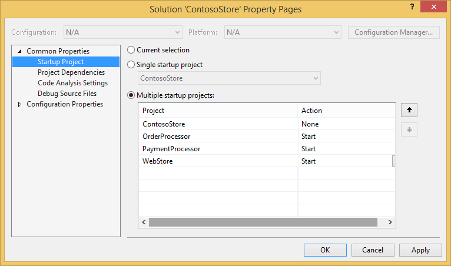
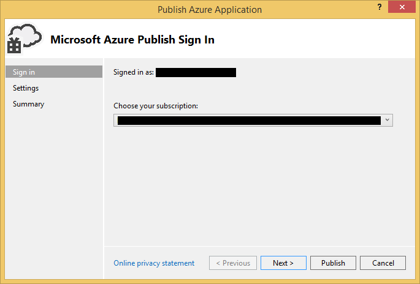
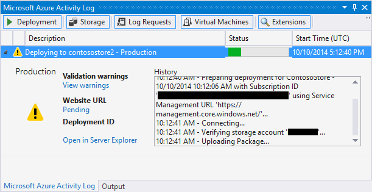

<properties
	pageTitle="Python web and worker roles with Visual Studio | Microsoft Azure"
	description="Overview of using Python Tools for Visual Studio to create Azure cloud services including web roles and worker roles."
	services="cloud-services"
	documentationCenter="python"
	authors="thraka"
	manager="timlt"
	editor=""/>

<tags
	ms.service="cloud-services"
	ms.workload="tbd"
	ms.tgt_pltfrm="na"
	ms.devlang="python"
	ms.topic="hero-article"
	ms.date="07/20/2016"
	ms.author="adegeo"/>


# Python web and worker roles with Python Tools for Visual Studio

This article provides an overview of using Python web and worker roles using [Python Tools for Visual Studio][]. You will learn how to use Visual Studio to create and deploy a basic Cloud Service that uses Python.

## Prerequisites

 - Visual Studio 2013 or 2015
 - [Python Tools for Visual Studio][] (PTVS)
 - [Azure SDK Tools for VS 2013][] or [Azure SDK Tools for VS 2015][]
 - [Python 2.7 32-bit][] or [Python 3.5 32-bit][]

[AZURE.INCLUDE [create-account-and-websites-note](../includes/create-account-and-websites-note.md)]

## What are Python web and worker roles?

Azure provides three compute models for running applications: [Web Apps feature in Azure App Service][execution model-web sites], [Azure Virtual Machines][execution model-vms], and [Azure Cloud Services][execution model-cloud services]. All three models support Python. Cloud Services, which include web and worker roles, provide *Platform as a Service (PaaS)*. Within a cloud service, a web role provides a dedicated Internet Information Services (IIS) web server to host front-end web applications, while a worker role can run asynchronous, long-running or perpetual tasks independent of user interaction or input.

For more information, see [What is a Cloud Service?].

> [AZURE.NOTE] *Looking to build a simple website?*
If your scenario involves just a simple website front-end, consider using the lightweight Web Apps feature in Azure App Service. You can easily upgrade to a Cloud Service as your website grows and your requirements change. See the <a href="/develop/python/">Python Developer Center</a> for articles that cover development of the Web Apps feature in Azure App Service.
<br />


## Project creation

In Visual Studio, you can select **Azure Cloud Service** in the **New Project** dialog box, under **Python**.



In the Azure Cloud Service wizard, you can create new web and worker roles.



The worker role template comes with boilerplate code to connect to a Azure storage account or Azure Service Bus.



You can add web or worker roles to an existing cloud service at any time.  You can choose to add existing projects in your solution, or create new ones.



Your cloud service can contain roles implemented in different languages.  For example, you can have a Python web role implemented using Django, with Python, or with C# worker roles.  You can easily communicate between your roles using Service Bus queues or storage queues.

## Install Python on the cloud service

>[AZURE.WARNING] The setup scripts that are installed at the time this article was last updated do not work. The rest of this article describes a workaround.

The main problem with the setup scripts are that they do not install python. First, define two [startup tasks](cloud-services-startup-tasks.md) in the [ServiceDefinition.csdef](cloud-services-model-and-package.md#servicedefinitioncsdef) file. The first task (**PrepPython.ps1**) downloads and installs the Python runtime. The second task (**PipInstaller.ps1**) runs pip to install any dependencies you may have.


>[AZURE.TIP] The scripts above were written targeting Python 3.5. If you want to use the version 2.x of python, set the **PYTHON2** variable file to **on** on the two startup tasks and the runtime task.
>
>```xml
><Variable name="PYTHON2" value="on" />
>```


```xml
<Startup>

  <Task executionContext="elevated" taskType="simple" commandLine="bin\ps.cmd PrepPython.ps1">
    <Environment>
      <Variable name="EMULATED">
        <RoleInstanceValue xpath="/RoleEnvironment/Deployment/@emulated" />
      </Variable>
	  <Variable name="PYTHON2" value="off" />
    </Environment>
  </Task>

  <Task executionContext="elevated" taskType="simple" commandLine="bin\ps.cmd PipInstaller.ps1">
    <Environment>
      <Variable name="EMULATED">
        <RoleInstanceValue xpath="/RoleEnvironment/Deployment/@emulated" />
      </Variable>
    </Environment>
	<Variable name="PYTHON2" value="off" />
  </Task>

</Startup>
```

The **PYTHON2** and **PYPATH** variables needs to be added to the worker startup task. The **PYPATH** variable is only used if the **PYTHON2** variable is set to **on**.

```xml
<Runtime>
  <Environment>
    <Variable name="EMULATED">
      <RoleInstanceValue xpath="/RoleEnvironment/Deployment/@emulated" />
    </Variable>
    <Variable name="PYTHON2" value="off" />
    <Variable name="PYPATH" value="%SystemDrive%\Python27" />
  </Environment>
  <EntryPoint>
    <ProgramEntryPoint commandLine="bin\ps.cmd LaunchWorker.ps1" setReadyOnProcessStart="true" />
  </EntryPoint>
</Runtime>
```

Next, create the **PrepPython.ps1** and **PipInstaller.ps1** files in the **./bin** folder of your role.

#### PrepPython.ps1

This script installs python. If the **PYTHON2** enviornment variable is set to **on** then Python 2.7 will be installed, otherwise Python 3.5 will be installed.

```powershell
$is_emulated = $env:EMULATED -eq "true"
$is_python2 = $env:PYTHON2 -eq "on"
$nl = [Environment]::NewLine

if (-not $is_emulated){
	Write-Host "Checking if python is installed...$nl"
	if ($is_python2) {
		& "${env:SystemDrive}\Python27\python.exe"  -V | Out-Null
	}
	else {
		py -V | Out-Null
	}

	if (-not $?) {

		$url = "https://www.python.org/ftp/python/3.5.2/python-3.5.2-amd64.exe"
		$outFile = "${env:TEMP}\python-3.5.2-amd64.exe"

		if ($is_python2) {
			$url = "https://www.python.org/ftp/python/2.7.12/python-2.7.12.amd64.msi"
			$outFile = "${env:TEMP}\python-2.7.12.amd64.msi"
		}
		
		Write-Host "Not found, downloading $url to $outFile$nl"
		Invoke-WebRequest $url -OutFile $outFile
		Write-Host "Installing$nl"

		if ($is_python2) {
			Start-Process msiexec.exe -ArgumentList "/q", "/i", "$outFile", "ALLUSERS=1" -Wait
		}
		else {
			Start-Process "$outFile" -ArgumentList "/quiet", "InstallAllUsers=1" -Wait
		}

		Write-Host "Done$nl"
	}
	else {
		Write-Host "Already installed"
	}
}
```

#### PipInstaller.ps1

This script calls up pip and installs all of the dependencies in the **requirements.txt** file. If the **PYTHON2** enviornment variable is set to **on** then Python 2.7 will be used, otherwise Python 3.5 will be used.

```powershell
$is_emulated = $env:EMULATED -eq "true"
$is_python2 = $env:PYTHON2 -eq "on"
$nl = [Environment]::NewLine

if (-not $is_emulated){
	Write-Host "Checking if requirements.txt exists$nl"
	if (Test-Path ..\requirements.txt) {
		Write-Host "Found. Processing pip$nl"

		if ($is_python2) {
			& "${env:SystemDrive}\Python27\python.exe" -m pip install -r ..\requirements.txt
		}
		else {
			py -m pip install -r ..\requirements.txt
		}

		Write-Host "Done$nl"
	}
	else {
		Write-Host "Not found$nl"
	}
}
```

#### Modify LaunchWorker.ps1

The **bin\LaunchWorker.ps1** was originally created to do a lot of prep work but it doesn't really work. Replace the contents in that file with the following script.

This script calls the **worker.py** file from your python project. If the **PYTHON2** enviornment variable is set to **on** then Python 2.7 will be used, otherwise Python 3.5 will be used.

```powershell
$is_emulated = $env:EMULATED -eq "true"
$is_python2 = $env:PYTHON2 -eq "on"
$nl = [Environment]::NewLine

if (-not $is_emulated){
	Write-Host "Running worker.py$nl"

	if ($is_python2) {
        cd..
		iex "$env:PYPATH\python.exe worker.py"
	}
	else {
		cd..
		iex "py worker.py"
	}
	
}
```

#### ps.cmd

The Visual Studio templates should have created a **ps.cmd** file in the **./bin** folder. This shell script calls out the PowerShell wrapper scripts above and provides logging based on the name of the PowerShell wrapper called. If this file wasn't created, here is what should be in it. 

```bat
@echo off

cd /D %~dp0

if not exist "%DiagnosticStore%\LogFiles" mkdir "%DiagnosticStore%\LogFiles"
%SystemRoot%\System32\WindowsPowerShell\v1.0\powershell.exe -ExecutionPolicy Unrestricted -File %* >> "%DiagnosticStore%\LogFiles\%~n1.txt" 2>> "%DiagnosticStore%\LogFiles\%~n1.err.txt"
```


## Run locally

If you set your cloud service project as the startup project and press F5, the cloud service will run in the local Azure emulator.

Although PTVS supports launching in the emulator, debugging (for example, breakpoints) will not work.

To debug your web and worker roles, you can set the role project as the startup project and debug that instead.  You can also set multiple startup projects.  Right-click the solution and then select **Set StartUp Projects**.



## Publish to Azure

To publish, right-click the cloud service project in the solution and then select **Publish**.



Follow the wizard. If you need to, enable remote desktop. Remote desktop is helpful when you need to debug something.

When you are done configuring settings, click **Publish**.

Some progress will appear in the output window, then you'll see the Microsoft Azure Activity Log window.



Deployment will take several minutes to complete, then your web and/or worker roles will be running on Azure!

### Investigate logs

After the cloud service virtual machine starts up and installs Python, you can look at the logs to find any failure messages. These logs are located in the **C:\Resources\Directory\{role}\LogFiles** folder. **PrepPython.err.txt** will have at least one error in it from when the script tries to detect if Python is installed and **PipInstaller.err.txt** may complain about an outdated version of pip.

## Next steps

For more detailed information about working with web and worker roles in Python Tools for Visual Studio, see the PTVS documentation:

- [Cloud Service Projects][]

For more details about using Azure services from your web and worker roles, such as using Azure Storage or Service Bus, see the following articles.

- [Blob Service][]
- [Table Service][]
- [Queue Service][]
- [Service Bus Queues][]
- [Service Bus Topics][]


<!--Link references-->

[What is a Cloud Service?]: ./cloud-services/cloud-services-choose-me.md
[execution model-web sites]: ./app-service-web/app-service-web-overview.md
[execution model-vms]: ./virtual-machines/virtual-machines-windows-about.md
[execution model-cloud services]: ./cloud-services/cloud-services-choose-me.md
[Python Developer Center]: /develop/python/

[Blob Service]: ./storage/storage-python-how-to-use-blob-storage.md
[Queue Service]: ./storage/storage-python-how-to-use-queue-storage.md
[Table Service]: ./storage/storage-python-how-to-use-table-storage.md
[Service Bus Queues]: ./service-bus/service-bus-python-how-to-use-queues.md
[Service Bus Topics]: ./service-bus/service-bus-python-how-to-use-topics-subscriptions.md


<!--External Link references-->

[Python Tools for Visual Studio]: http://aka.ms/ptvs
[Python Tools for Visual Studio Documentation]: http://aka.ms/ptvsdocs
[Cloud Service Projects]: http://go.microsoft.com/fwlink/?LinkId=624028
[Azure SDK Tools for VS 2013]: http://go.microsoft.com/fwlink/?LinkId=323510
[Azure SDK Tools for VS 2015]: http://go.microsoft.com/fwlink/?LinkId=518003
[Python 2.7 32-bit]: https://www.python.org/downloads/
[Python 3.5 32-bit]: https://www.python.org/downloads/
