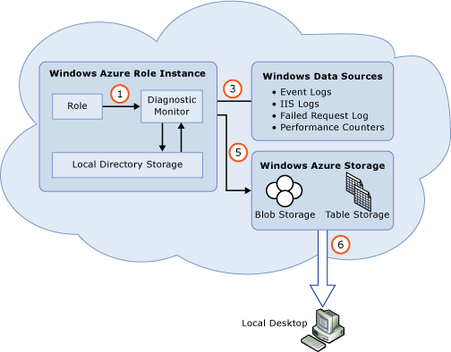
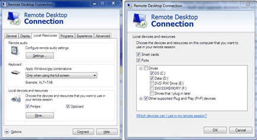
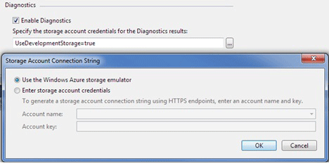
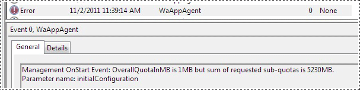
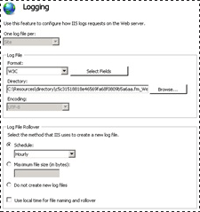
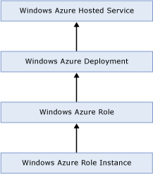
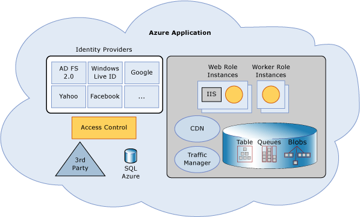
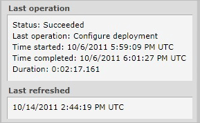

<properties 
   pageTitle="Troubleshooting Best Practices for Developing Azure Applications"
   description=""
   services="cloud-services"
   documentationCenter=""
   authors="Thraka"
   manager="timlt"
   editor=""/>
<tags 
   ms.service="cloud-services"
   ms.devlang="na"
   ms.topic="article"
   ms.tgt_pltfrm="na"
   ms.workload="tbd"
   ms.date="05/12/2015"
   ms.author="adegeo" />

## Troubleshooting Best Practices for Developing Azure Applications

Author: William Bellamy, Microsoft Principal Escalation Engineer

Contributors:

- Bryan Lamos, Microsoft Senior Program Manager, Product Quality

- Kevin Williamson, Microsoft Senior Escalation Engineer, Azure Developer Support

- Pranay Doshi, Microsoft Senior Program Manager, Azure Production Services

- Tom Christian, Microsoft Senior Escalation Engineer, Azure Developer Support

Published: January 2012

### Summary

The number one priority of Microsoft is to help Azure customers keep their applications up and running. The Azure [Service Level Agreements](http://azure.microsoft.com/support/legal/sla/) define a 99.95% availability of external connectivity when you deploy two or more role instances. However, external connectivity ensures that you are able to reach your application from outside the Microsoft data centers, which is not the same as "site up." Most Azure services have multiple dependencies: SQL Azure, Caching, Content Delivery Network, internal resources (through Azure Connect), and so on. The failure of any one of these dependencies can cause your Azure service to not function as expected.

This paper focuses on the different troubleshooting challenges and recommended approaches to design and develop more supportable applications for Microsoft’s Azure platform.  When (and not if) a problem occurs, time is of the essence. Proper planning can enable you to find and correct problems without having to contact Microsoft for support. The approach advocated in this paper will also speed the resolution of problems that require Microsoft assistance.

#### Intended Audience

This paper is intended to be a resource for technical software audiences: software designers, architects, IT Professionals, System Integrators, developers and testers who design, build and deploy Azure solutions.

We assume that you have a basic understanding of the application development lifecycle of an Azure application, including terminology and the various components of the Azure development and runtime environment.

We also assume that basic guidelines for Azure will be followed, such as using the latest version of the Azure SDK and testing code changes before they are put into production.

#### Document Structure

This paper is organized into two sections:

- Overview of Azure diagnostic resources:
	- Azure resources
	- Third-party resources

- Best practices for supportable design, development and deployment:
	- Before you deploy your application.
	- Fail fast design and monitoring.
	- What to do when a problem happens.

#### Contents

- [Starting with a Strategy](#bkmk_StartWithStrategy)

- [Overview of Azure Diagnostic Resources](#bkmk_Overview)

- [Designing More Supportable Azure Services](#bkmk_DesignWinAzureSvcs)

- [Putting It All Together: Creating More Supportable Azure Applications](#bkmk_PutTogether)

- [Conclusion](#bkmk_Conclusion)

- [References](#bkmk_References)

- [Appendix A: Glossary](#bkmk_AppA)

- [Appendix B: Web Role Code Sample](#bkmk_AppB)

- [Appendix C: Worker Role Code Sample](#bkmk_AppC)

- [Appendix D: ServiceDefinition.csdef](#bkmk_AppD)

- [Appendix E: ServiceConfiguration.Local.cscfg](#bkmk_AppE)

- [Appendix F: diagnostics.wadcfg](#bkmk_AppF)

- [Appendix G: Default Configuration](#bkmk_AppG)

### Starting with a Strategy

No developer expects their application to go down once it is put into production. We do our best to test the code during development so that it will be robust enough to run error free while we move on to our next project. Unfortunately code breaks. In a distributed environment, minor errors can become catastrophic due to the complexities inherent in the separation of application components. That is why a logging and tracing strategy must be designed into the application from the beginning. Ideally this strategy includes provisions to dynamically adjust without the need to rebuild/redeploy the type and volume of logging at a component level. Having volumes of logs does not guarantee speedy resolution. More is not necessarily better because lots of data takes a long time to decipher, and can potentially slow down the performance of your application. Adjustable logging controls both the size and storage cost of log data.

Distributed applications like those run on the Azure Platform have multiple components that each interact with each other when the user interacts with the application.  By consistently and copiously logging the flow of your code with special care given to calls out to external services, anyone should be able to virtually follow the execution flow of your application. This can be invaluable to you a year of two from now when there is a problem in production. Ideally the level of logging should be adjustable from the ServiceConfiguration.cscfg file so that it can be changed without having to redeploy.

It is convenient to use a debug build during development in order to get the maximum amount of error information. Developers usually add debug statements and sometimes some form of error logging. The caveat is that debug statements are removed in the production build, which means you will be out of luck when a problem occurs. Most customers will not want to redeploy with a debug build to solve a production problem. [Mike Kelly](https://msdn.microsoft.com/magazine/ff714589.aspx) calls out four types of diagnostic output that developers need to configure:

- **Debug Output** - Only in debug build includes Asserts

- **Tracing** - Tracks the flow of control during execution

- **Event Logging** - Major events

- **Error Logging** - Exceptional or dangerous situation

Many of the debug messages probably should be made into trace statements in order to take advantage of the different trace levels. Azure Diagnostics also allows you to configure diagnostics and to disable transfers so you can control when information is written to your persistent storage.

### Overview of Azure Diagnostic Resources

The following sections describe some of the troubleshooting resources available to developers who build applications on Azure.

Before we look at Azure, let’s begin by looking at the current troubleshooting paradigm for Windows Server applications. Developers typically examine logs when a production problem occurs. Event logs and IIS logs are turned on by default and survive restarts (as long as there isn't a disk failure).

This same process will work in an Azure application if Remote Desktop is enabled; developers can connect to each instance to collect diagnostic data. The collection can be done either by copying the logs to storage or by configuring RDP so that they can be copied to your local machine. This process is time consuming and will fail if the instance is reimaged, which causes a clean version of the web or worker role to be started. Obviously this clean version is devoid of all the previous logs. Reimaging can happen if there is an operating system upgrade of the host or guest virtual machine. Reimaging is a normal part of the Azure architecture.

#### Azure Diagnostics

The original Azure SDK 1.0 included functionality to collect diagnostics and store them in Azure storage collectively known as Azure Diagnostics (WAD). This software, built upon the Event Tracing for Windows (ETW) framework, fulfills two design requirements introduced by Azure scale-out architecture:

1. Save diagnostic data that would be lost during a reimaging of the instance.

1. Provide a central repository for diagnostics from multiple instances.

The Microsoft.WindowsAzure.Diagnostic namespace extends the System.Diagnostics namespace so that you can use the ETW framework within an Azure application.

After including Azure Diagnostics in the role (ServiceConfiguration.cscfg and ServiceDefinition.csdef), WAD collects diagnostic data from all the instances of that particular role. The diagnostic data can be used for debugging and troubleshooting, measuring performance, monitoring resource usage, traffic analysis and capacity planning, and auditing. Transfers to Azure storage account for persistence can either be scheduled or on-demand.

Azure Diagnostics changes the server paradigm in four important ways:

1. Diagnostics must be enabled at application creation time.

1. Specific tools/steps are needed to visualize diagnostic results.

1. Crashes will cause the loss of diagnostic data unless it is written to durable storage (Azure Storage as opposed to being on each instance).

1. Diagnostic storage incurs a monthly cost when stored in Azure storage.

Cost is of particular importance because one of the key benefits of the Azure platform is cost reduction. The only way to eliminate the cost of using WAD today is to leave the data on the virtual machine. This may work in a small deployment, but is impractical where there are many instances. Here are a few ways to minimize the financial impact:

1. Make sure that the storage account is in the same data center as your application. If for some reason they are not in the same data center, choose the interval of scheduled transfers wisely. Shorter transfer times will increase data relevance, but that trade off may not be great enough to justify the additional bandwidth and processing overhead.

1. Periodically copy and clear the diagnostic data from Azure Storage. The diagnostic data will transit through Azure storage, but not reside there unnecessarily. There are a number of tools to do this: System Center Monitoring Pack for Azure, Cerebrata's Azure Diagnostics Manager, and Azure PowerShell cmdlets.

1. Choose only the diagnostic data that you will need to troubleshoot and monitor your application. Capturing too much data may make it harder to troubleshoot in addition to costing significantly more.

1. Control the collection and extent of diagnostic data by implementing an on-demand switch in your application.

1. Utilize the logging level (Verbose, Info, Warning, Error) so that all information is available, then utilize the post-deploy WAD config to selectively gather data.

Azure storage is the basis for any supportable application. Ideally every application should have this functionality configured and active.

#### Storage Analytics

Azure Storage Analytics performs logging and provides metrics data for a storage account. You can use this data to trace storage requests, analyze usage trends, and diagnose issues with your storage account.

#### SQL Azure Resources

The key to writing supportable SQL Azure code is to examine the return codes and make sure that you have solid retry code to handle failures.

#### Microsoft System Center Monitoring Pack for Azure Applications

This [Monitoring Pack](https://www.microsoft.com/download/en/details.aspx?id=11324) allows you to use [Microsoft System Center Operations Manager](https://www.microsoft.com/server-cloud/system-center/operations-manager.aspx) to monitor the availability and performance of Azure Applications:

- Discovers Azure applications.

- Provides status of each role instance.

- Collects and monitors performance information.

- Collects and monitors Windows events.

- Collects and monitors the .NET Framework trace messages from each role instance.

- Grooms performance, event, and the .NET Framework trace data from Azure storage account.

- Changes the number of role instances.

Using Microsoft System Center Operations Manager 2007 is the best way to monitor the health of your Azure application.

#### Other Useful Tools

Today Azure does not provide a full solution for customers to monitor and manage their hosted service. For networking information, [speedtest.net](http://www.speedtest.net/) provides a tool that measures the response times, bandwidth, and overall connection quality. A number of tools are very useful when working with Azure. The following list is not an endorsement or recommendation of any particular third-party tool.

**Azure PowerShell Cmdlets**

The best way to remotely manager diagnostics is to use [Azure PowerShell Cmdlets](http://azure.microsoft.com/downloads/). The cmdlets are based on the Azure Management and Diagnostics APIs and the full source code is available through the CodePlex project so you can better understand the underlying APIs. The version 2.0 release allows you to configure/download/cleanup all aspects of Azure Diagnostics. Michael Washam's blog gives some good [example scripts](http://michaelwasham.com/tag/diagnostics/).

**Network Monitoring: AlertBot, Gomez, Keynote, Pingdom**

Compuware's [Gomez](http://www.compuware.com/application-performance-management/) Application Performance Management, [Keynote](http://www.keynote.com/solutions/), [Pingdom](http://pingdom.com/), and [AlertBot](http://www.alertbot.com/products/website-monitoring/default.aspx) are solutions for monitoring your Azure application from outside. They allow you to monitor the availability of your application and optimize performance. Some services, such as Pingom, enable notification by email, SMS or a desktop notifier when an error is detected. This type of monitoring needs to simulate what an end user does in order to successfully monitor, because sometimes a web role will display the home page without being fully functional.

**Azure Check**

Apica's [AzureCheck](http://www.apicasystem.com/products/azurecheck.aspx) is a tool that monitors your Azure web application "from outside." In order to use this tool, you need to download their code and add it to your deployment as a [startup task](https://msdn.microsoft.com/library/gg456327.aspx). The advantage of this tool is that it does not require that you store your logs in your storage account thus reducing the cost of monitoring.

**Azure Diagnostics Manager**

Cerebrata's [Azure Diagnostic Manager](http://www.cerebrata.com/Products/AzureDiagnosticsManager/Default.aspx) is a Windows based client for managing Azure Diagnostics. It displays or downloads the logs that are collected by WAD. You can also manage your WAD configuration and a dashboard allows you to monitor live performance.

**Azure Storage Explorers**

There are a number of ways to explore Azure storage. The Azure Storage team came up with a [list of storage explorers](http://blogs.msdn.com/b/windowsazurestorage/archive/2010/04/17/windows-azure-storage-explorers.aspx). Any of these will allow you to see WAD files and Azure Storage Analytics files. Cloudberry Lab's [Explorer for Azure Blob Storage](http://www.cloudberrylab.com/free-microsoft-azure-explorer.aspx) provides a user interface to enable Storage Analytics directly in the application by clicking **Storage Settings**.

**IntelliTrace**

Microsoft Visual Studio 2010 Ultimate contains [IntelliTrace](https://msdn.microsoft.com/library/dd264915.aspx), which can be enabled in order to debug applications before deployment into production. [IntelliTrace](https://msdn.microsoft.com/library/dd264915.aspx) supports ASP.NET, and WCF applications. Intellitrace is not supported when it is enabled in a production service, but can be used to get exceptions for an application after deployment to Azure. Jim Nakashima's blog post describes how to use [IntelliTrace](https://msdn.microsoft.com/library/dd264915.aspx) to debug Azure Cloud Services.

[IntelliTrace to debug Azure Cloud Services](http://blogs.msdn.com/b/jnak/archive/2010/06/07/using-intellitrace-to-debug-windows-azure-cloud-services.aspx)

**AVIcode**

Microsoft purchased [AVIcode](https://www.microsoft.com/server-cloud/system-center/avicode.aspx) and it is now part of Microsoft System Center. [AVIcode](https://www.microsoft.com/server-cloud/system-center/avicode.aspx) delivers .NET application performance monitoring capabilities with a comprehensive suite of application monitoring capabilities.

**Fiddler**

Fiddler is a Web Debugging Proxy that logs all HTTP(S) traffic between your computer and the Internet. [Fiddler](http://www.fiddler2.com/fiddler2/) allows you to inspect traffic, set breakpoints, and "fiddle" with incoming or outgoing data. [Fiddler](http://www.fiddler2.com/fiddler2/) is especially helpful for troubleshooting Azure Storage troubleshooting.

To use Fiddler against the local development fabric, you will use ipv4.fiddler instead of 127.0.0.1:

1. Launch Fiddler.

1. Launch your service in the development fabric.

1. Browse to http://ipv4.fiddler:/. Fiddler should trace the request.

To use Fiddler against the local development storage, you need to modify the service configuration file to point to Fiddler:

1. Open the ServiceConfiguration.cscfg file and change the connection string to:

		Value=“UseDevelopmentStorage=true;DevelopmentStorageProxyUri=http://ipv4.fiddler”

1. Launch Fiddler.

1. Launch your service. Fiddler should trace any storage requests.

**Performance Profiling**

You can [profile](https://msdn.microsoft.com/library/azure/hh369930.aspx) your Azure application when it runs in Azure to determine any performance issues. When you publish your Azure application from Visual Studio, you can choose to [profile](https://msdn.microsoft.com/library/azure/hh369930.aspx) the application and select the profiling settings that you require.

**Azure VM Assistant**

The [VM Assitant](http://azurevmassist.codeplex.com/) tool is a CodePlex project that saves you time diagnosing problems by collecting all the relevant data in one place when you Remote Desktop into an instance. The **VM Health** button gives the current status of the instance.

### Designing More Supportable Azure Services

When it comes to cloud-based solutions, it is more important for software designers and developers to prepare for problems at design time than is the case with traditional boxed-product software deployed on servers in a corporate datacenter. This section highlights some specific scenarios that developers are responsible for mitigating in the cloud and describes how to prepare so that problems can be solved quickly when they occur.

#### Remote Desktop

The fundamental difference with the traditional server-based deployment is that you no longer can access the server hardware. The Azure SDK 1.3 added the ability to use Remote Desktop Services to access Azure roles. Using the latest SDK will ensure the best experience. [Enabling remote desktop](https://msdn.microsoft.com/library/gg443832.aspx) is a mandatory first step in creating a supportable Azure Service. This step can only be done before deployment.

One of the steps required to enable Remote Desktop is to choose a User name, password, and account expiration date. These three items can be changed in the Azure Management Portal. This is handy when you forget the password you set months ago when the service was first deployed.

When you click the **Configure** button in the portal to change any of these three parameters, normally you will see this sequence: Updating..., Waiting for host..., Role was updated successfully. Waiting for host…, Ready. This corresponds to the role receiving then handling the change event. Customers can subscribe to **RoleEnvironment** events, then when the [RoleEnvironment.Changing Event](https://msdn.microsoft.com/library/azure/microsoft.windowsazure.serviceruntime.roleenvironment.changing.aspx) is received either: accept the changes and keep running (default), or take the instance offline apply the changes then come back online (e.Cancel = true).

If the code does recycle the role on change events, all the instances in all the roles in that hosted service will be recycled. Services with multiple instances per role will not see down time because of the [update domain](http://blog.toddysm.com/2010/04/upgrade-domains-and-fault-domains-in-windows-azure.html) architecture, but performance may be degraded as each domain is recycled. More importantly, if you are in the middle of a problem that only reproduces once a month, you will lose the chance to capture the state of the instance. Therefore, we recommend that you have an enabled Remote Desktop connection with known and secure credentials that have not expired.

Next, you need to test to make sure the connection works. This is easily done by clicking the **Connect** button in the portal. In most cases you should keep a copy of the RDP file so that you can change the **Local Resources** section to include your local disks. This will enable you to easily copy files back and forth to your instance. You can do this by clicking the **Local Resources** tab, then the **More** button. The Connection settings on the **General** tab will allow you to save your settings to an .RDP file.

**How to troubleshoot on the VM**

Now that you have connected to an instance, what do you look for? If you are troubleshooting a role that fails to start, then work through this [MSDN article](https://msdn.microsoft.com/library/azure/hh134844.aspx). Kevin Williamson has an excellent [blog post](http://blogs.msdn.com/b/kwill/archive/2011/05/05/windows-azure-role-architecture.aspx) that gives an overview of where to find log files and what process to debug.

You can also install [VM Assistant](#bkmk_VMAsst) to look at the log files and give you useful information on your instance. You can also install the tools, such as Network Monitor, or Fiddler to see what is happening on the network. One of the simplest tests is to run Internet Explorer on your instance and connect to your website because it will show you exception details.

**Debugging a Hosted Web Core**

If you are running a Hosted Web Core role, there will be only one command window available in the virtual machine so you should open a new Cmd window by running start from the command prompt otherwise you will get the full Windows Server experience. Here is a list of some basic commands:

- **Start** – Opens a new Cmd window

- **explorer** – Opens Windows Explorer

- **eventvwr** – Opens the event log viewer

- **taskmgr** – Opens Task Manager

- **start iexplore** – Runs internet explorer

- **services.msc** – Opens the Service manager

- **control** – Opens the Control Panel

- **certmgr.ms**c – Opens the certificate manager snapin

- **regedit** – Opens the registry editor

- **shutdown /r /t 0** – Restarts the virtual machineinstance

- **Start Task Manager** – Useful if you lose your Cmd prompt and need to start a new one (from Task Manager go to **File -> Run -> Cmd**)

Remote Desktop is the basis of a supportable Azure Service, but it has its limitations when the number of roles and instances increases. For example, how do you know to which instance you need to connect to when there are 100 or more? Using this method of troubleshooting can actually increase the time required to get your site back up if you do not know where to look and what to look for.

The key points are as follows:

- Enable remote desktop on every role during deployment.

- Set a strong known password and make sure that your credentials do not expire.

- Test your access to make sure it works before a problem occurs.

- Save a RDP file for your connection.

#### Azure Diagnostics

There are four main tasks to use Azure Diagnostics:

1. Setup WAD

1. Configuring data collection

1. Instrumenting your code

1. Viewing data

**Setup WAD**

The architecture of Azure Diagnostics is to first collect data on the instance and then persist the data to Azure Storage. Thus first you must go to the Azure Management Portal to create a storage account; for example, mylogs. A best practice is to locate your storage account in the same geolocation as your Azure application in order to avoid paying external bandwidth costs and to reduce latency.

One of the great development features of the Azure Tools for Visual Studio version 1.4 (August 2011) and later is the possibility to have different configuration files (ServiceConfiguration.cscfg) for Local and Cloud. [Multiple service configurations](https://msdn.microsoft.com/library/hh369934.aspx) comes in handy for diagnostics because it facilitates the use of Storage Emulator for local testing free of charge while maintaining a separate configuration file for production. One of the main causes for applications not starting when published to Azure is forgetting to change a connection string containing `UseDevelopmentStorage=true to false`.

Visual Studio makes it easy to enable diagnostics during testing by clicking **Use the Azure storage emulator** button:

After you have tested your application and are ready to publish, you'll need to have a storage account to configure for the cloud (ServiceConfiguration.Cloug.cscfg). [David Makogon](http://www.davidmakogon.com/2010/08/azure-tip-of-day-separate-diagnostic.html) blogs three reasons for having a storage account specifically for diagnostics, which is separate from your application data storage:

1. Having a separate access key for diagnostics allows access to logs without risk to application data.

1. No cost is incurred in having multiple storage accounts because it is based on data size.

1. Performance can be enhanced by having a separate account.

Next set the connection string:

	<Setting name="Microsoft.WindowsAzure.Plugins.Diagnostics.ConnectionString" value="DefaultEndpointsProtocol=https;AccountName=<name>;AccountKey=<key>" />

The **AccountName** and **AccountKey** values are available on the Management Portal in the storage account section. **AccountName** is the first portion of the URL for the table and blob storage endpoints (the part before “.table.core.windows.net”). **AccountKey** is the base-64 encoded Primary Access Key for your storage account.

By default, only Azure Logs are enabled, but not persisted so you will next need to decide how much data you want to collect and when the logs should be transferred. These are not  trivial decisions because they influence the performance of your application and determine how much you will be charged for storage each month.

First you need to determine how much total storage will be required for the data collected by Azure Diagnostics. This value is gated by the size of the disk for your [instance/Virtual Machine size](https://msdn.microsoft.com/library/ee814754.aspx) and by the [OverallQuotaInMB](https://msdn.microsoft.com/library/microsoft.windowsazure.diagnostics.diagnosticmonitorconfiguration.overallquotainmb.aspx) property of the **DiagnosticMonitorConfiguration** class. For example, if you have configured your service model to use an ExtraSmall virtual machine size, then the maximum amount of local storage available is 20 GB. By default, **[OverallQuotaInMB](https://msdn.microsoft.com/library/microsoft.windowsazure.diagnostics.diagnosticmonitorconfiguration.overallquotainmb.aspx)** is set to 4 GB so that means that you would only have 16 GB local storage total which may not be enough for your application and temp files. **[OverallQuotaInMB](https://msdn.microsoft.com/library/microsoft.windowsazure.diagnostics.diagnosticmonitorconfiguration.overallquotainmb.aspx)** sets the size of a rewritable wraparound buffer. On the other hand, if your website has lots of traffic and you have configured lots of performance counters, your diagnostic data may get overwritten especially if you do not transfer it to persistent storage on a regular basis.

After your virtual machine size is set, you may want to go beyond the 4 GB. This can be accomplished by adding a <LocalStorage> element for **DiagnosticStore** with the **sizeInMB** attribute set to the new size to your ServiceDefinition.csdef file and change the **OverallQuotaInMB** value accordingly:

	<LocalResources>
      <LocalStorage name="DiagnosticStore" sizeInMB="8192" cleanOnRoleRecycle="false" />
    </LocalResources>

By setting the **cleanOnRoleRecycle** attribute value to false, you ensure that the local storage "DiagnosticStore" is not wiped clean when the role recycles. See [Appendix D: ServiceDefinition.csdef](#bkmk_AppD) for the full code of the ServiceDefinition.csdef. This setting does not guarantee that the data will remain if the instance is moved (hardware problem, and so on.). Remember that diagnostic settings are specific to one role so you must add a DiagnosticStore for each of your roles individually.

Calculating the aggregate size of the diagnostics data you’ve configured is extremely important because Azure Diagnostics will fail if the sum exceeds the **OverallQuotaInMB**. The only way to see this error is to attach a debugger, or to add a try catch to the OnStart method. This is what appears in the Application event log if the catch code writes an event:

So how do you calculate the “sum of requested sub-quotas”? Each item collection type (Event logs, Performance counters, and so on.) has an associated data buffer which, by default, is zero. The **[BufferQuotaInMB](https://msdn.microsoft.com/library/microsoft.windowsazure.diagnostics.diagnosticdatabufferconfiguration.bufferquotainmb.aspx)** property can either be left at the default of zero, which means less than the **OverallQuotainMB** or it can be explicitly set. The **OverallQuotaInMB** must be less than the sum of all the **[BufferQuotaInMB](https://msdn.microsoft.com/library/microsoft.windowsazure.diagnostics.diagnosticdatabufferconfiguration.bufferquotainmb.aspx)** properties.

When the quota is reached, the oldest data is deleted as new data is added. This deletion policy also applies if you have configured a transfer interval for the buffer. After the transfer has occurred, the data remains in local storage and will be deleted per the above policy.

	// Set an overall quota of 8GB.
	config.OverallQuotaInMB = 8192;

	// Set the sub-quotas and make sure it is less than the OverallQuotaInMB set above
	config.Logs.BufferQuotaInMB = 1024;
	config.Directories.BufferQuotaInMB = 0; // Use the rest of the storage here
	config.WindowsEventLog.BufferQuotaInMB = 1024;
	config.PerformanceCounters.BufferQuotaInMB = 1024;
	config.DiagnosticInfrastructureLogs.BufferQuotaInMB = 1024;

The Directories sub-quotas is set to zero so that it will use the rest of the available storage quota. If you put a specific value, it must be greater than or equal to the other quotas because it must be large enough to contain the IIS logs (web role) and crash dumps. By default, the **Directory.QuotaInMB** is set to 1024 MB, which means that if a crash dump is greater than one gigabyte the dump will fail to write. Mini-dumps are one way to reduce the size of dumps.

Full dump files contain a process' memory (Virtual Bytes) at the time of a crash. Because we are running in a 64-bit version of Windows, the upper bound of memory will be the physical memory of the machine. You can find this value by looking at the memory column in this table of [instance/Virtual Machine size](https://msdn.microsoft.com/library/ee814754.aspx). For example, a full crash dump from an ExtraLarge instance could be up to 14 GB. Obviously this is a worst case scenario where the process is using up all available memory, but isn't that when you really want to capture the dump file?

Now that you know how much diagnostic data you will collect you need to determine a strategy for persisting that data.

One option would be to not begin collecting data until you determine that a problem has occurred. This option has two flaws:

1. How will you know that a problem has occurred? While customers can be relied upon to report major problem, what about more insidious issues like a memory leak?

1. What is the baseline before the issue started? Does your application run at 80% CPU all the time or is that a symptom of the problem?

Surprisingly, this option is the most popular because it doesn't require any cost, planning or action. It is also without a doubt the worst option.

Option two is to setup all of the needed counters, but not to persist the data to Window Azure Storage. When a problem occurs the data can be examined or a transfer can be manually initiated. This seems like an ideal solution, because there is no cost involved until an issue appears. Unfortunately the same problems with option one apply to option two and increases the time for recovery.

Option three is to set the different [ScheduledTransferPeriod](https://msdn.microsoft.com/library/azure/microsoft.windowsazure.diagnostics.diagnosticdatabufferconfiguration.scheduledtransferperiod.aspx) properties small enough to ensure that diagnostic data is not overwritten on the instance, but large enough that it will not impact the performance of your application. The smallest transfer period you can specify is 1 minute luckily any inferior value will is rounded up to 1 so persistence is not turned off. Thus make sure to check that your diagnostic data is getting transferred before you really need it.

One common problem in many of the example code samples is that the **ScheduledTransferPeriod** is set to 1 minute, which will adversely impact your application's performance in production. The reason the samples use the minimum value is so that you can see if it works quickly. Most developers don't want to wait 30 minutes to verify that logs were transferred. There are two ways around this conundrum: systematically modify the **WAD** configuration after deployment using one of the [Other Useful Tools](#bkmk_UsefulTools), or add code plus a setting to the ServiceConfiguration.cscfg file leveraging the multiple service configuration files feature mentioned earlier in this section. The setting is created like this in the ServiceConfiguration.Local.cscfg:

	<ConfigurationSettings>
      <Setting name="ScheduledTransferPeriod" value="1" />

While in the ServiceConfiguration.Cloud.cscfg looks like this:

	<ConfigurationSettings>
	     <Setting name="ScheduledTransferPeriod" value="30" />

The code in the [OnStart](https://msdn.microsoft.com/library/azure/microsoft.windowsazure.serviceruntime.roleentrypoint.onstart.aspx) method and [RoleEnvironmentChanging](https://msdn.microsoft.com/library/azure/gg432963.aspx) event would look like this:

	// Get ScheduledTransferPeriod setting from ServiceConfiguration.cscfg and then set it 
	var myScheduledTransferPeriod = RoleEnvironment.GetConfigurationSettingValue("ScheduledTransferPeriod");
	TimeSpan myTimeSpan = TimeSpan.FromMinutes(Convert.ToDouble(myScheduledTransferPeriod));
	config.Logs.ScheduledTransferPeriod = myTimeSpan;
	config.Directories.ScheduledTransferPeriod = myTimeSpan;
	config.WindowsEventLog.ScheduledTransferPeriod = myTimeSpan;
	config.PerformanceCounters.ScheduledTransferPeriod = myTimeSpan;
	config.DiagnosticInfrastructureLogs.ScheduledTransferPeriod = myTimeSpan;

The other variable that will impact the amount of data collected is the logging level. One of the most important data sources to collect is the Application Event Logs. Application Event Logs and sometimes the System Event logs may be useful. The Security Event logs are not available through WAD. The size of these files can be mitigated by using the following filter values to specify the level of log entries:

- Critical

- Error

- Warning

- Information

- Verbose

The logging level is cumulative so that if the filter is set to **Warning** then both **Error** and **Critical** will be transferred as well. You can use the method above to configure specific [LogLevelFilter](https://msdn.microsoft.com/library/azure/microsoft.windowsazure.diagnostics.management.ondemandtransferoptions.loglevelfilter.aspx) levels specific for the Local and Cloud configurations. ServiceConfiguration.Local.cscfg would look like this:

	<Setting name="LogLevelFilter" value="Information" />

ServiceConfiguration.Cloud.cscfg would look like this:

	<Setting name="LogLevelFilter" value="Error" />

The code in the **OnStart** method and **RoleEnvironmentChanging** event would look like this:

	// Get LogLevelFilter setting from ServiceConfiguration.cscfg and then set it
	var LogLevelFilter = RoleEnvironment.GetConfigurationSettingValue("LogLevelFilter");
	var myLogLevel = LogLevel.Undefined;
	switch (LogLevelFilter)
	{
		case ("Information"):
			myLogLevel = LogLevel.Information;
			break;
		case ("Verbose"):
			myLogLevel = LogLevel.Verbose;
			break;
		case ("Warning"):
			myLogLevel = LogLevel.Warning;
			break;
		case ("Critical"):
			myLogLevel = LogLevel.Critical;
			break;
		case ("Error"):
			myLogLevel = LogLevel.Error;
			break;
		default:
			break;
	} 

	// Filter what will be sent to persistent storage.
	config.Logs.ScheduledTransferLogLevelFilter = myLogLevel;
	config.DiagnosticInfrastructureLogs.ScheduledTransferLogLevelFilter = myLogLevel;
	config.WindowsEventLog.ScheduledTransferLogLevelFilter = myLogLevel;

The suggested code may or may not fit your needs. For those who don't want to add any code and would prefer to have the last known configuration instead of what is set in the code, there is another solution.

**Using a Configuration File**

The Azure SDK 1.3 added the ability to put configuration in an XML file instead of writing code. [David Hardin](http://blogs.msdn.com/b/davidhardin/archive/2011/03/29/configuring-wad-via-the-diagnostics-wadcfg-config-file.aspx) contends that this is the most efficient way of configuring diagnostics for all types of Azure Roles This method has many advantages over writing code:

1. WAD starts before **OnStart** is run so that errors in startup tasks are caught.

1. Any changes made to the configuration at run time will remain after a restart.

1. Automatically start diagnostics agent with set configuration without the need for additional code that can cause an exception that will lead your role not to start.

1. This is the only method for getting diagnostics from a beta virtual machinerole.

1. Configuration changes do not require the code to be rebuilt

A sample [diagnostics.wadcfg](https://msdn.microsoft.com/library/gg604918.aspx) can be found in Appendix F: [diagnostics.wadcfg](https://msdn.microsoft.com/library/gg604918.aspx). The configuration file named **[diagnostics.wadcfg](https://msdn.microsoft.com/library/gg604918.aspx)** must be placed in the following location and make sure to set the **Copy to Output Directory** setting to **Copy always**:

[Appendix F: diagnostics.wadcfg](#bkmk_AppF)

- For worker roles, the configuration file is located in the root directory of the role.

- For web roles, the configuration file is located in the bin directory under the root directory of the role.

- For the beta virtual machine roles, the configuration file must be located in the %ProgramFiles%\Azure Integration Components\<VersionNumber>\Diagnostics folder in the server image that you are uploading to the Azure Management Portal. <VersionNumber> is the version of the Azure SDK that you are using. A default file is located in this folder that you can modify or you can overwrite this file with one of your own.

The format of this file is described in the following [MSDN document](https://msdn.microsoft.com/library/gg604918.aspx). The .wadcfg file is ignored if there is already an XML configuration in the wad-control-container blob storage container. You also need to make sure that everything in the file is correct, otherwise no diagnostics will be collected.

Now you are ready to decide which information you want to collect.

**Configuring Data Collection**

If you do not want to use a configuration file, then the best place to start diagnostics is in the **OnStart**  method within a try/catch block. The block will ensure that if there is a problem, you handle it gracefully, which will prevent your role from getting stuck recycling. The danger with putting code in the **OnStart** method is that if you don't handle all exceptions then the role will get into a recycling loop that is difficult to debug. While in this method the role instance is set to **Busy** and the instance is not available through the Azure load balancer. If the **OnStart** method returns false or if there is an exception, the role instance is immediately stopped. If the method returns true, Azure starts the role by calling the **Run** method.

By wrapping the **OnStart** code in a try/catch block, you can avoid your role from cycling (status on Management Portal never goes to Ready) when there is an exception. The catch code can either contain a [Trace.WriteLine](https://msdn.microsoft.com/library/149a051x.aspx) method call ([MSDN example](https://msdn.microsoft.com/library/hh180875.aspx)) or an event log error can be logged ([ASP.NET Debugging blog](http://blogs.msdn.com/b/tom/archive/2011/02/25/help-with-windows-azure-role-stuck-in-initializing-busy-stopped-state.aspx)). By logging an event in the event log it is easier to see why a role doesn't start. A slight twist on this code as proposed by [Tom Christian](http://blogs.msdn.com/b/tom/archive/2011/02/25/help-with-windows-azure-role-stuck-in-initializing-busy-stopped-state.aspx), is to log the exception to the Application Event log like this:

	catch (Exception e)  
		{
				string sSource;
				string sEvent;
				sSource = "WaAppAgent";
				sEvent = "WorkerRole OnStart Event: " + e.Message;
				EventLog.WriteEntry(sSource, sEvent, EventLogEntryType.Error, 0);
		}

The full code is in [Appendix B: Web Role Code Sample](#bkmk_AppB). The most powerful method of configuring diagnostics is to use both a configuration file and code that allows you to dynamically change the configuration from the Management Portal.

Now that Azure diagnostics is setup, you can start collecting data. There are five types of data that can be collected:

- Crash Dumps

- Windows Event Log

- Performance Counters

- IIS logs

- FREB logs

The table below gives an overview of which data is collected locally by default, and which data must be explicitly configured:

Data Source|Default Configuration|Description
---|---|---
[DiagnosticInfrastructureLogs](https://msdn.microsoft.com/library/microsoft.windowsazure.diagnostics.diagnosticmonitorconfiguration.diagnosticinfrastructurelogs.aspx)|Enabled, stored locally, no transfer to persistent storage defined. Transfers to storage table **WADDiagnosticInfrastructureLogsTable**|Logs specific to the diagnostics infrastructure itself. Normally these are not very helpful.
[Logs](https://msdn.microsoft.com/library/microsoft.windowsazure.diagnostics.diagnosticmonitorconfiguration.directories.aspx)|Enabled, stored locally, no transfer to persistent storage defined. Transfers to storage table **WADLogsTable**|System.Diagnostics.Trace logs that is placed in application code.
[Directories](https://msdn.microsoft.com/library/microsoft.windowsazure.diagnostics.diagnosticmonitorconfiguration.performancecounters.aspx)|**wad-iis-failedreqlogfiles**, **wad-iis-logfiles**, and **wad-crash-dumps** blobs are automatically created by default, each with their [DirectoryQuotaInMB](https://msdn.microsoft.com/library/microsoft.windowsazure.diagnostics.directoryconfiguration.directoryquotainmb.aspx) property set to 1024 MB. You can also configure additional directories|Log data will be transferred at the [ScheduledTransferPeriod](https://msdn.microsoft.com/library/azure/microsoft.windowsazure.diagnostics.diagnosticdatabufferconfiguration.scheduledtransferperiod.aspx) transfer interval.
[PerformanceCounters](https://msdn.microsoft.com/library/microsoft.windowsazure.diagnostics.diagnosticmonitorconfiguration.logs.aspx)|Disabled. When these are added, the storage table name is **WADPerformanceCountersTable**|Performance counters must be specified explicitly
[WindowsEventLog](https://msdn.microsoft.com/library/microsoft.windowsazure.diagnostics.diagnosticmonitorconfiguration.windowseventlog.aspx)|Disabled. When these are added, the storage table name is **WADWindowsEventLogsTable**|No [DataSources](https://msdn.microsoft.com/library/microsoft.windowsazure.diagnostics.windowseventlogsbufferconfiguration.datasources.aspx) are specified for Windows Event logs.
[CrashDumps](https://msdn.microsoft.com/library/microsoft.windowsazure.diagnostics.crashdumps.enablecollection.aspx)|Mini crash dumps are collected locally. Full dumps can be enabled. **wad-crash-dumps** is the name created in blob storage.|Call EnableCollection(true)  method to get full crash dumps.
[IIS 7.0 failed request trace data](https://msdn.microsoft.com/library/gg433083.aspx)|Disabled. When these are added, the blob storage name is **wad-iis-failedreqlogfiles**|This must be enabled in Web.config

- **Crash Dumps**  
	Azure Diagnostics does not automatically [collect crash dumps](https://msdn.microsoft.com/library/azure/gg433094.aspx). The syntax is confusing, because to collect mini dumps you must add this code:Copy

		// Enable crash mini dump collection.
                CrashDumps.EnableCollection(false);
- The code to collect full dumps looks like this:Copy

  	          // Enable full crash dump collection.
               CrashDumps.EnableCollection(true);

	Remember when we talked about setting the Directory.QuotaInMB, that if you have full dumps, you will need to allocate enough local storage and overall storage to save a full dump.

- **Event Logs**  
	Event logs are the most useful way to find application errors. This is how you can add Application and System Events:

		// Add in configuration settings for Windows Event logs           config.WindowsEventLog.DataSources.Add("Application!*");
		config.WindowsEventLog.DataSources.Add("System!*");

	Only events that occur after Azure Diagnostics starts will be collected, which makes Event logs useless for diagnosing startup problems unless you use the recommended way of starting and configuring diagnostics.

	You can also filter only certain events. [Steve Marx’s blog](http://blog.smarx.com/posts/capturing-filtered-windows-events-with-windows-azure-diagnostics) explains how to create an XPath query to get only the information that will be useful. For example, using the following XPath query with the **Add** method would only collect **WaAppAgent** messages:

		("Application!*[System[Provider[@Name='WaAppAgent']]]")

- **Performance Counters**  
	Performance counters need to be explicitly added. The difficulty of setting these counters is that if one is wrong, it will cause the all of the counters on that role to fail. In the Compute Emulator output window, you will see the following error:

		[MonAgentHost] Error:  PdhExpandWildCardPath(\Process(_Total)) failed

	Web and worker roles can use multiple languages. For all types of roles, these are the basic performance counters that are recommended. The name of the process in the example below (WaWorkerHost) would need to be changed to WaIISHost for a web role. The code specific to a worker role not running .NET code can be found in [Appendix C: Worker Role Code Sample](#bkmk_AppC):

- @"\Process(WaWorkerHost)\% Processor Time "
- @"\Process(WaWorkerHost)\Private Bytes "
- @"\Process(WaWorkerHost)\Thread Count"
- @"\Processor(_Total)\% Processor Time"
- @"\Memory\Available Bytes"
	
	For a web role or worker role running .NET language code, there are additional counters that need to be monitored. Again, the name of the process in the example below (w3wp) will need to be changed to WaWorkerHost if this is a worker role, and to WaIISHost if using a web role in full IIS mode. The recommended counters for a web role running .NET language code can be found in [Appendix B: Web Role Code Sample](#bkmk_AppB):
- @"\Process(w3wp)\% Processor Time "
- @"\Process(w3wp)\Private Bytes "
- @"\Process(w3wp)\Thread Count "
- @"\Processor(_Total)\% Processor Time"
- @"\Memory\Available Bytes"
- @"\ASP.NET\Applications Running"
- @"\.NET CLR Interop(_Global_)\## of marshalling"
- @"\.NET CLR Jit(_Global_)\% Time in Jit"
- @"\.NET CLR Loading(_Global_)\% Time Loading"
- @"\.NET CLR LocksAndThreads(_Global_)\Contention Rate / sec"
- @"\.NET CLR Memory(_Global_)\## Bytes in all Heaps"
- @"\.NET CLR Networking(_Global_)\Connections Established"
- @"\.NET CLR Remoting(_Global_)\Remote Calls/sec"
The string WaIISHost will need to be changed to w3wp if full IIS mode is not used. As we discussed earlier, the [ScheduledTransferPeriod](https://msdn.microsoft.com/library/azure/microsoft.windowsazure.diagnostics.diagnosticdatabufferconfiguration.scheduledtransferperiod.aspx) will determine when or if the counters are persisted to storage.

[Copy](javascript:if (window.epx.codeSnippet)window.epx.codeSnippet.copyCode('CodeSnippetContainerCode_d63020e1-e584-43fa-8672-b1f70a78678a');)

- @"\Process(WaWorkerHost)\% Processor Time "

- @"\Process(WaWorkerHost)\Private Bytes "

- @"\Process(WaWorkerHost)\Thread Count"

- @"\Processor(_Total)\% Processor Time"

- @"\Memory\Available Bytes"

- @"\Process(w3wp)\% Processor Time "

- @"\Process(w3wp)\Private Bytes "

- @"\Process(w3wp)\Thread Count "

- @"\Processor(_Total)\% Processor Time"

- @"\Memory\Available Bytes"

- @"\ASP.NET\Applications Running"

- @"\.NET CLR Interop(_Global_)\## of marshalling"

- @"\.NET CLR Jit(_Global_)\% Time in Jit"

- @"\.NET CLR Loading(_Global_)\% Time Loading"

- @"\.NET CLR LocksAndThreads(_Global_)\Contention Rate / sec"

- @"\.NET CLR Memory(_Global_)\## Bytes in all Heaps"

- @"\.NET CLR Networking(_Global_)\Connections Established"

- @"\.NET CLR Remoting(_Global_)\Remote Calls/sec"

- **IIS Logs**  

	Azure web roles run under IIS with [logging enabled](https://technet.microsoft.com/library/cc754631(WS.10).aspx) by default, and written in W3C format encoded in UTF-8 to the resource folder for your application (for example, C:\Resources\directory\c5c31518818e46569fa68f0809b5a6aa.fm_WebRole.DiagnosticStore\LogFiles\Web) with [Log File Rollover](https://technet.microsoft.com/library/cc754615(WS.10).aspx) set to Hourly. There is one log file per site. If you remote in to one of your instances and open [Internet Information Services Manager](http://www.iis.net/ConfigReference/system.applicationHost/sites/site/logFile), you can see the settings:

	

	The default logging options can be [modified](https://technet.microsoft.com/library/cc732826(WS.10).aspx) to fit your particular requirements. The trick is that any changes will need to be incorporated into a startup task so that at each instance restart the settings are not lost. For example, to only log errors, you would leverage [Appcmd.exe](https://technet.microsoft.com/library/cc772200(WS.10).aspx), which is part of IIS7 in a startup task that would contain the following command:

		appcmd set config /section:httpLogging /dontLog:False /selectiveLogging:LogError

- **Failed Request Tracing**

	If you have a web role, you certainly want to collect the [Failed Request Tracing](http://www.iis.net/ConfigReference/system.webServer/tracing/traceFailedRequests) (formerly known as Failed Request Buffering, or FREB) logs. This is done in the Web.config file by adding the following lines to the <system.webServer> section like this:

		<tracing>
	      <traceFailedRequests>
	        <add path="*">
	          <traceAreas>
	            <add provider="ASP" verbosity="Verbose" />
	            <add provider="ASPNET" areas="Infrastructure,Module,Page,AppServices" verbosity="Verbose" />
	            <add provider="WWW Server" areas="Authentication, Security, Filter, StaticFile, CGI, Compression, Cache, RequestNotifications,Module" verbosity="Verbose" />
	          </traceAreas>
	          <failureDefinitions timeTaken="00:00:20" statusCodes="400-599" />
	        </add>
	      </traceFailedRequests>
	    </tracing>

This results in failure logging for any requests that take longer than 15 seconds or with status codes between 400 and 599 (the failureDefinitions element). Once the FREB log is created, it will be automatically persisted to storage.

- **Other Directories**

	You also might want to collect other files that are written to the instance in particular the guest agent files. These files can give you information on what is happening between the guest agent and the Azure fabric controller. In order to do that, you would need to setup a directory that will be copied by Azure Diagnostics:

	          // Add a custom directory transfer
	          DirectoryConfiguration directoryConfiguration = new DirectoryConfiguration();
	          directoryConfiguration.Container = "wad-custom-logs";
	          directoryConfiguration.DirectoryQuotaInMB = 0;
	          directoryConfiguration.Path = @"c:\logs\WaAppAgent.log";
	          config.Directories.DataSources.Add(directoryConfiguration);

	The same caveat applies here about what can happen if the configuration fails. To test on the Compute emulator, you will need to create this folder and make sure that multiple roles are not running this code otherwise there will be a sharing violation. This error will not occur in the cloud configuration because each instance is separate.

**Troubleshooting WAD**  

Now that you have everything configured, it is time to test it out both in the Compute emulator and deployed in Azure. What happens when your diagnostics don't appear? Here is a list of things to check:

1. Check the blobs in the wad-control-container blob container in the diagnostics storage account. You are looking for the blob named with the <deploymentID>/<RoleName>/<RoleInstance> (i.e., 3981bcff0eb743ddb9b7574a8821e955/WebRole1/WebRole1_IN_0).
	1. Open the XML file and make sure it is configured the way you expect. If you see <ScheduledTransferPeriodInMinutes>0</ScheduledTransferPeriodInMinutes> for a given data source, it means that the diagnostics are not configured to transfer any data.
	
	2. If you have multiple instances, and some of them are transferring diagnostics, but others are not, compare the XML files to make sure they are all configured correctly.

	3. If you configure diagnostics after deployment, and diagnostics randomly stopped working, it is probably because the role recycled or the instance restarted. When an instance restarts, the custom post-deployment settings are lost and the diagnostics configured in code are used. One of the primary benefits of using the .wadcfg file is that this configuration is not overwritten on role recycle.

1. Check the logs in the WADDiagnosticInfrastructureLogsTable table in the diagnostics storage account. You will want to filter based on DeploymentId (i.e., DeploymentId eq 'bd9e149f76e8413aba8865c77326e449'). Look for any exceptions or error messages that might indicate why diagnostics are not being transferred.

1. If Diagnostics.Trace information is not being collected, make sure the DiagnosticMonitorTraceListener is configured in the web.config or app.config. This is configured by default in cloud projects, but sometime it can get altered, which will cause the trace statements to not be collected by diagnostics.

1. A common problem is not querying the diagnostics storage correctly, thus returning no results and assuming that diagnostics are not being captured. Query the diagnostics tables, filtering on **DeploymentID**, and validate if diagnostics are getting transferred correctly or not. Some common query mistakes are: not filtering on **DeploymentID**, and not following continuation tokens.

1. After deployment if your instance does not start, make sure the storage account configured in the ServiceConfiguration.cscfg file is not set to "UseDevelopmentStorage=true". If you are using a post-August 2011 version of the Azure Tools for Visual Studio 2011, then you will receive a warning. If not you will need to RDP into your instance and check the role config file located in the C:\Config folder.

1. Another thing to check when connected to the instance is that **DiagnosticsAgent**.exe and **MonAgentHost**.exe are running. Assuming it is, you can install and attach WinDBG to see if any exceptions are being thrown.

1. You can also check that the diagnostics are being written locally. 

	- For the development environment, the .tsf files will be written to:
	c:\Users\<username>\AppData\Local\dftmp\Resources\<deploymentID>\directory\DiagnosticStore\Monitor\Tables

	- On a running instance the files will be written to:
	c:\Resources\<deploymentID>.<role>\directory\DiagnosticStore\Monitor\Tables

1. If you have multiple instances and only a few of them aren’t transferring diagnostics correctly, try to reimage the role from the Management Portal. This should be used as a last resort because we will lose the ability to determine root cause for why the problem was happening.

**Instrumenting your code**

Perhaps the most important diagnostic data is the trace messages that you as a developer add to your own code. System data may show exceptions or log error messages. You can trace down to specific calls to dependent systems. The best practice would be to add a trace message when calling a dependent system that may fail; for example, a third-party authentication service.

The ETW framework associates a TraceEventType with each event:

|TraceEventType|Level|Value|Meaning|
|---|---|---|---|
|**Critical**|1|0x0001|Fatal error or application crash|
|**Error**|2|0x0002|Recoverable error|
|**Warning**|3|0x0004|Non-critical problem—may be an indication of more serious problems to come|
|**Information**|4|0x0008|Informational message|
|**Verbose**|5|0x0010|Debugging trace (such as detailed execution flow information, parameters, and so forth)|
|**Start**||0x0100|Starting of a logical operation|
|**Stop**||0x0200|Stopping of a logical operation|

After you have a plan for how to instrument your code, you can simply add the System.Diagnostics namespace then add trace messages, which in C## would look like this:

	Trace.WriteLine("LoggingWorkerRole entry point called", "Information");

Because Azure started running in Full IIS (SDK 1.3), the web application code runs in a different application domain and process from the RoleEntryPoint. This means that the trace messages will not show up in the Compute emulator unless you add an additional trace listener to Web.Config under the Microsoft.WindowsAzure.Diagnostics.DiagnosticMonitorTraceListener:

	<add type="Microsoft.ServiceHosting.Tools.DevelopmentFabric.Runtime.DevelopmentFabricTraceListener, Microsoft.ServiceHosting.Tools.DevelopmentFabric.Runtime, Version=1.0.0.0, Culture=neutral, PublicKeyToken=31bf3856ad364e35" name="DevFabricListener">
		<filter type=""/>
	</add>

For more complex applications, having an EventId methodology will allow you to filter logs more efficiently, which will lead to faster problem resolution. If you use the C## WriteLine, then EventId will always be 0. In order to specify an **EventId**, you need to use the [TraceEvent](https://msdn.microsoft.com/library/5141xyx5.aspx) method, where the **traceType** can be found in the table above:

	Trace.TraceEvent(traceType, eventId, message);

Trace messages are persisted to the WADLogsTable table. Azure automatically associates the following information with each logged event: a timestamp, a tick count (which provides more detailed timing with 100-nanosecond granularity), and information about the deployment, role and role instance. This allows you to narrow down logs to specific instances. The message is stored in XML format like this:

	<Properties>
	 <EventTickCount>634402131502204503</EventTickCount>
	 <DeploymentId>deployment(28)</DeploymentId>
	 <Role>WebRole1</Role>
	 <RoleInstance>deployment(28).Sample.WebRole1.0</RoleInstance>
	 <Level>3</Level>
	 <EventId>20</EventId>
	 <Pid>10796</Pid>
	 <Tid>7172</Tid>
	 <Message>trace message; TraceSource 'Data' event</Message> 
	</Properties>

The level corresponds to the **TraceEventType**. In the table above you can see that level 3 corresponds to a **Warning**. If no **TraceEventType** is specified, or if you use **Trace.WriteLine**, then the level will be set to 5 (Verbose).

Most of the time the standard logging should be sufficient. For more detailed types of logging, you can create a custom trace listener:

- [Custom Trace Listener Technology Sample](https://msdn.microsoft.com/library/ms180974(v=VS.85).aspx)

- [Writing custom .NET trace listeners](http://www.codeproject.com/KB/dotnet/customnettracelisteners.aspx)

- [TraceListener Class information](https://msdn.microsoft.com/library/system.diagnostics.tracelistener.aspx)

[Azure Table Query](http://azuretablequery.codeplex.com/) is a CodePlex project of web roles that allows you to query the WADLogsTable with a LINQ query.

**Viewing your data**

The reason to collect diagnostics is to have it readily available when a problem occurs. This means that you need to verify that everything is working before there is a problem the same way that you need to verify that a data backup is working correctly. That means viewing your diagnostic data during the testing of your application and then periodically to ensure that it is still working. It also means building a baseline so that you will know when abnormal performance occurs.

All Azure Diagnostic data is stored in the storage account that you specify when WAD is started. You can use Visual Studio Server Explorer, or one of the many [storage explorers](#bkmk_StorageExplorers) to visualize this data.

The wad-control-container blob contains logging the diagnostic infrastructure itself. This is where you can see if data is being transferred from a given instance. The blob's identity will be in this form:

This identity is separated in three parts:

1. **The long number is the deployment ID** - 0aef2b51ad1d49ef915dd41d3ca01f24

1. **Role name** - WorkerRole1

1. **Instance name** - WorkerRole1_IN_0

When there are multiple instances then the zero based suffix will increment, for example, WorkerRole1_IN_1 will be the second instance.

Below is a table that shows where each of the logs is written:

|Type of Log|Azure Storage Format|Notes|
|---|---|---|
|**Azure logs generated from your code**|Table|Trace listener must be added to web.config or app.config file The files are stored in **WADLogsTable**.|
|**IIS 7.0 logs**|Blob|Web roles only. Stored in a Blob container under the path **wad-iis-logfiles**\<deployment ID>\<web role name>\<role instance>\W3SVC1.|
|**Windows Diagnostic Infrastructure logs**|Table|Information about the diagnostics service itself. Stored in **WADDiagnosticInfrastructureLogs**Table.|
|**Failed request logs**|Blob|Web roles only. Enable by setting tracing options under system.WebServer settings in web.config. Stored in a blob container under the path **wad-iis-failedreqlogfiles**\<deployment ID>\<web role name>\<role instance>\W3SVC1.|
|**Windows Event logs**|Table|Enable by altering DiagnosticMonitor Configuration.WindowsEventLog when setting up initial configuration. Stored in **WADWindowsEventLogs**Table.|
|**Performance counters**|Table|Enable by altering DiagnosticMonitor Configuration. PerformanceCounters. Stored in **WADPerformanceCounters**Table. The sample code worker role sets up a performance counter.|
|**Crash dumps**|Blob|Enable by calling CrashDumps.EnableCollection. Stored in a blob container under the path **wad-crash-dumps**. Because ASP.NET handles most exceptions, this is generally useful only for a worker role.|
|**Custom error logs**|Blob|For a helpful example of how to use this, see Neil [Mackenzie’s blog](http://nmackenzie.spaces.live.com/blog/cns!B863FF075995D18A!537.entry).|

When crash dump data is transferred to persistent storage, it is stored to the wad-crash-dumps blob container. IIS logs are transferred to the wad-iis-logfiles blob container. Failed request are stored in the wad-iis-failedreqlogfiles blob container.

Event logs are transferred to the WADWindowsEventLogs Table in persistent storage. Performance counters are transferred to the WADPerformanceCounters table at the specified interval. The WADDiagnosticInfrastructureLogs contains logs about the diagnostic infrastructure. Trace listeners are found in the WADLogsTable table.

Another tool for viewing diagnostic data is to use LINQPad using Jason Haley's [AzureLogsWithLINQPad](http://jasonhaley.com/blog/post/2010/01/28/How-To-Query-Azure-Log-Tables-with-LINQPad.aspx) sample.

**Managing Diagnostics**

Persisting all of these log files to Azure storage will cost both money and time. The ideal solution is to enable tracing “just in time” when you need it to solve a particular problem. When dynamically changing diagnostic settings, you need to remember to manually put them back to the original settings or change the original settings if something always needs to be there. This conscious step is especially important if you are not using a .wadcfg file because in the case where the instance is restarted, your new settings will be replaced with the diagnostic settings configured in your code.

Azure PowerShell Cmdlets can manage many aspects of your running Azure services, including diagnostics. You run these from your local machine and they use the Azure Management and Diagnostics APIs to connect over the Internet to your service, providing information and adjusting parameters.

[Azure PowerShell Cmdlets](http://azure.microsoft.com/downloads/)

Windows PowerShell is installed with Windows 7 and is the evolution of the Service Management cmdLets installed with the Azure Management Tool (MMC). Below is a list of some of the more useful cmdlets:

- **Get-DiagnosticConfiguration** - Gets the buffer configuration for the specified buffer name (Logs, Directories, PerformanceCounters, WindowsEventLogs or DiagnosticInfrastructureLogs).

- To change the configuration for a role, use the Set-DiagnosticConfiguration cmdlet.

- **Start-OnDemandTransfer** - Starts an on-demand transfer of the specified data buffer. This moves the data to Azure storage (either table or blob storage).

[David Aiken's blog](http://www.davidaiken.com/2011/10/26/how-to-clean-up-old-windows-azure-diagnostics) has a script for cleaning up some log files (IIS log files and the wad-control-container XML files). The Clear-Container cmdlet must be called for each container. You will also need to ensure that your scheduled transfers do not overlap with the deletion. You will also need to come up with a strategy for the logs stored in tables (pef counters, event logs,…). Some users download everything from Azure storage and put it into a SQL Server database so that they will no longer be charged for storage and will be able to do more complex queries on the data.

### Putting It All Together: Creating More Supportable Azure Applications

By understanding the Azure diagnostic resources, developers can build supportable applications using the design best practices outlined below.

#### How do I know if my application is healthy?

The health of an application needs to be measured against a baseline. The fact that your home page displays does not necessarily mean that your application is healthy. Understanding the health and performance of your business logic is also needed to create a complete baseline of health.

The next step is to understand how health rolls up. The first pillar of good health is paying your Azure bill on time. Having an unpaid subscription will have progressively bad consequences. which will ultimately lead to your application being deleted.

For each Subscription, an Azure hosted services has four levels that can impact the health of your application.

For example, an instance could fail because of a hardware failure or be restarted because of a software update. This will not cause the role to fail unless you only have only one instance configured. Similarly, each hosted service is located in a particular region (for example, South Central US). This critical information will determine if your application is impacted by a service-interrupting event (aka an outage). Failures at the lower levels can cause failures at the hosted service level if redundancy is not built into the application design.

Most Azure applications require more complex architectures than the previous diagram. Your application probably looks more like this:

The distributed nature introduces multiple possible points of failure. Documenting these critical paths makes troubleshooting more efficient. For example, in the diagram above, how could you test if the failure occurred in Access Control?

In order to understand what went wrong in an application, you have to monitor and record the state of the application. In general, you want to record four categories of information about your application:

- **Programmatic**: Exceptions, values of key variables, and any information needed to debug the application.

- **Business process**: Auditing needed for security, change tracking, compliance.

- **System stability**: Performance, scalability, throughput, latencies.

- **Validation of business assumptions**: Is the application being used the way you thought it would?

#### Speeding recovery

The most basic element of human character is to freeze when there is a crisis. Training and practice will enable you to overcome this instinct. That is why we practice firedrills. and some airlines are promoting [crash safety courses](http://online.wsj.com/article/SB10001424052970204138204576598773620831448.html). Most large companies spend a significant amount of their budget on disaster recovery planning. For best practices, you can read [Microsoft IT Implementation of Disaster Recovery in the Datacenter](https://www.microsoft.com/download/en/details.aspx?id=28373).

We would simply like to highlight techniques that will speed troubleshooting in case of a problem. Knowing that your application is built in a way that will facilitate troubleshooting can reduce the stress when a problem occurs while reducing the time to getting the site up. Cost benefit analysis will determine how much fault tolerance will be built into your system. For example, is it worth the additional cost of having a hot backup provided by Traffic Manager in order to reduce downtime?

The Azure Traffic Manager enables you to manage and distribute incoming traffic to your Azure hosted services whether they are deployed in the same data center or in different centers across the world. It provides the ability to configure a failover service so that if your primary service goes down then traffic is sent to the next available service in a list. Third-party software like [Akamai](http://www.akamai.com/) or [Limelight](http://www.limelight.com/website-application-acceleration/) also offer load balancing solutions.

Below is a five step plan to speed resolution.

The first step of your plan needs to be knowing about problems as soon as they occur. The faster you know a problem is happening, the faster you can begin implementing your disaster plan. That is why monitoring is key.

The second step is to determine the origin of the problem: the Azure platform, or in your application. The first place to look is at the [Azure Service Dashboard](http://azure.microsoft.com/en-us/status/). This site requires that you know all of the services your application uses and in which data center the service is deployed. It takes only one service degradation to impact your application.

One way to monitor Azure platform service events is to subscribe to all of the [RSS feeds](http://azure.microsoft.com/updates/feed/) for your application. For example, if your application was hosted in the North Central US data center you would subscribe to this [RSS feed](https://www.microsoft.com/support/status/RSSFeed.aspx?RSSFeedCode=WACNCUS).

Azure Storage uses [fault domains](http://blogs.msdn.com/b/windowsazurestorage/archive/2011/05/10/10110459.aspx) (rack, network switch, power) to limit the impact of hardware failures. One common misconception about Azure storage is that replicas of your data outside a single location (e.g., South Central US) will automatically fail over to a replica. If storage has a problem in a given location access to your data will be impacted. This storage team blog gives all the details on the new [geo-replication feature](http://blogs.msdn.com/b/windowsazurestorage/archive/2011/09/15/introducing-geo-replication-for-windows-azure-storage.aspx).

The third step is to localize the problem. This is perhaps the hardest step in a complex application that uses multiple Azure Services. Building a stateless service will help isolate the different parts of your application. If all of the dependent services are running normally, then you need to determine the health of your compute services. This can be done in the Management Portal by opening the **Hosted Services, Storage Accounts & CDN** section and choosing your deployment. In the properties window, you will see something like this:

In this case, I can see that for the last eight days my deployment has run normally as calculated by the timespan difference between Last operation Time completed and Last refreshed. If on the other hand you see that your deployment has aborted or restarted recently, then this can help you pinpoint where to start looking. If this appears to be a service event impacting all of your deployments in a given data center, **please contact Microsoft immediately: (866) 676-6546.**

The fourth step is to perform standard troubleshooting steps, such as checking log files, Event logs, attaching a debugger, or using tools, such as Procmon or Network Monitor, to see if you can find some indication of the problem. The first place to look on an Azure Hosted Service deployment is in the Application Event Log. Make sure that you do not have any exceptions thrown by your application. This may appear to be unnecessary because currently all support is free. The truth is that often you can find and fix issues faster than a highly trained Microsoft support engineer that does not have your knowledge of the entire application scope. If the imperative is "site up", then looking first is the best alternative.

The fifth step is to [contact Microsoft Support](http://azure.microsoft.com/support/options/). To expedite the resolution of your problem, you will need to provide the federated Id (Windows Live ID) associated with the Account Owner of your subscription. You should also provide the result of your analysis of the source of the problem and errors found in the different log files. The Microsoft support engineer may request that you add them as a co-admin to your subscription so that they can see the Management Portal exactly the way that you see it.

#### Performance

Performance is like beauty: it is in the eye of the beholder. What is the threshold when performance becomes unacceptable? When a page times out? Even if you quantify the maximum load time, that does not guarantee that pages will load for all of your customers. The DNS route and the network reliability are two key factors in determining the page load times. For example, we had a customer in Memphis, TN whose ISP sent San Antonio, TX traffic to Chicago first.

A detailed discussion of performance is beyond the scope of this paper. For best practices for developing on Azure, check out the TechNet article [SQL Azure Performance and Elasticity Guide](http://social.technet.microsoft.com/wiki/contents/articles/sql-azure-performance-and-elasticity-guide.aspx). Performance troubleshooting begins with having a baseline. That is why it is vital to collect performance data over a long period of time. Once you have the baseline, you can see trends and anomalies.

#### Reliability

The Azure platform provides [Service Level Agreements](http://azure.microsoft.com/support/legal/sla/) (SLA) that define the levels of availability/connectivity for the various services. What are your SLAs? My ISP once told me that I shouldn't be using my connection for business because my package didn't have an SLA.  Reliability is a bit like performance in that it is heavily dependent on the customer's underlying network connection and really is in the eye of the beholder. The links above can help you understand the performance of your network connection.

One common mistake is to assume that the Azure platform SLAs will guarantee the same SLAs for your application. First, some don't read the second sentence, which says:

>For compute, we guarantee that when you deploy two or more role instances in different fault and upgrade domains your Internet facing roles will have external connectivity at least 99.95% of the time.

This sentence lacks an additional two word qualifier: "two or more role instances **per role**". In other words, having a web role and a worker role, each with one instance implies, that your application will not be available each time there is a [host OS updates](https://msdn.microsoft.com/library/hh543978.aspx) or there is some type of system healing. Azure Compute uses [fault domains](http://blog.toddysm.com/2010/04/upgrade-domains-and-fault-domains-in-windows-azure.html) to ensure the SLA is met.

Another misconception is that if you choose a particular OS version, then there will not be any interruptions because of OS updates. While this is true of the guest OS running on your instance, it is not true of the host OS running on the physical machine running in the data center.

In order to maximize reliability you need to monitor your site both internally with Window Azure Diagnostic data, and externally using Compuware's [Gomez](http://www.compuware.com/application-performance-management/), or [Pingdom](http://pingdom.com/). You also need to make sure that you have the latest security patches and have a plan for verification for code changes.

#### Security

When creating a new application with Visual Studio the default behavior is to set the Guest OS version like this in the ServiceConfiguration.cscfg file:

	osFamily="1" osVersion="*"

This is good because you will get automatic updates, which is one of the key benefits of PaaS. It is less than optimal because you are not using the latest OS. In order to use the latest OS version (Windows Server 2008 R2), the setting should look like this:

	osFamily="2" osVersion="*"

Many customers unfortunately decide to lock to a particular version of the OS in the hopes of increasing uptime by avoiding [guest OS](https://msdn.microsoft.com/library/ee924680.aspx) updates. This is only a reasonable strategy for enterprise customers that systematically tests each update in staging and then schedules a VIP Swap to their mission critical application running in production. For everyone else that does not test each [guest OS](https://msdn.microsoft.com/library/ee924680.aspx) update, not configuring automatic updates is putting your Azure application at risk.

#### Verification and Release

What is the plan when you need to update your service especially in an emergency? This often ignored step can be the difference between having a site down and dealing with a minor staging issue. While much time and effort goes into the initial planning and release for an Azure application, many times it is assumed that extensive testing is not required for updates because the bar for correcting a change is lower than in a boxed product. Regressions can be quickly corrected. Unfortunately they can also easily create a catastrophic failure.

Every change to a production application needs to be tested before final deployment to production. The extra time is well spent given the possible consequences of a failure. For more information, you should read [Overview of Updating an Azure Service](https://msdn.microsoft.com/library/azure/hh472157.aspx).

### Conclusion

Thank you for taking the time to consider the topics discussed in this paper. We would love to hear your [feedback](mailto:willbell@microsoft.com?subject=Azure%20Troubleshooting%20Whitepaper%20Feedback) of what works for you. The cost of having your service down must be weighed against the cost of collecting diagnostic data. This calculation needs to be made before moving to production. The work required to develop reliable Azure applications isn’t new, revolutionary, or technically challenging; it simply requires that designers and developers consider the potential problems that can appear in their applications and apply the practices described in this paper.

### References

- Christian, Tom, "Help with Azure role stuck in Initializing/Busy/Stopped state", [Blog](http://blogs.msdn.com/b/tom/archive/2011/02/25/help-with-windows-azure-role-stuck-in-initializing-busy-stopped-state.aspx), Feb. 25, 2011.

- Cross, Andy, "Tracing to Azure Compute Emulator SDK V1.3", [Blog](http://blog.bareweb.eu/2011/01/tracing-to-azure-compute-emulator-sdk-v1-3/), Jan. 22, 2011.

- Haley, Jason, "How To: Query Azure Log Tables with LINQPad", [Blog](http://jasonhaley.com/blog/post/2010/01/28/How-To-Query-Azure-Log-Tables-with-LINQPad.aspx), Jan. 28, 2010 15:09.

- Hardin, David, "Configuring WAD via the diagnostics.wadcfg Config File", [Blog](http://blogs.msdn.com/b/davidhardin/archive/2011/03/29/configuring-wad-via-the-diagnostics-wadcfg-config-file.aspx), March 29, 2011.

- Kelly, Mike, "Take Control of Logging and Tracing in Azure", [MSDN Magazine](https://msdn.microsoft.com/magazine/ff714589.aspx), June 2010.

- Mackenzie, Neil, "Custom Diagnostics in Azure", [Blog](http://convective.wordpress.com/2009/12/08/custom-diagnostics-in-windows-azure/), December 8, 2009.

- Makogon, David, "Azure Tip of the Day: Separate Diagnostic Storage Account", [Blog](http://www.davidmakogon.com/2010/08/azure-tip-of-day-separate-diagnostic.html), August 15, 2010.

- Marx, Steve, "Capturing Filtered Windows Events with Azure Diagnostics", [Blog](http://blog.smarx.com/posts/capturing-filtered-windows-events-with-windows-azure-diagnostics), April 21, 2010.

- Mladenov, Toddy, "Collecting Event Logs in Azure", [Blog](http://blog.toddysm.com/2010/05/collecting-event-logs-in-windows-azure.html), May 2, 2010.

- Myers, Walter, "Setting Up Performance Counters In Your Azure Web and Worker Roles", [Blog](http://blogs.msdn.com/b/walterm/archive/2011/02/01/setting-up-performance-counters-in-your-web-and-worker-roles.aspx), Jan. 31 Jan 2011.

- Nakashima, Jim, "Using IntelliTrace to debug Azure Cloud Services", [Blog](http://blogs.msdn.com/b/jnak/archive/2010/06/07/using-intellitrace-to-debug-windows-azure-cloud-services.aspx), June 7, 2010.

- O’Neil, Jim, "500 and Other Errors in Azure Deployments [Blog](http://blogs.msdn.com/b/jimoneil/archive/2011/04/11/500-and-other-errors-in-azure-deployments.aspx)", [Blog](http://blogs.msdn.com/b/jimoneil/archive/2011/04/11/500-and-other-errors-in-azure-deployments.aspx), April 11, 2011 4:47 AM.

- Stiefel, Michael, "Why Did My Azure Application Crash? Using the Azure Diagnostics API to Find Code Problems", [Blog](http://www.informit.com/articles/article.aspx?p=1747366&seqNum=1), September 8 2011.

- Washam, Michael, "Managing Log Files with Azure PowerShell Cmdlets 2.0", [Blog](http://michaelwasham.com/tag/diagnostics/), September 20, 2011.

- Williamson, Kevin, " Azure Role Architecture", [Blog](http://blogs.msdn.com/b/kwill/archive/2011/05/05/windows-azure-role-architecture.aspx), May 5, 2011.

- Azure Management Portal [http://manage.windowsazure.com](http://manage.windowsazure.com/).

- Azure Portal [http://azure.microsoft.com/](http://azure.microsoft.com/)

### Appendix A: Glossary

|Fabric|The logical clusters of machines, which provide a role execution environment inside a virtual machine.|
|---|---|
|FREB|Failed Request Tracing (formerly known as Failed Request Buffering)|
|Management Portal|The Azure Management Portal is an administrative portal for managing, deploying and monitoring Azure services. The Management Portal can be accessed at [http://manage.windowsazure.com](http://manage.windowsazure.com).|
|REST|REpresentational State Transfer; a software design that uses a stateless client-server architecture in which the web services are viewed as resources and can be identified by their URLs.|
|SLA|Service Level Agreement|
|Virtual Machine|A software emulation of a computer that runs in an isolated [partition](http://en.wiktionary.org/wiki/partition) of a real computer.|
|WAD|Azure Diagnostics|
|Web Role|A web role is a role that is customized for web application programming as supported by IIS 7 and ASP.NET.|
|Worker Role|A worker role is a role that is useful for generalized development and may perform background processing for a web role.|

### Appendix B: Web Role Code Sample

This appendix focuses on the code required to configure Azure Diagnostics. The [RoleEntryPoint.OnStart](https://msdn.microsoft.com/library/azure/microsoft.windowsazure.serviceruntime.roleentrypoint.onstart.aspx) method is called to give you an opportunity to customize the startup of your role instance. You can provide your own implementation of OnStart to run the code required to configure WAD for your role.

	public override bool OnStart()
	{
		string sSource = "WaAppAgent";
		string sEvent = null;

		try
		{
			DiagnosticMonitorConfiguration config = DiagnosticMonitor.GetDefaultInitialConfiguration();

			// Set an overall quota of 8GB.
			config.OverallQuotaInMB = 8192;

			// Set the sub-quotas and make sure it is less than the OverallQuotaInMB set above
			config.Logs.BufferQuotaInMB = 1024;
			config.Directories.BufferQuotaInMB = 0; // Use the rest of the storage here
			config.WindowsEventLog.BufferQuotaInMB = 1024;
			config.PerformanceCounters.BufferQuotaInMB = 1024;
			config.DiagnosticInfrastructureLogs.BufferQuotaInMB = 1024;

			// Get ScheduledTransferPeriod setting from ServiceConfiguration.cscfg and then set it 
			var myScheduledTransferPeriod = RoleEnvironment.GetConfigurationSettingValue("ScheduledTransferPeriod");
			TimeSpan myTimeSpan = TimeSpan.FromMinutes(Convert.ToDouble(myScheduledTransferPeriod));
			config.Logs.ScheduledTransferPeriod = myTimeSpan;
			config.Directories.ScheduledTransferPeriod = myTimeSpan;
			config.WindowsEventLog.ScheduledTransferPeriod = myTimeSpan;
			config.PerformanceCounters.ScheduledTransferPeriod = myTimeSpan;
			config.DiagnosticInfrastructureLogs.ScheduledTransferPeriod = myTimeSpan;

			// Get LogLevelFilter setting from ServiceConfiguration.cscfg and then set it
			var LogLevelFilter = RoleEnvironment.GetConfigurationSettingValue("LogLevelFilter");
			var myLogLevel = LogLevel.Undefined;
			switch (LogLevelFilter)
			{
				case ("Information"):
					myLogLevel = LogLevel.Information;
					break;
				case ("Verbose"):
					myLogLevel = LogLevel.Verbose;
					break;
				case ("Warning"):
					myLogLevel = LogLevel.Warning;
					break;
				case ("Critical"):
					myLogLevel = LogLevel.Critical;
					break;
				case ("Error"):
					myLogLevel = LogLevel.Error;
					break;
				default:
					break;
			} 

			// Filter what will be sent to persistent storage.
			config.Logs.ScheduledTransferLogLevelFilter = myLogLevel;
			config.DiagnosticInfrastructureLogs.ScheduledTransferLogLevelFilter = myLogLevel;
			config.WindowsEventLog.ScheduledTransferLogLevelFilter = myLogLevel;

			// Add in configuration settings for Windows Event logs
			config.WindowsEventLog.DataSources.Add("Application!*");
			config.WindowsEventLog.DataSources.Add("System!*");

			// Add a custom directory transfer
			DirectoryConfiguration directoryConfiguration = new DirectoryConfiguration();
			directoryConfiguration.Container = "wad-custom-logs";
			directoryConfiguration.DirectoryQuotaInMB = 0;
			directoryConfiguration.Path = @"c:\logs";
			config.Directories.DataSources.Add(directoryConfiguration);
	 

			// Enable full crash dump collection.
			CrashDumps.EnableCollection(true);

			// Use 30 seconds for the perf counter sample rate.
			TimeSpan perfSampleRate = TimeSpan.FromSeconds(30D);

			config.PerformanceCounters.DataSources.Add(new PerformanceCounterConfiguration()
			{
				CounterSpecifier = @"\Memory\Available Bytes",
				SampleRate = perfSampleRate
			});

			config.PerformanceCounters.DataSources.Add(new PerformanceCounterConfiguration()
			{
				CounterSpecifier = @"\Processor(_Total)\% Processor Time",
				SampleRate = perfSampleRate
			});

			config.PerformanceCounters.DataSources.Add(new PerformanceCounterConfiguration()
			{
				CounterSpecifier = @"\Process(w3wp)\% Processor Time",
				SampleRate = perfSampleRate
			});

			config.PerformanceCounters.DataSources.Add(new PerformanceCounterConfiguration()
			{
				CounterSpecifier = @"\Process(w3wp)\Private Bytes",
				SampleRate = perfSampleRate
			});

			config.PerformanceCounters.DataSources.Add(new PerformanceCounterConfiguration()
			{
				CounterSpecifier = @"\Process(w3wp)\Thread Count",
				SampleRate = perfSampleRate
			});

			config.PerformanceCounters.DataSources.Add(new PerformanceCounterConfiguration()
			{
				CounterSpecifier = @"\.NET CLR Interop(_Global_)\# of marshalling",
				SampleRate = perfSampleRate
			});

			config.PerformanceCounters.DataSources.Add(new PerformanceCounterConfiguration()
			{
				 CounterSpecifier = @"\.NET CLR Jit(_Global_)\% Time in Jit",
				 SampleRate = perfSampleRate
			 });

			config.PerformanceCounters.DataSources.Add(new PerformanceCounterConfiguration()
			{
				CounterSpecifier = @"\.NET CLR Loading(_Global_)\% Time Loading",
				SampleRate = perfSampleRate
			});

			config.PerformanceCounters.DataSources.Add(new PerformanceCounterConfiguration()
			{
				CounterSpecifier = @"\.NET CLR LocksAndThreads(_Global_)\Contention Rate / sec",
				SampleRate = perfSampleRate
			});

			config.PerformanceCounters.DataSources.Add(new PerformanceCounterConfiguration()
			{
				CounterSpecifier = @"\.NET CLR Memory(_Global_)\# Bytes in all Heaps",
				SampleRate = perfSampleRate
			});

			config.PerformanceCounters.DataSources.Add(new PerformanceCounterConfiguration()
			{
				CounterSpecifier = @"\.NET CLR Networking(_Global_)\Connections Established",
				SampleRate = perfSampleRate
			});

			config.PerformanceCounters.DataSources.Add(new PerformanceCounterConfiguration()
			{
				CounterSpecifier = @"\.NET CLR Remoting(_Global_)\Remote Calls/sec",
				SampleRate = perfSampleRate
			});

			// Apply the updated configuration to the diagnostic monitor.
			// The first parameter is for the connection string configuration setting.
			DiagnosticMonitor.Start("Microsoft.WindowsAzure.Plugins.Diagnostics.ConnectionString", config);

			sEvent = "Management OnStart called diagnostics";
			EventLog.WriteEntry(sSource, sEvent, EventLogEntryType. Information, 0);
		}
		catch (Exception e)
		{
			sEvent = "Management OnStart Event: " + e.Message;
			EventLog.WriteEntry(sSource, sEvent, EventLogEntryType.Error, 0);
		}

		return base.OnStart();
	}

### Appendix C: Worker Role Code Sample
	public override bool OnStart()
	{
		// Set the maximum number of concurrent connections 
		ServicePointManager.DefaultConnectionLimit = 12;
		string sSource = "WaAppAgent";
		string sEvent = "WorkerRole OnStart Event: ";

		try
		{
			// For information on handling configuration changes
			// see the MSDN topic at http://go.microsoft.com/fwlink/?LinkId=166357.

			DiagnosticMonitorConfiguration config = DiagnosticMonitor.GetDefaultInitialConfiguration();

			// Set an overall quota of 8GB.
			config.OverallQuotaInMB = 8192;
			// Set the sub-quotas and make sure it is less than the OverallQuotaInMB set above
			config.Logs.BufferQuotaInMB = 1024;
			config.Directories.BufferQuotaInMB = 0; // Use the rest of the storage here
			config.WindowsEventLog.BufferQuotaInMB = 1024;
			config.PerformanceCounters.BufferQuotaInMB = 1024;
			config.DiagnosticInfrastructureLogs.BufferQuotaInMB = 1024;

			// Get ScheduledTransferPeriod setting from ServiceConfiguration.cscfg and then set it 
			var myScheduledTransferPeriod = RoleEnvironment.GetConfigurationSettingValue("ScheduledTransferPeriod");
			TimeSpan myTimeSpan = TimeSpan.FromMinutes(Convert.ToDouble(myScheduledTransferPeriod));
			config.Logs.ScheduledTransferPeriod = myTimeSpan;
			config.Directories.ScheduledTransferPeriod = myTimeSpan;
			config.WindowsEventLog.ScheduledTransferPeriod = myTimeSpan;
			config.PerformanceCounters.ScheduledTransferPeriod = myTimeSpan;
			config.DiagnosticInfrastructureLogs.ScheduledTransferPeriod = myTimeSpan;

			// Get LogLevelFilter setting from ServiceConfiguration.cscfg and then set it
			var LogLevelFilter = RoleEnvironment.GetConfigurationSettingValue("LogLevelFilter");
			var myLogLevel = LogLevel.Undefined;
			switch (LogLevelFilter)
			{
				case ("Information"):
					myLogLevel = LogLevel.Information;
					break;
				case ("Verbose"):
					myLogLevel = LogLevel.Verbose;
					break;
				case ("Warning"):
					myLogLevel = LogLevel.Warning;
					break;
				case ("Critical"):
					myLogLevel = LogLevel.Critical;
					break;
				case ("Error"):
					myLogLevel = LogLevel.Error;
					break;
				default:
					break;
			}

			// Filter what will be sent to persistent storage.
			config.Logs.ScheduledTransferLogLevelFilter = myLogLevel;
			config.DiagnosticInfrastructureLogs.ScheduledTransferLogLevelFilter = myLogLevel;
			config.WindowsEventLog.ScheduledTransferLogLevelFilter = myLogLevel;

			// Add in configuration settings for Windows Event logs
			config.WindowsEventLog.DataSources.Add("Application!*");
			config.WindowsEventLog.DataSources.Add("System!*");

			// Add a custom directory transfer
			DirectoryConfiguration directoryConfiguration = new DirectoryConfiguration();
			directoryConfiguration.Container = "wad-custom-logs";
			directoryConfiguration.DirectoryQuotaInMB = 0;
			directoryConfiguration.Path = @"c:\logs";
			config.Directories.DataSources.Add(directoryConfiguration);

			// Enable full crash dump collection.
			CrashDumps.EnableCollection(true);

			// Use 30 seconds for the perf counter sample rate.
			TimeSpan perfSampleRate = TimeSpan.FromSeconds(30D);

			config.PerformanceCounters.DataSources.Add(new PerformanceCounterConfiguration()
			{
				CounterSpecifier = @"\Memory\Available Bytes",
				SampleRate = perfSampleRate
			});

			config.PerformanceCounters.DataSources.Add(new PerformanceCounterConfiguration()
			{
				CounterSpecifier = @"\Processor(_Total)\% Processor Time",
				SampleRate = perfSampleRate
			});

			config.PerformanceCounters.DataSources.Add(new PerformanceCounterConfiguration()
			{
				CounterSpecifier = @"\Process(WaWorkerHost)\% Processor Time",
				SampleRate = perfSampleRate
			});

			config.PerformanceCounters.DataSources.Add(new PerformanceCounterConfiguration()
			{
				CounterSpecifier = @"\Process(WaWorkerHost)\Private Bytes",
				SampleRate = perfSampleRate
			}); 
					
			config.PerformanceCounters.DataSources.Add(new PerformanceCounterConfiguration()
			{
				CounterSpecifier = @"\Process(WaWorkerHost)\Thread Count",
				SampleRate = perfSampleRate
			});

			// Apply the updated configuration to the diagnostic monitor.
			// The first parameter is for the connection string configuration setting.
			DiagnosticMonitor.Start("Microsoft.WindowsAzure.Plugins.Diagnostics.ConnectionString", config);

		}
		catch (Exception e)  
			{
					sEvent += e.Message;
					EventLog.WriteEntry(sSource, sEvent, EventLogEntryType.Error, 0);
			} 
				
		return base.OnStart();   
	}

### Appendix D: ServiceDefinition.csdef

	<?xml version="1.0" encoding="utf-8"?>
	<ServiceDefinition name="Windows_Azure_Full_Diagnostics" xmlns="http://schemas.microsoft.com/ServiceHosting/2008/10/ServiceDefinition">
	  <WebRole name="WebRole1">
		<Sites>
		  <Site name="Web">
			<Bindings>
			  <Binding name="Endpoint1" endpointName="Endpoint1" />
			</Bindings>
		  </Site>
		</Sites>
		<Endpoints>
		  <InputEndpoint name="Endpoint1" protocol="http" port="8080" />
		</Endpoints>
		<Imports>
		  <Import moduleName="Diagnostics" />
		  <Import moduleName="RemoteAccess" />
		  <Import moduleName="RemoteForwarder" />
		</Imports>
		<ConfigurationSettings>
		  <Setting name="ScheduledTransferPeriod" />
		  <Setting name="LogLevelFilter" />
		</ConfigurationSettings>
		<LocalResources>
		  <LocalStorage name="DiagnosticStore" cleanOnRoleRecycle="false" sizeInMB="8192" />
		</LocalResources>
	  </WebRole>
	  <WorkerRole name="WorkerRole1" vmsize="Small">
		<Imports>
		  <Import moduleName="Diagnostics" />
		  <Import moduleName="RemoteAccess" />
		</Imports>
		<LocalResources>
		  <LocalStorage name="DiagnosticStore" sizeInMB="8192" cleanOnRoleRecycle="false" />
		</LocalResources>
		<ConfigurationSettings>
		  <Setting name="ScheduledTransferPeriod" />
		  <Setting name="LogLevelFilter" />
		</ConfigurationSettings>
	  </WorkerRole>
	</ServiceDefinition>

### Appendix E: ServiceConfiguration.Local.cscfg

>[AZURE.NOTE] This configuration file is for local use, with the compute emulator.

	<?xml version="1.0" encoding="utf-8"?>
	<ServiceConfiguration serviceName="Windows_Azure_Full_Diagnostics" xmlns="http://schemas.microsoft.com/ServiceHosting/2008/10/ServiceConfiguration" osFamily="2" osVersion="*">
	  <Role name="WebRole1">
	    <Instances count="1" />
	    <ConfigurationSettings>
	      <Setting name="ScheduledTransferPeriod" value="1" />
	      <Setting name="Microsoft.WindowsAzure.Plugins.Diagnostics.ConnectionString" value="UseDevelopmentStorage=true" />
	      <Setting name="LogLevelFilter" value="Verbose" />
	      <Setting name="Microsoft.WindowsAzure.Plugins.RemoteAccess.Enabled" value="true" />
	      <Setting name="Microsoft.WindowsAzure.Plugins.RemoteAccess.AccountUsername" value="me" />
	      <Setting name="Microsoft.WindowsAzure.Plugins.RemoteAccess.AccountEncryptedPassword" value="MIIBnQYJKoZIhvcNAQcDoIIBjjCCAYoCAQAxggFOMIIBSgIBADAyMB4xHDAaBgNVBAMME1dpbmRvd3MgQXp1cmUgVG9vbHMCEDra5x6UQkuIRHdUChkiglEwDQYJKoZIhvcNAQEBBQAEggEAp8ADE0ov0pKTFo6V1AI94NmsUr8YcQ/dl4M63zbBQkrjSvqqzgofMcMwxYVO8gTwmr3eXawTNp2fbPdN68ZynNgRwEHBm67QP3y6lcAFvx8Amxvp8GZ6qxpAYGE8LhpqBNzoel55mot6IZg0I3qfXtl6SHyfLcyGuPv3nDEzhuYGuPSFR+UF82G2ZK0omLzSuI3KQcbFyTxaUYDIu/fSNOkHVOWwgpNND3SIvg+nSHfS38w+nskAA7bo7oN06LnC+3lLNRrpoKsPBaqogqfyhTkivc3+AJoQ6UAHIyyAJU6kfp4iP7gMl0ZU1mLVeqX5oDwmywf9FGRf7vSn2uEfiTAzBgkqhkiG9w0BBwEwFAYIKoZIhvcNAwcECAw305eQdOSogBA6i8i7rTruZOxAadm1g545" />
	      <Setting name="Microsoft.WindowsAzure.Plugins.RemoteAccess.AccountExpiration" value="2011-12-31T23:59:59.0000000-05:00" />
	      <Setting name="Microsoft.WindowsAzure.Plugins.RemoteForwarder.Enabled" value="true" />
	    </ConfigurationSettings>
	    <Certificates>
	      <Certificate name="Microsoft.WindowsAzure.Plugins.RemoteAccess.PasswordEncryption" thumbprint="D91092F38C839BE56787A0528591E49510FCC711" thumbprintAlgorithm="sha1" />
	    </Certificates>
	  </Role>
	  <Role name="WorkerRole1">
	    <Instances count="1" />
	    <ConfigurationSettings>
	      <Setting name="Microsoft.WindowsAzure.Plugins.Diagnostics.ConnectionString" value="UseDevelopmentStorage=true" />
	      <Setting name="ScheduledTransferPeriod" value="1" />
	      <Setting name="LogLevelFilter" value="Verbose" />
	      <Setting name="Microsoft.WindowsAzure.Plugins.RemoteAccess.Enabled" value="true" />
	      <Setting name="Microsoft.WindowsAzure.Plugins.RemoteAccess.AccountUsername" value="me" />
	      <Setting name="Microsoft.WindowsAzure.Plugins.RemoteAccess.AccountEncryptedPassword" value="MIIBnQYJKoZIhvcNAQcDoIIBjjCCAYoCAQAxggFOMIIBSgIBADAyMB4xHDAaBgNVBAMME1dpbmRvd3MgQXp1cmUgVG9vbHMCEDra5x6UQkuIRHdUChkiglEwDQYJKoZIhvcNAQEBBQAEggEAp8ADE0ov0pKTFo6V1AI94NmsUr8YcQ/dl4M63zbBQkrjSvqqzgofMcMwxYVO8gTwmr3eXawTNp2fbPdN68ZynNgRwEHBm67QP3y6lcAFvx8Amxvp8GZ6qxpAYGE8LhpqBNzoel55mot6IZg0I3qfXtl6SHyfLcyGuPv3nDEzhuYGuPSFR+UF82G2ZK0omLzSuI3KQcbFyTxaUYDIu/fSNOkHVOWwgpNND3SIvg+nSHfS38w+nskAA7bo7oN06LnC+3lLNRrpoKsPBaqogqfyhTkivc3+AJoQ6UAHIyyAJU6kfp4iP7gMl0ZU1mLVeqX5oDwmywf9FGRf7vSn2uEfiTAzBgkqhkiG9w0BBwEwFAYIKoZIhvcNAwcECAw305eQdOSogBA6i8i7rTruZOxAadm1g545" />
	      <Setting name="Microsoft.WindowsAzure.Plugins.RemoteAccess.AccountExpiration" value="2011-12-31T23:59:59.0000000-05:00" />
	    </ConfigurationSettings>
	    <Certificates>
	      <Certificate name="Microsoft.WindowsAzure.Plugins.RemoteAccess.PasswordEncryption" thumbprint="D91092F38C839BE56787A0528591E49510FCC711" thumbprintAlgorithm="sha1" />
	    </Certificates>
	  </Role>
	</ServiceConfiguration>

### Appendix F: diagnostics.wadcfg

This is an example of a diagnostics.wadcfg file for a web role.

	<?xml version="1.0" encoding="utf-8" ?>
	<DiagnosticMonitorConfiguration xmlns="http://schemas.microsoft.com/ServiceHosting/2010/10/DiagnosticsConfiguration"
	      configurationChangePollInterval="PT1M"
	      overallQuotaInMB="4096">
	  <DiagnosticInfrastructureLogs bufferQuotaInMB="0"
	     scheduledTransferLogLevelFilter="Verbose"
	     scheduledTransferPeriod="PT1M" />
	  <Logs bufferQuotaInMB="0"
	     scheduledTransferLogLevelFilter="Verbose"
	     scheduledTransferPeriod="PT1M" />
	  <Directories bufferQuotaInMB="0"
	     scheduledTransferPeriod="PT1M">
	
	    <!-- These three elements specify the special directories 
	           that are set up for the log types -->
	    <CrashDumps container="wad-crash-dumps" directoryQuotaInMB="0" />
	    <FailedRequestLogs container="wad-frq" directoryQuotaInMB="0" />
	    <IISLogs container="wad-iis" directoryQuotaInMB="0" />
	  </Directories>
	
	  <PerformanceCounters bufferQuotaInMB="0" scheduledTransferPeriod="PT1M">
	    <!-- The counter specifier is in the same format as the imperative 
	           diagnostics configuration API -->
	    <PerformanceCounterConfiguration counterSpecifier="\Memory\Available Bytes" sampleRate="PT30S" />
	    <PerformanceCounterConfiguration counterSpecifier="\Processor(_Total)\% Processor Time" sampleRate="PT30S" />
	    <PerformanceCounterConfiguration counterSpecifier="\Process(w3wp)\% Processor Time" sampleRate="PT30S" />
	    <PerformanceCounterConfiguration counterSpecifier="\Process(w3wp)\Private Bytes" sampleRate="PT30S" />
	    <PerformanceCounterConfiguration counterSpecifier="\Process(w3wp)\Thread Count" sampleRate="PT30S" />
	    <PerformanceCounterConfiguration counterSpecifier="\.NET CLR Interop(_Global_)\# of marshalling" sampleRate="PT30S" />
	    <PerformanceCounterConfiguration counterSpecifier="\.NET CLR Loading(_Global_)\% Time Loading" sampleRate="PT30S" />
	    <PerformanceCounterConfiguration counterSpecifier="\.NET CLR LocksAndThreads(_Global_)\Contention Rate / sec" sampleRate="PT30S" />
	    <PerformanceCounterConfiguration counterSpecifier="\.NET CLR Memory(_Global_)\# Bytes in all Heaps" sampleRate="PT30S" />
	    <PerformanceCounterConfiguration counterSpecifier="\.NET CLR Networking(_Global_)\Connections Established" sampleRate="PT30S" />
	    <PerformanceCounterConfiguration counterSpecifier="\.NET CLR Remoting(_Global_)\Remote Calls/sec" sampleRate="PT30S" />
	    <PerformanceCounterConfiguration counterSpecifier="\.NET CLR Jit(_Global_)\% Time in Jit" sampleRate="PT30S" />
	  </PerformanceCounters>
	  <WindowsEventLog bufferQuotaInMB="0"
	     scheduledTransferLogLevelFilter="Verbose"
	     scheduledTransferPeriod="PT1M">
	    <!-- The event log name is in the same format as the imperative 
	           diagnostics configuration API -->
	    <DataSource name="Application!*" />
	    <DataSource name="System!*" />
	  </WindowsEventLog>
	</DiagnosticMonitorConfiguration>

### Appendix G: Default Configuration

This is the default configuration written to wad-control-container blob.

	<?xml version="1.0"?>
	<ConfigRequest xmlns:xsi="http://www.w3.org/2001/XMLSchema-instance" xmlns:xsd="http://www.w3.org/2001/XMLSchema">
	  <DataSources>
	    <OverallQuotaInMB>4080</OverallQuotaInMB>
	    <Logs>
	      <BufferQuotaInMB>0</BufferQuotaInMB>
	      <ScheduledTransferPeriodInMinutes>0</ScheduledTransferPeriodInMinutes>
	      <ScheduledTransferLogLevelFilter>Undefined</ScheduledTransferLogLevelFilter>
	    </Logs>
	    <DiagnosticInfrastructureLogs>
	      <BufferQuotaInMB>0</BufferQuotaInMB>
	      <ScheduledTransferPeriodInMinutes>0</ScheduledTransferPeriodInMinutes>
	      <ScheduledTransferLogLevelFilter>Undefined</ScheduledTransferLogLevelFilter>
	    </DiagnosticInfrastructureLogs>
	    <PerformanceCounters>
	      <BufferQuotaInMB>0</BufferQuotaInMB>
	      <ScheduledTransferPeriodInMinutes>0</ScheduledTransferPeriodInMinutes>
	      <Subscriptions />
	    </PerformanceCounters>
	    <WindowsEventLog>
	      <BufferQuotaInMB>0</BufferQuotaInMB>
	      <ScheduledTransferPeriodInMinutes>0</ScheduledTransferPeriodInMinutes>
	      <Subscriptions />
	      <ScheduledTransferLogLevelFilter>Undefined</ScheduledTransferLogLevelFilter>
	    </WindowsEventLog>
	    <Directories>
	      <BufferQuotaInMB>0</BufferQuotaInMB>
	      <ScheduledTransferPeriodInMinutes>0</ScheduledTransferPeriodInMinutes>
	      <Subscriptions>
	        <DirectoryConfiguration>
	          <Path>C:\Users\me\AppData\Local\dftmp\Resources\c95f5289-7d10-4bff-b105-198904c9ad93\directory\DiagnosticStore\FailedReqLogFiles</Path>
	          <Container>wad-iis-failedreqlogfiles</Container>
	          <DirectoryQuotaInMB>1024</DirectoryQuotaInMB>
	        </DirectoryConfiguration>
	        <DirectoryConfiguration>
	          <Path>C:\Users\me\AppData\Local\dftmp\Resources\c95f5289-7d10-4bff-b105-198904c9ad93\directory\DiagnosticStore\LogFiles</Path>
	          <Container>wad-iis-logfiles</Container>
	          <DirectoryQuotaInMB>1024</DirectoryQuotaInMB>
	        </DirectoryConfiguration>
	        <DirectoryConfiguration>
	          <Path>C:\Users\me\AppData\Local\dftmp\Resources\c95f5289-7d10-4bff-b105-198904c9ad93\directory\DiagnosticStore\CrashDumps</Path>
	          <Container>wad-crash-dumps</Container>
	          <DirectoryQuotaInMB>1024</DirectoryQuotaInMB>
	        </DirectoryConfiguration>
	      </Subscriptions>
	    </Directories>
	  </DataSources>
	  <IsDefault>true</IsDefault>
	</ConfigRequest>

