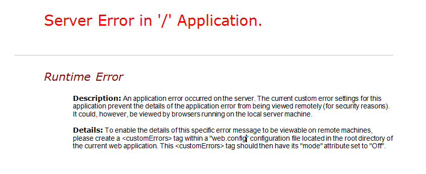
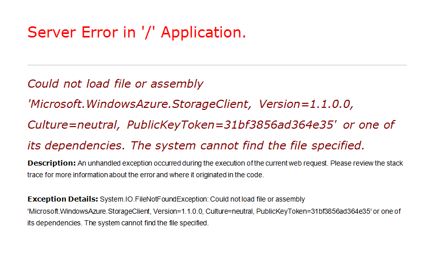
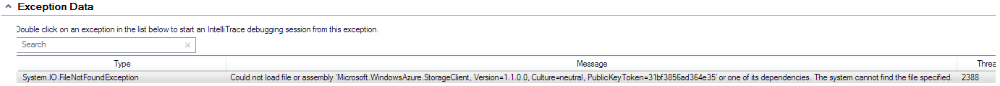

<properties 
   pageTitle="Troubleshooting Roles That Fail to Start"
   description=""
   services="cloud-services"
   documentationCenter=""
   authors="Thraka"
   manager="timlt"
   editor=""/>
<tags 
   ms.service="cloud-services"
   ms.devlang="na"
   ms.topic="article"
   ms.tgt_pltfrm="na"
   ms.workload="tbd"
   ms.date="05/12/2015"
   ms.author="adegeo" />

## Troubleshooting Roles That Fail to Start

**Applies to:** Azure SDK 1.0 and later

Unresponsive roles and roles that are cycling between initializing-busy-stopping states can be caused by missing DLLs or assemblies.

**Symptom:**  Symptoms of missing DLLs or assemblies can be:

- Your role instance is cycling between ‘initializing / busy / stopping’

- Your role instance has moved to ‘ready’ but navigating to your web application the page does not come up

Resolution:  There are three recommended methods for investigating these issues.

### Diagnosing missing DLL issues in a web role

When you navigate to a web site that is deployed in a web role and the browser displays a server error similar to the one below:

#### Diagnose issues by turning off custom errors

More complete errors can be viewed by configuring the web.config for the web role to set the custom error mode to off and redeploying the service.

To view more complete errors without using Remote Desktop:

1. Open the solution in Visual Studio.

1. In the **Solution Explorer**, locate the web.config file and open it.

1. In the web.config file, locate the system.web section and add the following line:  

			<customErrors mode="Off" />

1. Save the file.

1. Repackage and redeploy the service.

Once the service is redeployed you will see the error below with the name of the missing assembly or DLL.

#### Diagnose issues by viewing the error remotely

You can use remote desktop to access the role and view more complete errors remotely.

Use the following steps to view the errors using Remote Desktop:

1. Ensure that Azure SDK 1.3 or higher is installed.

1. During the deployment of the solution using Visual Studio, choose to “Configure Remote Desktop connections…” For more information on configuring the Remote Desktop connection, see [Using Remote Desktop with Azure Roles](https://msdn.microsoft.com/library/gg443832.aspx).

1. In the Microsoft Azure Management Portal, once the instance shows a status of **Ready**, click on one of the role instances.

1. Click the **Connect** icon in the **Remote Access** area of the ribbon

1. Log into the virtual machine using the credentials specified during the Remote Desktop configuration.

1. Open a command prompt.

1. Type IPconfig.

1. Note the IPV4 Address value.

1. Open Internet Explorer.

1. Type the address and the name of the web application. For example, http://<IPV4 Address>/default.aspx.

Navigating to the web site will return more explicit error messages.

- Server Error in ‘/’ Application

- Description: An unhandled exception occurred during the execution of the current web request. Please review the stack trace for more information about the error and where it originated in the code.

- Exception Details: System.IO.FIleNotFoundException: Could not load file or assembly ‘Microsoft.WindowsAzure.StorageClient, Version=1.1.0.0, Culture=neutral, PublicKeyToken=31bf856ad364e35’ or one of its dependencies. The system cannot find the file specified.

For example:

### Diagnose issues using the Compute Emulator

You can use the Azure Microsoft Azure compute emulator to diagnose and troubleshoot issues of missing dependencies and web.config errors.

For best results in using this method of diagnosis, you should use a computer or virtual machine that has a clean installation of Windows. To best simulate the Azure environment you should use Windows Server 2008 R2 x64.

1. Install the standalone version of the Azure SDK from [https://azure.microsoft.com/downloads](https://http://azure.microsoft.com/downloads).

1. On the development machine build the cloud service project.

1. In Windows Explorer, navigate to the bin\debug folder of the Cloud Service project.

1. Copy the .csx folder and .cscfg file to the computer you are using to debug the issues.

1. On the clean machine open a Azure SDK Command Prompt and type `csrun.exe /devstore:start`.

1. In the Command Prompt type `run csrun <path to .csx folder> <path to .cscfg file> /launchBrowser`.

1. When the role starts you will see detailed error information in Internet Explorer.  You can also use standard Windows troubleshooting tools to further diagnose the problem.

### Diagnose issues using IntelliTrace

For worker and web roles that use .NET Framework 4, you can use [IntelliTrace](https://msdn.microsoft.com/library/dd264915.aspx) which is available in [Microsoft Visual Studio Ultimate](https://www.visualstudio.com/products/visual-studio-ultimate-with-MSDN-vs).

Follow these steps to deploy the service with IntelliTrace enabled:

1. Confirm that Azure SDK 1.3 or higher is installed.

1. Deploy the solution using Visual Studio. During deployment, check the **Enable IntelliTrace for .NET 4 roles** checkbox.

1. Once the instance starts, open the **Server Explorer**.

1. Expand the** Windows Azure Compute** node and locate the deployment.

1. Expand the deployment until you see the role instances.   
	Right click on one of the instances.

1. Choose **View IntelliTrace logs**. The **IntelliTrace Summary** will open.

1. Locate the exceptions section of the summary. If there are exceptions it will be labeled **Exception Data**.

1. Expand the **Exception Data** and look for **System.IO.FileNotFoundException** errors similar to the following:

### Addressing missing DLLs and assemblies

To address missing DLL and assembly errors, follow these steps:

1. Open the solution in Visual Studio.

1. In the **Solution Explorer**, open the **References** folder.

1. Click on the assembly identified in the error.

1. In the **Properties** pane and Locate the Copy Local property and set the value to **True**.

1. Redeploy the hosted service.

Once it has been verified that all errors have been corrected, the service can be deployed without the **Enable IntelliTrace for .NET 4 roles** setting checked.

### See Also

[Common Issues Which Cause Roles to Recycle](https://msdn.microsoft.com/library/gg465402)

