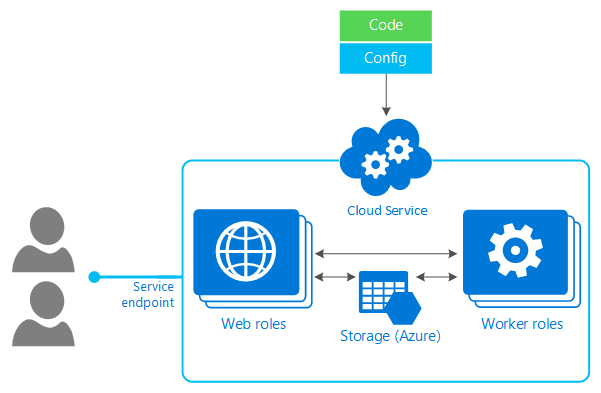

<properties
	pageTitle="Azure compute options - Cloud Services | Microsoft Azure"
	description="Learn about Azure compute hosting options and how they work: App Service, Cloud Services, and Virtual Machines"
	services="cloud-services"
    documentationCenter=""
	authors="Thraka"
	manager="timlt"/>

<tags
	ms.service="multiple"
	ms.workload="multiple"
	ms.tgt_pltfrm="na"
	ms.devlang="na"
	ms.topic="article"
	ms.date="07/05/2016"
	ms.author="adegeo"/>

# Should I choose cloud services or something else?

Is Azure Cloud Services the choice for you? Azure provides different hosting models for running applications. Each one provides a different set of services, so which one you choose depends on exactly what you're trying to do.

[AZURE.INCLUDE [compute-table](../../includes/compute-options-table.md)]

## Tell me about cloud services

Cloud Services is an example of [Platform-as-a-Service](https://azure.microsoft.com/overview/what-is-paas/) (PaaS). Like [App Service](../app-service-web/app-service-web-overview.md), this technology is designed to support applications that are scalable, reliable, and cheap to operate. Just like an App Service is hosted on VMs, so too are Cloud Services, however, you have more control over the VMs. You can install your own software on Cloud Service VMs and you can remote into them.

More control also means less ease of use; unless you need the  additional control options, it's typically quicker and easier to get a web application up and running in Web Apps in App Service compared to Cloud Services.

The technology provides two slightly different VM options: instances of *web roles* run a variant of Windows Server with IIS, while instances of *worker roles* run the same Windows Server variant without IIS. A Cloud Services application relies on some combination of these two options.

Any combination of these two slightly different VM hosting options are available in a cloud service:

* **Web role**  
  Runs Windows Server with your web app automatically deployed to IIS.

* **Worker role**  
  Runs Windows Server without IIS.

For example, a simple application might use just a web role, while a more complex application might use a web role to handle incoming requests from users, then pass the work those requests create to a worker role for processing. (This communication could use [Service Bus](../service-bus/service-bus-fundamentals-hybrid-solutions.md) or [Azure Queues](../storage/storage-introduction.md).)

As the figure above suggests, all of the VMs in a single application run in the same cloud service. Because of this, users access the application through a single public IP address, with requests automatically load balanced across the application's VMs. The platform will [scale and deploy](cloud-services-how-to-scale.md) the VMs in a Cloud Services application in a way that avoids a single point of hardware failure.

Even though applications run in virtual machines, it's important to understand that Cloud Services provides PaaS, not IaaS. Here's one way to think about it: With IaaS, such as Azure Virtual Machines, you first create and configure the environment your application will run in, then deploy your application into this environment. You're responsible for managing much of this world, doing things such as deploying new patched versions of the operating system in each VM. In PaaS, by contrast, it's as if the environment already exists. All you have to do is deploy your application. Management of the platform it runs on, including deploying new versions of the operating system, is handled for you.

## Scaling and management
With Cloud Services, you don't create virtual machines. Instead, you provide a configuration file that tells Azure how many of each you'd like, such as **three web role instances** and **two worker role instances**, and the platform creates them for you.  You still choose [what size](cloud-services-sizes-specs.md) those backing VMs should be, but you don't explicitly create them yourself. If your application needs to handle a greater load, you can ask for more VMs, and Azure will create those instances. If the load decreases, you can shut those instances down and stop paying for them.

A Cloud Services application is typically made available to users via a two-step process. A developer first [uploads the application](cloud-services-how-to-create-deploy.md) to the platform's staging area. When the developer is ready to make the application live, they use the Azure Management Portal to request that it be put into production. This [switch between staging and production](cloud-services-nodejs-stage-application.md) can be done with no downtime, which lets a running application be upgraded to a new version without disturbing its users.

## Monitoring
Cloud Services also provides monitoring. Like Azure Virtual Machines, it will detect a failed physical server and restart the VMs that were running on that server on a new machine. But Cloud Services also detects failed VMs and applications, not just hardware failures. Unlike Virtual Machines, it has an agent inside each web and worker role, and so it's able to start new VMs and application instances when failures occur.

The PaaS nature of Cloud Services has other implications, too. One of the most important is that applications built on this technology should be written to run correctly when any web or worker role instance fails. To achieve this, a Cloud Services application shouldn't maintain state in the file system of its own VMs. Unlike VMs created with Azure Virtual Machines, writes made to Cloud Services VMs aren't persistent; there's nothing like a Virtual Machines data disk. Instead, a Cloud Services application should explicitly write all state to SQL Database, blobs, tables, or some other external storage. Building applications this way makes them easier to scale and more resistant to failure, both important goals of Cloud Services.

## Next steps
[Create a cloud service app in .NET](cloud-services-dotnet-get-started.md)  
[Create a cloud service app in Node.js](cloud-services-nodejs-develop-deploy-app.md)  
[Create a cloud service app in PHP](../cloud-services-php-create-web-role.md)  
[Create a cloud service app in Python](../cloud-services-python-ptvs.md)
