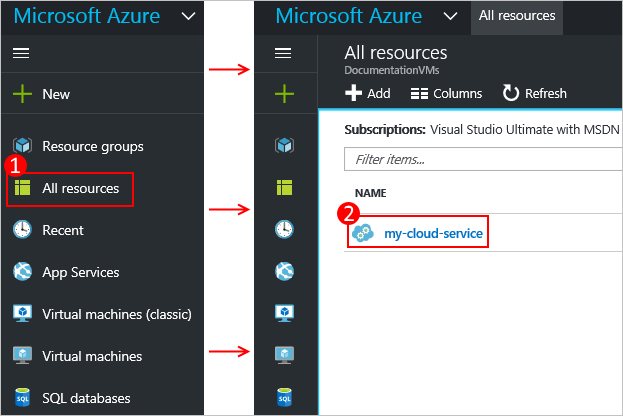
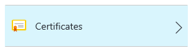
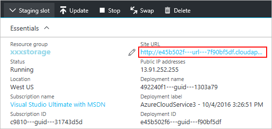
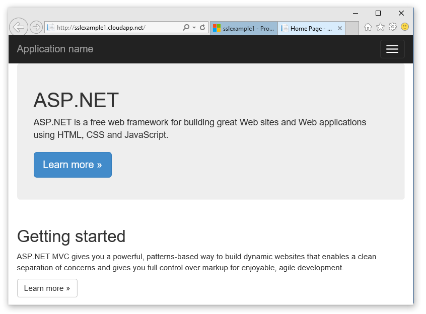

# Configuring SSL for an application in Azure

Secure Socket Layer (SSL) encryption is the most commonly used method of securing data sent across the internet. This common task discusses how to specify an HTTPS endpoint for a web role and how to upload an SSL certificate to secure your application.

> [!NOTE]
> The procedures in this task apply to Azure Cloud Services; for App Services, see [this](../app-service/app-service-web-tutorial-custom-ssl.md).
>

This task uses a production deployment. Information on using a staging deployment is provided at the end of this topic.

Read [this](cloud-services-how-to-create-deploy-portal.md) first if you have not yet created a cloud service.

## Step 1: Get an SSL certificate
To configure SSL for an application, you first need to get an SSL certificate that has been signed by a Certificate Authority (CA), a trusted third party who issues certificates for this purpose. If you do not already have one, you need to obtain one from a company that sells SSL certificates.

The certificate must meet the following requirements for SSL certificates in Azure:

* The certificate must contain a private key.
* The certificate must be created for key exchange, exportable to a Personal Information Exchange (.pfx) file.
* The certificate's subject name must match the domain used to access the cloud service. You cannot obtain an SSL certificate from a certificate authority (CA) for the cloudapp.net domain. You must acquire a custom domain name to use when access your service. When you request a certificate from a CA, the certificate's subject name must match the custom domain name used to access your application. For example, if your custom domain name is **contoso.com** you would request a certificate from your CA for ***.contoso.com** or **www\.contoso.com**.
* The certificate must use a minimum of 2048-bit encryption.

For test purposes, you can [create](cloud-services-certs-create.md) and use a self-signed certificate. A self-signed certificate is not authenticated through a CA and can use the cloudapp.net domain as the website URL. For example, the following task uses a self-signed certificate in which the common name (CN) used in the certificate is **sslexample.cloudapp.net**.

Next, you must include information about the certificate in your service definition and service configuration files.

<a name="modify"> </a>

## Step 2: Modify the service definition and configuration files
Your application must be configured to use the certificate, and an HTTPS endpoint must be added. As a result, the service definition and service configuration files need to be updated.

1. In your development environment, open the service definition file
   (CSDEF), add a **Certificates** section within the **WebRole**
   section, and include the following information about the
   certificate (and intermediate certificates):

   ```xml
    <WebRole name="CertificateTesting" vmsize="Small">
    ...
        <Certificates>
            <Certificate name="SampleCertificate"
                        storeLocation="LocalMachine"
                        storeName="My"
                        permissionLevel="limitedOrElevated" />
            <!-- IMPORTANT! Unless your certificate is either
            self-signed or signed directly by the CA root, you
            must include all the intermediate certificates
            here. You must list them here, even if they are
            not bound to any endpoints. Failing to list any of
            the intermediate certificates may cause hard-to-reproduce
            interoperability problems on some clients.-->
            <Certificate name="CAForSampleCertificate"
                        storeLocation="LocalMachine"
                        storeName="CA"
                        permissionLevel="limitedOrElevated" />
        </Certificates>
    ...
    </WebRole>
    ```

   The **Certificates** section defines the name of our certificate, its location, and the name of the store where it is located.

   Permissions (`permissionLevel` attribute) can be set to one of the following values:

   | Permission Value | Description |
   | --- | --- |
   | limitedOrElevated |**(Default)** All role processes can access the private key. |
   | elevated |Only elevated processes can access the private key. |

2. In your service definition file, add an **InputEndpoint** element
   within the **Endpoints** section to enable HTTPS:

   ```xml
    <WebRole name="CertificateTesting" vmsize="Small">
    ...
        <Endpoints>
            <InputEndpoint name="HttpsIn" protocol="https" port="443"
                certificate="SampleCertificate" />
        </Endpoints>
    ...
    </WebRole>
    ```

3. In your service definition file, add a **Binding** element within
   the **Sites** section. This element adds an HTTPS binding to map the
   endpoint to your site:

   ```xml
    <WebRole name="CertificateTesting" vmsize="Small">
    ...
        <Sites>
            <Site name="Web">
                <Bindings>
                    <Binding name="HttpsIn" endpointName="HttpsIn" />
                </Bindings>
            </Site>
        </Sites>
    ...
    </WebRole>
    ```

   All the required changes to the service definition file have been
   completed; but, you still need to add the certificate information to
   the service configuration file.
4. In your service configuration file (CSCFG), ServiceConfiguration.Cloud.cscfg, add a **Certificates**
value with that of your certificate. The following code sample provides
   details of the **Certificates** section, except for the thumbprint value.

   ```xml
    <Role name="Deployment">
    ...
        <Certificates>
            <Certificate name="SampleCertificate"
                thumbprint="9427befa18ec6865a9ebdc79d4c38de50e6316ff"
                thumbprintAlgorithm="sha1" />
            <Certificate name="CAForSampleCertificate"
                thumbprint="79d4c38de50e6316ff9427befa18ec6865a9ebdc"
                thumbprintAlgorithm="sha1" />
        </Certificates>
    ...
    </Role>
    ```

(This example uses **sha1** for the thumbprint algorithm. Specify the appropriate value for your certificate's thumbprint algorithm.)

Now that the service definition and service configuration files have
been updated, package your deployment for uploading to Azure. If
you are using **cspack**, don't use the
**/generateConfigurationFile** flag, as that will overwrite the
certificate information you just inserted.

## Step 3: Upload a certificate
Connect to the Azure portal and...

1. In the **All resources** section of the Portal, select your cloud service.

    

2. Click **Certificates**.

    

3. Click **Upload** at the top of the certificates area.

    

4. Provide the **File**, **Password**, then click **Upload** at the bottom of the data entry area.

## Step 4: Connect to the role instance by using HTTPS
Now that your deployment is up and running in Azure, you can
connect to it using HTTPS.

1. Click the **Site URL** to open up the web browser.

   

2. In your web browser, modify the link to use **https** instead of **http**, and then visit the page.

   > [!NOTE]
   > If you are using a self-signed certificate, when you browse to an HTTPS endpoint that's associated with the self-signed certificate you may see a certificate error in the browser. Using a certificate signed by a trusted certification authority eliminates this problem; in the meantime, you can ignore the error. (Another option is to add the self-signed certificate to the user's trusted certificate authority certificate store.)
   >
   >

   

   > [!TIP]
   > If you want to use SSL for a staging deployment instead of a production deployment, you'll first need to determine the URL used for the staging deployment. Once your cloud service has been deployed, the URL to the staging environment is determined by the **Deployment ID** GUID in this format: `https://deployment-id.cloudapp.net/`  
   >
   > Create a certificate with the common name (CN) equal to the GUID-based URL (for example, **328187776e774ceda8fc57609d404462.cloudapp.net**). Use the portal to add the certificate to your staged cloud service. Then, add the certificate information to your CSDEF and CSCFG files, repackage your application, and update your staged deployment to use the new package.
   >

## Next steps
* [General configuration of your cloud service](cloud-services-how-to-configure-portal.md).
* Learn how to [deploy a cloud service](cloud-services-how-to-create-deploy-portal.md).
* Configure a [custom domain name](cloud-services-custom-domain-name-portal.md).
* [Manage your cloud service](cloud-services-how-to-manage-portal.md).
