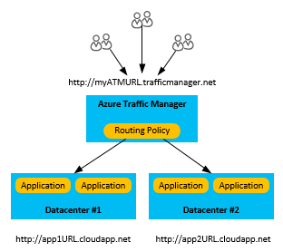

# What to do in the event of an Azure service disruption that impacts Azure Cloud Services
At Microsoft, we work hard to make sure that our services are always available to you when you need them. Forces beyond our control sometimes impact us in ways that cause unplanned service disruptions.

Microsoft provides a Service Level Agreement (SLA) for its services as a commitment for uptime and connectivity. The SLA for individual Azure services can be found at [Azure Service Level Agreements](https://azure.microsoft.com/support/legal/sla/).

Azure already has many built-in platform features that support highly available applications. For more about these services, read [Disaster recovery and high availability for Azure applications](../resiliency/resiliency-disaster-recovery-high-availability-azure-applications.md).

This article covers a true disaster recovery scenario, when a whole region experiences an outage due to major natural disaster or widespread service interruption. These are rare occurrences, but you must prepare for the possibility that there is an outage of an entire region. If an entire region experiences a service disruption, the locally redundant copies of your data would temporarily be unavailable. If you have enabled geo-replication, three additional copies of your Azure Storage blobs and tables are stored in a different region. In the event of a complete regional outage or a disaster in which the primary region is not recoverable, Azure remaps all of the DNS entries to the geo-replicated region.

> [!NOTE]
> Be aware that you do not have any control over this process, and it will only occur for datacenter-wide service disruptions. Because of this, you must also rely on other application-specific backup strategies to achieve the highest level of availability. For more information, see [Disaster recovery and high availability for applications built on Microsoft Azure](../resiliency/resiliency-disaster-recovery-high-availability-azure-applications.md). If you would like to be able to affect your own failover, you might want to consider the use of [read-access geo-redundant storage (RA-GRS)](../storage/common/storage-redundancy.md), which creates a read-only copy of your data in another region.
>
>

## Option 1: Use a backup deployment through Azure Traffic Manager
The most robust disaster recovery solution involves maintaining multiple deployments of your application in different regions, then using [Azure Traffic Manager](../traffic-manager/traffic-manager-overview.md) to direct traffic between them. Azure Traffic Manager provides multiple [routing methods](../traffic-manager/traffic-manager-routing-methods.md), so you can choose whether to manage your deployments using a primary/backup model or to split traffic between them.

For the fastest response to the loss of a region, it is important that you configure Traffic Manager's [endpoint monitoring](../traffic-manager/traffic-manager-monitoring.md).

## Option 2: Deploy your application to a new region
Maintaining multiple active deployments as described in the previous option incurs additional ongoing costs. If your recovery time objective (RTO) is flexible enough and you have the original code or compiled Cloud Services package, you can create a new instance of your application in another region and update your DNS records to point to the new deployment.

For more detail about how to create and deploy a cloud service application, see [How to create and deploy a cloud service](cloud-services-how-to-create-deploy-portal.md).

Depending on your application data sources, you may need to check the recovery procedures for your application data source.

* For Azure Storage data sources, see [Azure Storage redundancy](../storage/common/storage-redundancy.md) to check on the options that are available based on the chosen redundancy model for your application.
* For SQL Database sources, read [Overview: Cloud business continuity and database disaster recovery with SQL Database](../azure-sql/database/business-continuity-high-availability-disaster-recover-hadr-overview.md) to check on the options that are available based on the chosen replication model for your application.

## Option 3: Wait for recovery
In this case, no action on your part is required, but your service will be unavailable until the region is restored. You can see the current service status on the [Azure Service Health Dashboard](https://azure.microsoft.com/status/).

## Next steps
To learn more about how to implement a disaster recovery and high availability strategy, see [Disaster recovery and high availability for Azure applications](../resiliency/resiliency-disaster-recovery-high-availability-azure-applications.md).

To develop a detailed technical understanding of a cloud platform’s capabilities, see [Azure resiliency technical guidance](/azure/architecture/checklist/resiliency-per-service).