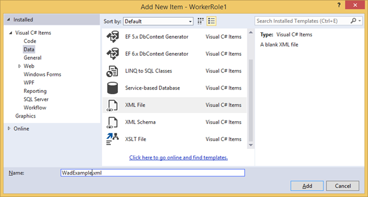

# Enabling Azure Diagnostics in Azure Cloud Services (classic)

[!INCLUDE [Cloud Services (classic) deprecation announcement](includes/deprecation-announcement.md)]

See [Azure Diagnostics Overview](../azure-monitor/agents/diagnostics-extension-overview.md) for a background on Azure Diagnostics.

## How to Enable Diagnostics in a Worker Role
This walkthrough describes how to implement an Azure worker role that emits telemetry data using the .NET EventSource class. Azure Diagnostics is used to collect the telemetry data and store it in an Azure storage account. When creating a worker role, Visual Studio automatically enables Diagnostics 1.0 as part of the solution in Azure SDKs for .NET 2.4 and earlier. The following instructions describe the process for creating the worker role, disabling Diagnostics 1.0 from the solution, and deploying Diagnostics 1.2 or 1.3 to your worker role.

### Prerequisites
This article assumes you have an Azure subscription and are using Visual Studio with the Azure SDK. If you do not have an Azure subscription, you can sign up for the [Free Trial][Free Trial]. Make sure to [Install and configure Azure PowerShell version 0.8.7 or later][Install and configure Azure PowerShell version 0.8.7 or later].

### Step 1: Create a Worker Role
1. Launch **Visual Studio**.
2. Create an **Azure Cloud Service** project from the **Cloud** template that targets .NET Framework 4.5.  Name the project "WadExample" and click Ok.
3. Select **Worker Role** and click Ok. The project will be created.
4. In **Solution Explorer**, double-click the **WorkerRole1** properties file.
5. In the **Configuration** tab, un-check **Enable Diagnostics** to disable Diagnostics 1.0 (Azure SDK 2.4 and earlier).
6. Build your solution to verify that you have no errors.

### Step 2: Instrument your code
Replace the contents of WorkerRole.cs with the following code. The class SampleEventSourceWriter, inherited from the [EventSource Class][EventSource Class], implements four logging methods: **SendEnums**, **MessageMethod**, **SetOther** and **HighFreq**. The first parameter to the **WriteEvent** method defines the ID for the respective event. The Run method implements an infinite loop that calls each of the logging methods implemented in the **SampleEventSourceWriter** class every 10 seconds.

```csharp
using Microsoft.WindowsAzure.ServiceRuntime;
using System;
using System.Diagnostics;
using System.Diagnostics.Tracing;
using System.Net;
using System.Threading;

namespace WorkerRole1
{
    sealed class SampleEventSourceWriter : EventSource
    {
        public static SampleEventSourceWriter Log = new SampleEventSourceWriter();
        public void SendEnums(MyColor color, MyFlags flags) { if (IsEnabled())  WriteEvent(1, (int)color, (int)flags); }// Cast enums to int for efficient logging.
        public void MessageMethod(string Message) { if (IsEnabled())  WriteEvent(2, Message); }
        public void SetOther(bool flag, int myInt) { if (IsEnabled())  WriteEvent(3, flag, myInt); }
        public void HighFreq(int value) { if (IsEnabled()) WriteEvent(4, value); }

    }

    enum MyColor
    {
        Red,
        Blue,
        Green
    }

    [Flags]
    enum MyFlags
    {
        Flag1 = 1,
        Flag2 = 2,
        Flag3 = 4
    }

    public class WorkerRole : RoleEntryPoint
    {
        public override void Run()
        {
            // This is a sample worker implementation. Replace with your logic.
            Trace.TraceInformation("WorkerRole1 entry point called");

            int value = 0;

            while (true)
            {
                Thread.Sleep(10000);
                Trace.TraceInformation("Working");

                // Emit several events every time we go through the loop
                for (int i = 0; i < 6; i++)
                {
                    SampleEventSourceWriter.Log.SendEnums(MyColor.Blue, MyFlags.Flag2 | MyFlags.Flag3);
                }

                for (int i = 0; i < 3; i++)
                {
                    SampleEventSourceWriter.Log.MessageMethod("This is a message.");
                    SampleEventSourceWriter.Log.SetOther(true, 123456789);
                }

                if (value == int.MaxValue) value = 0;
                SampleEventSourceWriter.Log.HighFreq(value++);
            }
        }

        public override bool OnStart()
        {
            // Set the maximum number of concurrent connections
            ServicePointManager.DefaultConnectionLimit = 12;

            // For information on handling configuration changes
            // see the MSDN topic at https://go.microsoft.com/fwlink/?LinkId=166357.

            return base.OnStart();
        }
    }
}
```


### Step 3: Deploy your Worker Role

[!INCLUDE [cloud-services-wad-warning](../../includes/cloud-services-wad-warning.md)]

1. Deploy your worker role to Azure from within Visual Studio by selecting the **WadExample** project in the Solution Explorer then **Publish** from the **Build** menu.
2. Choose your subscription.
3. In the **Microsoft Azure Publish Settings** dialog, select **Create New…**.
4. In the **Create Cloud Service and Storage Account** dialog, enter a **Name** (for example, "WadExample") and select a region or affinity group.
5. Set the **Environment** to **Staging**.
6. Modify any other **Settings** as appropriate and click **Publish**.
7. After deployment has completed, verify in the Azure portal that your cloud service is in a **Running** state.

### Step 4: Create your Diagnostics configuration file and install the extension
1. Download the public configuration file schema definition by executing the following PowerShell command:

    ```powershell
    (Get-AzureServiceAvailableExtension -ExtensionName 'PaaSDiagnostics' -ProviderNamespace 'Microsoft.Azure.Diagnostics').PublicConfigurationSchema | Out-File -Encoding utf8 -FilePath 'WadConfig.xsd'
    ```
2. Add an XML file to your **WorkerRole1** project by right-clicking on the **WorkerRole1** project and select **Add** -> **New Item…** -> **Visual C# items** -> **Data** -> **XML File**. Name the file "WadExample.xml".

   
3. Associate the WadConfig.xsd with the configuration file. Make sure the WadExample.xml editor window is the active window. Press **F4** to open the **Properties** window. Click the **Schemas** property in the **Properties** window. Click the **…** in the **Schemas** property. Click the **Add…** button and navigate to the location where you saved the XSD file and select the file WadConfig.xsd. Click **OK**.

4. Replace the contents of the WadExample.xml configuration file with the following XML and save the file. This configuration file defines a couple performance counters to collect: one for CPU utilization and one for memory utilization. Then the configuration defines the four events corresponding to the methods in the SampleEventSourceWriter class.

```xml
<?xml version="1.0" encoding="utf-8"?>
<PublicConfig xmlns="http://schemas.microsoft.com/ServiceHosting/2010/10/DiagnosticsConfiguration">
  <WadCfg>
    <DiagnosticMonitorConfiguration overallQuotaInMB="25000">
      <PerformanceCounters scheduledTransferPeriod="PT1M">
        <PerformanceCounterConfiguration counterSpecifier="\Processor(_Total)\% Processor Time" sampleRate="PT1M" unit="percent" />
        <PerformanceCounterConfiguration counterSpecifier="\Memory\Committed Bytes" sampleRate="PT1M" unit="bytes"/>
      </PerformanceCounters>
      <EtwProviders>
        <EtwEventSourceProviderConfiguration provider="SampleEventSourceWriter" scheduledTransferPeriod="PT5M">
          <Event id="1" eventDestination="EnumsTable"/>
          <Event id="2" eventDestination="MessageTable"/>
          <Event id="3" eventDestination="SetOtherTable"/>
          <Event id="4" eventDestination="HighFreqTable"/>
          <DefaultEvents eventDestination="DefaultTable" />
        </EtwEventSourceProviderConfiguration>
      </EtwProviders>
    </DiagnosticMonitorConfiguration>
  </WadCfg>
</PublicConfig>
```

### Step 5: Install Diagnostics on your Worker Role
The PowerShell cmdlets for managing Diagnostics on a web or worker role are: Set-AzureServiceDiagnosticsExtension, Get-AzureServiceDiagnosticsExtension, and Remove-AzureServiceDiagnosticsExtension.

1. Open Azure PowerShell.
2. Execute the script to install Diagnostics on your worker role (replace *StorageAccountKey* with the storage account key for your wadexample storage account and *config_path* with the path to the *WadExample.xml* file):

```powershell
$storage_name = "wadexample"
$key = "<StorageAccountKey>"
$config_path="c:\users\<user>\documents\visual studio 2013\Projects\WadExample\WorkerRole1\WadExample.xml"
$service_name="wadexample"
$storageContext = New-AzureStorageContext -StorageAccountName $storage_name -StorageAccountKey $key
Set-AzureServiceDiagnosticsExtension -StorageContext $storageContext -DiagnosticsConfigurationPath $config_path -ServiceName $service_name -Slot Staging -Role WorkerRole1
```

### Step 6: Look at your telemetry data
In the Visual Studio **Server Explorer**, navigate to the wadexample storage account. After the cloud service has been running about five (5) minutes, you should see the tables **WADEnumsTable**, **WADHighFreqTable**, **WADMessageTable**, **WADPerformanceCountersTable** and **WADSetOtherTable**. Double-click one of the tables to view the telemetry that has been collected.


## Configuration File Schema
The Diagnostics configuration file defines values that are used to initialize diagnostic configuration settings when the diagnostics agent starts. See the [latest schema reference](../azure-monitor/agents/diagnostics-extension-versions.md) for valid values and examples.

## Troubleshooting
If you have trouble, see [Troubleshooting Azure Diagnostics](../azure-monitor/agents/diagnostics-extension-troubleshooting.md) for help with common problems.

## Next Steps
[See a list of related Azure virtual-machine diagnostic articles](../azure-monitor/agents/diagnostics-extension-overview.md) to change the data you are collecting, troubleshoot problems or learn more about diagnostics in general.

[EventSource Class]: /dotnet/api/system.diagnostics.tracing.eventsource

[Debugging an Azure Application]: https://msdn.microsoft.com/library/windowsazure/ee405479.aspx   
[Collect Logging Data by Using Azure Diagnostics]: /previous-versions/azure/gg433048(v=azure.100)
[Free Trial]: https://azure.microsoft.com/pricing/free-trial/
[Install and configure Azure PowerShell version 0.8.7 or later]: /powershell/azure/
