<properties
	pageTitle="Get started with Azure Cloud Services and ASP.NET | Microsoft Azure"
	description="Learn how to create a multi-tier app using ASP.NET MVC and Azure. The app runs in a cloud service, with web role and worker role. It uses Entity Framework, SQL Database, and Azure Storage queues and blobs."
	services="cloud-services, storage"
	documentationCenter=".net"
	authors="Thraka"
	manager="timlt"
	editor=""/>

<tags
	ms.service="cloud-services"
	ms.workload="tbd"
	ms.tgt_pltfrm="na"
	ms.devlang="dotnet"
	ms.topic="hero-article"
	ms.date="06/10/2016"
	ms.author="adegeo"/>

# Get started with Azure Cloud Services and ASP.NET

> [AZURE.SELECTOR]
- [Node.js](cloud-services-nodejs-develop-deploy-app.md)
- [.NET](cloud-services-dotnet-get-started.md)

## Overview

This tutorial shows how to create a multi-tier .NET application with an ASP.NET MVC front-end, and deploy it to an [Azure cloud service](cloud-services-choose-me.md). The application uses [Azure SQL Database](http://msdn.microsoft.com/library/azure/ee336279), the [Azure Blob service](http://www.asp.net/aspnet/overview/developing-apps-with-windows-azure/building-real-world-cloud-apps-with-windows-azure/unstructured-blob-storage), and the [Azure Queue service](http://www.asp.net/aspnet/overview/developing-apps-with-windows-azure/building-real-world-cloud-apps-with-windows-azure/queue-centric-work-pattern). You can [download the Visual Studio project](http://code.msdn.microsoft.com/Simple-Azure-Cloud-Service-e01df2e4) from the MSDN Code Gallery.

The tutorial shows you how to build and run the application locally, how to deploy it to Azure and run in the cloud, and finally how to build it from scratch. You can start by building from scratch and then do the test and deploy steps afterward if you prefer.

## Contoso Ads application

The application is an advertising bulletin board. Users create an ad by entering text and uploading an image. They can see a list of ads with thumbnail images, and they can see the full size image when they select an ad to see the details.

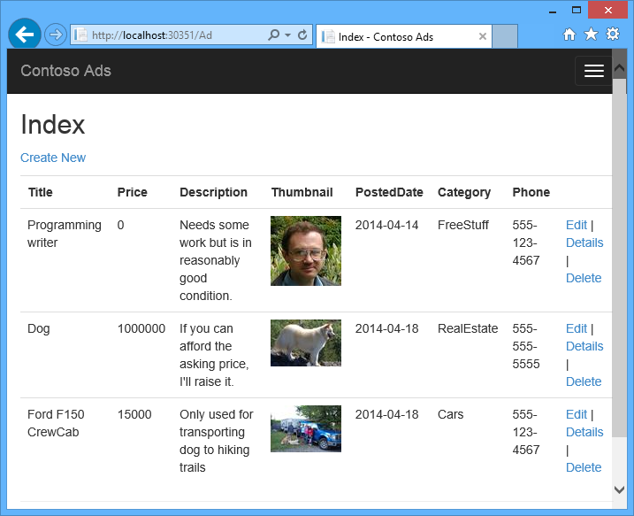

The application uses the [queue-centric work pattern](http://www.asp.net/aspnet/overview/developing-apps-with-windows-azure/building-real-world-cloud-apps-with-windows-azure/queue-centric-work-pattern) to off-load the CPU-intensive work of creating thumbnails to a back-end process.

## Alternative architecture: Websites and WebJobs

This tutorial shows how to run both front-end and back-end in an Azure cloud service. An alternative is to run the front-end in an [Azure website](/services/web-sites/) and use the [WebJobs](http://go.microsoft.com/fwlink/?LinkId=390226) feature (currently in preview) for the back-end. For a tutorial that uses WebJobs, see [Get Started with the Azure WebJobs SDK](../app-service-web/websites-dotnet-webjobs-sdk-get-started.md). For information about how to choose the services that best fit your scenario, see [Azure Websites, Cloud Services, and virtual machines comparison](../app-service-web/choose-web-site-cloud-service-vm.md).

## What you'll learn

* How to enable your machine for Azure development by installing the Azure SDK.
* How to create a Visual Studio cloud service project with an ASP.NET MVC web role and a worker role.
* How to test the cloud service project locally, using the Azure storage emulator.
* How to publish the cloud project to an Azure cloud service and test using an Azure storage account.
* How to upload files and store them in the Azure Blob service.
* How to use the Azure Queue service for communication between tiers.

## Prerequisites

The tutorial assumes that you understand [basic concepts about Azure cloud services](cloud-services-choose-me.md) such as *web role* and *worker role* terminology.  It also assumes that you know how to work with [ASP.NET MVC](http://www.asp.net/mvc/tutorials/mvc-5/introduction/getting-started) or [Web Forms](http://www.asp.net/web-forms/tutorials/aspnet-45/getting-started-with-aspnet-45-web-forms/introduction-and-overview) projects in Visual Studio. The sample application uses MVC, but most of the tutorial also applies to Web Forms.

You can run the app locally without an Azure subscription, but you'll need one in order to deploy the application to the cloud. If you don't have an account, you can [activate your MSDN subscriber benefits](/pricing/member-offers/msdn-benefits-details/?WT.mc_id=A55E3C668) or [sign up for a free trial](/pricing/free-trial/?WT.mc_id=A55E3C668).

The tutorial instructions work with either of the following products:

* Visual Studio 2013
* Visual Studio 2015

If you don't have one of these, Visual Studio 2015 will be installed automatically when you install the Azure SDK.

## Application architecture

The app stores ads in a SQL database, using Entity Framework Code First to create the tables and access the data. For each ad the database stores two URLs, one for the full-size image and one for the thumbnail.


When a user uploads an image, the front-end running in a web role stores the image in an [Azure blob](http://www.asp.net/aspnet/overview/developing-apps-with-windows-azure/building-real-world-cloud-apps-with-windows-azure/unstructured-blob-storage), and it stores the ad information in the database with a URL that points to the blob. At the same time, it writes a message to an Azure queue. A back-end process running in a worker role periodically polls the queue for new messages. When a new message appears, the worker role creates a thumbnail for that image and updates the thumbnail URL database field for that ad. The following diagram shows how the parts of the application interact.

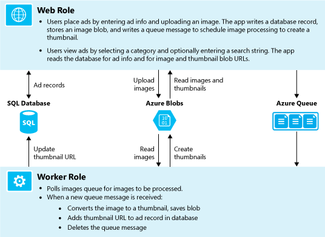

[AZURE.INCLUDE [install-sdk](../../includes/install-sdk-2015-2013.md)]

## Download and run the completed solution

1. Download and unzip the [completed solution](http://code.msdn.microsoft.com/Simple-Azure-Cloud-Service-e01df2e4).

2. Start Visual Studio.

3. From the **File** menu choose **Open Project**, navigate to where you downloaded the solution, and then open the solution file.

3. Press CTRL+SHIFT+B to build the solution.

	By default, Visual Studio automatically restores the NuGet package content, which was not included in the *.zip* file. If the packages don't restore, install them manually by going to the **Manage NuGet Packages for Solution** dialog box and clicking the **Restore** button at the top right.

3. In **Solution Explorer**, make sure that **ContosoAdsCloudService** is selected as the startup project.

2. If you're using Visual Studio 2015, change the SQL Server connection string in the application *Web.config* file of the ContosoAdsWeb project and in the *ServiceConfiguration.Local.cscfg* file of the ContosoAdsCloudService project. In each case, change "(localdb)\v11.0" to "(localdb)\MSSQLLocalDB".

1. Press CTRL+F5 to run the application.

	When you run a cloud service project locally, Visual Studio automatically invokes the Azure *compute emulator* and Azure *storage emulator*. The compute emulator uses your computer's resources to simulate the web role and worker role environments. The storage emulator uses a [SQL Server Express LocalDB](http://msdn.microsoft.com/library/hh510202.aspx) database to simulate Azure cloud storage.

	The first time you run a cloud service project, it takes a minute or so for the emulators to start up. When emulator startup is finished, the default browser opens to the application home page.

	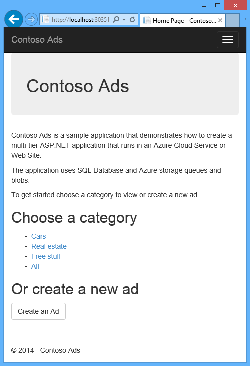

2. Click  **Create an Ad**.

2. Enter some test data and select a *.jpg* image to upload, and then click **Create**.

	

	The app goes to the Index page, but it doesn't show a thumbnail for the new ad because that processing hasn't happened yet.

3. Wait a moment and then refresh the Index page to see the thumbnail.

	

4. Click **Details** for your ad to see the full-size image.

	

You've been running the application entirely on your local computer, with no connection to the cloud. The storage emulator stores the queue and blob data in a SQL Server Express LocalDB database, and the application stores the ad data in another LocalDB database. Entity Framework Code First automatically created the ad database the first time the web app tried to access it.

In the following section you'll configure the solution to use Azure cloud resources for queues, blobs, and the application database when it runs in the cloud. If you wanted to continue to run locally but use cloud storage and database resources, you could do that; it's just a matter of setting connection strings, which you'll see how to do.

## Deploy the application to Azure

You'll do the following steps to run the application in the cloud:

* Create an Azure cloud service.
* Create an Azure SQL database.
* Create an Azure storage account.
* Configure the solution to use your Azure SQL database when it runs in Azure.
* Configure the solution to use your Azure storage account when it runs in Azure.
* Deploy the project to your Azure cloud service.

### Create an Azure cloud service

An Azure cloud service is the environment the application will run in.

1. In your browser, open the [Azure classic portal](http://manage.windowsazure.com).

2. Click **New > Compute > Cloud Service > Quick Create**.

4. In the URL input box, enter a URL prefix.

	This URL has to be unique.  You'll get an error message if the prefix you choose is already in use by someone else.

5. Choose the region where you want to deploy the application.

	This field specifies which datacenter your cloud service will be hosted in. For a production application, you'd choose the region closest to your customers. For this tutorial, choose the region closest to you.

6. Click **Create Cloud Service**.

	In the following image, a cloud service is created with the URL contosoads.cloudapp.net.

	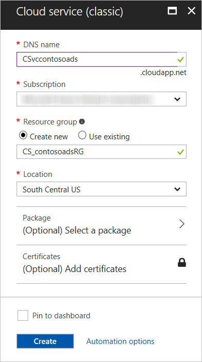

### Create an Azure SQL database

When the app runs in the cloud, it will use a cloud-based database.

1. In the [Azure classic portal](http://manage.windowsazure.com), click **New > Data Services > SQL Database > Quick Create**.

1. In the **Database Name** box, enter *contosoads*.

1. From the **Server** drop-down list, choose **New SQL Database server**.

	Alternatively, if your subscription already has a server, you can select that server from the drop-down list.

1. Choose the same **Region** that you chose for the cloud service.

	When the cloud service and database are in different datacenters (different regions), latency will increase and you will be charged for bandwidth outside the data center. Bandwidth within a data center is free.

1. Enter an administrator **Login Name** and **Password**.

	If you selected **New SQL Database server** you aren't entering an existing name and password here, you're entering a new name and password that you're defining now to use later when you access the database. If you selected a server that you created previously, you'll be prompted for the password to the administrative user account you already created.

1. Click **Create SQL Database**.

	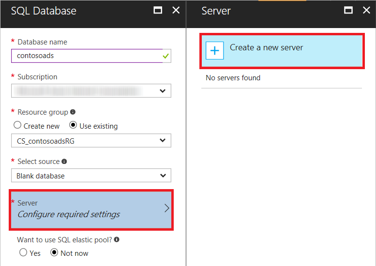

1. After Azure finishes creating the database, click the **SQL Databases** tab in the left pane of the portal, and then click the name of the new database.

2. Click the **Dashboard** tab.

3. Click **Manage allowed IP addresses**.

4. Under **Allowed Services**, change **Azure Services** to **Yes**.

5. Click **Save**.

### Create an Azure storage account

An Azure storage account provides resources for storing queue and blob data in the cloud.

In a real-world application, you would typically create separate accounts for application data versus logging data, and separate accounts for test data versus production data. For this tutorial you'll use just one account.

1. In the [Azure classic portal](http://manage.windowsazure.com), click **New > Data Services > Storage > Quick Create**.

4. In the **URL** box, enter a URL prefix.

	This prefix plus the text you see under the box will be the unique URL to your storage account. If the prefix you enter has already been used by someone else, you'll have to choose a different prefix.

5. Set the **Region** drop-down list to the same region you chose for the cloud service.

	When the cloud service and storage account are in different datacenters (different regions), latency will increase and you will be charged for bandwidth outside the data center. Bandwidth within a data center is free.

	Azure affinity groups provide a mechanism to minimize the distance between resources in a data center, which can reduce latency. This tutorial does not use affinity groups. For more information, see [How to Create an Affinity Group in Azure](http://msdn.microsoft.com/library/jj156209.aspx).

6. Set the **Replication** drop-down list to **Locally redundant**.

	When geo-replication is enabled for a storage account, the stored content is replicated to a secondary datacenter to enable failover to that location in case of a major disaster in the primary location. Geo-replication can incur additional costs. For test and development accounts, you generally don't want to pay for geo-replication. For more information, see [Create, manage, or delete a storage account](../storage/storage-create-storage-account.md#replication-options).

5. Click **Create Storage Account**.

	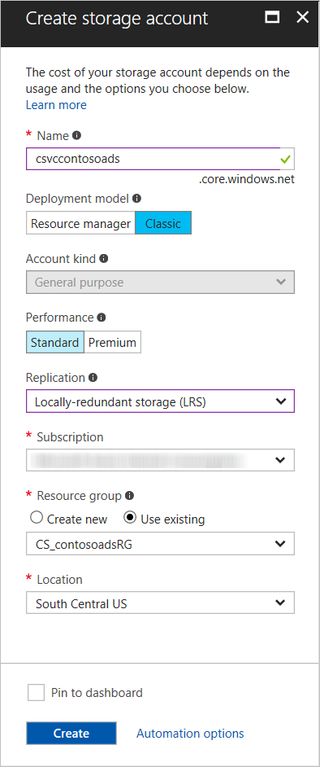

	In the image, a storage account is created with the URL `contosoads.core.windows.net`.

### Configure the solution to use your Azure SQL database when it runs in Azure

The web project and the worker role project each has its own database connection string, and each needs to point to the Azure SQL database when the app runs in Azure.

You'll use a [Web.config transform](http://www.asp.net/mvc/tutorials/deployment/visual-studio-web-deployment/web-config-transformations) for the web role and a cloud service environment setting for the worker role.

>[AZURE.NOTE] In this section and the next section you store credentials in project files. [Don't store sensitive data in public source code repositories](http://www.asp.net/aspnet/overview/developing-apps-with-windows-azure/building-real-world-cloud-apps-with-windows-azure/source-control#secrets).

1. In the ContosoAdsWeb project, open the *Web.Release.config* transform file for the application *Web.config* file, delete the comment block that contains a `<connectionStrings>` element, and paste the following code in its place.

    ```xml
    <connectionStrings>
        <add name="ContosoAdsContext" connectionString="{connectionstring}"
        providerName="System.Data.SqlClient" xdt:Transform="SetAttributes" xdt:Locator="Match(name)"/>
    </connectionStrings>
    ```

	Leave the file open for editing.

2. In the [Azure classic portal](http://manage.windowsazure.com), click **SQL Databases** in the left pane, click the database you created for this tutorial, click the **Dashboard** tab, and then click **Show connection strings**.

	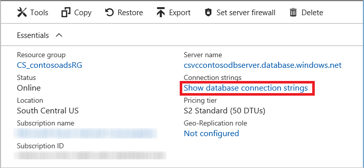

	The portal displays connection strings, with a placeholder for the password.

	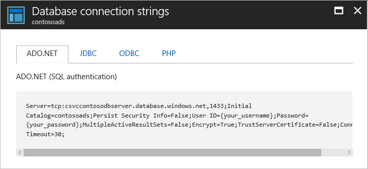

4. In the *Web.Release.config* transform file, delete `{connectionstring}` and paste in its place the ADO.NET connection string from the Azure classic portal.

5. In the connection string that you pasted into the *Web.Release.config* transform file, replace `{your_password_here}` with the password you created for the new SQL database.

7. Save the file.  

6. Select and copy the connection string (without the surrounding quotation marks) for use in the following steps for configuring the worker role project.

5. In **Solution Explorer**, under **Roles** in the cloud service project, right-click **ContosoAdsWorker** and then click **Properties**.

	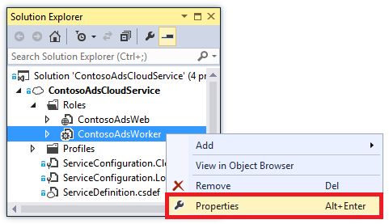

6. Click the **Settings** tab.

7. Change **Service Configuration** to **Cloud**.

7. Select the **Value** field for the `ContosoAdsDbConnectionString` setting, and then paste the connection string that you copied from the previous section of the tutorial.

	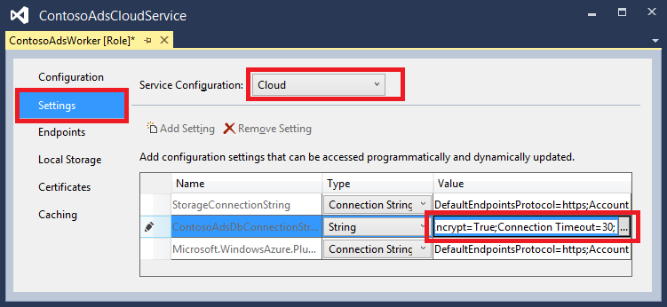

7. Save your changes.  

### Configure the solution to use your Azure storage account when it runs in Azure

Azure storage account connection strings for both the web role project and the worker role project are stored in environment settings in the cloud service project. For each project there is a separate set of settings to be used when the application runs locally and when it runs in the cloud. You'll update the cloud environment settings for both web and worker role projects.

1. In **Solution Explorer**, right-click **ContosoAdsWeb** under **Roles** in the **ContosoAdsCloudService** project, and then click **Properties**.

	

2. Click the **Settings** tab. In the **Service Configuration** drop-down box, choose **Cloud**.

	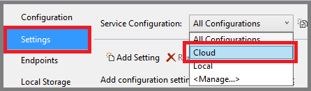

3. Select the **StorageConnectionString** entry, and you'll see an ellipsis (**...**) button at the right end of the line. Click the ellipsis button to open the **Create Storage Account Connection String** dialog box.

	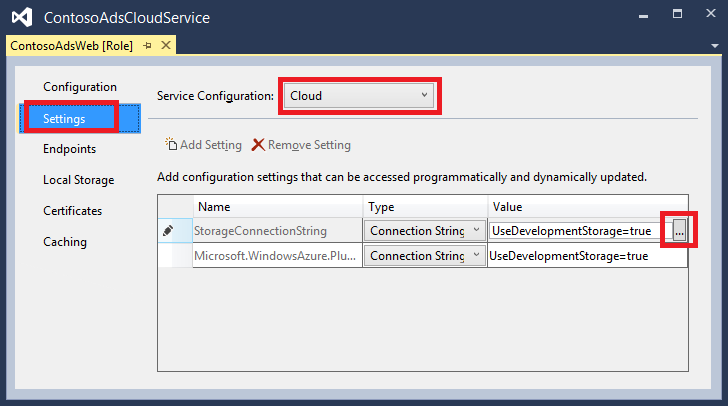

4. In the **Create Storage Connection String** dialog box, click **Your subscription**, choose the storage account that you created earlier, and then click **OK**. If you're not already logged in, you'll be prompted for your Azure account credentials.

	

5. Save your changes.

6. Follow the same procedure that you used for the `StorageConnectionString` connection string to set the `Microsoft.WindowsAzure.Plugins.Diagnostics.ConnectionString` connection string.

	This connection string is used for logging.

7. Follow the same procedure that you used for the **ContosoAdsWeb** role to set both connection strings for the **ContosoAdsWorker** role. Don't forget to set **Service Configuration** to **Cloud**.

The role environment settings that you have configured using the Visual Studio UI are stored in the following files in the ContosoAdsCloudService project:

* *ServiceDefinition.csdef* - Defines the setting names.
* *ServiceConfiguration.Cloud.cscfg* - Provides values for when the app runs in the cloud.
* *ServiceConfiguration.Local.cscfg* - Provides values for when the app runs locally.

For example, the ServiceDefinition.csdef includes the following definitions.

```xml
<ConfigurationSettings>
    <Setting name="StorageConnectionString" />
    <Setting name="ContosoAdsDbConnectionString" />
</ConfigurationSettings>
```

And the *ServiceConfiguration.Cloud.cscfg* file includes the values you entered for those settings in Visual Studio.

```xml
<Role name="ContosoAdsWorker">
    <Instances count="1" />
    <ConfigurationSettings>
        <Setting name="StorageConnectionString" value="{yourconnectionstring}" />
        <Setting name="ContosoAdsDbConnectionString" value="{yourconnectionstring}" />
        <!-- other settings not shown -->

    </ConfigurationSettings>
    <!-- other settings not shown -->

</Role>
```

The `<Instances>` setting specifies the number of virtual machines that Azure will run the worker role code on. The [Next steps](#next-steps) section includes links to more information about scaling out a cloud service,

###  Deploy the project to Azure

1.	In **Solution Explorer**, right-click the **ContosoAdsCloudService** cloud project and then select **Publish**.

	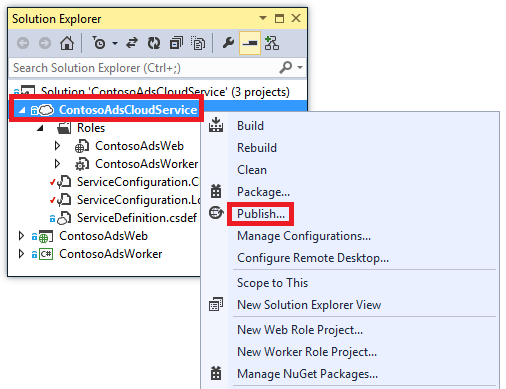

2. In the **Sign in** step of the **Publish Azure Application** wizard, click **Next**.

	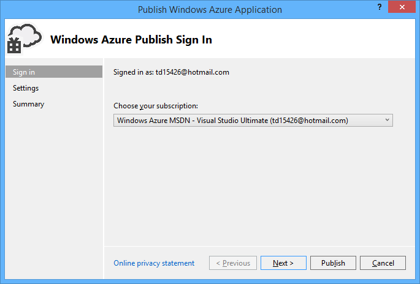

3. In the **Settings** step of the wizard, click **Next**.

	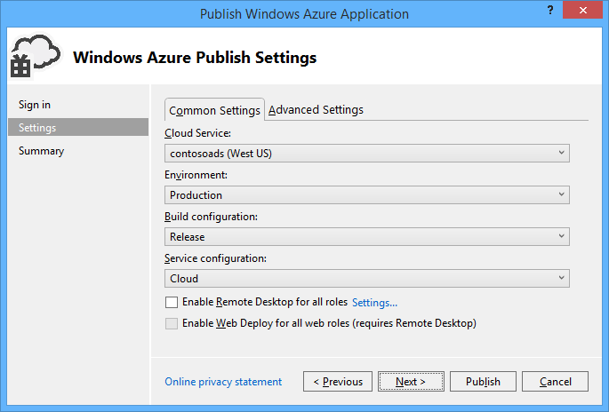

	The default settings in the **Advanced** tab are fine for this tutorial. For information about the advanced tab, see [Publish Azure Application Wizard](http://msdn.microsoft.com/library/hh535756.aspx).

4. In the **Summary** step, click **Publish**.

	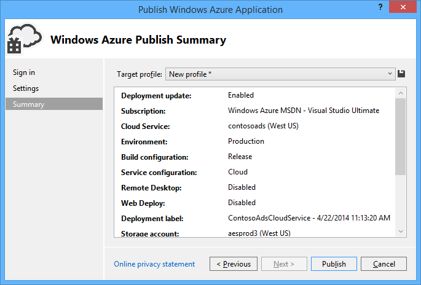

   The **Azure Activity Log** window opens in Visual Studio.

5. Click the right arrow icon to expand the deployment details.

	The deployment can take up to 5 minutes or more to complete.

	

6. When the deployment status is complete, click the **Web app URL** to start the application.

7. You can now test the app by creating, viewing, and editing some ads, as you did when you ran the application locally.

>[AZURE.NOTE] When you're finished testing, delete or stop the cloud service. Even if you're not using the cloud service, it's accruing charges because virtual machine resources are reserved for it. And if you leave it running, anyone who finds your URL can create and view ads. In the [Azure classic portal](http://manage.windowsazure.com), go to the **Dashboard** tab for your cloud service, and then click the **Delete** button at the bottom of the page. If you just want to temporarily prevent others from accessing the site, click **Stop** instead. In that case, charges will continue to accrue. You can follow a similar procedure to delete the SQL database and storage account when you no longer need them.

## Create the application from scratch

If you haven't already downloaded
[the completed application](http://code.msdn.microsoft.com/Simple-Azure-Cloud-Service-e01df2e4), do that now. You'll copy files from the downloaded project into the new project.

Creating the Contoso Ads application involves the following steps:

* Create a cloud service Visual Studio solution.
* Update and add NuGet packages.
* Set project references.
* Configure connection strings.
* Add code files.

After the solution is created, you'll review the code that is unique to cloud service projects and Azure blobs and queues.

### Create a cloud service Visual Studio solution

1. In Visual Studio, choose **New Project** from the **File** menu.

2. In the left pane of the **New Project** dialog box, expand **Visual C#** and choose **Cloud** templates, and then choose the **Azure Cloud Service** template.

3. Name the project and solution ContosoAdsCloudService, and then click **OK**.

	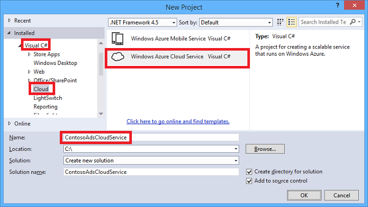

4. In the **New Azure Cloud Service** dialog box, add a web role and a worker role. Name the web role ContosoAdsWeb, and name the worker role ContosoAdsWorker. (Use the pencil icon in the right-hand pane to change the default names of the roles.)

	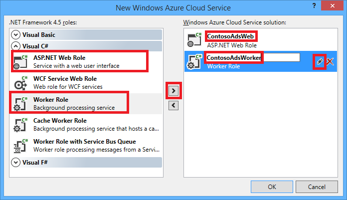

5. When you see the **New ASP.NET Project** dialog box for the web role, choose the MVC template, and then click **Change Authentication**.

	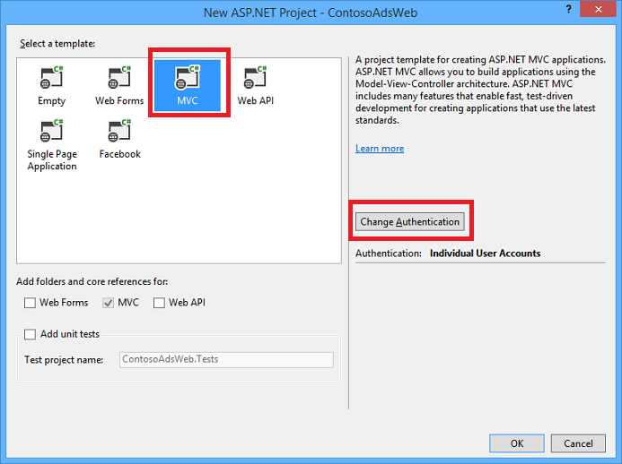

7. In the **Change Authentication** dialog box, choose **No Authentication**, and then click **OK**.

	

8. In the **New ASP.NET Project** dialog, click **OK**.

9. In **Solution Explorer**, right-click the solution (not one of the projects), and choose **Add - New Project**.

11. In the **Add New Project** dialog box, choose **Windows** under **Visual C#** in the left pane, and then click the **Class Library** template.  

10. Name the project *ContosoAdsCommon*, and then click **OK**.

	You need to reference the Entity Framework context and the data model from both web and worker role projects. As an alternative you could define the EF-related classes in the web role project and reference that project from the worker role project. But in the alternative approach, your worker role project would have a reference to web assemblies which it doesn't need.

### Update and add NuGet packages

1. Open the **Manage NuGet Packages** dialog box for the solution.

2. At the top of the window, select **Updates**.

3. Look for the *WindowsAzure.Storage* package, and if it's in the list, select it and select the web and worker projects to update it in, and then click **Update**.

	The storage client library is updated more frequently than Visual Studio project templates, so you'll often find that the version in a newly created projected needs to be updated.

4. At the top of the window, select **Browse**.

5. Find the *EntityFramework* NuGet package, and install it in all three projects.

6. Find the *Microsoft.WindowsAzure.ConfigurationManager* NuGet package, and install it in the worker role project.

### Set project references

1. In the ContosoAdsWeb project, set a reference to the ContosoAdsCommon project. Right-click the ContosoAdsWeb project, and then click **References** - **Add References**. In the **Reference Manager** dialog box, select **Solution – Projects** in the left pane, select **ContosoAdsCommon**, and then click **OK**.

2. In the ContosoAdsWorker project, set a reference to the ContosAdsCommon project.

	ContosoAdsCommon will contain the Entity Framework data model and context class, which will be used by both the front-end and back-end.

3. In the ContosoAdsWorker project, set a reference to `System.Drawing`.

	This assembly is used by the back-end to convert images to thumbnails.

### Configure connection strings

In this section you configure Azure Storage and SQL connection strings for testing locally. The deployment instructions earlier in the tutorial explain how to set up the connection strings for when the app runs in the cloud.

1. In the ContosoAdsWeb project, open the application Web.config file, and insert the following `connectionStrings` element after the `configSections` element.

    ```xml
    <connectionStrings>
        <add name="ContosoAdsContext" connectionString="Data Source=(localdb)\v11.0; Initial Catalog=ContosoAds; Integrated Security=True; MultipleActiveResultSets=True;" providerName="System.Data.SqlClient" />
    </connectionStrings>
    ```

	If you're using Visual Studio 2015, replace "v11.0" with "MSSQLLocalDB".

2. Save your changes.

3. In the ContosoAdsCloudService project, right-click ContosoAdsWeb under **Roles**, and then click **Properties**.

	

4. In the **ContosAdsWeb [Role]** properties window, click the **Settings** tab, and then click **Add Setting**.

	Leave **Service Configuration** set to **All Configurations**.

5. Add a new setting named *StorageConnectionString*. Set **Type** to *ConnectionString*, and set **Value** to *UseDevelopmentStorage=true*.

	

6. Save your changes.

7. Follow the same procedure to add a storage connection string in the ContosoAdsWorker role properties.

8. Still in the **ContosoAdsWorker [Role]** properties window, add another connection string:

	* Name: ContosoAdsDbConnectionString
	* Type: String
	* Value: Paste the same connection string you used for the web role project. (The following example is for Visual Studio 2013; don't forget to change the Data Source if you copy this example and you're using Visual Studio 2015.)

	    ```
        Data Source=(localdb)\v11.0; Initial Catalog=ContosoAds; Integrated Security=True; MultipleActiveResultSets=True;
        ```

### Add code files

In this section you copy code files from the downloaded solution into the new solution. The following sections will show and explain key parts of this code.

To add files to a project or a folder, right-click the project or folder and click **Add** - **Existing Item**. Select the files you want and then click **Add**. If asked whether you want to replace existing files, click **Yes**.

3. In the ContosoAdsCommon project, delete the *Class1.cs* file and add in its place the *Ad.cs* and *ContosoAdscontext.cs* files from the downloaded project.

3. In the ContosoAdsWeb project, add the following files from the downloaded project.
	- *Global.asax.cs*.  
	- In the *Views\Shared* folder: *\_Layout.cshtml*.
	- In the *Views\Home* folder: *Index.cshtml*.
	- In the *Controllers* folder: *AdController.cs*.
	- In the *Views\Ad* folder (create the folder first): five *.cshtml* files.

3. In the ContosoAdsWorker project, add *WorkerRole.cs* from the downloaded project.

You can now build and run the application as instructed earlier in the tutorial, and the app will use local database and storage emulator resources.

The following sections explain the code related to working with the Azure environment, blobs, and queues. This tutorial does not explain how to create MVC controllers and views using scaffolding, how to write Entity Framework code that works with SQL Server databases, or the basics of asynchronous programming in ASP.NET 4.5. For information about these topics, see the following resources:

* [Get started with MVC 5](http://www.asp.net/mvc/tutorials/mvc-5/introduction/getting-started)
* [Get started with EF 6 and MVC 5](http://www.asp.net/mvc/tutorials/getting-started-with-ef-using-mvc)
* [Introduction to asynchronous programming in .NET 4.5](http://www.asp.net/aspnet/overview/developing-apps-with-windows-azure/building-real-world-cloud-apps-with-windows-azure/web-development-best-practices#async).

### ContosoAdsCommon - Ad.cs

The Ad.cs file defines an enum for ad categories and a POCO entity class for ad information.

```csharp
public enum Category
{
    Cars,
    [Display(Name="Real Estate")]
    RealEstate,
    [Display(Name = "Free Stuff")]
    FreeStuff
}

public class Ad
{
    public int AdId { get; set; }

    [StringLength(100)]
    public string Title { get; set; }

    public int Price { get; set; }

    [StringLength(1000)]
    [DataType(DataType.MultilineText)]
    public string Description { get; set; }

    [StringLength(1000)]
    [DisplayName("Full-size Image")]
    public string ImageURL { get; set; }

    [StringLength(1000)]
    [DisplayName("Thumbnail")]
    public string ThumbnailURL { get; set; }

    [DataType(DataType.Date)]
    [DisplayFormat(DataFormatString = "{0:yyyy-MM-dd}", ApplyFormatInEditMode = true)]
    public DateTime PostedDate { get; set; }

    public Category? Category { get; set; }
    [StringLength(12)]
    public string Phone { get; set; }
}
```

### ContosoAdsCommon - ContosoAdsContext.cs

The ContosoAdsContext class specifies that the Ad class is used in a DbSet collection, which Entity Framework will store in a SQL database.

```csharp
public class ContosoAdsContext : DbContext
{
    public ContosoAdsContext() : base("name=ContosoAdsContext")
    {
    }
    public ContosoAdsContext(string connString)
        : base(connString)
    {
    }
    public System.Data.Entity.DbSet<Ad> Ads { get; set; }
}
```

The class has two constructors. The first of them is used by the web project, and specifies the name of a connection string that is stored in the Web.config file. The second constructor enables you to pass in the actual connection string. That is needed by the worker role project, since it doesn't have a Web.config file. You saw earlier where this connection string was stored, and you'll see later how the code retrieves the connection string when it instantiates the DbContext class.

### ContosoAdsWeb - Global.asax.cs

Code that is called from the `Application_Start` method creates an *images* blob container and an *images* queue if they don't already exist. This ensures that whenever you start using a new storage account, or start using the storage emulator on a new computer, the required blob container and queue will be created automatically.

The code gets access to the storage account by using the storage connection string from the *.cscfg* file.

```csharp
var storageAccount = CloudStorageAccount.Parse
    (RoleEnvironment.GetConfigurationSettingValue("StorageConnectionString"));
```

Then it gets a reference to the *images* blob container, creates the container if it doesn't already exist, and sets access permissions on the new container. By default, new containers only allow clients with storage account credentials to access blobs. The website needs the blobs to be public so that it can display images using URLs that point to the image blobs.

```csharp
var blobClient = storageAccount.CreateCloudBlobClient();
var imagesBlobContainer = blobClient.GetContainerReference("images");
if (imagesBlobContainer.CreateIfNotExists())
{
    imagesBlobContainer.SetPermissions(
        new BlobContainerPermissions
        {
            PublicAccess =BlobContainerPublicAccessType.Blob
        });
}
```

Similar code gets a reference to the *images* queue and creates a new queue. In this case no permissions change is needed.

```csharp
CloudQueueClient queueClient = storageAccount.CreateCloudQueueClient();
var imagesQueue = queueClient.GetQueueReference("images");
imagesQueue.CreateIfNotExists();
```

### ContosoAdsWeb - \_Layout.cshtml

The *_Layout.cshtml* file sets the app name in the header and footer, and creates an "Ads" menu entry.

### ContosoAdsWeb - Views\Home\Index.cshtml

The *Views\Home\Index.cshtml* file displays category links on the home page. The links pass the integer value of the `Category` enum in a querystring variable to the Ads Index page.

```razor
<li>@Html.ActionLink("Cars", "Index", "Ad", new { category = (int)Category.Cars }, null)</li>
<li>@Html.ActionLink("Real estate", "Index", "Ad", new { category = (int)Category.RealEstate }, null)</li>
<li>@Html.ActionLink("Free stuff", "Index", "Ad", new { category = (int)Category.FreeStuff }, null)</li>
<li>@Html.ActionLink("All", "Index", "Ad", null, null)</li>
```

### ContosoAdsWeb - AdController.cs

In the *AdController.cs* file the constructor calls the `InitializeStorage` method to create Azure Storage Client Library objects that provide an API for working with blobs and queues.

Then the code gets a reference to the *images* blob container as you saw earlier in *Global.asax.cs*. While doing that it sets a default [retry policy](http://www.asp.net/aspnet/overview/developing-apps-with-windows-azure/building-real-world-cloud-apps-with-windows-azure/transient-fault-handling) appropriate for a web app. The default exponential backoff retry policy could hang the web app for longer than a minute on repeated retries for a transient fault. The retry policy specified here waits 3 seconds after each try for up to 3 tries.

```csharp
var blobClient = storageAccount.CreateCloudBlobClient();
blobClient.DefaultRequestOptions.RetryPolicy = new LinearRetry(TimeSpan.FromSeconds(3), 3);
imagesBlobContainer = blobClient.GetContainerReference("images");
```

Similar code gets a reference to the *images* queue.

```csharp
CloudQueueClient queueClient = storageAccount.CreateCloudQueueClient();
queueClient.DefaultRequestOptions.RetryPolicy = new LinearRetry(TimeSpan.FromSeconds(3), 3);
imagesQueue = queueClient.GetQueueReference("images");
```

Most of the controller code is typical for working with an Entity Framework data model using a DbContext class. An exception is the HttpPost `Create` method, which uploads a file and saves it in blob storage. The model binder provides an [HttpPostedFileBase](http://msdn.microsoft.com/library/system.web.httppostedfilebase.aspx) object to the method.

```csharp
[HttpPost]
[ValidateAntiForgeryToken]
public async Task<ActionResult> Create(
    [Bind(Include = "Title,Price,Description,Category,Phone")] Ad ad,
    HttpPostedFileBase imageFile)
```

If the user selected a file to upload, the code uploads the file, saves it in a blob, and updates the Ad database record with a URL that points to the blob.

```csharp
if (imageFile != null && imageFile.ContentLength != 0)
{
    blob = await UploadAndSaveBlobAsync(imageFile);
    ad.ImageURL = blob.Uri.ToString();
}
```

The code that does the upload is in the `UploadAndSaveBlobAsync` method. It creates a GUID name for the blob, uploads and saves the file, and returns a reference to the saved blob.

```csharp
private async Task<CloudBlockBlob> UploadAndSaveBlobAsync(HttpPostedFileBase imageFile)
{
    string blobName = Guid.NewGuid().ToString() + Path.GetExtension(imageFile.FileName);
    CloudBlockBlob imageBlob = imagesBlobContainer.GetBlockBlobReference(blobName);
    using (var fileStream = imageFile.InputStream)
    {
        await imageBlob.UploadFromStreamAsync(fileStream);
    }
    return imageBlob;
}
```

After the HttpPost `Create` method uploads a blob and updates the database, it creates a queue message to inform that back-end process that an image is ready for conversion to a thumbnail.

```csharp
string queueMessageString = ad.AdId.ToString();
var queueMessage = new CloudQueueMessage(queueMessageString);
await queue.AddMessageAsync(queueMessage);
```

The code for the HttpPost `Edit` method is similar except that if the user selects a new image file any blobs that already exist must be deleted.

```csharp
if (imageFile != null && imageFile.ContentLength != 0)
{
    await DeleteAdBlobsAsync(ad);
    imageBlob = await UploadAndSaveBlobAsync(imageFile);
    ad.ImageURL = imageBlob.Uri.ToString();
}
```

The next example shows the code that deletes blobs when you delete an ad.

```csharp
private async Task DeleteAdBlobsAsync(Ad ad)
{
    if (!string.IsNullOrWhiteSpace(ad.ImageURL))
    {
        Uri blobUri = new Uri(ad.ImageURL);
        await DeleteAdBlobAsync(blobUri);
    }
    if (!string.IsNullOrWhiteSpace(ad.ThumbnailURL))
    {
        Uri blobUri = new Uri(ad.ThumbnailURL);
        await DeleteAdBlobAsync(blobUri);
    }
}
private static async Task DeleteAdBlobAsync(Uri blobUri)
{
    string blobName = blobUri.Segments[blobUri.Segments.Length - 1];
    CloudBlockBlob blobToDelete = imagesBlobContainer.GetBlockBlobReference(blobName);
    await blobToDelete.DeleteAsync();
}
```

### ContosoAdsWeb - Views\Ad\Index.cshtml and Details.cshtml

The *Index.cshtml* file displays thumbnails with the other ad data.

```razor

```

The *Details.cshtml* file displays the full-size image.

```razor

```

### ContosoAdsWeb - Views\Ad\Create.cshtml and Edit.cshtml

The *Create.cshtml* and *Edit.cshtml* files specify form encoding that enables the controller to get the `HttpPostedFileBase` object.

```razor
@using (Html.BeginForm("Create", "Ad", FormMethod.Post, new { enctype = "multipart/form-data" }))
```

An `<input>` element tells the browser to provide a file selection dialog.

```razor
<input type="file" name="imageFile" accept="image/*" class="form-control fileupload" />
```

### ContosoAdsWorker - WorkerRole.cs - OnStart method

The Azure worker role environment calls the `OnStart` method in the `WorkerRole` class when the worker role is getting started, and it calls the `Run` method when the `OnStart` method finishes.

The `OnStart` method gets the database connection string from the *.cscfg* file and passes it to the Entity Framework DbContext class. The SQLClient provider is used by default, so the provider does not have to be specified.

```csharp
var dbConnString = CloudConfigurationManager.GetSetting("ContosoAdsDbConnectionString");
db = new ContosoAdsContext(dbConnString);
```

After that the method gets a reference to the storage account and creates the blob container and queue if they don't exist. The code for that is similar to what you already saw in the web role `Application_Start` method.

### ContosoAdsWorker - WorkerRole.cs - Run method

The `Run` method is called when the `OnStart` method finishes its initialization work. The method executes an infinite loop that watches for new queue messages and processes them when they arrive.

```csharp
public override void Run()
{
    CloudQueueMessage msg = null;

    while (true)
    {
        try
        {
            msg = this.imagesQueue.GetMessage();
            if (msg != null)
            {
                ProcessQueueMessage(msg);
            }
            else
            {
                System.Threading.Thread.Sleep(1000);
            }
        }
        catch (StorageException e)
        {
            if (msg != null && msg.DequeueCount > 5)
            {
                this.imagesQueue.DeleteMessage(msg);
            }
            System.Threading.Thread.Sleep(5000);
        }
    }
}
```

After each iteration of the loop, if no queue message was found, the program sleeps for a second. This prevents the worker role from incurring excessive CPU time and storage transaction costs. The Microsoft Customer Advisory Team tells a story about a  developer who forgot to include this, deployed to production, and left for vacation. When he got back, his oversight cost more than the vacation.

Sometimes the content of a queue message causes an error in processing. This is called a *poison message*, and if you just logged an error and restarted the loop, you could endlessly try to process that message.  Therefore the catch block includes an if statement that checks to see how many times the app has tried to process the current message, and if it has been more than 5 times, the message is deleted from the queue.

`ProcessQueueMessage` is called when a queue message is found.

```csharp
private void ProcessQueueMessage(CloudQueueMessage msg)
{
    var adId = int.Parse(msg.AsString);
    Ad ad = db.Ads.Find(adId);
    if (ad == null)
    {
        throw new Exception(String.Format("AdId {0} not found, can't create thumbnail", adId.ToString()));
    }

    CloudBlockBlob inputBlob = this.imagesBlobContainer.GetBlockBlobReference(ad.ImageURL);

    string thumbnailName = Path.GetFileNameWithoutExtension(inputBlob.Name) + "thumb.jpg";
    CloudBlockBlob outputBlob = this.imagesBlobContainer.GetBlockBlobReference(thumbnailName);

    using (Stream input = inputBlob.OpenRead())
    using (Stream output = outputBlob.OpenWrite())
    {
        ConvertImageToThumbnailJPG(input, output);
        outputBlob.Properties.ContentType = "image/jpeg";
    }

    ad.ThumbnailURL = outputBlob.Uri.ToString();
    db.SaveChanges();

    this.imagesQueue.DeleteMessage(msg);
}
```

This code reads the database to get the image URL, converts the image to a thumbnail, saves the thumbnail in a blob, updates the database with the thumbnail blob URL, and deletes the queue message.

>[AZURE.NOTE] The code in the `ConvertImageToThumbnailJPG` method uses classes in the System.Drawing namespace for simplicity. However, the classes in this namespace were designed for use with Windows Forms. They are not supported for use in a Windows or ASP.NET service. For more information about image processing options, see [Dynamic Image Generation](http://www.hanselman.com/blog/BackToBasicsDynamicImageGenerationASPNETControllersRoutingIHttpHandlersAndRunAllManagedModulesForAllRequests.aspx) and [Deep Inside Image Resizing](http://www.hanselminutes.com/313/deep-inside-image-resizing-and-scaling-with-aspnet-and-iis-with-imageresizingnet-author-na).

## Troubleshooting

In case something doesn't work while you're following the instructions in this tutorial, here are some common errors and how to resolve them.

### ServiceRuntime.RoleEnvironmentException

The `RoleEnvironment` object is provided by Azure when you run an application in Azure or when you run locally using the Azure compute emulator.  If you get this error when you're running locally, make sure that you have set the ContosoAdsCloudService project as the startup project. This sets up the project to run using the Azure compute emulator.

One of the things the application uses the Azure RoleEnvironment for is to get the connection string values that are stored in the *.cscfg* files, so another cause of this exception is a missing connection string. Make sure that you created the StorageConnectionString setting for both Cloud and Local configurations in the ContosoAdsWeb project, and that you created both connection strings for both configurations in the ContosoAdsWorker project. If you do a **Find All** search for StorageConnectionString in the entire solution, you should see it 9 times in 6 files.

### Cannot override to port xxx. New port below minimum allowed value 8080 for protocol http

Try changing the port number used by the web project. Right-click the ContosoAdsWeb project, and then click **Properties**. Click the **Web** tab, and then change the port number in the **Project Url** setting.

For another alternative that might resolve the problem, see the following  section.

### Other errors when running locally

By default new cloud service projects use the Azure compute emulator express to simulate the Azure environment. This is a lightweight version of the full compute emulator, and under some conditions the full emulator will work when the express version does not.  

To change the project to use the full emulator, right-click the ContosoAdsCloudService project, and then click **Properties**. In the **Properties** window click the **Web** tab, and then click the **Use Full Emulator** radio button.

In order to run the application with the full emulator, you have to open Visual Studio with administrator privileges.

## Next steps

The Contoso Ads application has intentionally been kept simple for a getting-started tutorial. For example, it doesn't implement [dependency injection](http://www.asp.net/mvc/tutorials/hands-on-labs/aspnet-mvc-4-dependency-injection) or the [repository and unit of work patterns](http://www.asp.net/mvc/tutorials/getting-started-with-ef-using-mvc/advanced-entity-framework-scenarios-for-an-mvc-web-application#repo), it doesn't [use an interface for logging](http://www.asp.net/aspnet/overview/developing-apps-with-windows-azure/building-real-world-cloud-apps-with-windows-azure/monitoring-and-telemetry#log), it doesn't use [EF Code First Migrations](http://www.asp.net/mvc/tutorials/getting-started-with-ef-using-mvc/migrations-and-deployment-with-the-entity-framework-in-an-asp-net-mvc-application) to manage data model changes or [EF Connection Resiliency](http://www.asp.net/mvc/tutorials/getting-started-with-ef-using-mvc/connection-resiliency-and-command-interception-with-the-entity-framework-in-an-asp-net-mvc-application) to manage transient network errors, and so forth.

Here are some cloud service sample applications that demonstrate more real-world coding practices, listed from less complex to more complex:

* [PhluffyFotos](http://code.msdn.microsoft.com/PhluffyFotos-Sample-7ecffd31). Similar in concept to Contoso Ads but implements more features and more real-world coding practices.
* [Azure Cloud Service Multi-Tier Application with Tables, Queues, and Blobs](http://code.msdn.microsoft.com/windowsazure/Windows-Azure-Multi-Tier-eadceb36). Introduces Azure Storage tables as well as blobs and queues. Based on an older version of the Azure SDK for .NET, will require some modifications to work with the current version.
* [Cloud Service Fundamentals in Microsoft Azure](http://code.msdn.microsoft.com/Cloud-Service-Fundamentals-4ca72649). A comprehensive sample demonstrating a wide range of best practices, produced by the Microsoft Patterns and Practices group.

For general information about developing for the cloud, see [Building Real-World Cloud Apps with Azure](http://www.asp.net/aspnet/overview/developing-apps-with-windows-azure/building-real-world-cloud-apps-with-windows-azure/introduction).

For a video introduction to Azure Storage best practices and patterns, see [Microsoft Azure Storage – What's New, Best Practices and Patterns](http://channel9.msdn.com/Events/Build/2014/3-628).

For more information, see the following resources:

* [Azure Cloud Services Part 1: Introduction](http://justazure.com/microsoft-azure-cloud-services-part-1-introduction/)
* [How to manage Cloud Services](cloud-services-how-to-manage.md)
* [Azure Storage](/documentation/services/storage/)
* [How to choose a cloud service provider](https://azure.microsoft.com/overview/choosing-a-cloud-service-provider/)
