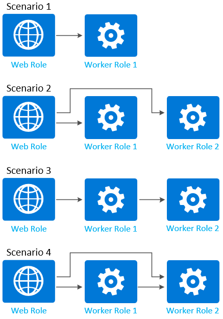

# Enable communication for role instances in Azure Cloud Services (classic)

[!INCLUDE [Cloud Services (classic) deprecation announcement](includes/deprecation-announcement.md)]

Cloud service roles communicate through internal and external connections. External connections are called **input endpoints** while internal connections are called **internal endpoints**. This topic describes how to modify the [service definition](cloud-services-model-and-package.md#csdef) to create endpoints.

## Input endpoint
The input endpoint is used when you want to expose a port to the outside. You specify the protocol type and the port of the endpoint which then applies for both the external and internal ports for the endpoint. If you want, you can specify a different internal port for the endpoint with the [localPort](/previous-versions/azure/reference/gg557552(v=azure.100)#inputendpoint) attribute.

The input endpoint can use the following protocols: **http, https, tcp, udp**.

To create an input endpoint, add the **InputEndpoint** child element to the **Endpoints** element of either a web or worker role.

```xml
<Endpoints>
  <InputEndpoint name="StandardWeb" protocol="http" port="80" localPort="80" />
</Endpoints> 
```

## Instance input endpoint
Instance input endpoints are similar to input endpoints but allows you map specific public-facing ports for each individual role instance by using port forwarding on the load balancer. You can specify a single public-facing port, or a range of ports.

The instance input endpoint can only use **tcp** or **udp** as the protocol.

To create an instance input endpoint, add the **InstanceInputEndpoint** child element to the **Endpoints** element of either a web or worker role.

```xml
<Endpoints>
  <InstanceInputEndpoint name="Endpoint2" protocol="tcp" localPort="10100">
    <AllocatePublicPortFrom>
      <FixedPortRange max="10109" min="10105" />
    </AllocatePublicPortFrom>
  </InstanceInputEndpoint>
</Endpoints>
```

## Internal endpoint
Internal endpoints are available for instance-to-instance communication. The port is optional and if omitted, a dynamic port is assigned to the endpoint. A port range can be used. There is a limit of five internal endpoints per role.

The internal endpoint can use the following protocols: **http, tcp, udp, any**.

To create an internal input endpoint, add the **InternalEndpoint** child element to the **Endpoints** element of either a web or worker role.

```xml
<Endpoints>
  <InternalEndpoint name="Endpoint3" protocol="any" port="8999" />
</Endpoints> 
```

You can also use a port range.

```xml
<Endpoints>
  <InternalEndpoint name="Endpoint3" protocol="any">
    <FixedPortRange max="8999" min="8995" />
  </InternalEndpoint>
</Endpoints>
```


## Worker roles vs. Web roles
There is one minor difference with endpoints when working with both worker and web roles. The web role must have at minimum a single input endpoint using the **HTTP** protocol.

```xml
<Endpoints>
  <InputEndpoint name="StandardWeb" protocol="http" port="80" localPort="80" />
  <!-- more endpoints may be declared after the first InputEndPoint -->
</Endpoints>
```

## Using the .NET SDK to access an endpoint
The Azure Managed Library provides methods for role instances to communicate at runtime. From code running within a role instance, you can retrieve information about the existence of other role instances and their endpoints, as well as information about the current role instance.

> [!NOTE]
> You can only retrieve information about role instances that are running in your cloud service and that define at least one internal endpoint. You cannot obtain data about role instances running in a different service.
> 
> 

You can use the [Instances](/previous-versions/azure/reference/ee741904(v=azure.100)) property to retrieve instances of a role. First use the [CurrentRoleInstance](/previous-versions/azure/reference/ee741907(v=azure.100)) to return a reference to the current role instance, and then use the [Role](/previous-versions/azure/reference/ee741918(v=azure.100)) property to return a reference to the role itself.

When you connect to a role instance programmatically through the .NET SDK, it's relatively easy to access the endpoint information. For example, after you've already connected to a specific role environment, you can get the port of a specific endpoint with this code:

```csharp
int port = RoleEnvironment.CurrentRoleInstance.InstanceEndpoints["StandardWeb"].IPEndpoint.Port;
```

The **Instances** property returns a collection of **RoleInstance** objects. This collection always contains the current instance. If the role does not define an internal endpoint, the collection includes the current instance but no other instances. The number of role instances in the collection will always be 1 in the case where no internal endpoint is defined for the role. If the role defines an internal endpoint, its instances are discoverable at runtime, and the number of instances in the collection will correspond to the number of instances specified for the role in the service configuration file.

> [!NOTE]
> The Azure Managed Library does not provide a means of determining the health of other role instances, but you can implement such health assessments yourself if your service needs this functionality. You can use [Azure Diagnostics](cloud-services-dotnet-diagnostics.md) to obtain information about running role instances.
> 
> 

To determine the port number for an internal endpoint on a role instance, you can use the [`InstanceEndpoints`](/previous-versions/azure/reference/ee741917(v=azure.100)) property to return a Dictionary object that contains endpoint names and their corresponding IP addresses and ports. The [`IPEndpoint`](/previous-versions/azure/reference/ee741919(v=azure.100)) property returns the IP address and port for a specified endpoint. The `PublicIPEndpoint` property returns the port for a load balanced endpoint. The IP address portion of the `PublicIPEndpoint` property is not used.

Here is an example that iterates role instances.

```csharp
foreach (RoleInstance roleInst in RoleEnvironment.CurrentRoleInstance.Role.Instances)
{
    Trace.WriteLine("Instance ID: " + roleInst.Id);
    foreach (RoleInstanceEndpoint roleInstEndpoint in roleInst.InstanceEndpoints.Values)
    {
        Trace.WriteLine("Instance endpoint IP address and port: " + roleInstEndpoint.IPEndpoint);
    }
}
```

Here is an example of a worker role that gets the endpoint exposed through the service definition and starts listening for connections.

> [!WARNING]
> This code will only work for a deployed service. When running in the Azure Compute Emulator, service configuration elements that create direct port endpoints (**InstanceInputEndpoint** elements) are ignored.
> 
> 

```csharp
using System;
using System.Diagnostics;
using System.Linq;
using System.Net;
using System.Net.Sockets;
using System.Threading;
using Microsoft.WindowsAzure;
using Microsoft.WindowsAzure.Diagnostics;
using Microsoft.WindowsAzure.ServiceRuntime;
using Microsoft.WindowsAzure.StorageClient;

namespace WorkerRole1
{
  public class WorkerRole : RoleEntryPoint
  {
    public override void Run()
    {
      try
      {
        // Initialize method-wide variables
        var epName = "Endpoint1";
        var roleInstance = RoleEnvironment.CurrentRoleInstance;

        // Identify direct communication port
        var myPublicEp = roleInstance.InstanceEndpoints[epName].PublicIPEndpoint;
        Trace.TraceInformation("IP:{0}, Port:{1}", myPublicEp.Address, myPublicEp.Port);

        // Identify public endpoint
        var myInternalEp = roleInstance.InstanceEndpoints[epName].IPEndpoint;

        // Create socket listener
        var listener = new Socket(
          myInternalEp.AddressFamily, SocketType.Stream, ProtocolType.Tcp);

        // Bind socket listener to internal endpoint and listen
        listener.Bind(myInternalEp);
        listener.Listen(10);
        Trace.TraceInformation("Listening on IP:{0},Port: {1}",
          myInternalEp.Address, myInternalEp.Port);

        while (true)
        {
          // Block the thread and wait for a client request
          Socket handler = listener.Accept();
          Trace.TraceInformation("Client request received.");

          // Define body of socket handler
          var handlerThread = new Thread(
            new ParameterizedThreadStart(h =>
            {
              var socket = h as Socket;
              Trace.TraceInformation("Local:{0} Remote{1}",
                socket.LocalEndPoint, socket.RemoteEndPoint);

              // Shut down and close socket
              socket.Shutdown(SocketShutdown.Both);
              socket.Close();
            }
          ));

          // Start socket handler on new thread
          handlerThread.Start(handler);
        }
      }
      catch (Exception e)
      {
        Trace.TraceError("Caught exception in run. Details: {0}", e);
      }
    }

    public override bool OnStart()
    {
      // Set the maximum number of concurrent connections 
      ServicePointManager.DefaultConnectionLimit = 12;

      // For information on handling configuration changes
      // see the MSDN topic at https://go.microsoft.com/fwlink/?LinkId=166357.
      return base.OnStart();
    }
  }
}
```

## Network traffic rules to control role communication
After you define internal endpoints, you can add network traffic rules (based on the endpoints that you created) to control how role instances can communicate with each other. The following diagram shows some common scenarios for controlling role communication:



The following code example shows role definitions for the roles shown in the previous diagram. Each role definition includes at least one internal endpoint defined:

```xml
<ServiceDefinition name="MyService" xmlns="http://schemas.microsoft.com/ServiceHosting/2008/10/ServiceDefinition">
  <WebRole name="WebRole1" vmsize="Medium">
    <Sites>
      <Site name="Web">
        <Bindings>
          <Binding name="HttpIn" endpointName="HttpIn" />
        </Bindings>
      </Site>
    </Sites>
    <Endpoints>
      <InputEndpoint name="HttpIn" protocol="http" port="80" />
      <InternalEndpoint name="InternalTCP1" protocol="tcp" />
    </Endpoints>
  </WebRole>
  <WorkerRole name="WorkerRole1">
    <Endpoints>
      <InternalEndpoint name="InternalTCP2" protocol="tcp" />
    </Endpoints>
  </WorkerRole>
  <WorkerRole name="WorkerRole2">
    <Endpoints>
      <InternalEndpoint name="InternalTCP3" protocol="tcp" />
      <InternalEndpoint name="InternalTCP4" protocol="tcp" />
    </Endpoints>
  </WorkerRole>
</ServiceDefinition>
```

> [!NOTE]
> Restriction of communication between roles can occur with internal endpoints of both fixed and automatically assigned ports.
> 
> 

By default, after an internal endpoint is defined, communication can flow from any role to the internal endpoint of a role without any restrictions. To restrict communication, you must add a **NetworkTrafficRules** element to the **ServiceDefinition** element in the service definition file.

### Scenario 1
Only allow network traffic from **WebRole1** to **WorkerRole1**.

```xml
<ServiceDefinition name="MyService" xmlns="http://schemas.microsoft.com/ServiceHosting/2008/10/ServiceDefinition">
  <NetworkTrafficRules>
    <OnlyAllowTrafficTo>
      <Destinations>
        <RoleEndpoint endpointName="InternalTCP2" roleName="WorkerRole1"/>
      </Destinations>
      <AllowAllTraffic/>
      <WhenSource matches="AnyRule">
        <FromRole roleName="WebRole1"/>
      </WhenSource>
    </OnlyAllowTrafficTo>
  </NetworkTrafficRules>
</ServiceDefinition>
```

### Scenario 2
Only allows network traffic from **WebRole1** to **WorkerRole1** and **WorkerRole2**.

```xml
<ServiceDefinition name="MyService" xmlns="http://schemas.microsoft.com/ServiceHosting/2008/10/ServiceDefinition">
  <NetworkTrafficRules>
    <OnlyAllowTrafficTo>
      <Destinations>
        <RoleEndpoint endpointName="InternalTCP2" roleName="WorkerRole1"/>
        <RoleEndpoint endpointName="InternalTCP3" roleName="WorkerRole2"/>
      </Destinations>
      <WhenSource matches="AnyRule">
        <FromRole roleName="WebRole1"/>
      </WhenSource>
    </OnlyAllowTrafficTo>
  </NetworkTrafficRules>
</ServiceDefinition>
```

### Scenario 3
Only allows network traffic from **WebRole1** to **WorkerRole1**, and **WorkerRole1** to **WorkerRole2**.

```xml
<ServiceDefinition name="MyService" xmlns="http://schemas.microsoft.com/ServiceHosting/2008/10/ServiceDefinition">
  <NetworkTrafficRules>
    <OnlyAllowTrafficTo>
      <Destinations>
        <RoleEndpoint endpointName="InternalTCP2" roleName="WorkerRole1"/>
      </Destinations>
      <AllowAllTraffic/>
      <WhenSource matches="AnyRule">
        <FromRole roleName="WebRole1"/>
      </WhenSource>
    </OnlyAllowTrafficTo>
  </NetworkTrafficRules>
  <NetworkTrafficRules>
    <OnlyAllowTrafficTo>
      <Destinations>
        <RoleEndpoint endpointName="InternalTCP3" roleName="WorkerRole2"/>
      </Destinations>
      <WhenSource matches="AnyRule">
        <FromRole roleName="WorkerRole1"/>
      </WhenSource>
    </OnlyAllowTrafficTo>
  </NetworkTrafficRules>
</ServiceDefinition>
```

### Scenario 4
Only allows network traffic from **WebRole1** to **WorkerRole1**, **WebRole1** to **WorkerRole2**, and **WorkerRole1** to **WorkerRole2**.

```xml
<ServiceDefinition name="MyService" xmlns="http://schemas.microsoft.com/ServiceHosting/2008/10/ServiceDefinition">
  <NetworkTrafficRules>
    <OnlyAllowTrafficTo>
      <Destinations>
        <RoleEndpoint endpointName="InternalTCP2" roleName="WorkerRole1"/>
      </Destinations>
      <AllowAllTraffic/>
      <WhenSource matches="AnyRule">
        <FromRole roleName="WebRole1"/>
      </WhenSource>
    </OnlyAllowTrafficTo>
  </NetworkTrafficRules>
  <NetworkTrafficRules>
    <OnlyAllowTrafficTo >
      <Destinations>
        <RoleEndpoint endpointName="InternalTCP3" roleName="WorkerRole2"/>
      </Destinations>
      <AllowAllTraffic/>
      <WhenSource matches="AnyRule">
        <FromRole roleName="WorkerRole1"/>
      </WhenSource>
    </OnlyAllowTrafficTo>
  </NetworkTrafficRules>
  <NetworkTrafficRules>
    <OnlyAllowTrafficTo >
      <Destinations>
        <RoleEndpoint endpointName="InternalTCP4" roleName="WorkerRole2"/>
      </Destinations>
      <AllowAllTraffic/>
      <WhenSource matches="AnyRule">
        <FromRole roleName="WebRole1"/>
      </WhenSource>
    </OnlyAllowTrafficTo>
  </NetworkTrafficRules>
</ServiceDefinition>
```

An XML schema reference for the elements used above can be found [here](/previous-versions/azure/reference/gg557551(v=azure.100)).

## Next steps
Read more about the Cloud Service [model](cloud-services-model-and-package.md).
