# How to Configure Cloud Services

You can configure the most commonly used settings for a cloud service in the Azure portal. Or, if you like to update your configuration files directly, download a service configuration file to update, and then upload the updated file and update the cloud service with the configuration changes. Either way, the configuration updates are pushed out to all role instances.

You can also manage the instances of your cloud service roles, or remote desktop into them.

Azure can only ensure 99.95 percent service availability during the configuration updates if you have at least two role instances for every role. That enables one virtual machine to process client requests while the other is being updated. For more information, see [Service Level Agreements](https://azure.microsoft.com/support/legal/sla/).

## Change a cloud service

After opening the [Azure portal](https://portal.azure.com/), navigate to your cloud service. From here, you manage many aspects of it.

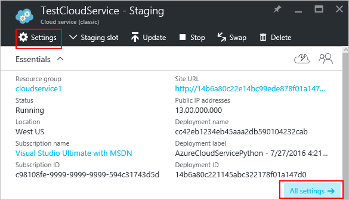

The **Settings** or **All settings** links will open up **Settings** where you can change the **Properties**, change the **Configuration**, manage the **Certificates**, set up **Alert rules**, and manage the **Users** who have access to this cloud service.

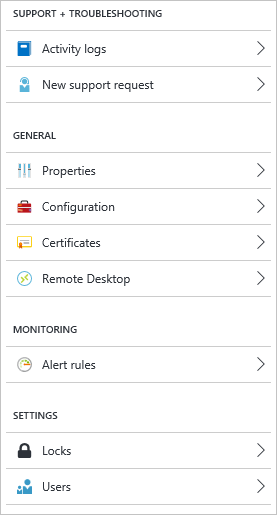

### Manage Guest OS version

By default, Azure periodically updates your guest OS to the latest supported image within the OS family that you've specified in your service configuration (.cscfg), such as Windows Server 2016.

If you need to target a specific OS version, you can set it in **Configuration**.

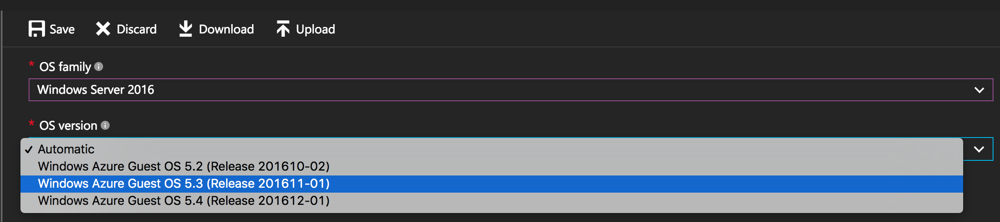

>[!IMPORTANT]
> Choosing a specific OS version disables automatic OS updates and makes patching your responsibility. You must ensure that your role instances are receiving updates or you may expose your application to security vulnerabilities.

## Monitoring

You can add alerts to your cloud service. Click **Settings** > **Alert Rules** > **Add alert**.

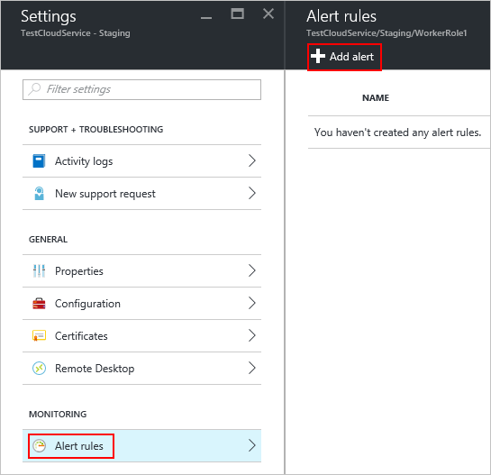

From here, you can set up an alert. With the **Metric** drop-down box, you can set up an alert for the following types of data.

* Disk read
* Disk write
* Network in
* Network out
* CPU percentage

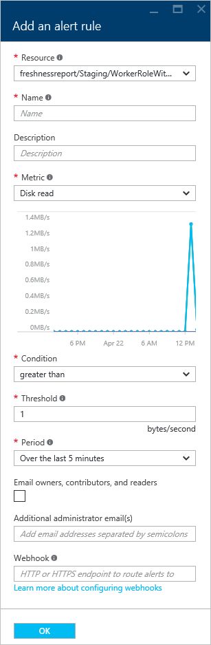

### Configure monitoring from a metric tile

Instead of using **Settings** > **Alert Rules**, you can click on one of the metric tiles in the **Monitoring** section of the cloud service.

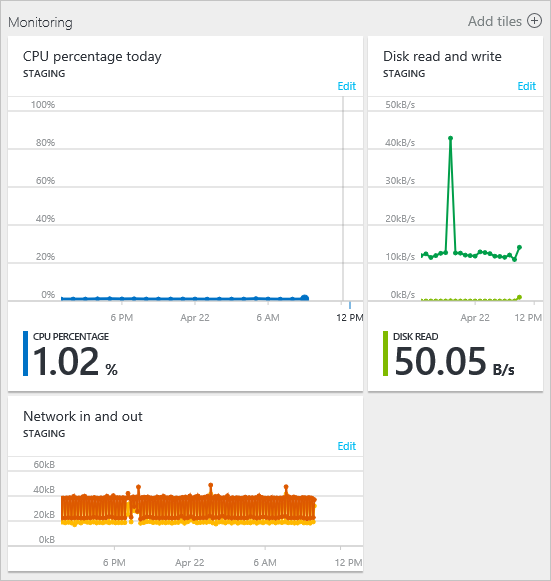

From here you can customize the chart used with the tile, or add an alert rule.

## Reboot, reimage, or remote desktop

You can set up remote desktop through the [Azure portal (set up remote desktop)](cloud-services-role-enable-remote-desktop-new-portal.md), [PowerShell](cloud-services-role-enable-remote-desktop-powershell.md), or through [Visual Studio](cloud-services-role-enable-remote-desktop-visual-studio.md).

To reboot, reimage, or remote into a Cloud Service, select the cloud service instance.

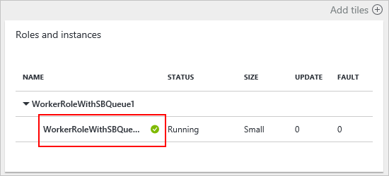

You can then initiate a remote desktop connection, remotely reboot the instance, or remotely reimage (start with a fresh image) the instance.

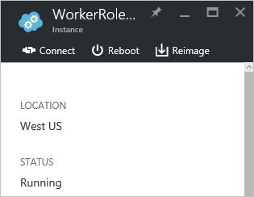

## Reconfigure your .cscfg

You may need to reconfigure your cloud service through the [service config (cscfg)](cloud-services-model-and-package.md#cscfg) file. First you need to download your .cscfg file, modify it, then upload it.

1. Click on the **Settings** icon or the **All settings** link to open up **Settings**.

    
2. Click on the **Configuration** item.

    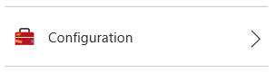
3. Click on the **Download** button.

    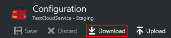
4. After you update the service configuration file, upload and apply the configuration updates:

    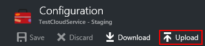
5. Select the .cscfg file and click **OK**.

## Next steps

* Learn how to [deploy a cloud service](cloud-services-how-to-create-deploy-portal.md).
* Configure a [custom domain name](cloud-services-custom-domain-name-portal.md).
* [Manage your cloud service](cloud-services-how-to-manage-portal.md).
* Configure [TLS/SSL certificates](cloud-services-configure-ssl-certificate-portal.md).

