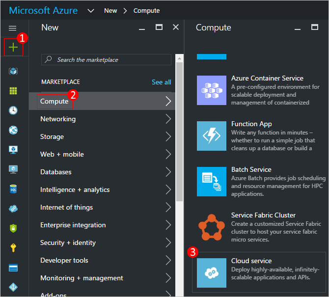
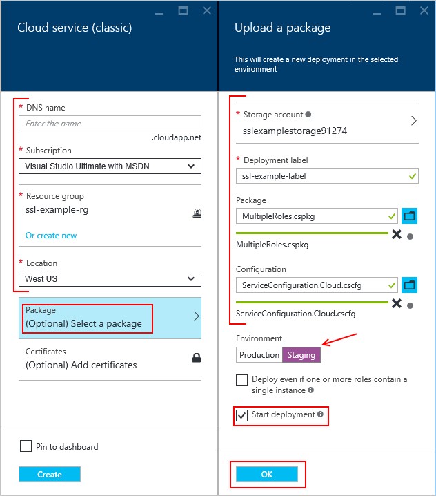
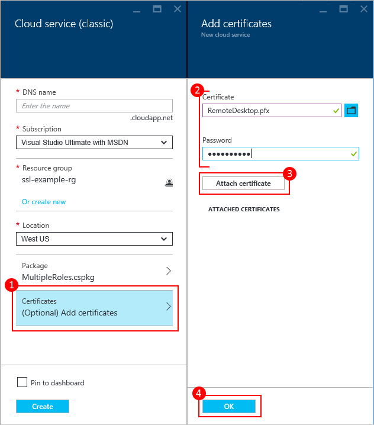
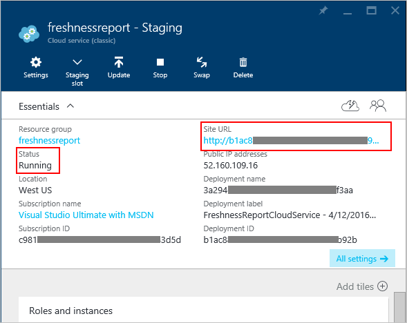

# How to create and deploy a cloud service
The Azure portal provides two ways for you to create and deploy a cloud service: *Quick Create* and *Custom Create*.

This article explains how to use the Quick Create method to create a new cloud service and then use **Upload** to upload and deploy a cloud service package in Azure. When you use this method, the Azure portal makes available convenient links for completing all requirements as you go. If you're ready to deploy your cloud service when you create it, you can do both at the same time using Custom Create.

> [!NOTE]
> If you plan to publish your cloud service from Azure DevOps, use Quick Create, and then set up Azure DevOps publishing from the Azure Quickstart or the dashboard. For more information, see [Continuous Delivery to Azure by Using Azure DevOps][TFSTutorialForCloudService], or see help for the **Quick Start** page.
>
>

## Concepts
Three components are required to deploy an application as a cloud service in Azure:

* **Service Definition**  
  The cloud service definition file (.csdef) defines the service model, including the number of roles.
* **Service Configuration**  
  The cloud service configuration file (.cscfg) provides configuration settings for the cloud service and individual roles, including the number of role instances.
* **Service Package**  
  The service package (.cspkg) contains the application code and configurations and the service definition file.

You can learn more about these and how to create a package [here](cloud-services-model-and-package.md).

## Prepare your app
Before you can deploy a cloud service, you must create the cloud service package (.cspkg) from your application code and a cloud service configuration file (.cscfg). The Azure SDK provides tools for preparing these required deployment files. You can install the SDK from the [Azure Downloads](https://azure.microsoft.com/downloads/) page, in the language in which you prefer to develop your application code.

Three cloud service features require special configurations before you export a service package:

* If you want to deploy a cloud service that uses Secure Sockets Layer (SSL) for data encryption, [configure your application](cloud-services-configure-ssl-certificate-portal.md#modify) for SSL.
* If you want to configure Remote Desktop connections to role instances, [configure the roles](cloud-services-role-enable-remote-desktop-new-portal.md) for Remote Desktop.
* If you want to configure verbose monitoring for your cloud service, enable Azure Diagnostics for the cloud service. *Minimal monitoring* (the default monitoring level) uses performance counters gathered from the host operating systems for role instances (virtual machines). *Verbose monitoring* gathers additional metrics based on performance data within the role instances to enable closer analysis of issues that occur during application processing. To find out how to enable Azure Diagnostics, see [Enabling diagnostics in Azure](cloud-services-dotnet-diagnostics.md).

To create a cloud service with deployments of web roles or worker roles, you must [create the service package](cloud-services-model-and-package.md#servicepackagecspkg).

## Before you begin
* If you haven't installed the Azure SDK, click **Install Azure SDK** to open the [Azure Downloads page](https://azure.microsoft.com/downloads/), and then download the SDK for the language in which you prefer to develop your code. (You'll have an opportunity to do this later.)
* If any role instances require a certificate, create the certificates. Cloud services require a .pfx file with a private key. You can upload the certificates to Azure as you create and deploy the cloud service.

## Create and deploy
1. Log in to the [Azure portal](https://portal.azure.com/).
2. Click **Create a resource > Compute**, and then scroll down to and click **Cloud Service**.

    
3. In the new **Cloud Service** pane, enter a value for the **DNS name**.
4. Create a new **Resource Group** or select an existing one.
5. Select a **Location**.
6. Click **Package**. This opens the **Upload a package** pane. Fill in the required fields. If any of your roles contain a single instance, ensure **Deploy even if one or more roles contain a single instance** is selected.
7. Make sure that **Start deployment** is selected.
8. Click **OK** which will close the **Upload a package** pane.
9. If you do not have any certificates to add, click **Create**.

    

## Upload a certificate
If your deployment package was [configured to use certificates](cloud-services-configure-ssl-certificate-portal.md#modify), you can upload the certificate now.

1. Select **Certificates**, and on the **Add certificates** pane, select the SSL certificate .pfx file, and then provide the **Password** for the certificate,
2. Click **Attach certificate**, and then click **OK** on the **Add certificates** pane.
3. Click **Create** on the **Cloud Service** pane. When the deployment has reached the **Ready** status, you can proceed to the next steps.

    

## Verify your deployment completed successfully
1. Click the cloud service instance.

    The status should show that the service is **Running**.
2. Under **Essentials**, click the **Site URL** to open your cloud service in a web browser.

    

[TFSTutorialForCloudService]: https://go.microsoft.com/fwlink/?LinkID=251796

## Next steps
* [General configuration of your cloud service](cloud-services-how-to-configure-portal.md).
* Configure a [custom domain name](cloud-services-custom-domain-name-portal.md).
* [Manage your cloud service](cloud-services-how-to-manage-portal.md).
* Configure [ssl certificates](cloud-services-configure-ssl-certificate-portal.md).
