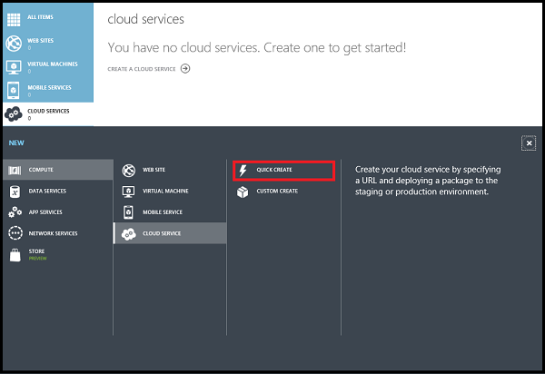
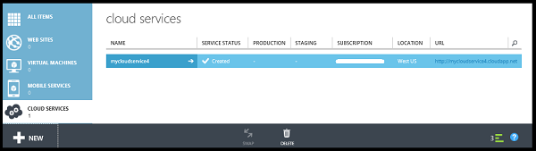
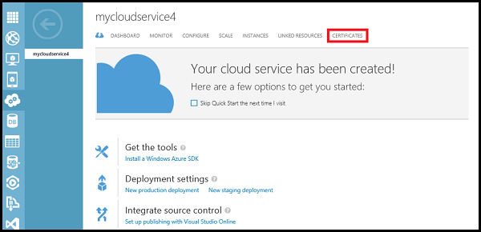
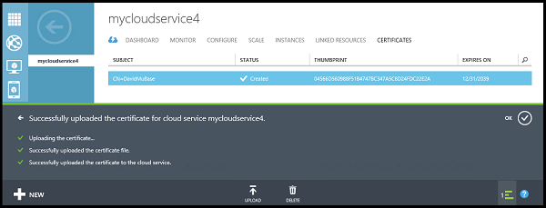
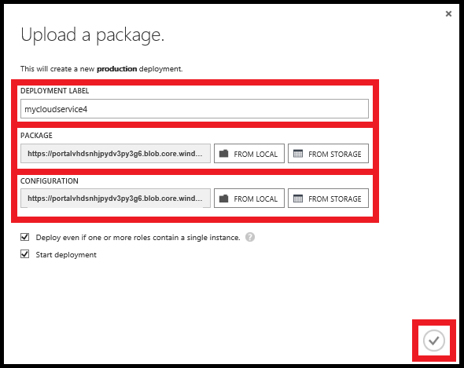
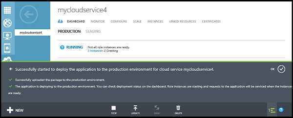

<properties
	pageTitle="How to create and deploy a cloud service | Microsoft Azure"
	description="Learn how to create and deploy a cloud service using the Quick Create method in Azure."
	services="cloud-services"
	documentationCenter=""
	authors="Thraka"
	manager="timlt"
	editor=""/>

<tags
	ms.service="cloud-services"
	ms.workload="tbd"
	ms.tgt_pltfrm="na"
	ms.devlang="na"
	ms.topic="article"
	ms.date="07/05/2016"
	ms.author="adegeo"/>

# How to Create and Deploy a Cloud Service

> [AZURE.SELECTOR]
- [Azure portal](cloud-services-how-to-create-deploy-portal.md)
- [Azure classic portal](cloud-services-how-to-create-deploy.md)

The Azure classic portal provides two ways for you to create and deploy a cloud service: **Quick Create** and **Custom Create**.

This topic explains how to use the Quick Create method to create a new cloud service and then use **Upload** to upload and deploy a cloud service package in Azure. When you use this method, the Azure classic portal makes available convenient links for completing all requirements as you go. If you're ready to deploy your cloud service when you create it, you can do both at the same time using **Custom Create**.

> [AZURE.NOTE] If you plan to publish your cloud service from Visual Studio Team Services (VSTS), use Quick Create, and then set up VSTS publishing from **Quick Start** or the dashboard. For more information, see [Continuous Delivery to Azure by Using Visual Studio Team Services][TFSTutorialForCloudService], or see help for the **Quick Start** page.

## Concepts
Three components are required in order to deploy an application as a cloud service in Azure:

- **Service Definition**  
  The cloud service definition file (.csdef) defines the service model, including the number of roles.

- **Service Configuration**  
  The cloud service configuration file (.cscfg) provides configuration settings for the cloud service and individual roles, including the number of role instances.

- **Service Package**  
  The service package (.cspkg) contains the application code and configurations and the service definition file.
  
You can learn more about these and how to create a package [here](cloud-services-model-and-package.md).

## Prepare your app
Before you can deploy a cloud service, you must create the cloud service package (.cspkg) from your application code and a cloud service configuration file (.cscfg). The Azure SDK provides tools for preparing these required deployment files. You can install the SDK from the [Azure Downloads](https://azure.microsoft.com/downloads/) page, in the language in which you prefer to develop your application code.

Three cloud service features require special configurations before you export a service package:

- If you want to deploy a cloud service that uses Secure Sockets Layer (SSL) for data encryption, [configure your application](cloud-services-configure-ssl-certificate.md#step-2-modify-the-service-definition-and-configuration-files) for SSL.

- If you want to configure Remote Desktop connections to role instances, [configure the roles](cloud-services-role-enable-remote-desktop.md) for Remote Desktop.

- If you want to configure verbose monitoring for your cloud service, enable Azure Diagnostics for the cloud service. *Minimal monitoring* (the default monitoring level) uses performance counters gathered from the host operating systems for role instances (virtual machines). "Verbose monitoring* gathers additional metrics based on performance data within the role instances to enable closer analysis of issues that occur during application processing. To find out how to enable Azure Diagnostics, see [Enabling Diagnostics in Azure](cloud-services-dotnet-diagnostics.md).

To create a cloud service with deployments of web roles or worker roles, you must [create the service package](cloud-services-model-and-package.md#servicepackagecspkg).

## Before you begin

- If you haven't installed the Azure SDK, click **Install Azure SDK** to open the [Azure Downloads page](https://azure.microsoft.com/downloads/), and then download the SDK for the language in which you prefer to develop your code. (You'll have an opportunity to do this later.)

- If any role instances require a certificate, create the certificates. Cloud services require a .pfx file with a private key. You can [upload the certificates to Azure](cloud-services-configure-ssl-certificate.md#step-3-upload-a-certificate) as you create and deploy the cloud service.

- If you plan to deploy the cloud service to an affinity group, create the affinity group. You can use an affinity group to deploy your cloud service and other Azure services to the same location in a region. You can create the affinity group in the **Networks** area of the Azure classic portal, on the **Affinity Groups** page.

## How to: Create a cloud service using Quick Create

1. In the [Azure classic portal](http://manage.windowsazure.com/), click **New**>**Compute**>**Cloud Service**>**Quick Create**.

	

2. In **URL**, enter a subdomain name to use in the public URL for accessing your cloud service in production deployments. The URL format for production deployments is: http://*myURL*.cloudapp.net.

3. In **Region or Affinity Group**, select the geographic region or affinity group to deploy the cloud service to. Select an affinity group if you want to deploy your cloud service to the same location as other Azure services within a region.

4. Click **Create Cloud Service**.

	

	You can monitor the status of the process in the message area at the bottom of the window.

	The **Cloud Services** area opens, with the new cloud service displayed. When the status changes to Created, cloud service creation has completed successfully.

	

## How to: Upload a certificate for a cloud service

1. In the [Azure classic portal](http://manage.windowsazure.com/), click **Cloud Services**, click the name of the cloud service, and then click **Certificates**.

	

2. Click either **Upload a certificate** or **Upload**.

3. In **File**, use **Browse** to select the certificate (.pfx file).

4. In **Password**, enter the private key for the certificate.

5. Click **OK** (checkmark).

	

	You can watch the progress of the upload in the message area, shown below. When the upload completes, the certificate is added to the table. In the message area, click OK to close the message.

	

## How to: Deploy a cloud service

1. In the [Azure classic portal](http://manage.windowsazure.com/), click **Cloud Services**, click the name of the cloud service, and then click **Dashboard**.

2. Click either **Upload a new production deployment** or **Upload**.

3. In **Deployment label**, enter a name for the new deployment - for example, MyCloudServicev4.

3. In **Package**, use **Browse** to select the service package file (.cspkg) to use.

4. In **Configuration**, use **Browse** to select the service configure file (.cscfg) to use.

5. If the cloud service will include any roles with only one instance, select the **Deploy even if one or more roles contain a single instance** check box to enable the deployment to proceed.

    Azure can only guarantee 99.95 percent access to the cloud service during maintenance and service updates if every role has at least two instances. If needed, you can add additional role instances on the **Scale** page after you deploy the cloud service. For more information, see [Service Level Agreements](https://azure.microsoft.com/support/legal/sla/).

6. Click **OK** (checkmark) to begin the cloud service deployment.

	

	You can monitor the status of the deployment in the message area. Click OK to hide the message.

	

## Verify your deployment completed successfully

1. Click **Dashboard**.

	The status should show that the service is **Running**.

2. Under **quick glance**, click the site URL to open your cloud service in a web browser.

    

[TFSTutorialForCloudService]: http://go.microsoft.com/fwlink/?LinkID=251796
 
## Next steps

* [General configuration of your cloud service](cloud-services-how-to-configure.md).
* Configure a [custom domain name](cloud-services-custom-domain-name.md).
* [Manage your cloud service](cloud-services-how-to-manage.md).
* Configure [ssl certificates](cloud-services-configure-ssl-certificate.md).