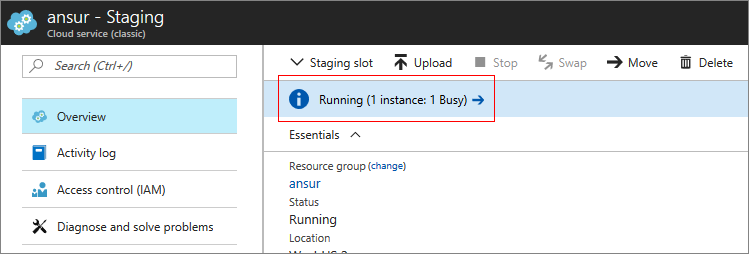

# Manage Cloud Services (classic) in the Azure portal

[!INCLUDE [Cloud Services (classic) deprecation announcement](includes/deprecation-announcement.md)]

In the **Cloud Services** area of the Azure portal, you can:

* Update a service role or a deployment.
* Promote a staged deployment to production.
* Link resources to your cloud service so that you can see the resource dependencies and scale the resources together.
* Delete a cloud service or a deployment.

For more information about how to scale your cloud service, see [Configure auto-scaling for a cloud service in the portal](cloud-services-how-to-scale-portal.md).

## Update a cloud service role or deployment
If you need to update the application code for your cloud service, use **Update** on the cloud service blade. You can update a single role or all roles. To update, you can upload a new service package or service configuration file.

1. In the [Azure portal], select the cloud service you want to update. This step opens the cloud service instance blade.

2. On the blade, select **Update**.

    

3. Update the deployment with a new service package file (.cspkg) and service configuration file (.cscfg).

    

4. Optionally, update the storage account and the deployment label.

5. If any roles have only one role instance, select the **Deploy even if one or more roles contain a single instance** check box to enable the upgrade to proceed.

    Azure can guarantee only 99.95 percent service availability during a cloud service update if each role has at least two role instances (virtual machines). With two role instances, one virtual machine processes client requests while the other is updated.

6. Select the **Start deployment** check box to apply the update after the upload of the package has finished.

7. Select **OK** to begin updating the service.

## Swap deployments to promote a staged deployment to production
When you decide to deploy a new release of a cloud service, stage and test your new release in your cloud service staging environment. Use **Swap** to switch the URLs by which the two deployments are addressed and promote a new release to production.

You can swap deployments from the **Cloud Services** page or the dashboard.

1. In the [Azure portal], select the cloud service you want to update. This step opens the cloud service instance blade.

2. On the blade, select **Swap**.

    

3. The following confirmation prompt opens:

    

4. After you verify the deployment information, select **OK** to swap the deployments.

    The deployment swap happens quickly because the only thing that changes is the virtual IP addresses (VIPs) for the deployments.

    To save compute costs, you can delete the staging deployment after you verify that your production deployment is working as expected.

### Common questions about swapping deployments

**What are the prerequisites for swapping deployments?**

There are two key prerequisites for a successful deployment swap:

- If you want to use a static IP address for your production slot, you must reserve one for your staging slot as well. Otherwise, the swap fails.

- All instances of your roles must be running before you can perform the swap. You can check the status of your instances on the **Overview** blade of the Azure portal. Alternatively, you can use the [Get-AzureRole](/powershell/module/servicemanagement/azure/get-azurerole) command in Windows PowerShell.

Note that guest OS updates and service healing operations also can cause deployment swaps to fail. For more information, see [Troubleshoot cloud service deployment problems](cloud-services-troubleshoot-deployment-problems.md).

**Does a swap incur downtime for my application? How should I handle it?**

As described in the previous section, a deployment swap is typically fast because it's just a configuration change in the Azure load balancer. In some cases, it can take 10 or more seconds and result in transient connection failures. To limit impact to your customers, consider implementing [client retry logic](/azure/architecture/best-practices/transient-faults).

## Delete deployments and a cloud service
Before you can delete a cloud service, you must delete each existing deployment.

To save compute costs, you can delete the staging deployment after you verify that your production deployment is working as expected. You are billed for compute costs for deployed role instances that are stopped.

Use the following procedure to delete a deployment or your cloud service.

1. In the [Azure portal], select the cloud service you want to delete. This step opens the cloud service instance blade.

2. On the blade, select **Delete**.

    

3. To delete the entire cloud service, select the **Cloud service and its deployments** check box. Or you can choose either the **Production deployment** or the **Staging deployment** check box.

    

4. Select **Delete** at the bottom.

5. To delete the cloud service, select **Delete cloud service**. Then, at the confirmation prompt, select **Yes**.

> [!NOTE]
> When a cloud service is deleted and verbose monitoring is configured, you must delete the data manually from your storage account. For information about where to find the metrics tables, see [Introduction to cloud service monitoring](cloud-services-how-to-monitor.md).

## Find more information about failed deployments
The **Overview** blade has a status bar at the top. When you select the bar, a new blade opens and displays any error information. If the deployment doesn't contain any errors, the information blade is blank.

## Next steps

* [General configuration of your cloud service](cloud-services-how-to-configure-portal.md).
* Learn how to [deploy a cloud service](cloud-services-how-to-create-deploy-portal.md).
* Configure a [custom domain name](cloud-services-custom-domain-name-portal.md).
* Configure [TLS/SSL certificates](cloud-services-configure-ssl-certificate-portal.md).

[Azure portal]: https://portal.azure.com
