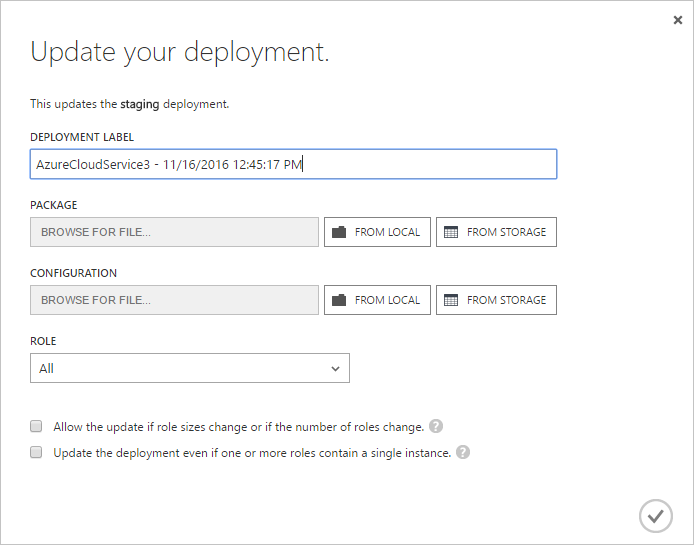
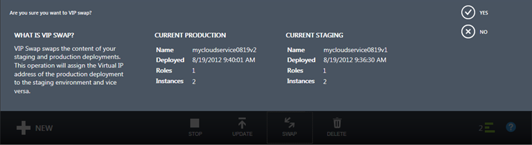
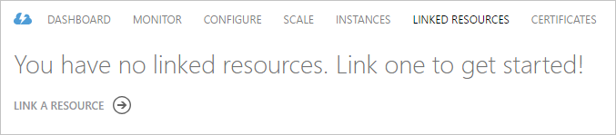
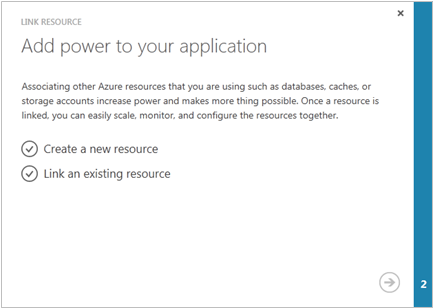
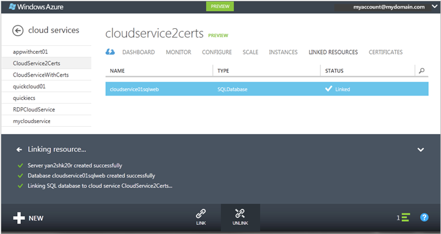
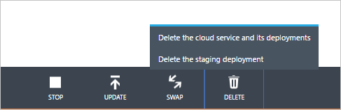

<properties 
	pageTitle="Common cloud service management tasks (classic) | Microsoft Azure" 
	description="Learn how to manage cloud services in the Azure classic portal." 
	services="cloud-services" 
	documentationCenter="" 
	authors="Thraka" 
	manager="timlt" 
	editor=""/>

<tags 
	ms.service="cloud-services" 
	ms.workload="tbd" 
	ms.tgt_pltfrm="na" 
	ms.devlang="na" 
	ms.topic="article" 
	ms.date="08/10/2016"
	ms.author="adegeo"/>

# How to Manage Cloud Services

> [AZURE.SELECTOR]
- [Azure portal](cloud-services-how-to-manage-portal.md)
- [Azure classic portal](cloud-services-how-to-manage.md)

In the **Cloud Services** area of the Azure classic portal, you can update a service role or a deployment, promote a staged deployment to production, link resources to your cloud service so that you can see the resource dependencies and scale the resources together, and delete a cloud service or a deployment.

## How to: Update a cloud service role or deployment

If you need to update the application code for your cloud service, use **Update** on the dashboard, **Cloud Services** page, or **Instances** page. You can update a single role or all roles. You'll need to upload a new service package and service configuration file.

1. In the [Azure classic portal](https://manage.windowsazure.com/), on the dashboard, **Cloud Services** page, or **Instances** page, click **Update**.

	

2. In **Deployment label**, enter a name to identify the deployment (for example, mycloudservice4). You'll find the deployment label under **quick start** on the dashboard.

3. In **Package**, use **Browse** to upload the service package file (.cspkg).

4. In **Configuration**, use **Browse** to upload the service configuration file (.cscfg).

5. In **Role**, select **All** if you want to upgrade all roles in the cloud service. To perform a single role update, select the role you want to update. Even if you select a specific role to update, the updates in the service configuration file are applied to all roles.

6. If the update changes the number of roles or the size of any role, select the **Allow update if role sizes or number of roles changes** check box to enable the update to proceed. 

	Be aware that if you change the size of a role (that is, the size of a virtual machine that hosts a role instance) or the number of roles, each role instance (virtual machine) must be re-imaged, and any local data will be lost.

7. If any service roles have only one role instance, select the **Update even if one or more role contain a single instance check box** to enable the upgrade to proceed. 

	Azure can only guarantee 99.95 percent service availability during a cloud service update if each role has at least two role instances (virtual machines). That enables one virtual machine to process client requests while the other is being updated.

8. Click **OK** (checkmark) to begin updating the service.

## How to: Swap deployments to promote a staged deployment to production

Use **Swap** to promote a staging deployment of a cloud service to production. When you decide to deploy a new release of a cloud service, you can stage and test your new release in your cloud service staging environment while your customers are using the current release in production. When you're ready to promote the new release to production, you can use **Swap** to switch the URLs by which the two deployments are addressed. 

You can swap deployments from the **Cloud Services** page or the dashboard.

1. In the [Azure classic portal](https://manage.windowsazure.com/), click **Cloud Services**.

2. In the list of cloud services, click the cloud service to select it.

3. Click **Swap**.

	The following confirmation prompt opens.

	

4. After you verify the deployment information, click **Yes** to swap the deployments.

	The deployment swap happens quickly because the only thing that changes is the virtual IP addresses (VIPs) for the deployments.

	To save compute costs, you can delete the deployment in the staging environment when you're sure the new production deployment is performing as expected.

## How to: Link a resource to a cloud service

To show your cloud service's dependencies on other resources, you can link an Azure SQL Database instance or a storage account to the cloud service. You can link and unlink resources on the **Linked Resources** page, and then monitor their usage on the cloud service dashboard. If a linked storage account has monitoring turned on, you can monitor Total Requests on the cloud service dashboard.

Use **Link** to link a new or existing SQL Database instance or storage account to your cloud service. You can then scale the database along with the cloud service role that is using it on the **Scale** page. (A storage account scales automatically as usage increases.) For more information, see [How to Scale a Cloud Service and Linked Resources](cloud-services-how-to-scale.md). 

You also can monitor, manage, and scale the database in the **Databases** node of the Azure classic portal. 

"Linking" a resource in this sense doesn't connect your app to the resource. If you create a new database using **Link**, you'll need to add the connection strings to your application code and then upgrade the cloud service. You'll also need to add connection strings if your app uses resources in a linked storage account.

The following procedure describes how to link a new SQL Database instance, deployed on a new SQL Database server, to a cloud service.

### To link a SQL Database instance to a cloud service

1. In the [Azure classic portal](http://manage.windowsazure.com/), click **Cloud Services**. Then click the name of the cloud service to open the dashboard.

2. Click **Linked Resources**.

	The **Linked Resources** page opens.

	

3. Click either **Link a Resource** or **Link**.

	The **Link Resource** wizard starts.

	

4. Click **Create a new resource** or **Link an existing resource**.

5. Choose the type of resource to link. In the [Azure classic portal](http://manage.windowsazure.com/), click **SQL Database**. (The Preview Azure classic portal does not support linking a storage account to a cloud service.)

6. To complete the database configuration, follow instructions in help for the **SQL Databases** area of the Azure classic portal.

	You can follow the progress of the linking operation in the message area.

	

	When linking is complete, you can monitor the status of the linked resource on the cloud service dashboard. For information about scaling a linked SQL Database, see [How to Scale a Cloud Service and Linked Resources](cloud-services-how-to-scale.md).

### To unlink a linked resource

1. In the [Azure classic portal](http://manage.windowsazure.com/), click **Cloud Services**. Then click the name of the cloud service to open the dashboard.

2. Click **Linked Resources**, and then select the resource.

3. Click **Unlink**. Then click **Yes** at the confirmation prompt.

	Unlinking a SQL Database has no effect on the database or the application's connections to the database. You can still manage the database in the **SQL Databases** area of the Azure classic portal.

## How to: Delete deployments and a cloud service

Before you can delete a cloud service, you must delete each existing deployment.

To save compute costs, you can delete your staging deployment after you verify that your production deployment is working as expected. You are billed compute costs for role instances even if a cloud service is not running.

Use the following procedure to delete a deployment or your cloud service. 

1. In the [Azure classic portal](http://manage.windowsazure.com/), click **Cloud Services**.

2. Select the cloud service, and then click **Delete**. (To select a cloud service without opening the dashboard, click anywhere except the name in the cloud service entry.)

	If you have a deployment in staging or production, you will see a menu of choices similar to the following one at the bottom of the window. Before you can delete the cloud service, you must delete any existing deployments.

	

3. To delete a deployment, click **Delete production deployment** or **Delete staging deployment**. Then, at the confirmation prompt, click **Yes**. 

4. If you plan to delete the cloud service, repeat step 3, if needed, to delete your other deployment.

5. To delete the cloud service, click **Delete cloud service**. Then, at the confirmation prompt, click **Yes**.

> [AZURE.NOTE]
> If verbose monitoring is configured for your cloud service, Azure does not delete the monitoring data from your storage account when you delete the cloud service. You will need to delete the data manually. For information about where to find the metrics tables, see "How to: Access verbose monitoring data outside the Azure classic portal" in [How to Monitor Cloud Services](cloud-services-how-to-monitor.md).

## Next steps

 * [General configuration of your cloud service](cloud-services-how-to-configure.md).
* Learn how to [deploy a cloud service](cloud-services-how-to-create-deploy.md).
* Configure a [custom domain name](cloud-services-custom-domain-name.md).
* Configure [ssl certificates](cloud-services-configure-ssl-certificate.md).
