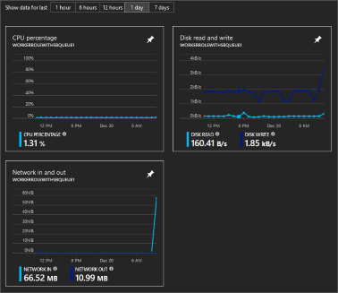

# Introduction to Cloud Service Monitoring

You can monitor key performance metrics for any cloud service. Every cloud service role collects minimal data: CPU usage, network usage, and disk utilization. If the cloud service has the `Microsoft.Azure.Diagnostics` extension applied to a role, that role can collect additional points of data. This article provides an introduction to Azure Diagnostics for Cloud Services.

With basic monitoring, performance counter data from role instances is sampled and collected at 3-minute intervals. This basic monitoring data is not stored in your storage account and has no additional cost associated with it.

With advanced monitoring, additional metrics are sampled and collected at intervals of 5 minutes, 1 hour, and 12 hours. The aggregated data is stored in a storage account, in tables, and is purged after 10 days. The storage account used is configured by role; you can use different storage accounts for different roles. This is configured with a connection string in the [.csdef](cloud-services-model-and-package.md#servicedefinitioncsdef) and [.cscfg](cloud-services-model-and-package.md#serviceconfigurationcscfg) files.


## Basic monitoring

As stated in the introduction, a cloud service automatically collects basic monitoring data from the host virtual machine. This data includes CPU percentage, network in/out, and disk read/write. The collected monitoring data is automatically displayed on the overview and metrics pages of the cloud service, in the Azure portal. 

Basic monitoring does not require a storage account. 



## Advanced monitoring

Advanced monitoring involves using the **Azure Diagnostics** extension (and optionally the Application Insights SDK) on the role you want to monitor. The diagnostics extension uses a config file (per role) named **diagnostics.wadcfgx** to configure the diagnostics metrics monitored. The Azure Diagnostic extension collects and stores data in an Azure Storage account. These settings are configured in the **.wadcfgx**, [.csdef](cloud-services-model-and-package.md#servicedefinitioncsdef), and [.cscfg](cloud-services-model-and-package.md#serviceconfigurationcscfg) files. This means that there is an extra cost associated with advanced monitoring.

As each role is created, Visual Studio adds the Azure Diagnostics extension to it. This diagnostics extension can collect the following types of information:

* Custom performance counters
* Application logs
* Windows event logs
* .NET event source
* IIS logs
* Manifest based ETW
* Crash dumps
* Customer error logs

> [!IMPORTANT]
> While all this data is aggregated into the storage account, the portal does **not** provide a native way to chart the data. It is highly recommended that you integrate another service, like Application Insights, into your application.

## Setup diagnostics extension

First, if you don't have a **classic** storage account, [create one](../storage/common/storage-quickstart-create-account.md). Make sure the storage account is created with the **Classic deployment model** specified.

Next, navigate to the **Storage account (classic)** resource. Select **Settings** > **Access keys** and copy the **Primary connection string** value. You need this value for the cloud service. 

There are two config files you must change for advanced diagnostics to be enabled, **ServiceDefinition.csdef** and **ServiceConfiguration.cscfg**.

### ServiceDefinition.csdef

In the **ServiceDefinition.csdef** file, add a new setting named `Microsoft.WindowsAzure.Plugins.Diagnostics.ConnectionString` for each role that uses advanced diagnostics. Visual Studio adds this value to the file when you create a new project. In case it is missing, you can add it now. 

```xml
<ServiceDefinition name="AnsurCloudService" xmlns="http://schemas.microsoft.com/ServiceHosting/2008/10/ServiceDefinition" schemaVersion="2015-04.2.6">
  <WorkerRole name="WorkerRoleWithSBQueue1" vmsize="Small">
    <ConfigurationSettings>
      <Setting name="Microsoft.WindowsAzure.Plugins.Diagnostics.ConnectionString" />
```

This defines a new setting that must be added to every **ServiceConfiguration.cscfg** file. 

Most likely you have two **.cscfg** files, one named **ServiceConfiguration.cloud.cscfg** for deploying to Azure, and one named **ServiceConfiguration.local.cscfg** that is used for local deployments in the emulated environment. Open and change each **.cscfg** file. Add a setting named `Microsoft.WindowsAzure.Plugins.Diagnostics.ConnectionString`. Set the value to the **Primary connection string** of the classic storage account. If you want to use the local storage on your development machine, use `UseDevelopmentStorage=true`.

```xml
<ServiceConfiguration serviceName="AnsurCloudService" xmlns="http://schemas.microsoft.com/ServiceHosting/2008/10/ServiceConfiguration" osFamily="4" osVersion="*" schemaVersion="2015-04.2.6">
  <Role name="WorkerRoleWithSBQueue1">
    <Instances count="1" />
    <ConfigurationSettings>
      <Setting name="Microsoft.WindowsAzure.Plugins.Diagnostics.ConnectionString" value="DefaultEndpointsProtocol=https;AccountName=mystorage;AccountKey=KWwkdfmskOIS240jnBOeeXVGHT9QgKS4kIQ3wWVKzOYkfjdsjfkjdsaf+sddfwwfw+sdffsdafda/w==" />
      
      <!-- or use the local development machine for storage
      <Setting name="Microsoft.WindowsAzure.Plugins.Diagnostics.ConnectionString" value="UseDevelopmentStorage=true" />
      -->
```

## Use Application Insights

When you publish the Cloud Service from Visual Studio, you are given the option to send the diagnostic data to Application Insights. You can create the Application Insights Azure resource at that time or send the data to an existing Azure resource. Your cloud service can be monitored by Application Insights for availability, performance, failures, and usage. Custom charts can be added to Application Insights so that you can see the data that matters the most. Role instance data can be collected by using the Application Insights SDK in your cloud service project. For more information on how to integrate Application Insights, see [Application Insights with Cloud Services](../application-insights/app-insights-cloudservices.md).

Note that while you can use Application Insights to display the performance counters (and the other settings) you have specified through the Windows Azure Diagnostics extension, you only get a richer experience by integrating the Application Insights SDK into your worker and web roles.


## Next steps

- [Learn about Application Insights with Cloud Services](../application-insights/app-insights-cloudservices.md)
- [Set up performance counters](diagnostics-performance-counters.md)

