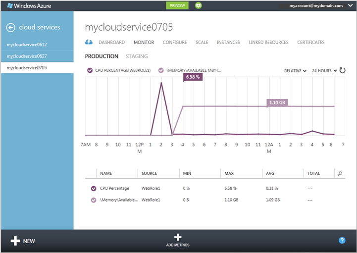
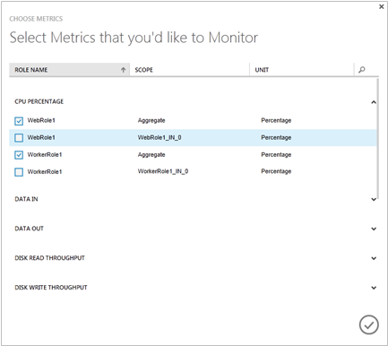
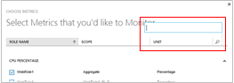
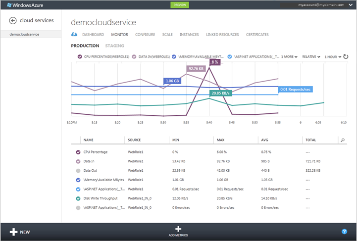
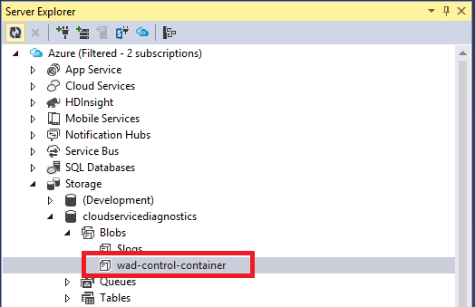
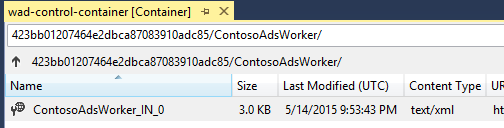
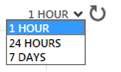

<properties 
    pageTitle="How to monitor a cloud service | Microsoft Azure" 
    description="Learn how to monitor cloud services by using the Azure classic portal." 
    services="cloud-services" 
    documentationCenter="" 
    authors="rboucher" 
    manager="timlt" 
    editor=""/>

<tags 
    ms.service="cloud-services" 
    ms.workload="tbd" 
    ms.tgt_pltfrm="na" 
    ms.devlang="na" 
    ms.topic="article" 
    ms.date="08/04/2015" 
    ms.author="robb"/>


# How to Monitor Cloud Services

[AZURE.INCLUDE [disclaimer](../../includes/disclaimer.md)]

You can monitor `key` performance metrics for your cloud services in the Azure classic portal. You can set the level of monitoring to minimal and verbose for each service role, and can customize the monitoring displays. Verbose monitoring data is stored in a storage account, which you can access outside the portal. 

Monitoring displays in the Azure classic portal are highly configurable. You can choose the metrics you want to monitor in the metrics list on the **Monitor** page, and you can choose which metrics to plot in metrics charts on the **Monitor** page and the dashboard. 

## Concepts

By default, minimal monitoring is provided for a new cloud service using performance counters gathered from the host operating system for the roles instances (virtual machines). The minimal metrics are limited to CPU Percentage, Data In, Data Out, Disk Read Throughput, and Disk Write Throughput. By configuring verbose monitoring, you can receive additional metrics based on performance data within the virtual machines (role instances). The verbose metrics enable closer analysis of issues that occur during application operations.

By default performance counter data from role instances is sampled and transferred from the role instance at 3-minute intervals. When you enable verbose monitoring, the raw performance counter data is aggregated for each role instance and across role instances for each role at intervals of 5 minutes, 1 hour, and 12 hours. The aggregated data is  purged after 10 days.

After you enable verbose monitoring, the aggregated monitoring data is stored in tables in your storage account. To enable verbose monitoring for a role, you must configure a diagnostics connection string that links to the storage account. You can use different storage accounts for different roles.

Note that enabling verbose monitoring will increase your storage costs related to data storage, data transfer, and storage transactions. Minimal monitoring does not require a storage account. The data for the metrics that are exposed at the minimal monitoring level are not stored in your storage account, even if you set the monitoring level to verbose.


## How to: Configure monitoring for cloud services

Use the following procedures to configure verbose or minimal monitoring in the Azure classic portal. 

### Before you begin

- Create a storage account to store the monitoring data. You can use different storage accounts for different roles. For more information, see help for **Storage Accounts**, or see [How To Create a Storage Account](/manage/services/storage/how-to-create-a-storage-account/).

- Enable Azure Diagnostics for your cloud service roles. See [Configuring Diagnostics for Cloud Services](https://msdn.microsoft.com/library/azure/dn186185.aspx#BK_EnableBefore).

Ensure that the diagnostics connection string is present in the Role configuration. You cannot turn on verbose monitoring until you enable Azure Diagnostics and include a diagnostics connection string in the Role configuration.   

> [AZURE.NOTE] Projects targeting Azure SDK 2.5 did not automatically include the diagnostics connection string in the project template. For these projects you need to manually add the diagnostics connection string to the Role configuration.

**To manually add diagnostics connection string to Role configuration**

1. Open the Cloud Service project in Visual Studio
2. Double click on the **Role** to open the Role designer and select the **Settings** tab
3. Look for a setting named **Microsoft.WindowsAzure.Plugins.Diagnostics.ConnectionString**. 
4. If this setting is not present then click on the **Add Setting** button to add it to the configuration and change the type for the new setting to **ConnectionString**
5. Set the value for connection string the by clicking on the **...** button. This will open up a dialog allowing you to select a storage account.

    

### To change the monitoring level to verbose or minimal

1. In the [Azure classic portal](https://manage.windowsazure.com/), open the **Configure** page for the cloud service deployment.

2. In **Level**, click **Verbose** or **Minimal**. 

3. Click **Save**.

After you turn on verbose monitoring, you should start seeing the monitoring data in the Azure classic portal within the hour.

The raw performance counter data and aggregated monitoring data are stored in the storage account in tables qualified by the deployment ID for the roles. 

## How to: Receive alerts for cloud service metrics

You can receive alerts based on your cloud service monitoring metrics. On the **Management Services** page of the Azure classic portal, you can create a rule to trigger an alert when the metric you choose reaches a value that you specify. You can also choose to have email sent when the alert is triggered. For more information, see [How to: Receive Alert Notifications and Manage Alert Rules in Azure](http://go.microsoft.com/fwlink/?LinkId=309356).

## How to: Add metrics to the metrics table

1. In the [Azure classic portal](http://manage.windowsazure.com/), open the **Monitor** page for the cloud service.

    By default, the metrics table displays a subset of the available metrics. The illustration shows the default verbose metrics for a cloud service, which is limited to the Memory\Available MBytes performance counter, with data aggregated at the role level. Use **Add Metrics** to select additional aggregate and role-level metrics to monitor in the Azure classic portal.

    
 
2. To add metrics to the metrics table:

    1. Click **Add Metrics** to open **Choose Metrics**, shown below.

		The first available metric is expanded to show options that are available. For each metric, the top option displays aggregated monitoring data for all roles. In addition, you can choose individual roles to display data for.

		

	2. To select metrics to display

		- Click the down arrow by the metric to expand the monitoring options.
		- Select the check box for each monitoring option you want to display.

		You can display up to 50 metrics in the metrics table.

		> [AZURE.TIP] In verbose monitoring, the metrics list can contain dozens of metrics. To display a scrollbar, hover over the right side of the dialog box. To filter the list, click the search icon, and enter text in the search box, as shown below.
	
		


3. After you finish selecting metrics, click OK (checkmark).

    The selected metrics are added to the metrics table, as shown below.

    

 
4. To delete a metric from the metrics table, click the metric to select it, and then click **Delete Metric**. (You only see **Delete Metric** when you have a metric selected.)

### To add custom metrics to the metrics table

The **Verbose** monitoring level provides a list of default metrics that you can monitor on the portal. In addition to these you can monitor any custom metrics or performance counters defined by your application through the portal.

The following steps assume that you have turned on **Verbose** monitoring level and have configuring your application to collect and transfer custom performance counters. 

To display the custom performance counters in the portal you need to update the configuration in wad-control-container:
 
1. Open the wad-control-container blob in your diagnostics storage account. You can use Visual Studio or any other storage explorer to do this.

	

2. Navigate the blob path using the pattern **DeploymentId/RoleName/RoleInstance** to find the configuration for your role instance. 

    
3. Download the configuration file for your role instance and update it to include any custom performance counters. For example to monitor *Disk Write Bytes/sec* for the *C drive* add the following under **PerformanceCounters\Subscriptions** node

    ```xml
    <PerformanceCounterConfiguration>
    <CounterSpecifier>\LogicalDisk(C:)\Disk Write Bytes/sec</CounterSpecifier>
    <SampleRateInSeconds>180</SampleRateInSeconds>
    </PerformanceCounterConfiguration>
    ```
4. Save the changes and upload the configuration file back to the same location overwriting the existing file in the blob.
5. Toggle to Verbose mode in the Azure classic portal configuration. If you were in Verbose mode already you will have to toggle to minimal and back to verbose.
6. The custom performance counter will now be available in the **Add Metrics** dialog box. 

## How to: Customize the metrics chart

1. In the metrics table, select up to 6 metrics to plot on the metrics chart. To select a metric, click the check box on its left side. To remove a metric from the metrics chart, clear its check box in the metrics table.

    As you select metrics in the metrics table, the metrics are added to the metrics   chart. On a narrow display, an **n more** drop-down list contains metric headers that won't fit the display.

 
2. To switch between displaying relative values (final value only for each metric) and absolute values (Y axis displayed), select Relative or Absolute at the top of the chart.

    

3. To change the time range the metrics chart displays, select 1 hour, 24 hours, or 7 days at the top of the chart.

    

    On the dashboard metrics chart, the method for plotting metrics is different. A standard set of metrics is available, and metrics are added or removed by selecting the metric header.

### To customize the metrics chart on the dashboard

1. Open the dashboard for the cloud service.

2. Add or remove metrics from the chart:

    - To plot a new metric, select the check box for the metric in the chart headers. On a narrow display, click the down arrow by ***n*??metrics** to plot a metric the chart header area can't display.

    - To delete a metric that is plotted on the chart, clear the check box by its header.

3. Switch between **Relative** and **Absolute** displays.

4. Choose 1 hour, 24 hours, or 7 days of data to display.

## How to: Access verbose monitoring data outside the Azure classic portal

Verbose monitoring data is stored in tables in the storage accounts that you specify for each role. For each cloud service deployment, six tables are created for the role. Two tables are created for each (5 minutes, 1 hour, and 12 hours). One of these tables stores role-level aggregations; the other table stores aggregations for role instances. 

The table names have the following format:

```
WAD*deploymentID*PT*aggregation_interval*[R|RI]Table
```

where:

- *deploymentID* is the GUID assigned to the cloud service deployment

- *aggregation_interval* = 5M, 1H, or 12H

- role-level aggregations = R

- aggregations for role instances = RI

For example, the following tables would store verbose monitoring data aggregated at 1-hour intervals:

```
WAD8b7c4233802442b494d0cc9eb9d8dd9fPT1HRTable (hourly aggregations for the role)

WAD8b7c4233802442b494d0cc9eb9d8dd9fPT1HRITable (hourly aggregations for role instances)
```
