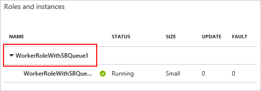
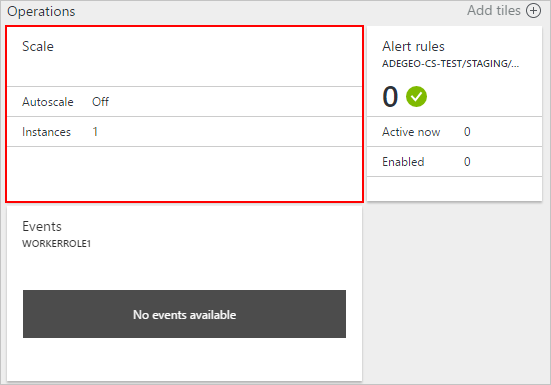
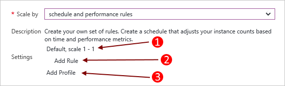
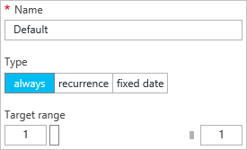
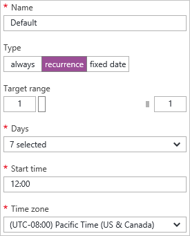
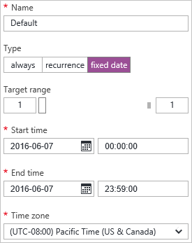
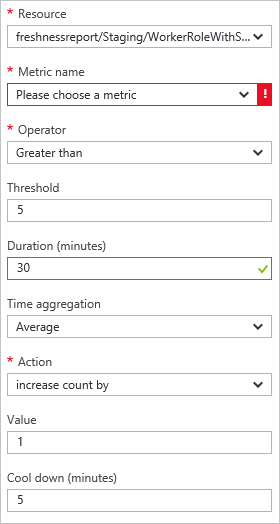
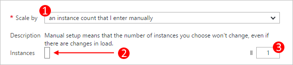

# How to configure auto scaling for a Cloud Service (classic) in the portal

[!INCLUDE [Cloud Services (classic) deprecation announcement](includes/deprecation-announcement.md)]

Conditions can be set for a cloud service worker role that trigger a scale in or out operation. The conditions for the role can be based on the CPU, disk, or network load of the role. You can also set a condition based on a message queue or the metric of some other Azure resource associated with your subscription.

> [!NOTE]
> This article focuses on Cloud Service (classic). When you create a virtual machine (classic) directly, it is hosted in a cloud service. You can scale a standard virtual machine by associating it with an [availability set](/previous-versions/azure/virtual-machines/windows/classic/configure-availability-classic) and manually turn them on or off.

## Considerations
You should consider the following information before you configure scaling for your application:

* Scaling is affected by core usage.

    Larger role instances use more cores. You can scale an application only within the limit of cores for your subscription. For example, say your subscription has a limit of 20 cores. If you run an application with two medium-sized cloud services (a total of 4 cores), you can only scale up other cloud service deployments in your subscription by the remaining 16 cores. For more information about sizes, see [Cloud Service Sizes](cloud-services-sizes-specs.md).

* You can scale based on a queue message threshold. For more information about how to use queues, see [How to use the Queue Storage Service](/azure/storage/queues/storage-quickstart-queues-dotnet?tabs=passwordless%2Croles-azure-portal%2Cenvironment-variable-windows%2Csign-in-azure-cli).

* You can also scale other resources associated with your subscription.

* To enable high availability of your application, you should ensure that it is deployed with two or more role instances. For more information, see [Service Level Agreements](https://azure.microsoft.com/support/legal/sla/).

* Auto Scale only happens when all the roles are in **Ready** state.  

## Where scale is located
After you select your cloud service, you should have the cloud service blade visible.

1. On the cloud service blade, on the **Roles and Instances** tile, select the name of the cloud service.   
   **IMPORTANT**: Make sure to click the cloud service role, not the role instance that is below the role.

    
2. Select the **scale** tile.

    

## Automatic scale
You can configure scale settings for a role with either two modes **manual** or **automatic**. Manual is as you would expect, you set the absolute count of instances. Automatic however allows you to set rules that govern how and by how much you should scale.

Set the **Scale by** option to **schedule and performance rules**.

1. An existing profile.
2. Add a rule for the parent profile.
3. Add another profile.

Select **Add Profile**. The profile determines which mode you want to use for the scale: **always**, **recurrence**, **fixed date**.

After you have configured the profile and rules, select the **Save** icon at the top.

#### Profile
The profile sets minimum and maximum instances for the scale, and also when this scale range is active.

* **Always**

    Always keep this range of instances available.  

    
* **Recurrence**

    Choose a set of days of the week to scale.

    
* **Fixed Date**

    A fixed date range to scale the role.

    

After you have configured the profile, select the **OK** button at the bottom of the profile blade.

#### Rule
Rules are added to a profile and represent a condition that triggers the scale.

The rule trigger is based on a metric of the cloud service (CPU usage, disk activity, or network activity) to which you can add a conditional value. Additionally you can have the trigger based on a message queue or the metric of some other Azure resource associated with your subscription.

After you have configured the rule, select the **OK** button at the bottom of the rule blade.

## Back to manual scale
Navigate to the [scale settings](#where-scale-is-located) and set the **Scale by** option to **an instance count that I enter manually**.

This setting removes automated scaling from the role and then you can set the instance count directly.

1. The scale (manual or automated) option.
2. A role instance slider to set the instances to scale to.
3. Instances of the role to scale to.

After you have configured the scale settings, select the **Save** icon at the top.
