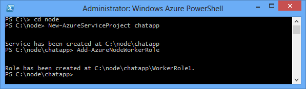
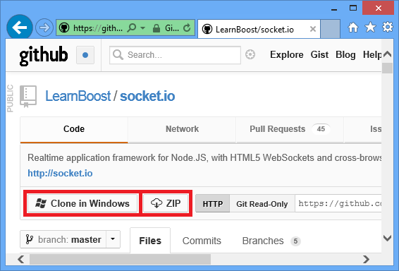
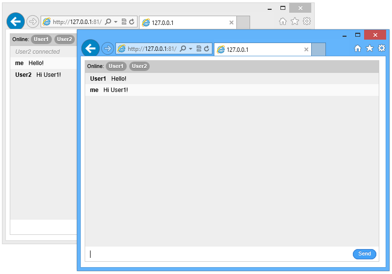

# Build a Node.js chat application with Socket.IO on an Azure Cloud Service

Socket.IO provides realtime communication between your node.js
server and clients. This tutorial walks you through hosting a
socket.IO based chat application on Azure. For more information
on Socket.IO, see [socket.io](https://socket.io).

A screenshot of the completed application is below:

![A browser window displaying the service hosted on Azure][completed-app]  

## Prerequisites
Ensure that the following products and versions are installed to successfully complete the example in this article:

* Install [Visual Studio](https://www.visualstudio.com/en-us/downloads/download-visual-studio-vs.aspx)
* Install [Node.js](https://nodejs.org/download/)
* Install [Python version 2.7.10](https://www.python.org/)

## Create a Cloud Service Project
The following steps create the cloud service project that will host the Socket.IO application.

1. From the **Start Menu** or **Start Screen**, search for **Windows PowerShell**. Finally, right-click **Windows PowerShell** and select **Run As Administrator**.
   
    ![Azure PowerShell icon][powershell-menu]
2. Create a directory called **c:\\node**. 
   
        PS C:\> md node
3. Change directories to the **c:\\node** directory
   
        PS C:\> cd node
4. Enter the following commands to create a new solution named **chatapp** and a worker role named **WorkerRole1**:
   
        PS C:\node> New-AzureServiceProject chatapp
        PS C:\Node> Add-AzureNodeWorkerRole
   
    You will see the following response:
   
    

## Download the Chat Example
For this project, we will use the chat example from the [Socket.IO
GitHub repository]. Perform the following steps to download the example
and add it to the project you previously created.

1. Create a local copy of the repository by using the **Clone** button. You may also use the **ZIP** button to download the project.
   
   
2. Navigate the directory structure of the local repository until you arrive at the **examples\\chat**
   directory. Copy the contents of this directory to the
   **C:\\node\\chatapp\\WorkerRole1** directory created earlier.
   
   ![Explorer, displaying the contents of the examples\\chat directory extracted from the archive][chat-contents]
   
   The highlighted items in the screenshot above are the files copied from the **examples\\chat** directory
3. In the **C:\\node\\chatapp\\WorkerRole1** directory, delete the **server.js** file, and then rename the **app.js** file to **server.js**. This removes the default **server.js** file created previously by the **Add-AzureNodeWorkerRole** cmdlet and replaces it with the application file from the chat example.

### Modify Server.js and Install Modules
Before testing the application in the Azure emulator, we must
make some minor modifications. Perform the following steps to the
server.js file:

1. Open the **server.js** file in Visual Studio or any text editor.
2. Find the **Module dependencies** section at the beginning of server.js and change the line containing **sio = require('..//..//lib//socket.io')** to **sio = require('socket.io')** as shown below:
   
       var express = require('express')
         , stylus = require('stylus')
         , nib = require('nib')
       //, sio = require('..//..//lib//socket.io'); //Original
         , sio = require('socket.io');                //Updated
         var port = process.env.PORT || 3000;         //Updated
3. To ensure the application listens on the correct port, open
   server.js in Notepad or your favorite editor, and then change the
   following line by replacing **3000** with **process.env.port** as shown below:
   
       //app.listen(3000, function () {            //Original
       app.listen(process.env.port, function () {  //Updated
         var addr = app.address();
         console.log('   app listening on http://' + addr.address + ':' + addr.port);
       });

After saving the changes to **server.js**, use the following steps to
install required modules, and then test the application in the
Azure emulator:

1. Using **Azure PowerShell**, change directories to the **C:\\node\\chatapp\\WorkerRole1** directory and use the following command to install the modules required by this application:
   
       PS C:\node\chatapp\WorkerRole1> npm install
   
   This will install the modules listed in the package.json file. After
   the command completes, you should see output similar to the
   following:
   
   ![The output of the npm install command][The-output-of-the-npm-install-command]
2. Since this example was originally a part of the Socket.IO GitHub
   repository, and directly referenced the Socket.IO library by
   relative path, Socket.IO was not referenced in the package.json
   file, so we must install it by issuing the following command:
   
       PS C:\node\chatapp\WorkerRole1> npm install socket.io --save

### Test and Deploy
1. Launch the emulator by issuing the following command:
   
       PS C:\node\chatapp\WorkerRole1> Start-AzureEmulator -Launch
   
   > [!NOTE]
   > If you encounter issues with launching emulator, eg.:
   >    Start-AzureEmulator : An unexpected failure occurred.  Details: Encountered an unexpected error The communication object,  System.ServiceModel.Channels.ServiceChannel, cannot be used for communication because it is in the Faulted state.
   > 
   > Reinstall AzureAuthoringTools v 2.7.1 and AzureComputeEmulator v 2.7 - make sure that version matches.

2. Open a browser and navigate to **http://127.0.0.1**.
3. When the browser window opens, enter a nickname and then hit enter.
   This will allow you to post messages as a specific nickname. To test
   multi-user functionality, open additional browser windows using the
   same URL and enter different nicknames.
   
   
4. After testing the application, stop the emulator by issuing the
   following command:
   
       PS C:\node\chatapp\WorkerRole1> Stop-AzureEmulator
5. To deploy the application to Azure, use the
   **Publish-AzureServiceProject** cmdlet. For example:
   
       PS C:\node\chatapp\WorkerRole1> Publish-AzureServiceProject -ServiceName mychatapp -Location "East US" -Launch
   
   > [!IMPORTANT]
   > Be sure to use a unique name, otherwise the publish process will fail. After the deployment has completed, the browser will open and navigate to the deployed service.
   > 
   > If you receive an error stating that the provided subscription name doesn't exist in the imported publish profile, you must download and import the publishing profile for your subscription before deploying to Azure. See the **Deploying the Application to Azure** section of [Build and deploy a Node.js application to an Azure Cloud Service](https://azure.microsoft.com/develop/nodejs/tutorials/getting-started/)
   > 
   > 
   
   ![A browser window displaying the service hosted on Azure][completed-app]
   
   > [!NOTE]
   > If you receive an error stating that the provided subscription name doesn't exist in the imported publish profile, you must download and import the publishing profile for your subscription before deploying to Azure. See the **Deploying the Application to Azure** section of [Build and deploy a Node.js application to an Azure Cloud Service](https://azure.microsoft.com/develop/nodejs/tutorials/getting-started/)
   > 
   > 

Your application is now running on Azure, and can relay chat
messages between different clients using Socket.IO.

> [!NOTE]
> For simplicity, this sample is limited to chatting between users connected to the same instance. This means that if the cloud service creates two worker role instances, users will only be able to chat with others connected to the same worker role instance. To scale the application to work with multiple role instances, you could use a technology like Service Bus to share the Socket.IO store state across instances. For examples, see the Service Bus Queues and Topics usage samples in the [Azure SDK for Node.js GitHub repository](https://github.com/WindowsAzure/azure-sdk-for-node).
> 
> 

## Next steps
In this tutorial you learned how to create a basic chat application hosted in an Azure Cloud Service. To learn how to host this application in an Azure Website, see [Build a Node.js Chat Application with Socket.IO on an Azure Web Site][chatwebsite].

For more information, see also the [Node.js Developer Center](https://docs.microsoft.com/azure/javascript/).

[chatwebsite]: https://docs.microsoft.com/azure/cloud-services/cloud-services-nodejs-develop-deploy-app

[Azure SLA]: https://www.windowsazure.com/support/sla/
[Azure SDK for Node.js GitHub repository]: https://github.com/WindowsAzure/azure-sdk-for-node
[completed-app]: ./media/cloud-services-nodejs-chat-app-socketio/socketio-10.png
[Azure SDK for Node.js]: https://www.windowsazure.com/develop/nodejs/
[Node.js Web Application]: https://www.windowsazure.com/develop/nodejs/tutorials/getting-started/
[Socket.IO GitHub repository]: https://github.com/LearnBoost/socket.io/tree/0.9.14
[Azure Considerations]: #windowsazureconsiderations
[Hosting the Chat Example in a Worker Role]: #hostingthechatexampleinawebrole
[Summary and Next Steps]: #summary
[powershell-menu]: ./media/cloud-services-nodejs-chat-app-socketio/azure-powershell-start.png

[chat example]: https://github.com/LearnBoost/socket.io/tree/master/examples/chat
[chat-example-view]: ./media/cloud-services-nodejs-chat-app-socketio/socketio-22.png

[chat-contents]: ./media/cloud-services-nodejs-chat-app-socketio/socketio-5.png
[The-output-of-the-npm-install-command]: ./media/cloud-services-nodejs-chat-app-socketio/socketio-7.png
[The output of the Publish-AzureService command]: ./media/cloud-services-nodejs-chat-app-socketio/socketio-9.png

