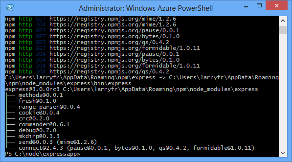
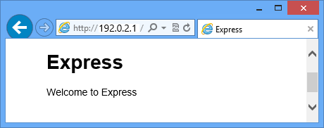
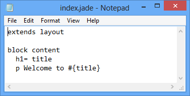
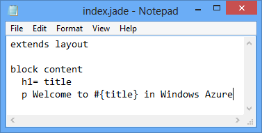
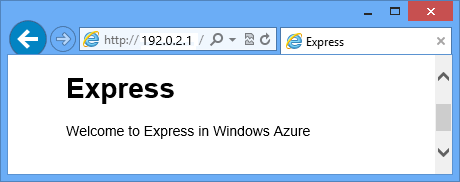

<properties 
	pageTitle="Web App with Express (Node.js) | Microsoft Azure" 
	description="A tutorial that builds on the cloud service tutorial, and demonstrates how to use the Express module." 
	services="cloud-services" 
	documentationCenter="nodejs" 
	authors="rmcmurray" 
	manager="wpickett" 
	editor=""/>

<tags 
	ms.service="cloud-services" 
	ms.workload="tbd" 
	ms.tgt_pltfrm="na" 
	ms.devlang="nodejs" 
	ms.topic="article" 
	ms.date="08/11/2016" 
	ms.author="robmcm"/>

# Build a Node.js web application using Express on an Azure Cloud Service

Node.js includes a minimal set of functionality in the core runtime.
Developers often use 3rd party modules to provide additional
functionality when developing a Node.js application. In this tutorial
you will create a new application using the [Express][] module, which provides an MVC framework for creating Node.js web applications.

A screenshot of the completed application is below:

##Create a Cloud Service Project

Perform the following steps to create a new cloud service project named 'expressapp':

1. From the **Start Menu** or **Start Screen**, search for **Windows PowerShell**. Finally, right-click **Windows PowerShell** and select **Run As Administrator**.

	

	[AZURE.INCLUDE [install-dev-tools](../../includes/install-dev-tools.md)]

2. Change directories to the **c:\\node** directory and then enter the following commands to create a new solution named **expressapp** and a web role named **WebRole1**:

		PS C:\node> New-AzureServiceProject expressapp
		PS C:\Node\expressapp> Add-AzureNodeWebRole
		PS C:\Node\expressapp> Set-AzureServiceProjectRole WebRole1 Node 0.10.21

	> [AZURE.NOTE] By default, **Add-AzureNodeWebRole** uses an older version of Node.js. The **Set-AzureServiceProjectRole** statement above instructs Azure to use v0.10.21 of Node.  Note the parameters are case-sensitive.  You can verify the correct version of Node.js has been selected by checking the **engines** property in **WebRole1\package.json**.

##Install Express

1. Install the Express generator by issuing the following command:

		PS C:\node\expressapp> npm install express-generator -g

	The output of the npm command should look similar to the result below. 

	

2. Change directories to the **WebRole1** directory and use the express command to generate a new application:

        PS C:\node\expressapp\WebRole1> express

	You will be prompted to overwrite your earlier application. Enter **y** or **yes** to continue. Express will generate the app.js file and a folder structure for building your application.

	

5.  To install additional dependencies defined in the package.json file,
    enter the following command:

        PS C:\node\expressapp\WebRole1> npm install

	

6.  Use the following command to copy the **bin/www** file to **server.js**. This is so the cloud service can find the entry point for this application.

		PS C:\node\expressapp\WebRole1> copy bin/www server.js

	After this command completes, you should have a **server.js** file in the WebRole1 directory.

7.  Modify the **server.js** to remove one of the '.' characters from the following line.

		var app = require('../app');

	After making this modification, the line should appear as follows.

		var app = require('./app');

	This change is required since we moved the file (formerly **bin/www**,) to the same directory as the app file being required. After making this change, save the **server.js** file.

8.  Use the following command to run the application in the Azure emulator:

        PS C:\node\expressapp\WebRole1> Start-AzureEmulator -launch

	

## Modifying the View

Now modify the view to display the message "Welcome to Express in
Azure".

1.  Enter the following command to open the index.jade file:

        PS C:\node\expressapp\WebRole1> notepad views/index.jade

    

    Jade is the default view engine used by Express applications. For more
    information on the Jade view engine, see [http://jade-lang.com][].

2.  Modify the last line of text by appending **in Azure**.

	

3.  Save the file and exit Notepad.

4.  Refresh your browser and you will see your changes.

	

After testing the application, use the **Stop-AzureEmulator** cmdlet to stop the emulator.

##Publishing the Application to Azure

In the Azure PowerShell window, use the **Publish-AzureServiceProject** cmdlet to deploy the application to a cloud service

    PS C:\node\expressapp\WebRole1> Publish-AzureServiceProject -ServiceName myexpressapp -Location "East US" -Launch

Once the deployment operation completes, your browser will open and display the web page.

## Next steps

For more information, see the [Node.js Developer Center](/develop/nodejs/).

  [Node.js Web Application]: http://www.windowsazure.com/develop/nodejs/tutorials/getting-started/
  [Express]: http://expressjs.com/
  [http://jade-lang.com]: http://jade-lang.com

 
